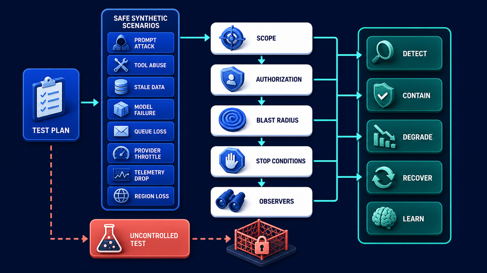
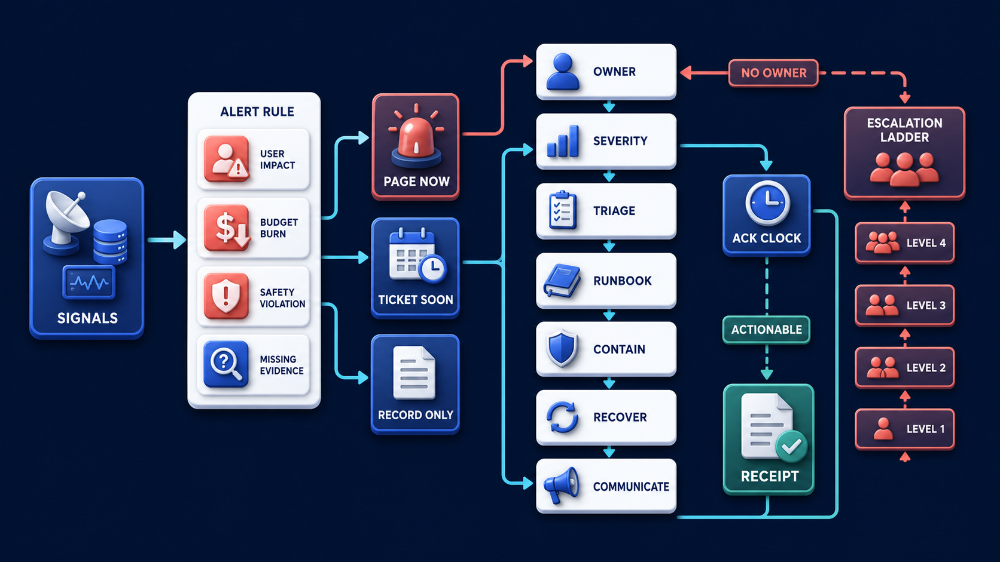

# Diagram 194 — Red-team, chaos, abuse, and recovery exercises

**Module:** Incidents and continuous learning
**Role in the course:** Make alerts actionable, rehearse failure, recover safely, and turn every serious defect into verified permanent learning.
**Layout:** The diagram shows TEST PLAN selecting SAFE SYNTHETIC SCENARIOS: PROMPT ATTACK, TOOL ABUSE, STALE DATA, MODEL FAILURE, QUEUE LOSS, PROVIDER THROTTLE, TELEMETRY DROP, REGION LOSS; it also pass through SCOPE, AUTHORIZATION, BLAST RADIUS, STOP CONDITIONS, OBSERVERS.

---

## At a glance

**Rehearse dangerous and disruptive conditions safely enough to prove controls and recovery before a real incident.**

- State the hypothesis, protected outcome, expected detection, containment, degradation, recovery, and learning evidence.
- Authorize scope, environment, synthetic data, blast radius, affected identities, tools, observers, stop conditions, and cleanup.
- Inject one controlled failure or abuse behavior and record what people, controls, telemetry, and users observe.
- A STALE DATA path shows the failure the design must catch before it reaches the user.

---

## What the diagram teaches

### 1. Rehearse dangerous conditions safely to prove recovery

A red-team exercise probes how people and systems resist adversarial behavior. A chaos exercise introduces controlled failure to test resilience assumptions. Abuse testing explores misuse, policy evasion, resource exhaustion, and harmful combinations. Recovery exercises verify containment, rollback, restoration, communication, and evidence. They overlap but need explicit objectives. Start with a hypothesis, owner, authorization, synthetic data, environment, blast radius, affected tenants, allowed tools, observer, stop conditions, communication, and cleanup. The diagram exists so the team can rehearse dangerous and disruptive conditions safely enough to prove controls and recovery before a real incident.

### 2. State the hypothesis, protected outcome, expected detection, containment, degradation, recovery,

State the hypothesis, protected outcome, expected detection, containment, degradation, recovery, and learning evidence. Success is not 'the system never failed.' It is that controls detected the event, bounded impact, preserved safety and evidence. Recovery exercises verify containment, rollback, restoration, communication, and evidence. In the diagram, this is represented by **DETECT** and **CONTAIN**, near **RECOVER**. The case study where Acme rehearses the exact failure behind Maya's stale answer while also dropping part of the trace and throttling the policy provider makes the risk concrete: running an unbounded 'chaos test' in production without authorization, synthetic data, stop conditions, or observers can become the incident it was meant to prevent. When this step is done well, the team proves that safety and recovery do not depend on perfect telemetry or one healthy provider.

### 3. Authorize scope, environment, synthetic data, blast radius, affected identities, tools,

In the diagram, this is represented by **SCOPE** and **BLAST RADIUS**, near **STOP CONDITIONS**. Authorize scope, environment, synthetic data, blast radius, affected identities, tools, observers, stop conditions, and cleanup. A red-team exercise probes how people and systems resist adversarial behavior. Start with a hypothesis, owner, authorization, synthetic data, environment, blast radius, affected tenants, allowed tools, observer, stop conditions, communication, and cleanup. The case study where Acme rehearses the exact failure behind Maya's stale answer while also dropping part of the trace and throttling the policy provider shows the value: the team proves that safety and recovery do not depend on perfect telemetry or one healthy provider. Skip it, and running an unbounded 'chaos test' in production without authorization, synthetic data, stop conditions, or observers can become the incident it was meant to prevent. The takeaway is clear: inject failure deliberately, constrain the blast radius, use real controls, and verify recovery and cleanup.

### 4. Inject one controlled failure or abuse behavior and record what

Test prompt injection, tool abuse, cross-tenant attempts, stale evidence, grader evasion, provider throttling, queue duplication. This is why the step is non-negotiable: inject one controlled failure or abuse behavior and record what people, controls, telemetry, and users observe. A red-team exercise probes how people and systems resist adversarial behavior. In the diagram, this is represented by **TOOL ABUSE** and **MODEL FAILURE**, near **TELEMETRY DROP**. The case study where Acme rehearses the exact failure behind Maya's stale answer while also dropping part of the trace and throttling the policy provider proves it: the team proves that safety and recovery do not depend on perfect telemetry or one healthy provider. If the team omits this, running an unbounded 'chaos test' in production without authorization, synthetic data, stop conditions, or observers can become the incident it was meant to prevent.

### 5. Contain and recover through the real runbook, then verify business

Contain and recover through the real runbook, then verify business state, security state, queued work, and telemetry restoration. Recovery exercises verify containment, rollback, restoration, communication, and evidence. Measure time to detect, acknowledge, contain, recover, and verify, while labeling targets as proposed until measured. In the diagram, this is represented by **CONTAIN** and **RECOVER**. The case study where Acme rehearses the exact failure behind Maya's stale answer while also dropping part of the trace and throttling the policy provider makes the risk concrete: running an unbounded 'chaos test' in production without authorization, synthetic data, stop conditions, or observers can become the incident it was meant to prevent. When this step is done well, the team proves that safety and recovery do not depend on perfect telemetry or one healthy provider.

### 6. Document control gaps, owners, due dates, proof requirements, and new

In the diagram, this is represented by **UNCONTROLLED TEST**. Document control gaps, owners, due dates, proof requirements, and new permanent evaluation cases before closing. A red-team exercise probes how people and systems resist adversarial behavior. Test prompt injection, tool abuse, cross-tenant attempts, stale evidence, grader evasion, provider throttling, queue duplication. The case study where Acme rehearses the exact failure behind Maya's stale answer while also dropping part of the trace and throttling the policy provider shows the value: the team proves that safety and recovery do not depend on perfect telemetry or one healthy provider. Skip it, and running an unbounded 'chaos test' in production without authorization, synthetic data, stop conditions, or observers can become the incident it was meant to prevent. The takeaway is clear: inject failure deliberately, constrain the blast radius, use real controls, and verify recovery and cleanup.

### 7. Putting it together

Taken together, these steps turn the objective "rehearse dangerous and disruptive conditions safely enough to prove controls and recovery before a real incident" into an operating contract. State the hypothesis, protected outcome, expected detection, containment, degradation, recovery, and learning evidence; Authorize scope, environment, synthetic data, blast radius, affected identities, tools, observers, stop conditions, and cleanup; Inject one controlled failure or abuse behavior and record what people, controls, telemetry, and users observe. The remaining steps extend this: Contain and recover through the real runbook, then verify business state, security state, queued work, and telemetry restoration; Document control gaps, owners, due dates, proof requirements, and new permanent evaluation cases before closing. The case of Acme rehearses the exact failure behind Maya's stale answer while also dropping part of the trace and throttling the policy provider shows how quickly running an unbounded 'chaos test' in production without authorization, synthetic data, stop conditions, or observers can become the incident it was meant to prevent. The durable lesson is inject failure deliberately, constrain the blast radius, use real controls, and verify recovery and cleanup.

### Analogy

A fire drill intentionally creates a safe simulation of danger so alarms, exits, roles, communications, and accountability are tested before smoke is real.

### The Next.js surface

In the Next.js surface, the same contract appears through framework-specific patterns. Add a non-production scenario console using synthetic fixtures and explicit environment banners; require authorization before any disruptive test action. Render exercise timeline, expected observations, actual detections, control actions, user-visible behavior, and stop-condition state from typed events. Prevent test flags and fake effects from crossing into production through separate credentials, stores, domains, and build-time checks.

### The Python surface

In the Python surface, the same contract is enforced with typed models and tests. Implement dependency fault adapters for delay, timeout, throttle, malformed response, duplication, loss, stale data, and telemetry failure with deterministic scopes. Drive exercises from a typed plan containing hypothesis, targets, blast radius, schedule, observers, abort rules, and cleanup assertions. Verify data and workflow reconciliation after recovery and export failed expectations directly into the regression-case backlog.

Diagram 193 — *Alerts, ownership, triage, and runbooks* is the next lens on this idea. The same concepts reappear there with different emphasis, so the two diagrams should be read as a pair.

---

## Case study — Rehearsing Maya's stale-answer failure with dropped traces

Acme rehearses the exact failure behind Maya's stale answer while also dropping part of the trace and throttling the policy provider.

### The walkthrough

1. The exercise uses synthetic policy documents and a non-production tenant inside a bounded environment.
2. Freshness assertions detect the stale selection even though trace telemetry is incomplete.
3. The system degrades to preserved evidence and human review while the runbook restores the provider and telemetry.
4. Cleanup proves no test artifacts or fault flags remain and adds cases for stale data plus observability loss.

### The result

The team proves that safety and recovery do not depend on perfect telemetry or one healthy provider.

### The danger

Running an unbounded 'chaos test' in production without authorization, synthetic data, stop conditions, or observers can become the incident it was meant to prevent.

### The takeaway

Inject failure deliberately, constrain the blast radius, use real controls, and verify recovery and cleanup.

---

## Composition

A TEST PLAN sits at the top left and selects SAFE SYNTHETIC SCENARIOS: PROMPT ATTACK, TOOL ABUSE, STALE DATA, MODEL FAILURE, QUEUE LOSS, PROVIDER THROTTLE, TELEMETRY DROP, and REGION LOSS. Each scenario passes through four safety gates: SCOPE, AUTHORIZATION, BLAST RADIUS, STOP CONDITIONS, and OBSERVERS. Outcomes at the right—DETECT, CONTAIN, DEGRADE, RECOVER, and LEARN—show what the exercise proves. At the bottom, a coral UNCONTROLLED TEST is quarantined, separating the safe exercise from the dangerous one. The composition is an exercise checklist: scenarios on the left, controls in the middle, outcomes on the right, and a quarantine for anything ungoverned.

## Element by element

- **TEST PLAN** — The **TEST PLAN** is selecting SAFE SYNTHETIC SCENARIOS:.
- **SAFE SYNTHETIC SCENARIOS** — The **SAFE SYNTHETIC SCENARIOS** is a teal healthy or verified result path that tEST PLAN selecting :.
- **PROMPT ATTACK** — The **PROMPT ATTACK** is a cyan request or propagation path.
- **TOOL ABUSE** — The **TOOL ABUSE** is a cyan request or propagation path.
- **STALE DATA** — The **STALE DATA** is a coral failure, risk, or incident path.
- **MODEL FAILURE** — The **MODEL FAILURE** is a coral failure, risk, or incident path.
- **QUEUE LOSS** — The **QUEUE LOSS** is a cyan request or propagation path.
- **PROVIDER THROTTLE** — The **PROVIDER THROTTLE** is a white record.
- **TELEMETRY DROP** — The **TELEMETRY DROP** is a cyan request or propagation path.
- **REGION LOSS** — The **REGION LOSS** is a cyan request or propagation path.
- **SCOPE** — The **SCOPE** is the control that defines what an exercise is allowed to touch.
- **AUTHORIZATION** — The **AUTHORIZATION** is the control that ensures the exercise is approved and safe to run.
- **BLAST RADIUS** — The **BLAST RADIUS** are the control that limits how much of the system the exercise can affect.
- **STOP CONDITIONS** — The **STOP CONDITIONS** are the criteria that end the exercise immediately if they are met.
- **OBSERVERS** — The **OBSERVERS** are the people or systems watching the exercise to ensure it remains controlled.
- **DETECT** — The **DETECT** is a cyan request or propagation path that outcomes ,.
- **CONTAIN** — The **CONTAIN** is a cyan request or propagation path.
- **DEGRADE** — The **DEGRADE** is a cyan request or propagation path.
- **RECOVER** — The **RECOVER** is a teal healthy or verified result path.
- **LEARN** — The **LEARN** is a cyan request or propagation path.
- **UNCONTROLLED TEST** — The **UNCONTROLLED TEST** is the coral exercise that is quarantined because it lacks scope, authorization, or stop conditions.

---

## Colour and flow semantics

- **Cyan arrow** — a request, propagated context, telemetry signal, evaluation flow, or candidate release path. In this diagram it appears on **TEST PLAN**, **PROMPT ATTACK**, **TOOL ABUSE**, **QUEUE LOSS**, **TELEMETRY DROP**, **REGION LOSS**, **SCOPE**, **AUTHORIZATION** and others.
- **Teal arrow** — a healthy result, matched evidence, safe promotion, controlled degradation, recovery, or verified learning path. In this diagram it appears on **SAFE SYNTHETIC SCENARIOS**, **RECOVER**.
- **Coral path** — a broken trace, failed assertion, regression, overload, unsafe outcome, rollback, alert, or incident path. In this diagram it appears on **STALE DATA**, **MODEL FAILURE**, **UNCONTROLLED TEST**.
- **White card** — a span, event, metric, log, resource, case, score, budget, version, release, runbook, action, or regression record. In this diagram it appears on **PROVIDER THROTTLE**.

The overall flow moves from the inputs on the left through the incidents and continuous learning stages and exits as either a teal healthy path or a coral failure path. White cards carry the records, cobalt platforms hold the boundaries, and the cyan arrows show propagation and requests.

---

## How to present it

- Start with the operational question the team actually needs to answer. Point at the central element and ask what a regulator, evaluator, or support operator would ask about this outcome, and which signal type would best answer it.
- Ask the room what the team would need to know before approving the next release. Point at **DETECT** and **CONTAIN** and ask what would change if this step were skipped? Use the case study to make the failure concrete.
- Have the group list the operational decisions this stage informs. Highlight **SCOPE** and **BLAST RADIUS** and ask what real decision does this evidence support? Use the case study to make the failure concrete.
- Ask what evidence would change the route a support ticket takes. Trace with your finger **TOOL ABUSE** and **MODEL FAILURE** and ask what would a missing or corrupted value look like here? Use the case study to make the failure concrete.
- Get the room to name the owner who would need this evidence in an incident. Put a marker on **CONTAIN** and **RECOVER** and ask who owns the evidence produced at this step? Use the case study to make the failure concrete.
- Ask what would need to be true for the team to skip this stage safely. Ask the room to locate **UNCONTROLLED TEST** and ask which downstream stage would fail if this step were wrong? Use the case study to make the failure concrete.
- Use the analogy. A fire drill intentionally creates a safe simulation of danger so alarms, exits, roles, communications, and accountability are tested before smoke is real. Ask the room where the equivalent tracking number, queue, or ledger is in their own system, and where it would first break.
- Tell the case study — Rehearsing Maya's stale-answer failure with dropped traces. Walk through the walkthrough and stop at the moment the failure first becomes visible. Ask what signal, gate, or version field would have caught it earlier.
- Run the lab. Write one tabletop and one isolated technical exercise. Include hypothesis, synthetic fixtures, eight injected faults or abuses, blast radius, observers, expected alerts, user-visible degradation, stop rules, recovery, cleanup, and five regression cases. Have each group label the fields that are captured, hashed, redacted, or omitted.
- Pose the checkpoint. Is a chaos exercise successful only if users notice no failure? Let the room answer before confirming with the answer. Then ask what the team would change in the next build based on the answer.
- Before moving on, ask the room to trace one healthy teal path and one coral path through the diagram, naming the evidence that flips the colour at each stage.
- Close on the contract. Inject failure deliberately, constrain the blast radius, use real controls, and verify recovery and cleanup. Make the group write one sentence that ties the lesson to their own system.

---

## Lab and checkpoint

**Lab:** Write one tabletop and one isolated technical exercise. Include hypothesis, synthetic fixtures, eight injected faults or abuses, blast radius, observers, expected alerts, user-visible degradation, stop rules, recovery, cleanup, and five regression cases.

**Checkpoint:** Is a chaos exercise successful only if users notice no failure?

**Answer:** No. The goal is to test assumptions. Controlled degradation may be visible; success means impact is bounded, safety is preserved, recovery works, and learning is captured.

---

## Glossary

- **Blast radius** — maximum allowed scope of test impact
- **Fault injection** — deliberate controlled introduction of failure
- **Stop condition** — rule that immediately halts the exercise

---

## Sources

- [OWASP Agentic Top 10 2026](https://genai.owasp.org/resource/owasp-top-10-for-agentic-applications-for-2026/)
- [NIST Generative AI Profile](https://www.nist.gov/publications/artificial-intelligence-risk-management-framework-generative-artificial-intelligence)
- [Google SRE incident response](https://sre.google/workbook/incident-response/)

---

## Related lessons

- Diagram 175 — Privacy-safe telemetry and content capture policy
- Diagram 182 — Tool contracts, policy decisions, and business effects
- Diagram 193 — Alerts, ownership, triage, and runbooks

---
