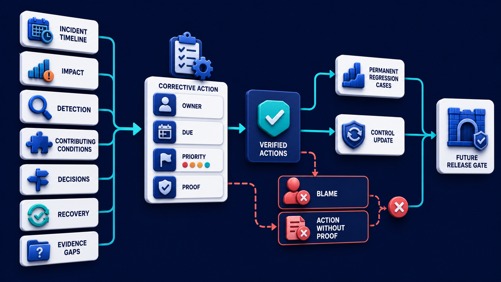
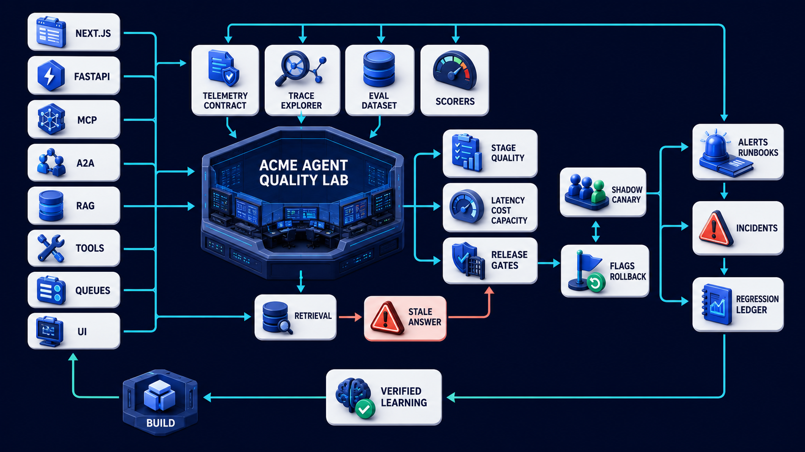

# Diagram 195 — Postmortems, corrective actions, and regression cases

**Module:** Incidents and continuous learning
**Role in the course:** Make alerts actionable, rehearse failure, recover safely, and turn every serious defect into verified permanent learning.
**Layout:** The diagram shows INCIDENT TIMELINE feeding IMPACT, DETECTION, CONTRIBUTING CONDITIONS, DECISIONS, RECOVERY, EVIDENCE GAPS; it also these create CORRECTIVE ACTION cards with OWNER, DUE, PRIORITY, PROOF.

---

## At a glance

**Turn a serious failure into verified system improvement instead of a document that is filed and forgotten.**

- Build a factual timeline from business records, traces, alerts, changes, communications, and user reports, marking evidence gaps.
- Describe impact and contributing technical, process, ownership, and decision conditions without stopping at individual blame.
- Create risk-prioritized corrective actions with owner, due date, proof requirement, and escalation for overdue work.
- A PROOF path shows the failure the design must catch before it reaches the user.

---

## What the diagram teaches

### 1. Turn serious failures into verified permanent learning

A useful postmortem reconstructs what happened, who and what was affected, how the event was detected, why impact expanded, which decisions helped or hurt, how recovery was verified, and where evidence was missing. It distinguishes triggering change, contributing technical and organizational conditions, and latent weaknesses without reducing the explanation to one person's mistake. Blameless learning does not remove accountability: decisions, owners, exceptions, ignored warnings, and overdue controls should remain clear. Corrective actions must be specific, prioritized by risk, assigned to an owner, dated, and closed only with evidence. Strong actions change the system: enforce an assertion, improve a boundary, simplify a dangerous dependency, add a safe fallback, repair ownership, or automate verification. The diagram exists so the team can turn a serious failure into verified system improvement instead of a document that is filed and forgotten.

### 2. Build a factual timeline from business records, traces, alerts, changes,

Build a factual timeline from business records, traces, alerts, changes, communications, and user reports, marking evidence gaps. Corrective actions must be specific, prioritized by risk, assigned to an owner, dated, and closed only with evidence. A useful postmortem reconstructs what happened, who and what was affected, how the event was detected, why impact expanded. In the diagram, this is represented by **EVIDENCE GAPS**. The case study where Maya's stale answer reached production because the offline dataset lacked version-conflict cases, the canary dashboard hid the slice, and the alert had no owner makes the risk concrete: closing actions because code merged, training occurred, or a checkbox changed can leave the actual control unverified and the same failure available. When this step is done well, one incident improves retrieval, evaluation, release, alerting, and recovery rather than producing only a narrative.

### 3. Describe impact and contributing technical, process, ownership, and decision conditions

In the diagram, this is represented by **IMPACT** and **OWNER**, near **BLAME**. Describe impact and contributing technical, process, ownership, and decision conditions without stopping at individual blame. A useful postmortem reconstructs what happened, who and what was affected, how the event was detected, why impact expanded. It distinguishes triggering change, contributing technical and organizational conditions, and latent weaknesses without reducing the explanation to one person's mistake. The case study where Maya's stale answer reached production because the offline dataset lacked version-conflict cases, the canary dashboard hid the slice, and the alert had no owner shows the value: one incident improves retrieval, evaluation, release, alerting, and recovery rather than producing only a narrative. Skip it, and closing actions because code merged, training occurred, or a checkbox changed can leave the actual control unverified and the same failure available. The takeaway is clear: every serious failure should change a control, gain an owner, prove the fix, and remain a regression test.

### 4. Create risk-prioritized corrective actions with owner, due date, proof requirement,

Corrective actions must be specific, prioritized by risk, assigned to an owner, dated, and closed only with evidence. This is why the step is non-negotiable: create risk-prioritized corrective actions with owner, due date, proof requirement, and escalation for overdue work. Blameless learning does not remove accountability: decisions, owners, exceptions, ignored warnings, and overdue controls should remain clear. In the diagram, this is represented by **CORRECTIVE ACTION** and **OWNER**, near **DUE**. The case study where Maya's stale answer reached production because the offline dataset lacked version-conflict cases, the canary dashboard hid the slice, and the alert had no owner proves it: one incident improves retrieval, evaluation, release, alerting, and recovery rather than producing only a narrative. If the team omits this, closing actions because code merged, training occurred, or a checkbox changed can leave the actual control unverified and the same failure available.

### 5. Turn the failure into stage-level and end-to-end regression cases

Turn the failure into stage-level and end-to-end regression cases that fail before the fix and pass after it. Verify that the fix fails before the change and passes after it, then keep the case in future release gates. Weak actions merely say 'be careful' or 'retrain the team.' Every reproducible failure should become a versioned regression case at the earliest stage that could have caught it. In the diagram, this is represented by **PERMANENT REGRESSION CASES**. The case study where Maya's stale answer reached production because the offline dataset lacked version-conflict cases, the canary dashboard hid the slice, and the alert had no owner makes the risk concrete: closing actions because code merged, training occurred, or a checkbox changed can leave the actual control unverified and the same failure available. When this step is done well, one incident improves retrieval, evaluation, release, alerting, and recovery rather than producing only a narrative.

### 6. Close only after action evidence, recovery verification, future gate inclusion,

In the diagram, this is represented by **DETECTION** and **RECOVERY**. Close only after action evidence, recovery verification, future gate inclusion, and a review of detection and response improvement. A useful postmortem reconstructs what happened, who and what was affected, how the event was detected, why impact expanded. Review whether detection, containment, recovery, and communication improved, not only whether the original bug disappeared. The case study where Maya's stale answer reached production because the offline dataset lacked version-conflict cases, the canary dashboard hid the slice, and the alert had no owner shows the value: one incident improves retrieval, evaluation, release, alerting, and recovery rather than producing only a narrative. Skip it, and closing actions because code merged, training occurred, or a checkbox changed can leave the actual control unverified and the same failure available. The takeaway is clear: every serious failure should change a control, gain an owner, prove the fix, and remain a regression test.

### 7. Putting it together

Taken together, these steps turn the objective "turn a serious failure into verified system improvement instead of a document that is filed and forgotten" into an operating contract. Build a factual timeline from business records, traces, alerts, changes, communications, and user reports, marking evidence gaps; Describe impact and contributing technical, process, ownership, and decision conditions without stopping at individual blame; Create risk-prioritized corrective actions with owner, due date, proof requirement, and escalation for overdue work. The remaining steps extend this: Turn the failure into stage-level and end-to-end regression cases that fail before the fix and pass after it; Close only after action evidence, recovery verification, future gate inclusion, and a review of detection and response improvement. The case of Maya's stale answer reached production because the offline dataset lacked version-conflict cases, the canary dashboard hid the slice, and the alert had no owner shows how quickly closing actions because code merged, training occurred, or a checkbox changed can leave the actual control unverified and the same failure available. The durable lesson is every serious failure should change a control, gain an owner, prove the fix, and remain a regression test.

### Analogy

After a bridge defect, engineers do not only replace one bolt. They inspect design assumptions, maintenance records, alarms, inspection methods, ownership, and every similar bridge, then change future checks.

### The Next.js surface

In the Next.js surface, the same contract appears through framework-specific patterns. Build a postmortem view that links timeline events to authorized evidence, distinguishes fact from inference, and records redaction and access rules. Track corrective actions as durable records with owner, status, due date, proof artifact, reviewer, and connection to release gates. Expose regression cases and verification history in the quality lab so closing an action cannot be reduced to checking a UI box.

Diagram 196 — *Capstone: the Acme Agent Quality Lab* is the next lens on this idea. The same concepts reappear there with different emphasis, so the two diagrams should be read as a pair.

### The Python surface

In the Python surface, the same contract is enforced with typed models and tests. Generate timeline candidates from normalized events but require human review; never treat missing telemetry as proof that an event did not happen. Model corrective actions and evidence immutably and enforce state transitions from proposed to implemented to verified to closed. Convert incident fixtures into automated pytest and evaluation cases, demonstrate pre-fix failure, and register them in the standard release suite.

---

## Case study — Maya's stale answer reaches production

Maya's stale answer reached production because the offline dataset lacked version-conflict cases, the canary dashboard hid the slice, and the alert had no owner.

### The walkthrough

1. The postmortem reconstructs the retrieval change, missing slice, delayed report, and recovery decisions.
2. Actions add stale-current pairs, denominator-aware slice gates, owned alerts, and a verified rollback bundle.
3. Each action has an owner and proof: failing-before and passing-after case, alert exercise, or rollback observation.
4. Future candidates cannot promote until the permanent regression and ownership checks pass.

### The result

One incident improves retrieval, evaluation, release, alerting, and recovery rather than producing only a narrative.

### The danger

Closing actions because code merged, training occurred, or a checkbox changed can leave the actual control unverified and the same failure available.

### The takeaway

Every serious failure should change a control, gain an owner, prove the fix, and remain a regression test.

---

## Composition

An INCIDENT TIMELINE runs across the top, feeding six analysis boxes: IMPACT, DETECTION, CONTRIBUTING CONDITIONS, DECISIONS, RECOVERY, and EVIDENCE GAPS. These create CORRECTIVE ACTION cards below, each with OWNER, DUE, PRIORITY, and PROOF. Verified actions then feed PERMANENT REGRESSION CASES and a CONTROL UPDATE, which lead to a future RELEASE GATE. Two rejected items appear at the bottom in coral: BLAME and ACTION WITHOUT PROOF. The layout is a learning chain: the timeline at the top produces actions in the middle, which become tests and controls on the right, while two unsafe behaviors are blocked at the bottom.

## Element by element

- **INCIDENT TIMELINE** — The **INCIDENT TIMELINE** is feeding IMPACT,.
- **IMPACT** — The **IMPACT** is the postmortem analysis of who and what was affected.
- **DETECTION** — The **DETECTION** is a cyan request or propagation path.
- **CONTRIBUTING CONDITIONS** — The **CONTRIBUTING CONDITIONS** are the postmortem analysis of the surrounding conditions that made the failure possible.
- **DECISIONS** — The **DECISIONS** is a cyan request or propagation path.
- **RECOVERY** — The **RECOVERY** is a teal healthy or verified result path.
- **EVIDENCE GAPS** — The **EVIDENCE GAPS** are the postmortem analysis of missing or ambiguous evidence.
- **CORRECTIVE ACTION** — The **CORRECTIVE ACTION** is an owned change with priority, due date, and proof of improvement.
- **OWNER** — The **OWNER** is a cyan request or propagation path that these create CORRECTIVE ACTION cards with ,.
- **DUE** — The **DUE** is the date by which a corrective action must be completed.
- **PRIORITY** — The **PRIORITY** is the urgency of a corrective action relative to other work.
- **PROOF** — The **PROOF** is the evidence that a corrective action actually fixed the problem.
- **PERMANENT REGRESSION CASES** — The **PERMANENT REGRESSION CASES** is a CONTROL UPDATE,.
- **CONTROL UPDATE** — The **CONTROL UPDATE** is a cobalt platform or boundary that verified actions feed PERMANENT REGRESSION CASES and ,.
- **RELEASE GATE** — The **RELEASE GATE** is a GATE.
- **BLAME** — The **BLAME** is the coral postmortem behavior that assigns fault instead of fixing the control.
- **ACTION WITHOUT PROOF** — The **ACTION WITHOUT PROOF** is the coral postmortem closure that leaves the control unverified.

---

## Colour and flow semantics

- **Cobalt platform** — a service, stage, dataset, quality gate, budget, release lane, or incident-control boundary. In this diagram it appears on **INCIDENT TIMELINE**, **CONTROL UPDATE**, **RELEASE GATE**.
- **Cyan arrow** — a request, propagated context, telemetry signal, evaluation flow, or candidate release path. In this diagram it appears on **IMPACT**, **DETECTION**, **CONTRIBUTING CONDITIONS**, **DECISIONS**, **CORRECTIVE ACTION**, **OWNER**, **DUE**, **PRIORITY**.
- **Teal arrow** — a healthy result, matched evidence, safe promotion, controlled degradation, recovery, or verified learning path. In this diagram it appears on **RECOVERY**.
- **Coral path** — a broken trace, failed assertion, regression, overload, unsafe outcome, rollback, alert, or incident path. In this diagram it appears on **PROOF**, **BLAME**, **ACTION WITHOUT PROOF**.
- **White card** — a span, event, metric, log, resource, case, score, budget, version, release, runbook, action, or regression record. In this diagram it appears on **EVIDENCE GAPS**, **PERMANENT REGRESSION CASES**.

The overall flow moves from the inputs on the left through the incidents and continuous learning stages and exits as either a teal healthy path or a coral failure path. White cards carry the records, cobalt platforms hold the boundaries, and the cyan arrows show propagation and requests.

---

## How to present it

- Start with the operational question the team actually needs to answer. Point at the central element and ask what a regulator, evaluator, or support operator would ask about this outcome, and which signal type would best answer it.
- Ask the room what the team would need to know before approving the next release. Point at **EVIDENCE GAPS** and ask what would change if this step were skipped? Use the case study to make the failure concrete.
- Have the group list the operational decisions this stage informs. Highlight **IMPACT** and **OWNER** and ask what real decision does this evidence support? Use the case study to make the failure concrete.
- Ask what evidence would change the route a support ticket takes. Trace with your finger **CORRECTIVE ACTION** and **OWNER** and ask what would a missing or corrupted value look like here? Use the case study to make the failure concrete.
- Get the room to name the owner who would need this evidence in an incident. Put a marker on **PERMANENT REGRESSION CASES** and ask who owns the evidence produced at this step? Use the case study to make the failure concrete.
- Ask what would need to be true for the team to skip this stage safely. Ask the room to locate **DETECTION** and **RECOVERY** and ask which downstream stage would fail if this step were wrong? Use the case study to make the failure concrete.
- Use the analogy. After a bridge defect, engineers do not only replace one bolt. Ask the room where the equivalent tracking number, queue, or ledger is in their own system, and where it would first break.
- Tell the case study — Maya's stale answer reaches production. Walk through the walkthrough and stop at the moment the failure first becomes visible. Ask what signal, gate, or version field would have caught it earlier.
- Run the lab. Draft a one-page postmortem for Maya's stale answer with impact, 12-event timeline, five contributing conditions, four evidence gaps, six corrective actions, owners, due dates, proof, and three permanent regression cases. Reject any action phrased only as 'be more careful.' Have each group label the fields that are captured, hashed, redacted, or omitted.
- Pose the checkpoint. Does blameless mean nobody is accountable for corrective actions or risky decisions? Let the room answer before confirming with the answer. Then ask what the team would change in the next build based on the answer.
- Before moving on, ask the room to trace one healthy teal path and one coral path through the diagram, naming the evidence that flips the colour at each stage.
- Close on the contract. Every serious failure should change a control, gain an owner, prove the fix, and remain a regression test. Make the group write one sentence that ties the lesson to their own system.

---

## Lab and checkpoint

**Lab:** Draft a one-page postmortem for Maya's stale answer with impact, 12-event timeline, five contributing conditions, four evidence gaps, six corrective actions, owners, due dates, proof, and three permanent regression cases. Reject any action phrased only as 'be more careful.'

**Checkpoint:** Does blameless mean nobody is accountable for corrective actions or risky decisions?

**Answer:** No. Blameless learning avoids simplistic personal blame while keeping decisions, ownership, responsibilities, exceptions, and action accountability explicit.

---

## Glossary

- **Postmortem** — structured learning review after an incident
- **Corrective action** — owned change intended to reduce recurrence or impact
- **Regression case** — permanent test for a previously observed failure

---

## Sources

- [Google SRE postmortem culture](https://sre.google/sre-book/postmortem-culture/)
- [Google SRE incident response](https://sre.google/workbook/incident-response/)
- [NIST AI Risk Management Framework](https://www.nist.gov/itl/ai-risk-management-framework)

---

## Related lessons

- Diagram 176 — Business outcomes, artifacts, receipts, and trace references
- Diagram 193 — Alerts, ownership, triage, and runbooks
- Diagram 196 — Capstone: the Acme Agent Quality Lab

---
