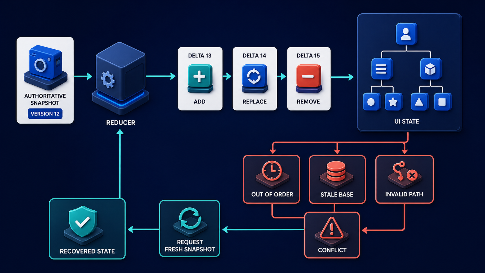
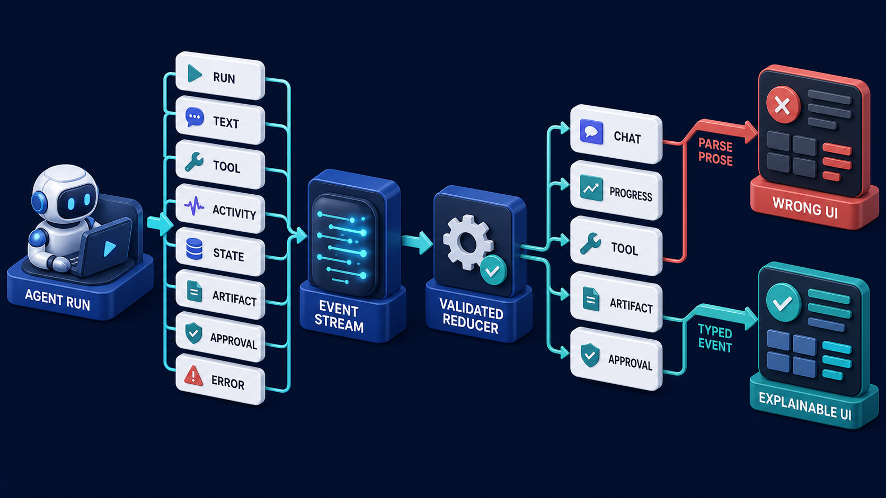

# Diagram 198 — State snapshots, deltas, reducers, and conflict handling

**Module:** Event-driven agent interfaces
**Role in the course:** Use snapshots and deltas without allowing missing or conflicting updates to silently corrupt the interface.
**Layout:** The diagram shows AUTHORITATIVE SNAPSHOT with VERSION 12 entering a REDUCER, followed by ordered DELTA 13, 14, 15 cards using ADD REPLACE REMOVE, with a coral risk path, and a...

---

## At a glance

**Use snapshots and deltas without allowing missing or conflicting updates to silently corrupt the interface.**

- The diagram centers on **AUTHORITATIVE SNAPSHOT** and its relationship to **RECOVERED STATE**.

- The teal **REQUEST FRESH SNAPSHOT** path shows the safe, authoritative, or consented route.

- The coral **OUT OF ORDER** path shows the risk the product must prevent.

- Maya's case: Maya approves a proposed exception while her browser has missed a policy-state delta during a brief network interruption.

---

## What the diagram teaches

### 1. Snapshot Says, 'replace Your Current View Of This State

A snapshot says, 'replace your current view of this state with this complete version.' A delta says, 'apply these named changes to the version you already have.' They solve different synchronization problems. AG-UI state deltas use JSON Patch operations. A reducer must apply operations in order, validate paths and values, and know which snapshot or revision the delta assumes. The diagram makes this concrete through **VERSION**, **DELTA**, **AUTHORITATIVE SNAPSHOT**. If the team skips this, blindly applying deltas or silently ignoring patch errors can leave a polished screen whose approval, artifact, or progress state never existed on the server. This is the lesson the case study ends with: Deltas are efficient only when revision checks, validation, conflict handling, and snapshot recovery make them trustworthy.

### 2. Conflict Handling Must Be Explicit: Reject The Patch, Mark

Conflict handling must be explicit: reject the patch, mark the projection uncertain, stop sensitive controls, and request a fresh snapshot. Guessing or partially applying a failed patch creates a convincing but false screen. Optimistic local changes should live in a separate pending layer. This is visible in the drawing as **CONFLICT**, **REQUEST FRESH SNAPSHOT**, **AUTHORITATIVE SNAPSHOT**. Without this step, blindly applying deltas or silently ignoring patch errors can leave a polished screen whose approval, artifact, or progress state never existed on the server. In the walkthrough, The approval card records that it was rendered from state revision 12 and evidence version P44..

### 3. Validated Snapshot With Schema Version, State Revision, And Product Ownership

This step asks the team to receive a validated snapshot with schema version, state revision, and product ownership metadata. The diagram shows this through **VERSION**, **AUTHORITATIVE SNAPSHOT**, **UI STATE**, which make the abstract step visible and testable. A snapshot says, 'replace your current view of this state with this complete version.' A delta says, 'apply these named changes to the version you already have.' They solve different synchronization problems. Fixtures should cover missing paths, duplicate operations, stale revisions, schema changes, and unknown fields. If the team skips this, blindly applying deltas or silently ignoring patch errors can leave a polished screen whose approval, artifact, or progress state never existed on the server. Maya's case makes this concrete: Maya approves a proposed exception while her browser has missed a policy-state delta during a brief network interruption.

### 4. Only Deltas Whose Expected Base Revision Matches The Reducer's Current

Here the product must apply only deltas whose expected base revision matches the reducer's current authoritative revision. In the drawing, **REDUCER**, **DELTA**, **AUTHORITATIVE SNAPSHOT** carry this responsibility. A reducer must apply operations in order, validate paths and values, and know which snapshot or revision the delta assumes. Small deltas make live interfaces efficient, but they are not automatically safe. Without this step, blindly applying deltas or silently ignoring patch errors can leave a polished screen whose approval, artifact, or progress state never existed on the server. The result — A stale browser cannot approve a changed proposal, and Maya does not lose the comment she already wrote. — depends on getting this right.

### 5. Validate Every JSON Patch Operation, Path, Value Type, And Protected

The diagram enforces this by showing the team how to validate every JSON Patch operation, path, value type, and protected field before mutation. The visual anchors are **INVALID PATH**; without them the step would be invisible to the user. AG-UI state deltas use JSON Patch operations. Guessing or partially applying a failed patch creates a convincing but false screen. The case study shows the risk: blindly applying deltas or silently ignoring patch errors can leave a polished screen whose approval, artifact, or progress state never existed on the server. This is the lesson the case study ends with: Deltas are efficient only when revision checks, validation, conflict handling, and snapshot recovery make them trustworthy.

### 6. Any Uncertainty, Freeze Sensitive Actions, Preserve Local Input, And Request

This is the discipline that makes the product on any uncertainty, freeze sensitive actions, preserve local input, and request a fresh authoritative snapshot. This idea sits on **AUTHORITATIVE SNAPSHOT** and reaches the rest of the diagram through **AUTHORITATIVE SNAPSHOT**, **REQUEST FRESH SNAPSHOT**. Conflict handling must be explicit: reject the patch, mark the projection uncertain, stop sensitive controls, and request a fresh snapshot. Optimistic local changes should live in a separate pending layer. Missing this is how products end up with blindly applying deltas or silently ignoring patch errors can leave a polished screen whose approval, artifact, or progress state never existed on the server. In the walkthrough, The approval card records that it was rendered from state revision 12 and evidence version P44..

### 7. Replay Snapshot-plus-delta Fixtures And Assert Both Final State And Visible

The team must replay snapshot-plus-delta fixtures and assert both final state and visible recovery behavior before the interface can be trustworthy. The diagram shows this through **DELTA**, **AUTHORITATIVE SNAPSHOT**, **UI STATE**, which make the abstract step visible and testable. If delta 14 arrives before 13, a remove targets a missing path, or the browser resumed from an old snapshot, the visible state may become impossible. Reducers are ideal test surfaces because the same initial snapshot and event sequence should produce the same visible state. A system that ignores this will eventually face blindly applying deltas or silently ignoring patch errors can leave a polished screen whose approval, artifact, or progress state never existed on the server. The danger the case warns about, Maya approves a proposed exception while her browser has missed a policy-state delta during a brief network interruption. should make this clear.

Diagram 197 — *The event-driven interface mental model* is the next lens on this idea. The same concepts reappear there with different emphasis, so the two diagrams should be read as a pair.

### 8. The standard in practice

The lesson is not a perfect prototype; it is a product contract. Use snapshots and deltas without allowing missing or conflicting updates to silently corrupt the interface.. The diagram makes that contract visible through **AUTHORITATIVE SNAPSHOT**, **VERSION**, **REDUCER**, so the team can argue about the contract before choosing a framework. The contract is not framework-specific; it is the set of observable promises the product makes to the person using it. Maya's case warns that blindly applying deltas or silently ignoring patch errors can leave a polished screen whose approval, artifact, or progress state never existed on the server. The practical standard is this: Deltas are efficient only when revision checks, validation, conflict handling, and snapshot recovery make them trustworthy.

### 9. The Next.js and Python surfaces

The same contract appears in both stacks, but the boundary moves with the architecture.
**In Next.js / React:**
- Validate snapshots and patches on the server, then expose a narrow typed client store with authoritativeRevision, pendingChanges, and synchronizationStatus.
- Apply JSON Patch through a tested reducer; do not let arbitrary paths modify security, ownership, approval, or tenant fields in client state.
- Render a visible resynchronizing state that preserves draft input and disables decisions whose evidence revision is uncertain.
- Keep the most sensitive payloads and policy decisions on the server and stream only user-visible, safe view models to client components.
**In Python / FastAPI:**
- Model state and patch envelopes with Pydantic, including schemaVersion, baseRevision, nextRevision, actor, and permitted path classes.
- Apply patches to a copy, validate the complete candidate state, and commit atomically only when every operation succeeds.
- Return a typed conflict requiring a fresh snapshot instead of catching patch errors and continuing with partially modified state.
- Treat every framework callback or protocol event as raw input; validate and transform it into the product's own event vocabulary before it reaches the reducer or domain model.
Both implementations must avoid the same trap: blindly applying deltas or silently ignoring patch errors can leave a polished screen whose approval, artifact, or progress state never existed on the server.

### 10. Analogy

Editing a shared map works when everyone starts from the same edition and applies numbered corrections in order. If correction 14 assumes street changes from correction 13, skipping 13 can put a bridge in the wrong place. The analogy keeps the lesson grounded. The diagram's **AUTHORITATIVE SNAPSHOT** plays the same role as the central object in the analogy: it must be visible, labeled, and trustworthy without the user having to infer meaning from a long narrative. The parallel works because both situations require separating the object from the record, the attempt from the proof, and the promise from the evidence.

---

## Case study — Maya

Maya approves a proposed exception while her browser has missed a policy-state delta during a brief network interruption.

### The walkthrough

1. The approval card records that it was rendered from state revision 12 and evidence version P44.
2. The server rejects the action because the current state is revision 15 and the proposal no longer matches.
3. The interface preserves Maya's comment, disables the old approval buttons, and requests a fresh snapshot.
4. The refreshed card explains that the proposal changed and asks Maya to review the new evidence before deciding.

### The result

A stale browser cannot approve a changed proposal, and Maya does not lose the comment she already wrote.

### The danger

Blindly applying deltas or silently ignoring patch errors can leave a polished screen whose approval, artifact, or progress state never existed on the server.

### The takeaway

Deltas are efficient only when revision checks, validation, conflict handling, and snapshot recovery make them trustworthy.

---

## Composition

The picture is a single-view explainer for *State snapshots, deltas, reducers, and conflict handling*. On the left, the diagram shows AUTHORITATIVE SNAPSHOT with VERSION 12 entering a REDUCER, followed by ordered DELTA 13, 14, 15 cards using ADD REPLACE REMOVE. At the top, the diagram renders a UI STATE tree. In the center, the diagram also includes coral OUT OF ORDER, STALE BASE, INVALID PATH into CONFLICT, then teal REQUEST FRESH SNAPSHOT into RECOVERED STATE. The eye travels from **AUTHORITATIVE SNAPSHOT** through the central flow to **RECOVERED STATE**, with the contrast between coral risk paths and teal recovery paths giving the reader the core message at a glance.

## Element by element

- **AUTHORITATIVE SNAPSHOT** — one of the cards in the diagram; this is the **AUTHORITATIVE SNAPSHOT** card.
- **VERSION** — one of the cards named by **AUTHORITATIVE SNAPSHOT**; this is the **VERSION** card.
- **REDUCER** — the validated function that turns events and prior state into new product state without parsing prose.
- **DELTA** — an ordered set of changes, often JSON Patch operations, applied to a known base revision.
- **ADD REPLACE REMOVE** — one of the cards named by **AUTHORITATIVE SNAPSHOT**; this is the **ADD REPLACE REMOVE** card.
- **UI STATE** — the visible, reduced representation of the authoritative state that the interface renders.
- **OUT OF ORDER** — the out of order STALE BASE, INVALID PATH into CONFLICT, then teal REQUEST FRESH SNAPSHOT into RECOVERED STATE.
- **STALE BASE** — one of the paths named by **OUT**; this is the **STALE BASE** path.
- **INVALID PATH** — one of the paths named by **OUT**; this is the **INVALID PATH** path.
- **CONFLICT** — evidence that local and authoritative state cannot be reconciled safely.
- **REQUEST FRESH SNAPSHOT** — one of the paths named by **OUT**; this is the **REQUEST FRESH SNAPSHOT** path.
- **RECOVERED STATE** — one of the paths named by **OUT**; this is the **RECOVERED STATE** path.

---

## Colour and flow semantics

The course visual grammar applies directly to this diagram.

- **Cobalt platform** — A browser surface, state store, component catalog, product boundary, workspace, or learning-platform region. Here the cobalt surface under **AUTHORITATIVE SNAPSHOT** and the surrounding workspace frames the product boundary; it tells the reader that this is a bounded product region, not an uncontrolled chat surface. It marks the product's responsibility to keep the user's workspace distinct from raw model output or runtime internals.

- **Cyan arrow** — A typed event, validated state update, user action, artifact reference, notification, or navigation path. Cyan arrows carry the flow of events, updates, and proposals from left to right, linking the typed cards and records to the reducer or next gate. When the reader sees cyan, they should expect a deliberate, validated transition rather than an accidental or hidden connection.

- **Teal arrow** — Authoritative state, accessible completion, informed consent, safe approval, preserved work, or verified recovery. The teal **REQUEST FRESH SNAPSHOT** path shows the safe, authoritative, and consented route through the diagram. This color tells the reader that the product has enough evidence and authority to proceed safely.

- **Coral path** — Conflict, stale UI, unsafe rendering, deceptive state, expired approval, privacy failure, lost work, or blocked action. The coral **OUT OF ORDER** path shows the risk, conflict, or blocked outcome the product must prevent. It signals that the product should pause, surface the conflict, and offer a recovery path rather than proceed silently.

- **White card** — An event, component, stage, proposal, artifact, receipt, consent record, lesson, checkpoint, or recovery option. The labeled cards and records throughout the diagram are white, marking them as structured events, proposals, receipts, or recovery options. The white background separates user-meaningful records from raw system logs or generated text.

The overall flow moves from the initiating actor or request, through validation and reduction, toward either the teal recovery or completion path or the coral failure path. The color of each arrow and card is a trust cue, not a decoration.

---

## How to present it

- **Start with the user moment.** Maya approves a proposed exception while her browser has missed a policy-state delta during a brief network interruption. Ask the room what they need to see to feel in control. Invite someone to describe the moment before any solution appears.

- **Point at AUTHORITATIVE SNAPSHOT and ask what it represents.** Then trace the flow from there through the next two or three elements, naming the color and direction of each arrow. Encourage them to name the incoming trigger, the visible state, and the decision the product must make.

- **Point at VERSION for step 1.** Validated Snapshot With Schema Version, State Revision, And Product Ownership. Ask what observable evidence the product would produce if this step worked correctly. Have the room identify the color of the path leaving this element and what it tells a user about trust.

- **Point at REDUCER for step 2.** Only Deltas Whose Expected Base Revision Matches The Reducer's Current. Ask what observable evidence the product would produce if this step worked correctly. Have the room identify the color of the path leaving this element and what it tells a user about trust.

- **Point at INVALID PATH for step 3.** Validate Every JSON Patch Operation, Path, Value Type, And Protected. Ask what observable evidence the product would produce if this step worked correctly. Have the room identify the color of the path leaving this element and what it tells a user about trust.

- **Point at AUTHORITATIVE SNAPSHOT for step 4.** Any Uncertainty, Freeze Sensitive Actions, Preserve Local Input, And Request. Ask what observable evidence the product would produce if this step worked correctly. Have the room identify the color of the path leaving this element and what it tells a user about trust.

- **Point at DELTA for step 5.** Replay Snapshot-plus-delta Fixtures And Assert Both Final State And Visible. Ask what observable evidence the product would produce if this step worked correctly. Have the room identify the color of the path leaving this element and what it tells a user about trust.

- **Use the analogy.** Editing a shared map works when everyone starts from the same edition and applies numbered corrections in order. If correction 14 assumes street changes from correction 13, skipping 13 can put a bridge in the wrong place. Draw the parallel to the diagram and ask what would break if the two situations were handled the same way.

- **Tell the case study.** Maya approves a proposed exception while her browser has missed a policy-state delta during a brief network interruption Walk through the walkthrough and stop at the moment the old design would have failed. Pause at the step where the old design would have failed and ask how the new interface prevents it.

- **Run the lab.** Create one snapshot and eight RFC 6902 deltas for an approval workspace. Then inject a duplicate, an out-of-order update, an invalid path, and a stale base. Define the exact reducer response and what Maya sees for each case. Ask pairs to present one part of the diagram and explain how the other parts reference it without merging their identities.

- **Pose the checkpoint.** If a JSON Patch operation fails, should the reducer apply the remaining operations? Let the room answer before confirming the principle. Collect answers, then confirm the principle and note any exceptions the team should watch for.

- **Close on the contract.** Deltas are efficient only when revision checks, validation, conflict handling, and snapshot recovery make them trustworthy. Ask the team what their own product's equivalent of the contract would be.

---

## Lab and checkpoint

**Lab:** Create one snapshot and eight RFC 6902 deltas for an approval workspace. Then inject a duplicate, an out-of-order update, an invalid path, and a stale base. Define the exact reducer response and what Maya sees for each case.

**Checkpoint:** If a JSON Patch operation fails, should the reducer apply the remaining operations?

**Answer:** Usually no. Treat the delta as an atomic state transition, keep the prior authoritative state, mark synchronization uncertain, and obtain a fresh snapshot.

---

## Glossary

- **Snapshot** — complete replacement view of state
- **Delta** — ordered set of changes from a known base
- **Conflict** — evidence that local and authoritative state cannot be reconciled safely

---

## Sources

- [AG-UI events](https://docs.ag-ui.com/concepts/events)
- [RFC 6902 JSON Patch](https://www.rfc-editor.org/info/rfc6902/)
- [JSON Schema 2020-12](https://json-schema.org/draft/2020-12)

## Related lessons

- Diagram 197 — The event-driven interface mental model
- Diagram 199 — Reconnect, replay, deduplication, and offline recovery
- Diagram 200 — Optimistic interface state versus authoritative business state

---