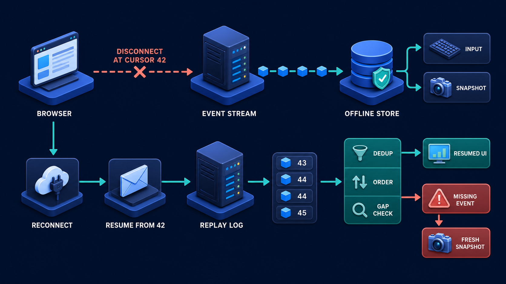

# Diagram 199 — Reconnect, replay, deduplication, and offline recovery

**Module:** Event-driven agent interfaces
**Role in the course:** Design reconnect behavior that restores visible state without duplicating messages, actions, or business effects.
**Layout:** The diagram shows LIVE STREAM with CURSOR 48 entering BROWSER, with a coral risk path, and a teal safe path.

---

## At a glance

**Design reconnect behavior that restores visible state without duplicating messages, actions, or business effects.**

- The diagram centers on **LIVE STREAM** and its relationship to **FRESH SNAPSHOT**.

- The teal **FRESH SNAPSHOT** path shows the safe, authoritative, or consented route.

- Maya's case: Maya closes her laptop while Acme is comparing policy evidence and returns after the workflow has produced an artifact and requested approval.

---

## What the diagram teaches

### 1. Streaming Interfaces Must Assume Disconnection

Streaming interfaces must assume disconnection. Laptops sleep, mobile networks switch, proxies time out, browser tabs pause, and workers restart while long-running agent work continues. The diagram makes this concrete through **LIVE STREAM**, **CURSOR**, **BROWSER**. If the team skips this, treating every reconnect as a new run can send duplicate emails, repeat tool calls, create competing artifacts, and make the interface disagree with business history. This is the lesson the case study ends with: Resume a view with cursor and snapshot logic; resume a business effect only through authoritative idempotent commands.

### 2. Offline Input Should Be Classified

Offline input should be classified. The screen should explain whether work continued, paused, or needs review. This is visible in the drawing as **OFFLINE BUFFER**. Without this step, treating every reconnect as a new run can send duplicate emails, repeat tool calls, create competing artifacts, and make the interface disagree with business history. In the walkthrough, The browser reconnects with the run ID and last applied cursor rather than starting a second review..

### 3. Assign Each Stream Event A Stable ID And Monotonic Cursor

This step asks the team to assign each stream event a stable ID and monotonic cursor within a clearly owned replay scope. The diagram shows this through **CURSOR**, **LIVE STREAM**, **EXPIRED CURSOR**, which make the abstract step visible and testable. A reconnect contract needs a stable stream or run identifier, an event cursor, retention window, ordering rule, and a statement about whether the server can replay missed events. The client records the last fully applied event, reconnects with that cursor, and deduplicates replayed event IDs. If the team skips this, treating every reconnect as a new run can send duplicate emails, repeat tool calls, create competing artifacts, and make the interface disagree with business history. Maya's case makes this concrete: Maya closes her laptop while Acme is comparing policy evidence and returns after the workflow has produced an artifact and requested approval.

### 4. Only The Minimum Local Recovery Metadata And Drafts, Never Secrets

Here the product must persist only the minimum local recovery metadata and drafts, never secrets or uncontrolled private payloads. In the drawing, **LIVE STREAM**, **CURSOR**, **BROWSER** carry this responsibility. Recovery tests should interrupt every stage: before start acknowledgement, during streamed text, mid-tool call, after artifact creation, around approval, and after final completion. Without this step, treating every reconnect as a new run can send duplicate emails, repeat tool calls, create competing artifacts, and make the interface disagree with business history. The result — Reconnect restores the workspace without duplicate work, invented continuity, or a stale approval action. — depends on getting this right.

### 5. Reconnect With Last-applied Cursor, Validate The Stream Identity, And Replay

The diagram enforces this by showing the team how to reconnect with last-applied cursor, validate the stream identity, and replay through ordering and deduplication gates. The visual anchors are **CURSOR**, **LIVE STREAM**, **RECONNECT REQUEST LAST SEEN**; without them the step would be invisible to the user. 'Reconnect and hope' is not a protocol. The case study shows the risk: treating every reconnect as a new run can send duplicate emails, repeat tool calls, create competing artifacts, and make the interface disagree with business history. This is the lesson the case study ends with: Resume a view with cursor and snapshot logic; resume a business effect only through authoritative idempotent commands.

### 6. Request A Fresh Snapshot When Replay Is Incomplete, Expired, Incompatible

This is the discipline that makes the product request a fresh snapshot when replay is incomplete, expired, incompatible, or conflicts with authoritative records. This idea sits on **FRESH SNAPSHOT** and reaches the rest of the diagram through **FRESH SNAPSHOT**, **RECONNECT REQUEST LAST SEEN**, **EXPIRED CURSOR**. If the replay window expired, an event gap is detected, or the local reducer version changed, the safe answer is a fresh snapshot plus durable artifact and receipt references. A snapshot rebuilds view state; business records prove what actually happened. Missing this is how products end up with treating every reconnect as a new run can send duplicate emails, repeat tool calls, create competing artifacts, and make the interface disagree with business history. In the walkthrough, The browser reconnects with the run ID and last applied cursor rather than starting a second review..

Diagram 198 — *State snapshots, deltas, reducers, and conflict handling* is the next lens on this idea. The same concepts reappear there with different emphasis, so the two diagrams should be read as a pair.

### 7. Separate UI Replay From Business Idempotency So Reconnect Can Never

The team must separate UI replay from business idempotency so reconnect can never repeat a consequential effect before the interface can be trustworthy. The diagram shows this through **RECONNECT REQUEST LAST SEEN**, **RESTORED UI**, **DUPLICATE EFFECT**, which make the abstract step visible and testable. Deduplication protects the projection, but it must never be used to repeat a business effect such as sending a refund or submitting an approval. A system that ignores this will eventually face treating every reconnect as a new run can send duplicate emails, repeat tool calls, create competing artifacts, and make the interface disagree with business history. The danger the case warns about, Maya closes her laptop while Acme is comparing policy evidence and returns after the workflow has produced an artifact and requested approval. should make this clear.

### 8. The standard in practice

The lesson is not a perfect prototype; it is a product contract. Design reconnect behavior that restores visible state without duplicating messages, actions, or business effects.. The diagram makes that contract visible through **LIVE STREAM**, **CURSOR**, **BROWSER**, so the team can argue about the contract before choosing a framework. The contract is not framework-specific; it is the set of observable promises the product makes to the person using it. Maya's case warns that treating every reconnect as a new run can send duplicate emails, repeat tool calls, create competing artifacts, and make the interface disagree with business history. The practical standard is this: Resume a view with cursor and snapshot logic; resume a business effect only through authoritative idempotent commands.

### 9. The Next.js and Python surfaces

The same contract appears in both stacks, but the boundary moves with the architecture.
**In Next.js / React:**
- Store run ID, last cursor, reducer version, and safe drafts in a scoped client store; do not persist tokens, private evidence, or approval authority in browser storage.
- Reconnect through a server route that validates user, tenant, run ownership, and replay window before streaming missed events.
- Make duplicate event handling pure and idempotent, while consequential actions use separate server-side idempotency keys and current preconditions.
- Keep the most sensitive payloads and policy decisions on the server and stream only user-visible, safe view models to client components.
**In Python / FastAPI:**
- Maintain an append-only event sequence with retention and cursor indexes, plus durable business records outside the transient stream.
- Expose replay or snapshot recovery through FastAPI with authenticated ownership checks and typed expired-cursor or gap responses.
- Write fault-injection tests that disconnect clients at every event boundary and assert no duplicate artifact, approval, message, or tool effect.
- Treat every framework callback or protocol event as raw input; validate and transform it into the product's own event vocabulary before it reaches the reducer or domain model.
Both implementations must avoid the same trap: treating every reconnect as a new run can send duplicate emails, repeat tool calls, create competing artifacts, and make the interface disagree with business history.

### 10. Analogy

A television recorder resumes after a power cut by checking the last saved timestamp. If the recording is missing a segment, it does not invent the frames; it marks the gap or reloads the complete program copy. The analogy keeps the lesson grounded. The diagram's **LIVE STREAM** plays the same role as the central object in the analogy: it must be visible, labeled, and trustworthy without the user having to infer meaning from a long narrative. The parallel works because both situations require separating the object from the record, the attempt from the proof, and the promise from the evidence.

---

## Case study — Maya

Maya closes her laptop while Acme is comparing policy evidence and returns after the workflow has produced an artifact and requested approval.

### The walkthrough

1. The browser reconnects with the run ID and last applied cursor rather than starting a second review.
2. Missed progress and artifact events replay once; duplicate text chunks are ignored by stable IDs.
3. Because the approval proposal is still current, the server returns a fresh proposal snapshot with its evidence version and expiry.
4. Maya sees that work continued while she was away and can review the completed evidence before deciding.

### The result

Reconnect restores the workspace without duplicate work, invented continuity, or a stale approval action.

### The danger

Treating every reconnect as a new run can send duplicate emails, repeat tool calls, create competing artifacts, and make the interface disagree with business history.

### The takeaway

Resume a view with cursor and snapshot logic; resume a business effect only through authoritative idempotent commands.

---

## Composition

The picture is a single-view explainer for *Reconnect, replay, deduplication, and offline recovery*. On the left, the diagram shows LIVE STREAM with CURSOR 48 entering BROWSER. At the top, a NETWORK BREAK creates OFFLINE BUFFER and RECONNECT REQUEST LAST SEEN 48. In the center, sERVER REPLAYS events 49-55 through DEDUP SET and ORDER GATE into RESTORED UI. To the right, coral paths show DUPLICATE EFFECT, GAP, EXPIRED CURSOR. Across the middle, teal FRESH SNAPSHOT recovers. The eye travels from **LIVE STREAM** through the central flow to **FRESH SNAPSHOT**, with the contrast between coral risk paths and teal recovery paths giving the reader the core message at a glance.

## Element by element

- **LIVE STREAM** — the continuous event stream that feeds the interface with run, message, tool, and state updates.
- **CURSOR** — the cursor LIVE STREAM with CURSOR 48 entering BROWSER.
- **BROWSER** — the user's client surface that receives the live stream and must recover after network breaks.
- **A NETWORK BREAK** — the a network break NETWORK BREAK creates OFFLINE BUFFER and RECONNECT REQUEST LAST SEEN 48..
- **OFFLINE BUFFER** — local recovery metadata that preserves the last cursor and safe drafts while disconnected.
- **RECONNECT REQUEST LAST SEEN** — one of the items named by **A NETWORK BREAK**; this is the **RECONNECT REQUEST LAST SEEN** item.
- **SERVER REPLAYS** — the server replays events 49-55 through DEDUP SET and ORDER GATE into RESTORED UI..
- **DEDUP SET** — the gate that ignores duplicate event IDs during replay.
- **ORDER GATE** — the gate that applies replayed events in the correct sequence.
- **RESTORED UI** — the interface state reconstructed from replayed and deduplicated events.
- **DUPLICATE EFFECT** — the duplicate effect paths show DUPLICATE EFFECT, GAP, EXPIRED CURSOR;.
- **GAP** — the gap paths show DUPLICATE EFFECT, GAP, EXPIRED CURSOR;.
- **EXPIRED CURSOR** — the expired cursor paths show DUPLICATE EFFECT, GAP, EXPIRED CURSOR;.
- **FRESH SNAPSHOT** — the fresh snapshot recovers.

---

## Colour and flow semantics

The course visual grammar applies directly to this diagram.

- **Cobalt platform** — A browser surface, state store, component catalog, product boundary, workspace, or learning-platform region. Here the cobalt surface under **LIVE STREAM** and the surrounding workspace frames the product boundary; it tells the reader that this is a bounded product region, not an uncontrolled chat surface. It marks the product's responsibility to keep the user's workspace distinct from raw model output or runtime internals.

- **Cyan arrow** — A typed event, validated state update, user action, artifact reference, notification, or navigation path. Cyan arrows carry the flow of events, updates, and proposals from left to right, linking the typed cards and records to the reducer or next gate. When the reader sees cyan, they should expect a deliberate, validated transition rather than an accidental or hidden connection.

- **Teal arrow** — Authoritative state, accessible completion, informed consent, safe approval, preserved work, or verified recovery. The teal **FRESH SNAPSHOT** path shows the safe, authoritative, and consented route through the diagram. This color tells the reader that the product has enough evidence and authority to proceed safely.

- **Coral path** — Conflict, stale UI, unsafe rendering, deceptive state, expired approval, privacy failure, lost work, or blocked action. Coral marks the conflict, stale state, or blocked action that appears when a control is missing or bypassed. It signals that the product should pause, surface the conflict, and offer a recovery path rather than proceed silently.

- **White card** — An event, component, stage, proposal, artifact, receipt, consent record, lesson, checkpoint, or recovery option. The labeled cards and records throughout the diagram are white, marking them as structured events, proposals, receipts, or recovery options. The white background separates user-meaningful records from raw system logs or generated text.

The overall flow moves from the initiating actor or request, through validation and reduction, toward either the teal recovery or completion path or the coral failure path. The color of each arrow and card is a trust cue, not a decoration.

---

## How to present it

- **Start with the user moment.** Maya closes her laptop while Acme is comparing policy evidence and returns after the workflow has produced an artifact and requested approval. Ask the room what they need to see to feel in control. Invite someone to describe the moment before any solution appears.

- **Point at LIVE STREAM and ask what it represents.** Then trace the flow from there through the next two or three elements, naming the color and direction of each arrow. Encourage them to name the incoming trigger, the visible state, and the decision the product must make.

- **Point at CURSOR for step 1.** Assign Each Stream Event A Stable ID And Monotonic Cursor. Ask what observable evidence the product would produce if this step worked correctly. Have the room identify the color of the path leaving this element and what it tells a user about trust.

- **Point at CURSOR for step 2.** Only The Minimum Local Recovery Metadata And Drafts, Never Secrets. Ask what observable evidence the product would produce if this step worked correctly. Have the room identify the color of the path leaving this element and what it tells a user about trust.

- **Point at CURSOR for step 3.** Reconnect With Last-applied Cursor, Validate The Stream Identity, And Replay. Ask what observable evidence the product would produce if this step worked correctly. Have the room identify the color of the path leaving this element and what it tells a user about trust.

- **Point at FRESH SNAPSHOT for step 4.** Request A Fresh Snapshot When Replay Is Incomplete, Expired, Incompatible. Ask what observable evidence the product would produce if this step worked correctly. Have the room identify the color of the path leaving this element and what it tells a user about trust.

- **Point at RECONNECT REQUEST LAST SEEN for step 5.** Separate UI Replay From Business Idempotency So Reconnect Can Never. Ask what observable evidence the product would produce if this step worked correctly. Have the room identify the color of the path leaving this element and what it tells a user about trust.

- **Use the analogy.** A television recorder resumes after a power cut by checking the last saved timestamp. If the recording is missing a segment, it does not invent the frames; it marks the gap or reloads the complete program copy. Draw the parallel to the diagram and ask what would break if the two situations were handled the same way.

- **Tell the case study.** Maya closes her laptop while Acme is comparing policy evidence and returns after the workflow has produced an artifact and requested approval Walk through the walkthrough and stop at the moment the old design would have failed. Pause at the step where the old design would have failed and ask how the new interface prevents it.

- **Run the lab.** Draw a reconnect state machine with connected, offline, replaying, resynchronizing, ready, and review-required states. Define cursors, retention, duplicate handling, expired replay, offline drafts, and the exact actions disabled in each state. Ask pairs to present one part of the diagram and explain how the other parts reference it without merging their identities.

- **Pose the checkpoint.** Can a replayed tool-result event safely call the tool again? Let the room answer before confirming the principle. Collect answers, then confirm the principle and note any exceptions the team should watch for.

- **Close on the contract.** Resume a view with cursor and snapshot logic; resume a business effect only through authoritative idempotent commands. Ask the team what their own product's equivalent of the contract would be.

---

## Lab and checkpoint

**Lab:** Draw a reconnect state machine with connected, offline, replaying, resynchronizing, ready, and review-required states. Define cursors, retention, duplicate handling, expired replay, offline drafts, and the exact actions disabled in each state.

**Checkpoint:** Can a replayed tool-result event safely call the tool again?

**Answer:** No. Replay reconstructs the interface. The original effect is proven by its receipt and idempotency record; replay must not execute it again.

---

## Glossary

- **Cursor** — position of the last applied stream event
- **Replay** — resend of recorded events for reconstruction
- **Idempotency** — repeated command produces one intended effect

---

## Sources

- [AG-UI events](https://docs.ag-ui.com/concepts/events)
- [AG-UI messages](https://docs.ag-ui.com/concepts/messages)
- [Indexed Database API 3.0](https://www.w3.org/TR/IndexedDB-3/)

## Related lessons

- Diagram 198 — State snapshots, deltas, reducers, and conflict handling
- Diagram 203 — Partial success, preserved work, and unfinished work
- Diagram 217 — Asynchronous return, notifications, and attention management

---