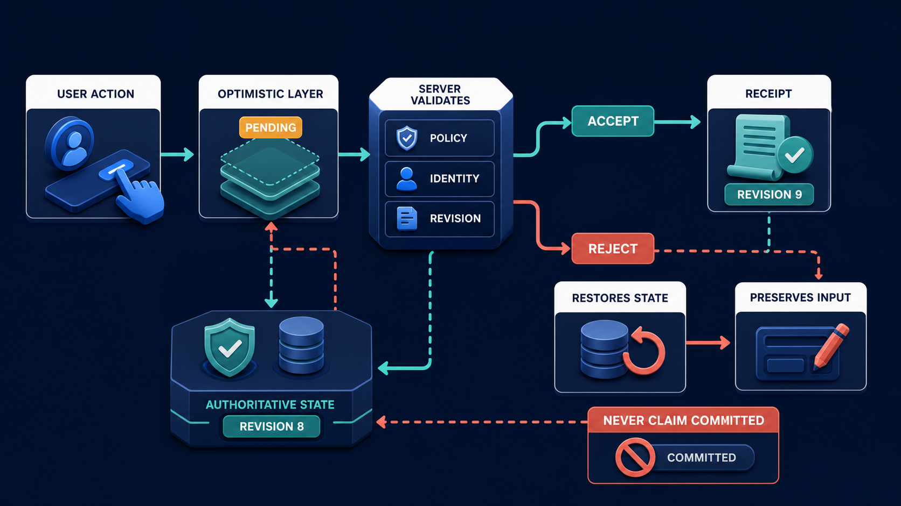

# Diagram 200 — Optimistic interface state versus authoritative business state

**Module:** Event-driven agent interfaces
**Role in the course:** Use optimistic UI for responsiveness without pretending that a consequential business action already succeeded.
**Layout:** The diagram shows USER ACTION entering two lanes, with a coral risk path.

---

## At a glance

**Use optimistic UI for responsiveness without pretending that a consequential business action already succeeded.**

- The diagram centers on **USER ACTION** and its relationship to **OPTIMISTIC PAID**.

- The coral **REJECTED CONFLICT** path shows the risk the product must prevent.

- Maya's case: Maya clicks Approve on a refund exception at the same moment the policy owner withdraws that exception proposal.

---

## What the diagram teaches

### 1. Optimistic State Is A Temporary Interface Prediction: The Screen Responds

Optimistic state is a temporary interface prediction: the screen responds immediately while the server decides. Authoritative state is the durable result owned by the business system. Optimism is useful for reversible, low-risk changes such as expanding a panel, reordering a private draft, or showing a pending comment. The diagram makes this concrete through **OPTIMISTIC UI**, **AUTHORITATIVE SERVER**, **OPTIMISTIC APPROVED**. If the team skips this, showing 'Approved' before the server commits can cause users to leave, communicate a false outcome, or click again and create duplicate effects. This is the lesson the case study ends with: Optimistic means pending prediction, not permission, commitment, or proof.

### 2. Successful Response Returns A Receipt Or New Authoritative Snapshot

A successful response returns a receipt or new authoritative snapshot. A rejection explains the conflict in plain language, preserves the user's input when safe, and offers retry, edit, or review rather than silently snapping back. React helpers such as useOptimistic or useActionState improve local interaction, but they do not decide which system owns the truth. This is visible in the drawing as **AUTHORITATIVE SERVER**, **COMMITTED RECEIPT**. Without this step, showing 'Approved' before the server commits can cause users to leave, communicate a false outcome, or click again and create duplicate effects. In the walkthrough, The button changes to Pending review rather than Approved, and the old proposal remains visible but inactive..

### 3. Classify The Proposed Interaction By Reversibility, Consequence, External Effect

This step asks the team to classify the proposed interaction by reversibility, consequence, external effect, and ownership before allowing optimism. The diagram shows this through **IDENTITY POLICY VERSION EFFECT**, which make the abstract step visible and testable. Optimism is useful for reversible, low-risk changes such as expanding a panel, reordering a private draft, or showing a pending comment. It is dangerous for approvals, payments, deletions, permission changes, and external communications. If the team skips this, showing 'Approved' before the server commits can cause users to leave, communicate a false outcome, or click again and create duplicate effects. Maya's case makes this concrete: Maya clicks Approve on a refund exception at the same moment the policy owner withdraws that exception proposal.

### 4. Local Pending Record Tied To One Command ID While Retaining

Here the product must create a local pending record tied to one command ID while retaining the prior visible state and user input. In the drawing, **PENDING**, **USER ACTION**, **LOCAL DRAFT** carry this responsibility. Optimistic state is a temporary interface prediction: the screen responds immediately while the server decides. The interface should label the prediction as pending and keep a reference to the prior state. Without this step, showing 'Approved' before the server commits can cause users to leave, communicate a false outcome, or click again and create duplicate effects. The result — The interface feels responsive while the authoritative record remains accurate and reviewable. — depends on getting this right.

### 5. Validate All Authoritative Preconditions On The Server And Commit Through

The diagram enforces this by showing the team how to validate all authoritative preconditions on the server and commit through an idempotent business command. The visual anchors are **AUTHORITATIVE SERVER**; without them the step would be invisible to the user. Authoritative state is the durable result owned by the business system. The server rechecks identity, tenant, policy, version, proposal scope, expiry, and idempotency before committing anything. The case study shows the risk: showing 'Approved' before the server commits can cause users to leave, communicate a false outcome, or click again and create duplicate effects. This is the lesson the case study ends with: Optimistic means pending prediction, not permission, commitment, or proof.

### 6. Reconcile With A Receipt Or Fresh Snapshot; On Rejection, Explain

This is the discipline that makes the product reconcile with a receipt or fresh snapshot; on rejection, explain the changed condition and safe choices. This idea sits on **COMMITTED RECEIPT** and reaches the rest of the diagram through **COMMITTED RECEIPT**, **A RECONCILE**. A successful response returns a receipt or new authoritative snapshot. Missing this is how products end up with showing 'Approved' before the server commits can cause users to leave, communicate a false outcome, or click again and create duplicate effects. In the walkthrough, The button changes to Pending review rather than Approved, and the old proposal remains visible but inactive..

### 7. Duplicate, Delayed, Lost, Rejected, And Conflicting Responses Until Every Path

The team must test duplicate, delayed, lost, rejected, and conflicting responses until every path converges on business truth before the interface can be trustworthy. The diagram shows this through **REJECTED CONFLICT**, which make the abstract step visible and testable. Tests should include slow response, duplicate submit, stale proposal, policy change, lost acknowledgement, server rejection, and late success after the user navigates away. A system that ignores this will eventually face showing 'Approved' before the server commits can cause users to leave, communicate a false outcome, or click again and create duplicate effects. The danger the case warns about, Maya clicks Approve on a refund exception at the same moment the policy owner withdraws that exception proposal. should make this clear.

### 8. The standard in practice

The lesson is not a perfect prototype; it is a product contract. Use optimistic UI for responsiveness without pretending that a consequential business action already succeeded.. The diagram makes that contract visible through **USER ACTION**, **OPTIMISTIC UI**, **PENDING**, so the team can argue about the contract before choosing a framework. The contract is not framework-specific; it is the set of observable promises the product makes to the person using it. Maya's case warns that showing 'Approved' before the server commits can cause users to leave, communicate a false outcome, or click again and create duplicate effects. The practical standard is this: Optimistic means pending prediction, not permission, commitment, or proof.

### 9. The Next.js and Python surfaces

The same contract appears in both stacks, but the boundary moves with the architecture.
**In Next.js / React:**
- Use useOptimistic only for explicitly reversible presentation state and render a visible pending label tied to a server action command ID.
- Keep approval, payment, deletion, and permission decisions as server actions that revalidate session, tenant, proposal version, expiry, policy, and idempotency.
- Return typed committed, rejected, conflict, and uncertain results so React reconciles intentionally instead of assuming every thrown error means nothing happened.
- Keep the most sensitive payloads and policy decisions on the server and stream only user-visible, safe view models to client components.
**In Python / FastAPI:**
- Define FastAPI command endpoints with expectedVersion, commandId, actor, tenant, proposalId, and typed precondition failure responses.
- Commit changes transactionally and return a durable receipt containing effect reference, authoritative revision, and safe display fields.
- Record uncertain outcomes separately when a downstream effect may have occurred but acknowledgement failed, then reconcile before permitting retry.
- Treat every framework callback or protocol event as raw input; validate and transform it into the product's own event vocabulary before it reaches the reducer or domain model.
Both implementations must avoid the same trap: showing 'Approved' before the server commits can cause users to leave, communicate a false outcome, or click again and create duplicate effects.

Diagram 198 — *State snapshots, deltas, reducers, and conflict handling* is the next lens on this idea. The same concepts reappear there with different emphasis, so the two diagrams should be read as a pair.

### 10. Analogy

A restaurant app may instantly show 'order submitted,' but the kitchen must accept the order before the screen says 'confirmed.' A pleasant animation cannot reserve ingredients or charge a card. The analogy keeps the lesson grounded. The diagram's **USER ACTION** plays the same role as the central object in the analogy: it must be visible, labeled, and trustworthy without the user having to infer meaning from a long narrative. The parallel works because both situations require separating the object from the record, the attempt from the proof, and the promise from the evidence.

---

## Case study — Maya

Maya clicks Approve on a refund exception at the same moment the policy owner withdraws that exception proposal.

### The walkthrough

1. The button changes to Pending review rather than Approved, and the old proposal remains visible but inactive.
2. The server detects the proposal-version conflict before any refund effect and returns the current policy state.
3. Maya's optional comment is preserved while the interface explains that the proposal changed.
4. A new review card presents current evidence and never records the rejected click as business approval.

### The result

The interface feels responsive while the authoritative record remains accurate and reviewable.

### The danger

Showing 'Approved' before the server commits can cause users to leave, communicate a false outcome, or click again and create duplicate effects.

### The takeaway

Optimistic means pending prediction, not permission, commitment, or proof.

---

## Composition

The picture is a single-view explainer for *Optimistic interface state versus authoritative business state*. On the left, the diagram shows USER ACTION entering two lanes. At the top, oPTIMISTIC UI immediately shows PENDING with LOCAL DRAFT and REVERSIBLE PREVIEW. In the center, aUTHORITATIVE SERVER checks IDENTITY POLICY VERSION EFFECT, then returns COMMITTED RECEIPT or coral REJECTED CONFLICT. To the right, a RECONCILE gate updates UI. Across the middle, forbid OPTIMISTIC APPROVED and OPTIMISTIC PAID. The eye travels from **USER ACTION** through the central flow to **OPTIMISTIC PAID**, with the contrast between coral risk paths and teal recovery paths giving the reader the core message at a glance.

## Element by element

- **USER ACTION** — the user action entering two lanes..
- **OPTIMISTIC UI** — the temporary, local prediction shown before the server confirms an action.
- **PENDING** — one of the items named by **OPTIMISTIC UI**; this is the **PENDING** item.
- **LOCAL DRAFT** — the user's pending input kept separately from the authoritative server state.
- **REVERSIBLE PREVIEW** — one of the items named by **OPTIMISTIC UI**; this is the **REVERSIBLE PREVIEW** item.
- **AUTHORITATIVE SERVER** — the business system that owns durable state and returns committed receipts or rejections.
- **IDENTITY POLICY VERSION EFFECT** — one of the items named by **AUTHORITATIVE SERVER**; this is the **IDENTITY POLICY VERSION EFFECT** item.
- **COMMITTED RECEIPT** — the durable proof that the server accepted a command and produced an effect.
- **REJECTED CONFLICT** — the server's response when a command cannot be applied because the state changed.
- **A RECONCILE** — the a reconcile RECONCILE gate updates UI;.
- **OPTIMISTIC APPROVED** — the optimistic approved forbid OPTIMISTIC APPROVED and OPTIMISTIC PAID..
- **OPTIMISTIC PAID** — one of the items named by **OPTIMISTIC APPROVED**; this is the **OPTIMISTIC PAID** item.

---

## Colour and flow semantics

The course visual grammar applies directly to this diagram.

- **Cobalt platform** — A browser surface, state store, component catalog, product boundary, workspace, or learning-platform region. Here the cobalt surface under **USER ACTION** and the surrounding workspace frames the product boundary; it tells the reader that this is a bounded product region, not an uncontrolled chat surface. It marks the product's responsibility to keep the user's workspace distinct from raw model output or runtime internals.

- **Cyan arrow** — A typed event, validated state update, user action, artifact reference, notification, or navigation path. Cyan arrows carry the flow of events, updates, and proposals from left to right, linking the typed cards and records to the reducer or next gate. When the reader sees cyan, they should expect a deliberate, validated transition rather than an accidental or hidden connection.

- **Teal arrow** — Authoritative state, accessible completion, informed consent, safe approval, preserved work, or verified recovery. Teal marks the authoritative and safe path, such as the committed receipt or restored state, distinguishing it from the raw request. This color tells the reader that the product has enough evidence and authority to proceed safely.

- **Coral path** — Conflict, stale UI, unsafe rendering, deceptive state, expired approval, privacy failure, lost work, or blocked action. The coral **REJECTED CONFLICT** path shows the risk, conflict, or blocked outcome the product must prevent. It signals that the product should pause, surface the conflict, and offer a recovery path rather than proceed silently.

- **White card** — An event, component, stage, proposal, artifact, receipt, consent record, lesson, checkpoint, or recovery option. **COMMITTED RECEIPT** appear as white cards, showing that they are records, proposals, or evidence rather than raw data or system internals. The white background separates user-meaningful records from raw system logs or generated text.

The overall flow moves from the initiating actor or request, through validation and reduction, toward either the teal recovery or completion path or the coral failure path. The color of each arrow and card is a trust cue, not a decoration.

---

## How to present it

- **Start with the user moment.** Maya clicks Approve on a refund exception at the same moment the policy owner withdraws that exception proposal. Ask the room what they need to see to feel in control. Invite someone to describe the moment before any solution appears.

- **Point at USER ACTION and ask what it represents.** Then trace the flow from there through the next two or three elements, naming the color and direction of each arrow. Encourage them to name the incoming trigger, the visible state, and the decision the product must make.

- **Point at IDENTITY POLICY VERSION EFFECT for step 1.** Classify The Proposed Interaction By Reversibility, Consequence, External Effect. Ask what observable evidence the product would produce if this step worked correctly. Have the room identify the color of the path leaving this element and what it tells a user about trust.

- **Point at PENDING for step 2.** Local Pending Record Tied To One Command ID While Retaining. Ask what observable evidence the product would produce if this step worked correctly. Have the room identify the color of the path leaving this element and what it tells a user about trust.

- **Point at AUTHORITATIVE SERVER for step 3.** Validate All Authoritative Preconditions On The Server And Commit Through. Ask what observable evidence the product would produce if this step worked correctly. Have the room identify the color of the path leaving this element and what it tells a user about trust.

- **Point at COMMITTED RECEIPT for step 4.** Reconcile With A Receipt Or Fresh Snapshot; On Rejection, Explain. Ask what observable evidence the product would produce if this step worked correctly. Have the room identify the color of the path leaving this element and what it tells a user about trust.

- **Point at REJECTED CONFLICT for step 5.** Duplicate, Delayed, Lost, Rejected, And Conflicting Responses Until Every Path. Ask what observable evidence the product would produce if this step worked correctly. Have the room identify the color of the path leaving this element and what it tells a user about trust.

- **Use the analogy.** A restaurant app may instantly show 'order submitted,' but the kitchen must accept the order before the screen says 'confirmed.' A pleasant animation cannot reserve ingredients or charge a card. Draw the parallel to the diagram and ask what would break if the two situations were handled the same way.

- **Tell the case study.** Maya clicks Approve on a refund exception at the same moment the policy owner withdraws that exception proposal Walk through the walkthrough and stop at the moment the old design would have failed. Pause at the step where the old design would have failed and ask how the new interface prevents it.

- **Run the lab.** Classify fifteen interface actions as local-only, optimistic-reversible, server-confirmed, or prohibited offline. For five consequential commands, specify preconditions, pending text, rejection text, preserved input, idempotency, and receipt fields. Ask pairs to present one part of the diagram and explain how the other parts reference it without merging their identities.

- **Pose the checkpoint.** Does React useOptimistic make an optimistic value authoritative? Let the room answer before confirming the principle. Collect answers, then confirm the principle and note any exceptions the team should watch for.

- **Close on the contract.** Optimistic means pending prediction, not permission, commitment, or proof. Ask the team what their own product's equivalent of the contract would be.

---

## Lab and checkpoint

**Lab:** Classify fifteen interface actions as local-only, optimistic-reversible, server-confirmed, or prohibited offline. For five consequential commands, specify preconditions, pending text, rejection text, preserved input, idempotency, and receipt fields.

**Checkpoint:** Does React useOptimistic make an optimistic value authoritative?

**Answer:** No. It manages temporary client presentation. Only the owned business system can commit the result and return authoritative evidence.

---

## Glossary

- **Optimistic state** — temporary prediction shown before confirmation
- **Authoritative state** — durable state owned by the responsible system
- **Reconciliation** — process of aligning local view with confirmed truth

---

## Sources

- [React useOptimistic](https://react.dev/reference/react/useOptimistic)
- [React useActionState](https://react.dev/reference/react/useActionState)
- [RFC 9457 Problem Details](https://www.rfc-editor.org/rfc/rfc9457)

## Related lessons

- Diagram 198 — State snapshots, deltas, reducers, and conflict handling
- Diagram 205 — Interrupt, input request, approval, rejection, and expiry
- Diagram 207 — Cancel, undo, compensate, and preserve audit history

---