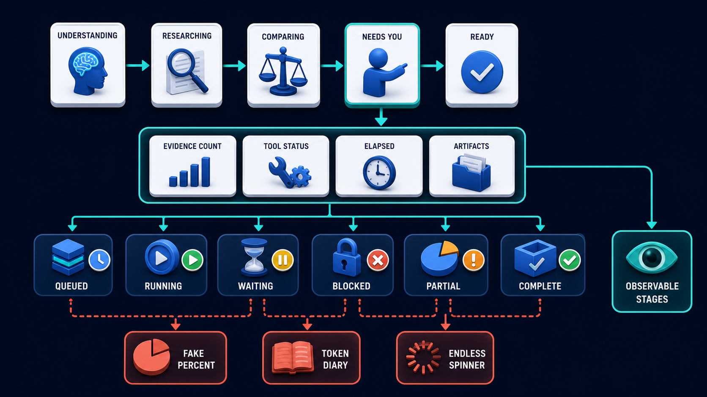
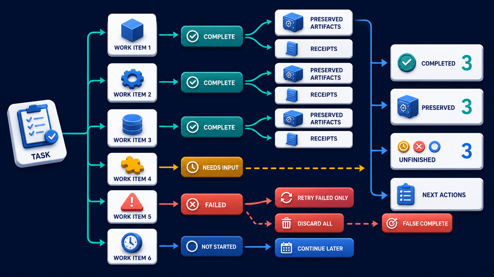

# Diagram 201 — Progressive disclosure and observable stage labels

**Module:** Progress, tools, artifacts, and recovery
**Role in the course:** Design progress that answers what is happening, what is complete, what is waiting, and what the person can do next.
**Layout:** The diagram shows one WORKFLOW progressing through UNDERSTAND, RESEARCH, CHECK POLICY, PREPARE, WAITING FOR YOU, COMPLETE, with a coral risk path.

---

## At a glance

**Design progress that answers what is happening, what is complete, what is waiting, and what the person can do next.**

- The diagram centers on **WORKFLOW** and its relationship to **LOST TRUST**.

- The diagram separates the tested, legitimate flow from failure paths that must fail closed.

- Maya's case: Maya starts a policy review that pauses because the finance specialist is unavailable, but the old screen continues spinning.

---

## What the diagram teaches

### 1. Progress Is A Promise About State, Not Decoration

Progress is a promise about state, not decoration. The diagram makes this concrete through **WORKFLOW**, **UNDERSTAND**, **RESEARCH**. If the team skips this, an indefinite spinner or fabricated percentage can hide a blocked workflow, encourage duplicate submissions, and make users assume the browser is broken. This is the lesson the case study ends with: Show observable stages, preserved value, and next actions; never manufacture certainty about unknown work.

Diagram 203 — *Partial success, preserved work, and unfinished work* is the next lens on this idea. The same concepts reappear there with different emphasis, so the two diagrams should be read as a pair.

### 2. Do Not Invent Percentages For Work Whose Size Is Unknown

Do not invent percentages for work whose size is unknown. This is visible in the drawing as **WORKFLOW**, **UNDERSTAND**, **RESEARCH**. Without this step, an indefinite spinner or fabricated percentage can hide a blocked workflow, encourage duplicate submissions, and make users assume the browser is broken. In the walkthrough, The redesigned workspace shows Research complete, Finance evidence waiting, and the policy summary already preserved..

### 3. Small Stage Vocabulary From Observable Product Events And Durable Transitions

This step asks the team to define a small stage vocabulary from observable product events and durable transitions, not model narration. The diagram shows this through **WORKFLOW**, **UNDERSTAND**, **RESEARCH**, which make the abstract step visible and testable. Use a small vocabulary of observable stages tied to real events and records. If the team skips this, an indefinite spinner or fabricated percentage can hide a blocked workflow, encourage duplicate submissions, and make users assume the browser is broken. Maya's case makes this concrete: Maya starts a policy review that pauses because the finance specialist is unavailable, but the old screen continues spinning.

### 4. Stage Start, Complete, Blocked, Waiting, Cancel, And Recovery Semantics Before

Here the product must give every stage start, complete, blocked, waiting, cancel, and recovery semantics before designing labels. In the drawing, **COMPLETE**, **WAITING FOR YOU** carry this responsibility. Each stage should have a start condition, completion condition, possible blocked state, owner, and user-safe label. Waiting is a first-class state. Without this step, an indefinite spinner or fabricated percentage can hide a blocked workflow, encourage duplicate submissions, and make users assume the browser is broken. The result — Maya receives useful work immediately and understands why the remaining part is unfinished. — depends on getting this right.

### 5. Current Stage, Completed Stages, Preserved Output, And Next Safe Action

The diagram enforces this by showing the team how to show the current stage, completed stages, preserved output, and next safe action in the default view. The visual anchors are **COMPLETE**, **A SIMPLE VIEW**, **EXPANDED VIEW**; without them the step would be invisible to the user. Prefer named stages, completed item counts, elapsed time, last meaningful event, and a statement about what may take longer. Progressive disclosure keeps the default view calm while allowing a curious or worried user to expand details. The case study shows the risk: an indefinite spinner or fabricated percentage can hide a blocked workflow, encourage duplicate submissions, and make users assume the browser is broken. This is the lesson the case study ends with: Show observable stages, preserved value, and next actions; never manufacture certainty about unknown work.

### 6. Reveal Timestamps, Evidence, Tool Status, And Receipts Through An Optional

This is the discipline that makes the product reveal timestamps, evidence, tool status, and receipts through an optional details view with accessible reading order. This idea sits on **A SIMPLE VIEW** and reaches the rest of the diagram through **A SIMPLE VIEW**, **EXPANDED VIEW**. The expanded view can show evidence counts, tool and specialist status, preserved artifacts, and support references without revealing private reasoning. Missing this is how products end up with an indefinite spinner or fabricated percentage can hide a blocked workflow, encourage duplicate submissions, and make users assume the browser is broken. In the walkthrough, The redesigned workspace shows Research complete, Finance evidence waiting, and the policy summary already preserved..

### 7. Interrupted, Slow, Queued, Waiting-for-user, Partial-success, And Failed Runs With Real

The team must test interrupted, slow, queued, waiting-for-user, partial-success, and failed runs with real users and assistive technology before the interface can be trustworthy. The diagram shows this through **WAITING FOR YOU**, which make the abstract step visible and testable. A spinner communicates only that the interface has not stopped animating; it does not say whether the server started, a tool is waiting, work is queued, or the request already failed. A system that ignores this will eventually face an indefinite spinner or fabricated percentage can hide a blocked workflow, encourage duplicate submissions, and make users assume the browser is broken. The danger the case warns about, Maya starts a policy review that pauses because the finance specialist is unavailable, but the old screen continues spinning. should make this clear.

### 8. The standard in practice

The lesson is not a perfect prototype; it is a product contract. Design progress that answers what is happening, what is complete, what is waiting, and what the person can do next.. The diagram makes that contract visible through **WORKFLOW**, **UNDERSTAND**, **RESEARCH**, so the team can argue about the contract before choosing a framework. The contract is not framework-specific; it is the set of observable promises the product makes to the person using it. Maya's case warns that an indefinite spinner or fabricated percentage can hide a blocked workflow, encourage duplicate submissions, and make users assume the browser is broken. The practical standard is this: Show observable stages, preserved value, and next actions; never manufacture certainty about unknown work.

### 9. The Next.js and Python surfaces

The same contract appears in both stacks, but the boundary moves with the architecture.
**In Next.js / React:**
- Render progress from a typed stage model in a server-owned stream, with each client component receiving only label, status, timestamps, evidence count, and permitted actions.
- Use accessible status announcements for important transitions while avoiding a live-region announcement for every token or animation frame.
- Keep the stage summary stable across responsive layouts and provide an explicit details disclosure rather than hiding evidence in hover-only tooltips.
- Keep the most sensitive payloads and policy decisions on the server and stream only user-visible, safe view models to client components.
**In Python / FastAPI:**
- Emit activity snapshot and delta events from workflow transitions, not arbitrary log statements or model text callbacks.
- Model stage status as a closed enum with timestamps, reason category, visible description, artifact references, and allowed recovery actions.
- Record time to first evidence, stage durations, waiting reasons, cancellations, and recovery outcomes with privacy-safe dimensions.
- Treat every framework callback or protocol event as raw input; validate and transform it into the product's own event vocabulary before it reaches the reducer or domain model.
Both implementations must avoid the same trap: an indefinite spinner or fabricated percentage can hide a blocked workflow, encourage duplicate submissions, and make users assume the browser is broken.

### 10. Analogy

A parcel tracker says collected, at depot, out for delivery, or delivery attempted. It does not show a spinning wheel for two days or claim 83 percent when it does not know the route. The analogy keeps the lesson grounded. The diagram's **WORKFLOW** plays the same role as the central object in the analogy: it must be visible, labeled, and trustworthy without the user having to infer meaning from a long narrative. The parallel works because both situations require separating the object from the record, the attempt from the proof, and the promise from the evidence.

---

## Case study — Maya

Maya starts a policy review that pauses because the finance specialist is unavailable, but the old screen continues spinning.

### The walkthrough

1. The redesigned workspace shows Research complete, Finance evidence waiting, and the policy summary already preserved.
2. The default card explains that Acme can continue with a partial answer, notify Maya later, or request human help.
3. The expanded view shows the unavailable dependency and last evidence timestamp without exposing internal prompts.
4. When Maya chooses partial answer, progress closes honestly as Partially complete rather than green success.

### The result

Maya receives useful work immediately and understands why the remaining part is unfinished.

### The danger

An indefinite spinner or fabricated percentage can hide a blocked workflow, encourage duplicate submissions, and make users assume the browser is broken.

### The takeaway

Show observable stages, preserved value, and next actions; never manufacture certainty about unknown work.

---

## Composition

The picture is a single-view explainer for *Progressive disclosure and observable stage labels*. On the left, the diagram shows one WORKFLOW progressing through UNDERSTAND, RESEARCH, CHECK POLICY, PREPARE, WAITING FOR YOU, COMPLETE. At the top, a SIMPLE VIEW shows current stage and next action. In the center, an EXPANDED VIEW reveals elapsed time, evidence count, tool status, and receipts. To the right, coral INDEFINITE SPINNER and FAKE PERCENTAGE lead to LOST TRUST. The eye travels from **WORKFLOW** through the central flow to **LOST TRUST**, with the contrast between coral risk paths and teal recovery paths giving the reader the core message at a glance.

## Element by element

- **WORKFLOW** — the sequence of stages that the agent and product move through to complete a task.
- **UNDERSTAND** — one of the items named by **WORKFLOW**; this is the **UNDERSTAND** item.
- **RESEARCH** — one of the items named by **WORKFLOW**; this is the **RESEARCH** item.
- **CHECK POLICY** — one of the items named by **WORKFLOW**; this is the **CHECK POLICY** item.
- **PREPARE** — one of the items named by **WORKFLOW**; this is the **PREPARE** item.
- **WAITING FOR YOU** — one of the items named by **WORKFLOW**; this is the **WAITING FOR YOU** item.
- **COMPLETE** — one of the items named by **WORKFLOW**; this is the **COMPLETE** item.
- **A SIMPLE VIEW** — the a simple view SIMPLE VIEW shows current stage and next action;.
- **EXPANDED VIEW** — the optional details that reveal elapsed time, evidence count, tool status, and receipts.
- **INDEFINITE SPINNER** — the indefinite spinner and FAKE PERCENTAGE lead to LOST TRUST..
- **FAKE PERCENTAGE** — one of the items named by **INDEFINITE SPINNER**; this is the **FAKE PERCENTAGE** item.
- **LOST TRUST** — one of the items named by **INDEFINITE SPINNER**; this is the **LOST TRUST** item.

---

## Colour and flow semantics

The course visual grammar applies directly to this diagram.

- **Cobalt platform** — A browser surface, state store, component catalog, product boundary, workspace, or learning-platform region. Here the cobalt surface under **WORKFLOW** and the surrounding workspace frames the product boundary; it tells the reader that this is a bounded product region, not an uncontrolled chat surface. It marks the product's responsibility to keep the user's workspace distinct from raw model output or runtime internals.

- **Cyan arrow** — A typed event, validated state update, user action, artifact reference, notification, or navigation path. Cyan arrows carry the flow of events, updates, and proposals from left to right, linking the typed cards and records to the reducer or next gate. When the reader sees cyan, they should expect a deliberate, validated transition rather than an accidental or hidden connection.

- **Teal arrow** — Authoritative state, accessible completion, informed consent, safe approval, preserved work, or verified recovery. Teal marks the authoritative and safe path, such as the committed receipt or restored state, distinguishing it from the raw request. This color tells the reader that the product has enough evidence and authority to proceed safely.

- **Coral path** — Conflict, stale UI, unsafe rendering, deceptive state, expired approval, privacy failure, lost work, or blocked action. Coral marks the conflict, stale state, or blocked action that appears when a control is missing or bypassed. It signals that the product should pause, surface the conflict, and offer a recovery path rather than proceed silently.

- **White card** — An event, component, stage, proposal, artifact, receipt, consent record, lesson, checkpoint, or recovery option. The labeled cards and records throughout the diagram are white, marking them as structured events, proposals, receipts, or recovery options. The white background separates user-meaningful records from raw system logs or generated text.

The overall flow moves from the initiating actor or request, through validation and reduction, toward either the teal recovery or completion path or the coral failure path. The color of each arrow and card is a trust cue, not a decoration.

---

## How to present it

- **Start with the user moment.** Maya starts a policy review that pauses because the finance specialist is unavailable, but the old screen continues spinning. Ask the room what they need to see to feel in control. Invite someone to describe the moment before any solution appears.

- **Point at WORKFLOW and ask what it represents.** Then trace the flow from there through the next two or three elements, naming the color and direction of each arrow. Encourage them to name the incoming trigger, the visible state, and the decision the product must make.

- **Point at WORKFLOW for step 1.** Small Stage Vocabulary From Observable Product Events And Durable Transitions. Ask what observable evidence the product would produce if this step worked correctly. Have the room identify the color of the path leaving this element and what it tells a user about trust.

- **Point at COMPLETE for step 2.** Stage Start, Complete, Blocked, Waiting, Cancel, And Recovery Semantics Before. Ask what observable evidence the product would produce if this step worked correctly. Have the room identify the color of the path leaving this element and what it tells a user about trust.

- **Point at COMPLETE for step 3.** Current Stage, Completed Stages, Preserved Output, And Next Safe Action. Ask what observable evidence the product would produce if this step worked correctly. Have the room identify the color of the path leaving this element and what it tells a user about trust.

- **Point at A SIMPLE VIEW for step 4.** Reveal Timestamps, Evidence, Tool Status, And Receipts Through An Optional. Ask what observable evidence the product would produce if this step worked correctly. Have the room identify the color of the path leaving this element and what it tells a user about trust.

- **Point at WAITING FOR YOU for step 5.** Interrupted, Slow, Queued, Waiting-for-user, Partial-success, And Failed Runs With Real. Ask what observable evidence the product would produce if this step worked correctly. Have the room identify the color of the path leaving this element and what it tells a user about trust.

- **Use the analogy.** A parcel tracker says collected, at depot, out for delivery, or delivery attempted. It does not show a spinning wheel for two days or claim 83 percent when it does not know the route. Draw the parallel to the diagram and ask what would break if the two situations were handled the same way.

- **Tell the case study.** Maya starts a policy review that pauses because the finance specialist is unavailable, but the old screen continues spinning Walk through the walkthrough and stop at the moment the old design would have failed. Pause at the step where the old design would have failed and ask how the new interface prevents it.

- **Run the lab.** Design a six-stage progress model for policy review. For every stage, define event trigger, visible label, waiting variants, evidence, cancellation effect, screen-reader announcement, support reference, and the metric that would reveal confusion. Ask pairs to present one part of the diagram and explain how the other parts reference it without merging their identities.

- **Pose the checkpoint.** Is a continuously increasing percentage always better than named stages? Let the room answer before confirming the principle. Collect answers, then confirm the principle and note any exceptions the team should watch for.

- **Close on the contract.** Show observable stages, preserved value, and next actions; never manufacture certainty about unknown work. Ask the team what their own product's equivalent of the contract would be.

---

## Lab and checkpoint

**Lab:** Design a six-stage progress model for policy review. For every stage, define event trigger, visible label, waiting variants, evidence, cancellation effect, screen-reader announcement, support reference, and the metric that would reveal confusion.

**Checkpoint:** Is a continuously increasing percentage always better than named stages?

**Answer:** No. A percentage is useful only when total work and measurement are real. Named observable stages are more honest for variable agent workflows.

---

## Glossary

- **Progressive disclosure** — showing essentials first and details on request
- **Stage** — named observable unit of product work
- **Waiting state** — explicit reason work cannot currently advance

---

## Sources

- [AG-UI messages](https://docs.ag-ui.com/concepts/messages)
- [AG-UI events](https://docs.ag-ui.com/concepts/events)
- [ARIA status role](https://www.w3.org/TR/wai-aria-1.2/#status)

## Related lessons

- Diagram 197 — The event-driven interface mental model
- Diagram 203 — Partial success, preserved work, and unfinished work
- Diagram 208 — Accessibility, plain language, uncertainty, and trust cues

---