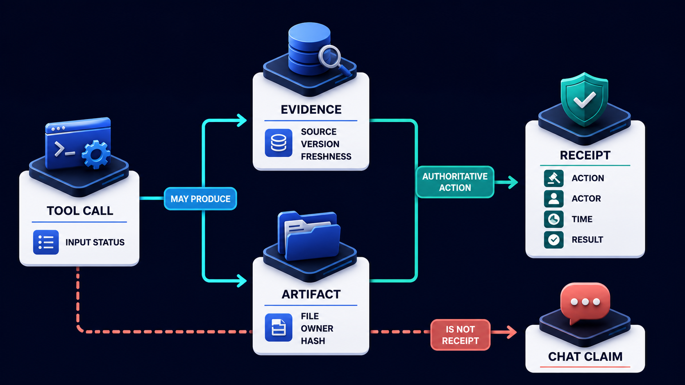

# Diagram 203 — Partial success, preserved work, and unfinished work

**Module:** Progress, tools, artifacts, and recovery
**Role in the course:** Represent partial success without discarding useful work or pretending the whole task completed.
**Layout:** The diagram shows a workflow split into COMPLETED RESEARCH, PRESERVED ARTIFACT, FAILED FINANCE CHECK, UNFINISHED APPROVAL, and SAFE PARTIAL RESULT, with a coral risk path, and...

---

## At a glance

**Represent partial success without discarding useful work or pretending the whole task completed.**

- The diagram centers on **COMPLETED RESEARCH** and its relationship to **PRESERVE CHECKPOINT**.

- The teal **PRESERVE CHECKPOINT** path shows the safe, authoritative, or consented route.

- Maya's case: Acme finishes policy research and writes a draft explanation, but the finance specialist times out before validating the refund amount.

---

## What the diagram teaches

### 1. Long Agent Workflows Rarely Fail As One Indivisible Block

Long agent workflows rarely fail as one indivisible block. The diagram makes this concrete through **COMPLETED RESEARCH**, **PRESERVED ARTIFACT**, **FAILED FINANCE CHECK**. If the team skips this, an all-or-nothing screen may discard valuable work after one dependency fails, while an overconfident partial screen may present an unfinished recommendation as final. This is the lesson the case study ends with: Preserve proven value, label missing work, and recover only the unfinished portion.

### 2. HTTP Success And Final Prose Do Not Describe That Shape

HTTP success and final prose do not describe that shape. Saving only chat text loses structured context and provenance. This is visible in the drawing as **COMPLETED RESEARCH**, **PRESERVED ARTIFACT**, **FAILED FINANCE CHECK**. Without this step, an all-or-nothing screen may discard valuable work after one dependency fails, while an overconfident partial screen may present an unfinished recommendation as final. In the walkthrough, The research artifact is preserved with current policy version and marked Incomplete for financial recommendation..

### 3. Completion, Evidence, Artifact, And Dependency State At Explicit Workflow Checkpoints

This step asks the team to record completion, evidence, artifact, and dependency state at explicit workflow checkpoints. The diagram shows this through **PRESERVED ARTIFACT**, which make the abstract step visible and testable. Research may complete while one specialist times out; an artifact may exist while approval remains unfinished; a tool may fail after useful evidence was collected. Preserved work needs checkpoints with artifact versions, evidence references, dependency state, and the conditions under which work may resume. If the team skips this, an all-or-nothing screen may discard valuable work after one dependency fails, while an overconfident partial screen may present an unfinished recommendation as final. Maya's case makes this concrete: Acme finishes policy research and writes a draft explanation, but the finance specialist times out before validating the refund amount.

Diagram 202 — *Tool cards, evidence cards, artifacts, and receipts* is the next lens on this idea. The same concepts reappear there with different emphasis, so the two diagrams should be read as a pair.

### 4. Classify Failed, Blocked, Cancelled, And Unstarted Stages Separately From Completed

Here the product must classify failed, blocked, cancelled, and unstarted stages separately from completed stages. In the drawing, **COMPLETED RESEARCH**, **FAILED FINANCE CHECK**, **RETRY FAILED STAGE** carry this responsibility. A product should classify every stage as complete, failed, blocked, cancelled, or not started, then compute an honest user outcome. Without this step, an all-or-nothing screen may discard valuable work after one dependency fails, while an overconfident partial screen may present an unfinished recommendation as final. The result — Useful work survives, unsupported conclusions remain blocked, and recovery does not repeat the entire workflow. — depends on getting this right.

### 5. Bounded Partial Artifact That Names Missing Evidence, Limitations, And Permitted

The diagram enforces this by showing the team how to create a bounded partial artifact that names missing evidence, limitations, and permitted uses. The visual anchors are **PRESERVED ARTIFACT**, **SAFE PARTIAL RESULT**; without them the step would be invisible to the user. The interface should separate what is supported, what is missing, what cannot be concluded, and whether a later continuation may change the current recommendation. The case study shows the risk: an all-or-nothing screen may discard valuable work after one dependency fails, while an overconfident partial screen may present an unfinished recommendation as final. This is the lesson the case study ends with: Preserve proven value, label missing work, and recover only the unfinished portion.

### 6. Offer Recovery Actions Scoped To Unfinished Work And Validate Current

This is the discipline that makes the product offer recovery actions scoped to unfinished work and validate current versions before resuming. This idea sits on **UNFINISHED APPROVAL** and reaches the rest of the diagram through **UNFINISHED APPROVAL**. Recovery choices should target the failed or unfinished portion instead of rerunning everything. Measure recovery by preserved-value rate, duplicate work avoided, successful resume, correction rate, user understanding, and whether partial artifacts were accidentally treated as final elsewhere. Missing this is how products end up with an all-or-nothing screen may discard valuable work after one dependency fails, while an overconfident partial screen may present an unfinished recommendation as final. In the walkthrough, The research artifact is preserved with current policy version and marked Incomplete for financial recommendation..

### 7. Close Only When The Person Accepts The Partial Outcome, Resumes

The team must close only when the person accepts the partial outcome, resumes successfully, cancels the remainder, or receives human resolution before the interface can be trustworthy. The diagram shows this through **SAFE PARTIAL RESULT**, **HUMAN HELP**, **CANCEL REMAINDER**, which make the abstract step visible and testable. Retry one dependency, replace an unavailable specialist, continue asynchronously, request human help, or cancel only the remainder. A system that ignores this will eventually face an all-or-nothing screen may discard valuable work after one dependency fails, while an overconfident partial screen may present an unfinished recommendation as final. The danger the case warns about, Acme finishes policy research and writes a draft explanation, but the finance specialist times out before validating the refund amount. should make this clear.

### 8. The standard in practice

The lesson is not a perfect prototype; it is a product contract. Represent partial success without discarding useful work or pretending the whole task completed.. The diagram makes that contract visible through **COMPLETED RESEARCH**, **PRESERVED ARTIFACT**, **FAILED FINANCE CHECK**, so the team can argue about the contract before choosing a framework. The contract is not framework-specific; it is the set of observable promises the product makes to the person using it. Maya's case warns that an all-or-nothing screen may discard valuable work after one dependency fails, while an overconfident partial screen may present an unfinished recommendation as final. The practical standard is this: Preserve proven value, label missing work, and recover only the unfinished portion.

### 9. The Next.js and Python surfaces

The same contract appears in both stacks, but the boundary moves with the architecture.
**In Next.js / React:**
- Render a stage summary with completed, failed, blocked, and pending groups plus preserved artifacts and the exact scope of each recovery button.
- Keep partial artifacts visibly labeled and prevent final-only actions such as publish or send until required completion evidence exists.
- Use server-side resume actions that reload authoritative checkpoint versions instead of reconstructing work from browser state or chat history.
- Keep the most sensitive payloads and policy decisions on the server and stream only user-visible, safe view models to client components.
**In Python / FastAPI:**
- Persist workflow checkpoints and artifact states transactionally with dependency versions, continuation tokens, and permitted resume transitions.
- Compute a typed outcome such as complete, partial, blocked, failed, or cancelled from stage and business records rather than response status.
- Implement targeted retry and resume commands that revalidate policy, evidence freshness, authority, and idempotency before continuing.
- Treat every framework callback or protocol event as raw input; validate and transform it into the product's own event vocabulary before it reaches the reducer or domain model.
Both implementations must avoid the same trap: an all-or-nothing screen may discard valuable work after one dependency fails, while an overconfident partial screen may present an unfinished recommendation as final.

### 10. Analogy

If one suitcase is delayed, an airline does not pretend the whole journey failed or throw away the bags that arrived. It records what arrived, what is missing, and how the missing item will be delivered. The analogy keeps the lesson grounded. The diagram's **COMPLETED RESEARCH** plays the same role as the central object in the analogy: it must be visible, labeled, and trustworthy without the user having to infer meaning from a long narrative. The parallel works because both situations require separating the object from the record, the attempt from the proof, and the promise from the evidence.

---

## Case study — Maya

Acme finishes policy research and writes a draft explanation, but the finance specialist times out before validating the refund amount.

### The walkthrough

1. The research artifact is preserved with current policy version and marked Incomplete for financial recommendation.
2. Maya receives the supported policy explanation immediately and sees that no amount has been approved.
3. She can retry finance, continue later with notification, or send the preserved artifact to human support.
4. A later resume reuses the current artifact only after confirming its policy evidence is still fresh.

### The result

Useful work survives, unsupported conclusions remain blocked, and recovery does not repeat the entire workflow.

### The danger

An all-or-nothing screen may discard valuable work after one dependency fails, while an overconfident partial screen may present an unfinished recommendation as final.

### The takeaway

Preserve proven value, label missing work, and recover only the unfinished portion.

---

## Composition

The picture is a single-view explainer for *Partial success, preserved work, and unfinished work*. On the left, the diagram shows a workflow split into COMPLETED RESEARCH, PRESERVED ARTIFACT, FAILED FINANCE CHECK, UNFINISHED APPROVAL, and SAFE PARTIAL RESULT. At the top, the diagram offers CONTINUE LATER, RETRY FAILED STAGE, HUMAN HELP, CANCEL REMAINDER. In the center, coral ALL OR NOTHING discards work. To the right, teal PRESERVE CHECKPOINT keeps value and provenance. The eye travels from **COMPLETED RESEARCH** through the central flow to **PRESERVE CHECKPOINT**, with the contrast between coral risk paths and teal recovery paths giving the reader the core message at a glance.

## Element by element

- **COMPLETED RESEARCH** — the completed research a workflow split into COMPLETED RESEARCH, PRESERVED ARTIFACT, FAILED FINANCE CHECK, UNFINISHED APPROVAL, and SAFE PARTIAL RESULT..
- **PRESERVED ARTIFACT** — the preserved artifact a workflow split into COMPLETED RESEARCH, PRESERVED ARTIFACT, FAILED FINANCE CHECK, UNFINISHED APPROVAL, and SAFE PARTIAL RESULT..
- **FAILED FINANCE CHECK** — the failed finance check a workflow split into COMPLETED RESEARCH, PRESERVED ARTIFACT, FAILED FINANCE CHECK, UNFINISHED APPROVAL, and SAFE PARTIAL RESULT..
- **UNFINISHED APPROVAL** — one of the items named by **FAILED**; this is the **UNFINISHED APPROVAL** item.
- **SAFE PARTIAL RESULT** — one of the items named by **FAILED**; this is the **SAFE PARTIAL RESULT** item.
- **CONTINUE LATER** — the continue later Offer CONTINUE LATER, RETRY FAILED STAGE, HUMAN HELP, CANCEL REMAINDER..
- **RETRY FAILED STAGE** — the retry failed stage Offer CONTINUE LATER, RETRY FAILED STAGE, HUMAN HELP, CANCEL REMAINDER..
- **HUMAN HELP** — one of the items named by **RETRY**; this is the **HUMAN HELP** item.
- **CANCEL REMAINDER** — one of the items named by **RETRY**; this is the **CANCEL REMAINDER** item.
- **ALL OR NOTHING** — the all or nothing discards work.
- **PRESERVE CHECKPOINT** — the preserve checkpoint keeps value and provenance.

---

## Colour and flow semantics

The course visual grammar applies directly to this diagram.

- **Cobalt platform** — A browser surface, state store, component catalog, product boundary, workspace, or learning-platform region. Here the cobalt surface under **COMPLETED RESEARCH** and the surrounding workspace frames the product boundary; it tells the reader that this is a bounded product region, not an uncontrolled chat surface. It marks the product's responsibility to keep the user's workspace distinct from raw model output or runtime internals.

- **Cyan arrow** — A typed event, validated state update, user action, artifact reference, notification, or navigation path. Cyan arrows carry the flow of events, updates, and proposals from left to right, linking the typed cards and records to the reducer or next gate. When the reader sees cyan, they should expect a deliberate, validated transition rather than an accidental or hidden connection.

- **Teal arrow** — Authoritative state, accessible completion, informed consent, safe approval, preserved work, or verified recovery. The teal **PRESERVE CHECKPOINT** path shows the safe, authoritative, and consented route through the diagram. This color tells the reader that the product has enough evidence and authority to proceed safely.

- **Coral path** — Conflict, stale UI, unsafe rendering, deceptive state, expired approval, privacy failure, lost work, or blocked action. Coral marks the conflict, stale state, or blocked action that appears when a control is missing or bypassed. It signals that the product should pause, surface the conflict, and offer a recovery path rather than proceed silently.

- **White card** — An event, component, stage, proposal, artifact, receipt, consent record, lesson, checkpoint, or recovery option. **PRESERVED ARTIFACT** appear as white cards, showing that they are records, proposals, or evidence rather than raw data or system internals. The white background separates user-meaningful records from raw system logs or generated text.

The overall flow moves from the initiating actor or request, through validation and reduction, toward either the teal recovery or completion path or the coral failure path. The color of each arrow and card is a trust cue, not a decoration.

---

## How to present it

- **Start with the user moment.** Acme finishes policy research and writes a draft explanation, but the finance specialist times out before validating the refund amount. Ask the room what they need to see to feel in control. Invite someone to describe the moment before any solution appears.

- **Point at COMPLETED RESEARCH and ask what it represents.** Then trace the flow from there through the next two or three elements, naming the color and direction of each arrow. Encourage them to name the incoming trigger, the visible state, and the decision the product must make.

- **Point at PRESERVED ARTIFACT for step 1.** Completion, Evidence, Artifact, And Dependency State At Explicit Workflow Checkpoints. Ask what observable evidence the product would produce if this step worked correctly. Have the room identify the color of the path leaving this element and what it tells a user about trust.

- **Point at COMPLETED RESEARCH for step 2.** Classify Failed, Blocked, Cancelled, And Unstarted Stages Separately From Completed. Ask what observable evidence the product would produce if this step worked correctly. Have the room identify the color of the path leaving this element and what it tells a user about trust.

- **Point at PRESERVED ARTIFACT for step 3.** Bounded Partial Artifact That Names Missing Evidence, Limitations, And Permitted. Ask what observable evidence the product would produce if this step worked correctly. Have the room identify the color of the path leaving this element and what it tells a user about trust.

- **Point at UNFINISHED APPROVAL for step 4.** Offer Recovery Actions Scoped To Unfinished Work And Validate Current. Ask what observable evidence the product would produce if this step worked correctly. Have the room identify the color of the path leaving this element and what it tells a user about trust.

- **Point at SAFE PARTIAL RESULT for step 5.** Close Only When The Person Accepts The Partial Outcome, Resumes. Ask what observable evidence the product would produce if this step worked correctly. Have the room identify the color of the path leaving this element and what it tells a user about trust.

- **Use the analogy.** If one suitcase is delayed, an airline does not pretend the whole journey failed or throw away the bags that arrived. It records what arrived, what is missing, and how the missing item will be delivered. Draw the parallel to the diagram and ask what would break if the two situations were handled the same way.

- **Tell the case study.** Acme finishes policy research and writes a draft explanation, but the finance specialist times out before validating the refund amount Walk through the walkthrough and stop at the moment the old design would have failed. Pause at the step where the old design would have failed and ask how the new interface prevents it.

- **Run the lab.** Draw a ten-stage workflow with two checkpoints and three failure points. For each failure, specify preserved artifacts, limitations, invalidated work, recovery choices, resume validation, and the final user-facing outcome label. Ask pairs to present one part of the diagram and explain how the other parts reference it without merging their identities.

- **Pose the checkpoint.** Can a partial artifact be useful and still be prohibited from publication? Let the room answer before confirming the principle. Collect answers, then confirm the principle and note any exceptions the team should watch for.

- **Close on the contract.** Preserve proven value, label missing work, and recover only the unfinished portion. Ask the team what their own product's equivalent of the contract would be.

---

## Lab and checkpoint

**Lab:** Draw a ten-stage workflow with two checkpoints and three failure points. For each failure, specify preserved artifacts, limitations, invalidated work, recovery choices, resume validation, and the final user-facing outcome label.

**Checkpoint:** Can a partial artifact be useful and still be prohibited from publication?

**Answer:** Yes. It may preserve verified evidence or draft work while missing approval, freshness, or required specialist input. Its lifecycle and permitted uses must state that clearly.

---

## Glossary

- **Checkpoint** — durable resume point with versioned state
- **Partial success** — useful verified outcome with named unfinished limits
- **Resume transition** — validated continuation from preserved state

---

## Sources

- [AG-UI messages](https://docs.ag-ui.com/concepts/messages)
- [AG-UI events](https://docs.ag-ui.com/concepts/events)
- [FastAPI background tasks](https://fastapi.tiangolo.com/tutorial/background-tasks/)

## Related lessons

- Diagram 199 — Reconnect, replay, deduplication, and offline recovery
- Diagram 202 — Tool cards, evidence cards, artifacts, and receipts
- Diagram 204 — Errors, recovery choices, support references, and next actions

---