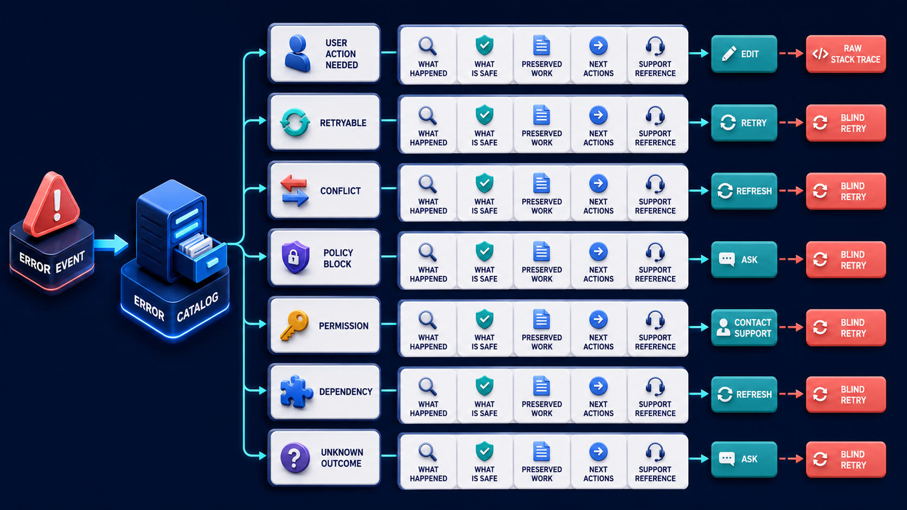

# Diagram 204 — Errors, recovery choices, support references, and next actions

**Module:** Progress, tools, artifacts, and recovery
**Role in the course:** Design error messages that preserve dignity, evidence, and control instead of blaming the user or offering a useless retry button.
**Layout:** The diagram shows ERROR EVENT entering a CLASSIFIER with USER ACTIONABLE, RETRYABLE, CONFLICT, PERMISSION, UNSAFE, UNKNOWN, with a coral risk path, and a teal safe path.

---

## At a glance

**Design error messages that preserve dignity, evidence, and control instead of blaming the user or offering a useless retry button.**

- The diagram centers on **ERROR EVENT** and its relationship to **SAFE STOP**.

- The teal **RETRY** path shows the safe, authoritative, or consented route.

- Maya's case: The refund provider times out after Acme sends a request, and the old interface displays 'Something went wrong - Try again.'

---

## What the diagram teaches

### 1. Never Expose Stack Traces, Internal URLs, Tokens, Or Provider Payloads

Never expose stack traces, internal URLs, tokens, or provider payloads. The diagram makes this concrete through **RAW STACK TRACE**. If the team skips this, a generic retry button after an uncertain consequential effect can repeat payments, emails, deletions, or approvals while hiding why the first attempt was unsafe to repeat. This is the lesson the case study ends with: Explain consequence and preserved state first; offer only recovery actions the system can prove are safe.

### 2. Normalize Technical Failures Into Bounded Product Categories With Consequence, Retryability

This step asks the team to normalize technical failures into bounded product categories with consequence, retryability, and state certainty. The diagram shows this through **RETRY**, which make the abstract step visible and testable. An error is part of the product state. Classify errors by action and consequence rather than provider message. If the team skips this, a generic retry button after an uncertain consequential effect can repeat payments, emails, deletions, or approvals while hiding why the first attempt was unsafe to repeat. Maya's case makes this concrete: The refund provider times out after Acme sends a request, and the old interface displays 'Something went wrong - Try again.'.

### 3. State What Happened, What Was Preserved, What May Have Changed

Here the product must state what happened, what was preserved, what may have changed, and what the person can safely do next. In the drawing, **WHAT HAPPENED** carry this responsibility. The person needs to know what failed, what did not fail, what work was preserved, whether anything changed externally, and which actions are safe now. Without this step, a generic retry button after an uncertain consequential effect can repeat payments, emails, deletions, or approvals while hiding why the first attempt was unsafe to repeat. The result — Maya avoids a duplicate refund and understands that the system recovered by checking the real outcome. — depends on getting this right.

Diagram 203 — *Partial success, preserved work, and unfinished work* is the next lens on this idea. The same concepts reappear there with different emphasis, so the two diagrams should be read as a pair.

### 4. Attach A Non-sensitive Support Reference That Connects Authorized Staff

The diagram enforces this by showing the team how to attach a non-sensitive support reference that connects authorized staff to deeper evidence. The visual anchors are **SUPPORT ID**; without them the step would be invisible to the user. Otherwise offer edit, refresh evidence, resume, undo, contact support, or safe stop. The case study shows the risk: a generic retry button after an uncertain consequential effect can repeat payments, emails, deletions, or approvals while hiding why the first attempt was unsafe to repeat. This is the lesson the case study ends with: Explain consequence and preserved state first; offer only recovery actions the system can prove are safe.

### 5. Offer Only Actions Whose Preconditions And Effect Safety Are Known;

This is the discipline that makes the product offer only actions whose preconditions and effect safety are known; reconcile uncertain outcomes before retry. This idea sits on **RETRY** and reaches the rest of the diagram through **RETRY**. Retry is appropriate only when the operation is retryable, idempotent, within a deadline, and unlikely to repeat harm. Missing this is how products end up with a generic retry button after an uncertain consequential effect can repeat payments, emails, deletions, or approvals while hiding why the first attempt was unsafe to repeat. In the walkthrough, The new interface marks the outcome Unknown rather than Failed because acknowledgement was lost..

### 6. Focus, Announcements, Keyboard Operation, Data Preservation, Localization, And Repeated-failure Behavior

The team must test focus, announcements, keyboard operation, data preservation, localization, and repeated-failure behavior before the interface can be trustworthy. The diagram shows this through **ERROR EVENT**, **CLASSIFIER**, **USER ACTIONABLE**, which make the abstract step visible and testable. Accessible error handling moves focus intentionally, connects fields to errors, announces important changes without repeated noise, preserves entered data, and never relies on color or icon alone. Unknown outcome is different from failure. A system that ignores this will eventually face a generic retry button after an uncertain consequential effect can repeat payments, emails, deletions, or approvals while hiding why the first attempt was unsafe to repeat. The danger the case warns about, The refund provider times out after Acme sends a request, and the old interface displays 'Something went wrong - Try again.' should make this clear.

### 7. The standard in practice

The lesson is not a perfect prototype; it is a product contract. Design error messages that preserve dignity, evidence, and control instead of blaming the user or offering a useless retry button.. The diagram makes that contract visible through **ERROR EVENT**, **CLASSIFIER**, **USER ACTIONABLE**, so the team can argue about the contract before choosing a framework. The contract is not framework-specific; it is the set of observable promises the product makes to the person using it. Maya's case warns that a generic retry button after an uncertain consequential effect can repeat payments, emails, deletions, or approvals while hiding why the first attempt was unsafe to repeat. The practical standard is this: Explain consequence and preserved state first; offer only recovery actions the system can prove are safe.

### 8. The Next.js and Python surfaces

The same contract appears in both stacks, but the boundary moves with the architecture.
**In Next.js / React:**
- Map typed server problems to an allowlisted error catalog with accessible heading, field association, preserved-input behavior, and recovery actions.
- Use error boundaries for rendering failures, but keep business error state in normal typed data so users can review evidence and recover without losing the whole page.
- Generate opaque support IDs server-side and never include stack traces, tenant data, secrets, or raw downstream bodies in client errors.
- Keep the most sensitive payloads and policy decisions on the server and stream only user-visible, safe view models to client components.
**In Python / FastAPI:**
- Return RFC 9457-style problem documents with stable type URI, safe title, status, instance reference, category, retryability, and permitted action codes.
- Separate internal exception evidence from the user response and enforce redaction through one error adapter rather than scattered string handling.
- For uncertain effects, query authoritative records and return reconciled committed, not-committed, or human-review-required state before accepting retry.
- Treat every framework callback or protocol event as raw input; validate and transform it into the product's own event vocabulary before it reaches the reducer or domain model.
Both implementations must avoid the same trap: a generic retry button after an uncertain consequential effect can repeat payments, emails, deletions, or approvals while hiding why the first attempt was unsafe to repeat.

### 9. Analogy

A good road closure sign says which road is closed, what remains open, the safe detour, and where to get help. A sign that shows an engine code and says 'try driving again' is not useful. The analogy keeps the lesson grounded. The diagram's **ERROR EVENT** plays the same role as the central object in the analogy: it must be visible, labeled, and trustworthy without the user having to infer meaning from a long narrative. The parallel works because both situations require separating the object from the record, the attempt from the proof, and the promise from the evidence.

---

## Case study — Maya

The refund provider times out after Acme sends a request, and the old interface displays 'Something went wrong - Try again.'

### The walkthrough

1. The new interface marks the outcome Unknown rather than Failed because acknowledgement was lost.
2. It preserves Maya's review and disables repeat submission while the server checks the provider receipt ledger.
3. The ledger confirms one refund, so the card changes to Completed with the authoritative receipt.
4. A support reference remains available without exposing the provider response or customer details.

### The result

Maya avoids a duplicate refund and understands that the system recovered by checking the real outcome.

### The danger

A generic retry button after an uncertain consequential effect can repeat payments, emails, deletions, or approvals while hiding why the first attempt was unsafe to repeat.

### The takeaway

Explain consequence and preserved state first; offer only recovery actions the system can prove are safe.

---

## Composition

The picture is a single-view explainer for *Errors, recovery choices, support references, and next actions*. On the left, the diagram shows ERROR EVENT entering a CLASSIFIER with USER ACTIONABLE, RETRYABLE, CONFLICT, PERMISSION, UNSAFE, UNKNOWN. At the top, each produces a plain card with WHAT HAPPENED, WHAT WAS SAVED, NEXT ACTION, SUPPORT ID. In the center, coral RAW STACK TRACE and TRY AGAIN LOOP. To the right, teal RETRY, EDIT, RESUME, HUMAN HELP, SAFE STOP. The eye travels from **ERROR EVENT** through the central flow to **SAFE STOP**, with the contrast between coral risk paths and teal recovery paths giving the reader the core message at a glance.

## Element by element

- **ERROR EVENT** — the error event entering a CLASSIFIER with USER ACTIONABLE, RETRYABLE, CONFLICT, PERMISSION, UNSAFE, UNKNOWN..
- **CLASSIFIER** — one of the items named by **ERROR EVENT**; this is the **CLASSIFIER** item.
- **USER ACTIONABLE** — one of the items named by **ERROR EVENT**; this is the **USER ACTIONABLE** item.
- **RETRYABLE** — one of the items named by **ERROR EVENT**; this is the **RETRYABLE** item.
- **CONFLICT** — evidence that local and authoritative state cannot be reconciled safely.
- **PERMISSION** — one of the items named by **ERROR EVENT**; this is the **PERMISSION** item.
- **UNKNOWN** — one of the items named by **ERROR EVENT**; this is the **UNKNOWN** item.
- **WHAT HAPPENED** — one of the fields on the **Each produces a plain** card; this is the **WHAT HAPPENED** field.
- **WHAT WAS SAVED** — one of the fields on the **Each produces a plain** card; this is the **WHAT WAS SAVED** field.
- **NEXT ACTION** — the next action WHAT WAS SAVED, NEXT ACTION, SUPPORT ID.
- **SUPPORT ID** — the support id WHAT WAS SAVED, NEXT ACTION, SUPPORT ID.
- **RAW STACK TRACE** — the raw stack trace and TRY AGAIN LOOP.
- **TRY AGAIN LOOP** — one of the items named by **RAW STACK TRACE**; this is the **TRY AGAIN LOOP** item.
- **RETRY** — the retry EDIT, RESUME, HUMAN HELP, SAFE STOP.
- **EDIT** — the edit RETRY, EDIT, RESUME, HUMAN HELP, SAFE STOP..
- **RESUME** — the resume RETRY, EDIT, RESUME, HUMAN HELP, SAFE STOP..
- **HUMAN HELP** — the human help RETRY, EDIT, RESUME, HUMAN HELP, SAFE STOP..
- **SAFE STOP** — the safe stop RETRY, EDIT, RESUME, HUMAN HELP, SAFE STOP..

---

## Colour and flow semantics

The course visual grammar applies directly to this diagram.

- **Cobalt platform** — A browser surface, state store, component catalog, product boundary, workspace, or learning-platform region. Here the cobalt surface under **ERROR EVENT** and the surrounding workspace frames the product boundary; it tells the reader that this is a bounded product region, not an uncontrolled chat surface. It marks the product's responsibility to keep the user's workspace distinct from raw model output or runtime internals.

- **Cyan arrow** — A typed event, validated state update, user action, artifact reference, notification, or navigation path. Cyan arrows carry the flow of events, updates, and proposals from left to right, linking the typed cards and records to the reducer or next gate. When the reader sees cyan, they should expect a deliberate, validated transition rather than an accidental or hidden connection.

- **Teal arrow** — Authoritative state, accessible completion, informed consent, safe approval, preserved work, or verified recovery. The teal **RETRY** path shows the safe, authoritative, and consented route through the diagram. This color tells the reader that the product has enough evidence and authority to proceed safely.

- **Coral path** — Conflict, stale UI, unsafe rendering, deceptive state, expired approval, privacy failure, lost work, or blocked action. Coral marks the conflict, stale state, or blocked action that appears when a control is missing or bypassed. It signals that the product should pause, surface the conflict, and offer a recovery path rather than proceed silently.

- **White card** — An event, component, stage, proposal, artifact, receipt, consent record, lesson, checkpoint, or recovery option. **ERROR EVENT** appear as white cards, showing that they are records, proposals, or evidence rather than raw data or system internals. The white background separates user-meaningful records from raw system logs or generated text.

The overall flow moves from the initiating actor or request, through validation and reduction, toward either the teal recovery or completion path or the coral failure path. The color of each arrow and card is a trust cue, not a decoration.

---

## How to present it

- **Start with the user moment.** The refund provider times out after Acme sends a request, and the old interface displays 'Something went wrong - Try again. Ask the room what they need to see to feel in control. Invite someone to describe the moment before any solution appears.

- **Point at ERROR EVENT and ask what it represents.** Then trace the flow from there through the next two or three elements, naming the color and direction of each arrow. Encourage them to name the incoming trigger, the visible state, and the decision the product must make.

- **Point at RETRY for step 1.** Normalize Technical Failures Into Bounded Product Categories With Consequence, Retryability. Ask what observable evidence the product would produce if this step worked correctly. Have the room identify the color of the path leaving this element and what it tells a user about trust.

- **Point at WHAT HAPPENED for step 2.** State What Happened, What Was Preserved, What May Have Changed. Ask what observable evidence the product would produce if this step worked correctly. Have the room identify the color of the path leaving this element and what it tells a user about trust.

- **Point at SUPPORT ID for step 3.** Attach A Non-sensitive Support Reference That Connects Authorized Staff. Ask what observable evidence the product would produce if this step worked correctly. Have the room identify the color of the path leaving this element and what it tells a user about trust.

- **Point at RETRY for step 4.** Offer Only Actions Whose Preconditions And Effect Safety Are Known;. Ask what observable evidence the product would produce if this step worked correctly. Have the room identify the color of the path leaving this element and what it tells a user about trust.

- **Point at CONFLICT for step 5.** Focus, Announcements, Keyboard Operation, Data Preservation, Localization, And Repeated-failure Behavior. Ask what observable evidence the product would produce if this step worked correctly. Have the room identify the color of the path leaving this element and what it tells a user about trust.

- **Use the analogy.** A good road closure sign says which road is closed, what remains open, the safe detour, and where to get help. A sign that shows an engine code and says 'try driving again' is not useful. Draw the parallel to the diagram and ask what would break if the two situations were handled the same way.

- **Tell the case study.** The refund provider times out after Acme sends a request, and the old interface displays 'Something went wrong - Try again Walk through the walkthrough and stop at the moment the old design would have failed. Pause at the step where the old design would have failed and ask how the new interface prevents it.

- **Run the lab.** Create an error catalog with twelve categories. For each, write internal trigger, user title, preserved state, possible effect, retry rule, primary action, secondary action, accessibility behavior, support reference, and telemetry event. Ask pairs to present one part of the diagram and explain how the other parts reference it without merging their identities.

- **Pose the checkpoint.** Is every timeout a failed operation? Let the room answer before confirming the principle. Collect answers, then confirm the principle and note any exceptions the team should watch for.

- **Close on the contract.** Explain consequence and preserved state first; offer only recovery actions the system can prove are safe. Ask the team what their own product's equivalent of the contract would be.

---

## Lab and checkpoint

**Lab:** Create an error catalog with twelve categories. For each, write internal trigger, user title, preserved state, possible effect, retry rule, primary action, secondary action, accessibility behavior, support reference, and telemetry event.

**Checkpoint:** Is every timeout a failed operation?

**Answer:** No. A timeout means an acknowledgement deadline passed. The downstream effect may have succeeded, failed, or remain unknown; reconcile authoritative state before retry.

---

## Glossary

- **Problem Details** — standard typed HTTP error document
- **Unknown outcome** — effect may have occurred but is not yet confirmed
- **Support reference** — safe identifier connecting a user report to authorized evidence

---

## Sources

- [RFC 9457 Problem Details](https://www.rfc-editor.org/rfc/rfc9457)
- [WCAG 2.2](https://www.w3.org/TR/WCAG22/)
- [ARIA alert dialog pattern](https://www.w3.org/WAI/ARIA/apg/patterns/alertdialog/)

## Related lessons

- Diagram 200 — Optimistic interface state versus authoritative business state
- Diagram 203 — Partial success, preserved work, and unfinished work
- Diagram 207 — Cancel, undo, compensate, and preserve audit history

---