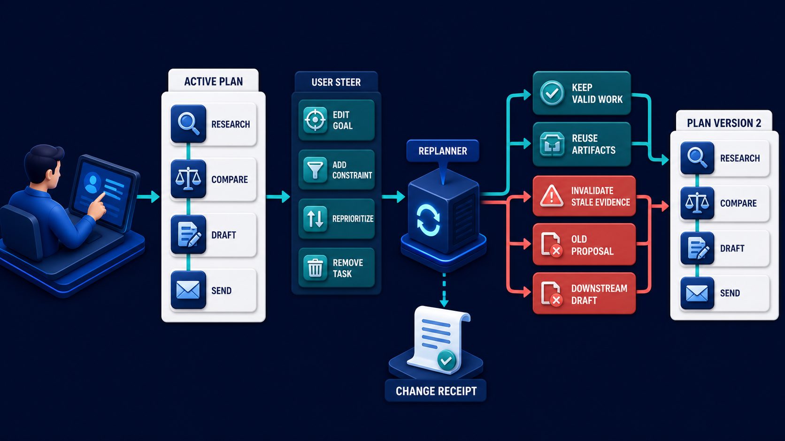
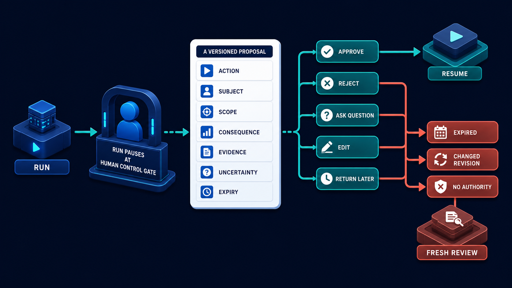

# Diagram 206 — Edit, steer, reprioritize, replan, and invalidate

**Module:** Human control and accessible trust
**Role in the course:** Let a person change direction without silently discarding valid work or pretending old evidence still supports a new plan.
**Layout:** The diagram shows CURRENT PLAN with GOAL, CONSTRAINTS, PRIORITIES, STEPS, ARTIFACTS, with a coral risk path, and a teal safe path.

---

## At a glance

**Let a person change direction without silently discarding valid work or pretending old evidence still supports a new plan.**

- The diagram centers on **CURRENT PLAN** and its relationship to **CONSENT**.

- The teal **NEW PLAN VERSION** path shows the safe, authoritative, or consented route.

- Maya's case: Maya changes the priority from fastest answer to strongest documented evidence after research has already begun.

---

## What the diagram teaches

### 1. It Is Not The Same As Sending Another Chat Message

It is not the same as sending another chat message and hoping the agent interprets it correctly. The diagram makes this concrete through **CURRENT PLAN**, **GOAL**, **CONSTRAINTS**. If the team skips this, a hidden replan can discard expensive work, reuse invalid evidence, repeat effects, or make support unable to explain why the final answer differs from the original goal. This is the lesson the case study ends with: Steering creates a visible versioned change, impact analysis, and bounded resume point.

### 2. Some Changes Require Fresh Approval Or Cannot Be Accepted After

Some changes require fresh approval or cannot be accepted after a point of no return. This is visible in the drawing as **CURRENT PLAN**, **GOAL**, **CONSTRAINTS**. Without this step, a hidden replan can discard expensive work, reuse invalid evidence, repeat effects, or make support unable to explain why the final answer differs from the original goal. In the walkthrough, The interface previews that the current policy evidence remains valid but the short-answer draft and deadline budget must change..

### 3. Current Goal, Constraints, Priorities, Plan Version, Preserved Artifacts, And Committed

This step asks the team to show the current goal, constraints, priorities, plan version, preserved artifacts, and committed effects. The diagram shows this through **GOAL**, **CONSTRAINTS**, **PRIORITIES**, which make the abstract step visible and testable. Steering means changing the goal, constraints, priority, or plan while work is in progress. The interface should expose the current goal, important constraints, next steps, committed effects, and preserved artifacts before accepting a change. If the team skips this, a hidden replan can discard expensive work, reuse invalid evidence, repeat effects, or make support unable to explain why the final answer differs from the original goal. Maya's case makes this concrete: Maya changes the priority from fastest answer to strongest documented evidence after research has already begun.

### 4. Capture The Requested Change As Structured Intent And Preview Likely

Here the product must capture the requested change as structured intent and preview likely impact before applying it. In the drawing, **IMPACT ANALYZER** carry this responsibility. The person needs to understand what the change will affect. An impact analysis classifies prior work as still valid, needs recheck, or invalid. Without this step, a hidden replan can discard expensive work, reuse invalid evidence, repeat effects, or make support unable to explain why the final answer differs from the original goal. The result — Maya can steer the work deliberately while the system preserves valid effort and honest history. — depends on getting this right.

### 5. Classify Existing Evidence, Artifacts, Steps, Approvals, And Effects As Keep

The diagram enforces this by showing the team how to classify existing evidence, artifacts, steps, approvals, and effects as keep, recheck, invalidate, or irreversible. The visual anchors are **STEPS**, **ARTIFACTS**, **RECHECK**; without them the step would be invisible to the user. A new budget may keep research but invalidate a recommendation; a changed customer may invalidate every tenant-bound artifact. The case study shows the risk: a hidden replan can discard expensive work, reuse invalid evidence, repeat effects, or make support unable to explain why the final answer differs from the original goal. This is the lesson the case study ends with: Steering creates a visible versioned change, impact analysis, and bounded resume point.

### 6. New Plan Version With A Human-readable Diff, Refreshed Budgets

This is the discipline that makes the product create a new plan version with a human-readable diff, refreshed budgets, and any required reapproval. This idea sits on **NEW PLAN VERSION** and reaches the rest of the diagram through **NEW PLAN VERSION**, **DIFF**, **CURRENT PLAN**. Replanning creates a new plan version with a visible diff and reason. Missing this is how products end up with a hidden replan can discard expensive work, reuse invalid evidence, repeat effects, or make support unable to explain why the final answer differs from the original goal. In the walkthrough, The interface previews that the current policy evidence remains valid but the short-answer draft and deadline budget must change..

### 7. Resume From The Earliest Affected Dependency While Preserving History

The team must resume from the earliest affected dependency while preserving history and preventing duplicate effects before the interface can be trustworthy. The diagram shows this through **CURRENT PLAN**, **GOAL**, **CONSTRAINTS**, which make the abstract step visible and testable. It does not edit history in place. A system that ignores this will eventually face a hidden replan can discard expensive work, reuse invalid evidence, repeat effects, or make support unable to explain why the final answer differs from the original goal. The danger the case warns about, Maya changes the priority from fastest answer to strongest documented evidence after research has already begun. should make this clear.

### 8. The standard in practice

The lesson is not a perfect prototype; it is a product contract. Let a person change direction without silently discarding valid work or pretending old evidence still supports a new plan.. The diagram makes that contract visible through **CURRENT PLAN**, **GOAL**, **CONSTRAINTS**, so the team can argue about the contract before choosing a framework. The contract is not framework-specific; it is the set of observable promises the product makes to the person using it. Maya's case warns that a hidden replan can discard expensive work, reuse invalid evidence, repeat effects, or make support unable to explain why the final answer differs from the original goal. The practical standard is this: Steering creates a visible versioned change, impact analysis, and bounded resume point.

### 9. The Next.js and Python surfaces

The same contract appears in both stacks, but the boundary moves with the architecture.
**In Next.js / React:**
- Build a steering panel with structured goal, constraint, and priority controls plus a server-generated impact preview and accessible diff.
- Keep plan history and committed effects visible; do not replace the current screen with a new chat answer that hides what changed.
- Require confirmation when steering invalidates an approval, discards costly work, or crosses an irreversible boundary.
- Keep the most sensitive payloads and policy decisions on the server and stream only user-visible, safe view models to client components.
**In Python / FastAPI:**
- Represent plans as immutable versioned graphs with dependencies, constraints, budgets, artifact references, and committed-effect markers.
- Compute an impact set from changed fields and dependency edges, then invalidate or recheck only affected nodes through explicit transitions.
- Emit a new plan artifact and resume command with idempotency and prior-version linkage rather than mutating the active plan record in place.
- Treat every framework callback or protocol event as raw input; validate and transform it into the product's own event vocabulary before it reaches the reducer or domain model.
Both implementations must avoid the same trap: a hidden replan can discard expensive work, reuse invalid evidence, repeat effects, or make support unable to explain why the final answer differs from the original goal.

Diagram 205 — *Interrupt, input request, approval, rejection, and expiry* is the next lens on this idea. The same concepts reappear there with different emphasis, so the two diagrams should be read as a pair.

### 10. Analogy

Changing a travel itinerary after one flight is completed does not erase the flown segment. The planner keeps valid bookings, cancels or changes affected legs, explains fees, and produces a new itinerary version. The analogy keeps the lesson grounded. The diagram's **CURRENT PLAN** plays the same role as the central object in the analogy: it must be visible, labeled, and trustworthy without the user having to infer meaning from a long narrative. The parallel works because both situations require separating the object from the record, the attempt from the proof, and the promise from the evidence.

---

## Case study — Maya

Maya changes the priority from fastest answer to strongest documented evidence after research has already begun.

### The walkthrough

1. The interface previews that the current policy evidence remains valid but the short-answer draft and deadline budget must change.
2. Maya confirms the change after seeing the new estimated stages and missing finance evidence.
3. Acme creates plan version 3, preserves research, invalidates the old draft, and adds a specialist verification step.
4. The final artifact links both plan versions and explains why the output changed.

### The result

Maya can steer the work deliberately while the system preserves valid effort and honest history.

### The danger

A hidden replan can discard expensive work, reuse invalid evidence, repeat effects, or make support unable to explain why the final answer differs from the original goal.

### The takeaway

Steering creates a visible versioned change, impact analysis, and bounded resume point.

---

## Composition

The picture is a single-view explainer for *Edit, steer, reprioritize, replan, and invalidate*. On the left, the diagram shows CURRENT PLAN with GOAL, CONSTRAINTS, PRIORITIES, STEPS, ARTIFACTS. At the top, uSER STEERING chooses EDIT GOAL, ADD CONSTRAINT, REPRIORITIZE, REPLAN. In the center, an IMPACT ANALYZER marks KEEP, RECHECK, INVALIDATE. To the right, coral SILENT PLAN MUTATION. Across the middle, teal NEW PLAN VERSION with DIFF, CONSENT, preserved valid work. The eye travels from **CURRENT PLAN** through the central flow to **CONSENT**, with the contrast between coral risk paths and teal recovery paths giving the reader the core message at a glance.

## Element by element

- **CURRENT PLAN** — the visible goal, constraints, priorities, steps, and artifacts that define active work.
- **GOAL** — one of the items named by **CURRENT PLAN**; this is the **GOAL** item.
- **CONSTRAINTS** — one of the items named by **CURRENT PLAN**; this is the **CONSTRAINTS** item.
- **PRIORITIES** — one of the items named by **CURRENT PLAN**; this is the **PRIORITIES** item.
- **STEPS** — one of the items named by **CURRENT PLAN**; this is the **STEPS** item.
- **ARTIFACTS** — one of the items named by **CURRENT PLAN**; this is the **ARTIFACTS** item.
- **USER STEERING** — the structured change a person makes to the goal, constraints, or priorities.
- **EDIT GOAL** — one of the items named by **USER STEERING**; this is the **EDIT GOAL** item.
- **ADD CONSTRAINT** — one of the items named by **USER STEERING**; this is the **ADD CONSTRAINT** item.
- **REPRIORITIZE** — one of the items named by **USER STEERING**; this is the **REPRIORITIZE** item.
- **REPLAN** — one of the items named by **USER STEERING**; this is the **REPLAN** item.
- **IMPACT ANALYZER** — the component that classifies prior work as keep, recheck, or invalidate after a change.
- **RECHECK** — one of the items named by **IMPACT ANALYZER**; this is the **RECHECK** item.
- **INVALIDATE** — one of the items named by **IMPACT ANALYZER**; this is the **INVALIDATE** item.
- **SILENT PLAN MUTATION** — the silent plan mutation .
- **NEW PLAN VERSION** — the immutable, versioned plan produced after a steering change.
- **DIFF** — one of the items named by **NEW PLAN VERSION**; this is the **DIFF** item.
- **CONSENT** — the informed, specific, and revocable user choice before data or authority is granted.

---

## Colour and flow semantics

The course visual grammar applies directly to this diagram.

- **Cobalt platform** — A browser surface, state store, component catalog, product boundary, workspace, or learning-platform region. Here the cobalt surface under **CURRENT PLAN** and the surrounding workspace frames the product boundary; it tells the reader that this is a bounded product region, not an uncontrolled chat surface. It marks the product's responsibility to keep the user's workspace distinct from raw model output or runtime internals.

- **Cyan arrow** — A typed event, validated state update, user action, artifact reference, notification, or navigation path. Cyan arrows carry the flow of events, updates, and proposals from left to right, linking the typed cards and records to the reducer or next gate. When the reader sees cyan, they should expect a deliberate, validated transition rather than an accidental or hidden connection.

- **Teal arrow** — Authoritative state, accessible completion, informed consent, safe approval, preserved work, or verified recovery. The teal **NEW PLAN VERSION** path shows the safe, authoritative, and consented route through the diagram. This color tells the reader that the product has enough evidence and authority to proceed safely.

- **Coral path** — Conflict, stale UI, unsafe rendering, deceptive state, expired approval, privacy failure, lost work, or blocked action. Coral marks the conflict, stale state, or blocked action that appears when a control is missing or bypassed. It signals that the product should pause, surface the conflict, and offer a recovery path rather than proceed silently.

- **White card** — An event, component, stage, proposal, artifact, receipt, consent record, lesson, checkpoint, or recovery option. **ARTIFACTS** appear as white cards, showing that they are records, proposals, or evidence rather than raw data or system internals. The white background separates user-meaningful records from raw system logs or generated text.

The overall flow moves from the initiating actor or request, through validation and reduction, toward either the teal recovery or completion path or the coral failure path. The color of each arrow and card is a trust cue, not a decoration.

---

## How to present it

- **Start with the user moment.** Maya changes the priority from fastest answer to strongest documented evidence after research has already begun. Ask the room what they need to see to feel in control. Invite someone to describe the moment before any solution appears.

- **Point at CURRENT PLAN and ask what it represents.** Then trace the flow from there through the next two or three elements, naming the color and direction of each arrow. Encourage them to name the incoming trigger, the visible state, and the decision the product must make.

- **Point at GOAL for step 1.** Current Goal, Constraints, Priorities, Plan Version, Preserved Artifacts, And Committed. Ask what observable evidence the product would produce if this step worked correctly. Have the room identify the color of the path leaving this element and what it tells a user about trust.

- **Point at IMPACT ANALYZER for step 2.** Capture The Requested Change As Structured Intent And Preview Likely. Ask what observable evidence the product would produce if this step worked correctly. Have the room identify the color of the path leaving this element and what it tells a user about trust.

- **Point at STEPS for step 3.** Classify Existing Evidence, Artifacts, Steps, Approvals, And Effects As Keep. Ask what observable evidence the product would produce if this step worked correctly. Have the room identify the color of the path leaving this element and what it tells a user about trust.

- **Point at NEW PLAN VERSION for step 4.** New Plan Version With A Human-readable Diff, Refreshed Budgets. Ask what observable evidence the product would produce if this step worked correctly. Have the room identify the color of the path leaving this element and what it tells a user about trust.

- **Point at STEPS for step 5.** Resume From The Earliest Affected Dependency While Preserving History. Ask what observable evidence the product would produce if this step worked correctly. Have the room identify the color of the path leaving this element and what it tells a user about trust.

- **Use the analogy.** Changing a travel itinerary after one flight is completed does not erase the flown segment. The planner keeps valid bookings, cancels or changes affected legs, explains fees, and produces a new itinerary version. Draw the parallel to the diagram and ask what would break if the two situations were handled the same way.

- **Tell the case study.** Maya changes the priority from fastest answer to strongest documented evidence after research has already begun Walk through the walkthrough and stop at the moment the old design would have failed. Pause at the step where the old design would have failed and ask how the new interface prevents it.

- **Run the lab.** Take one eight-step plan and apply four changes: new goal, new constraint, new priority, and changed user. Mark every step and artifact keep, recheck, invalidate, or irreversible. Produce the visible diff and confirmation copy. Ask pairs to present one part of the diagram and explain how the other parts reference it without merging their identities.

- **Pose the checkpoint.** Should changing one preference always restart the whole workflow? Let the room answer before confirming the principle. Collect answers, then confirm the principle and note any exceptions the team should watch for.

- **Close on the contract.** Steering creates a visible versioned change, impact analysis, and bounded resume point. Ask the team what their own product's equivalent of the contract would be.

---

## Lab and checkpoint

**Lab:** Take one eight-step plan and apply four changes: new goal, new constraint, new priority, and changed user. Mark every step and artifact keep, recheck, invalidate, or irreversible. Produce the visible diff and confirmation copy.

**Checkpoint:** Should changing one preference always restart the whole workflow?

**Answer:** No. Use dependency-aware impact analysis to preserve valid work, but invalidate anything whose assumptions, authority, or evidence no longer hold.

---

## Glossary

- **Steering** — structured change to active goal, constraints, or priorities
- **Invalidation** — marking prior work no longer usable under new assumptions
- **Plan diff** — visible comparison between plan versions

---

## Sources

- [AG-UI messages](https://docs.ag-ui.com/concepts/messages)
- [AG-UI events](https://docs.ag-ui.com/concepts/events)
- [NIST AI Risk Management Framework](https://www.nist.gov/itl/ai-risk-management-framework)

## Related lessons

- Diagram 183
- Diagram 205 — Interrupt, input request, approval, rejection, and expiry
- Diagram 207 — Cancel, undo, compensate, and preserve audit history

---