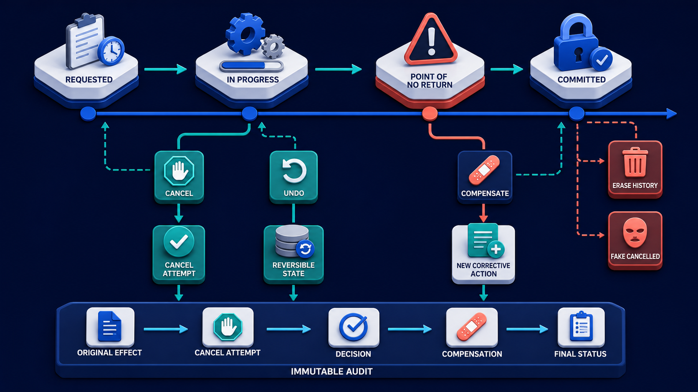

# Diagram 207 — Cancel, undo, compensate, and preserve audit history

**Module:** Human control and accessible trust
**Role in the course:** Explain and design the different promises made by cancel, undo, and compensation.
**Layout:** The diagram shows ACTION TIMELINE with QUEUED, RUNNING, COMMITTED, with a coral risk path, and a teal safe path.

---

## At a glance

**Explain and design the different promises made by cancel, undo, and compensation.**

- The diagram centers on **ACTION TIMELINE** and its relationship to **RECOVERED STATE**.

- The teal **RECOVERED STATE** path shows the safe, authoritative, or consented route.

- Maya's case: Maya cancels a refund workflow after Acme has already sent the refund request but before the provider acknowledgement arrives.

---

## What the diagram teaches

### 1. Cancellation Is Cooperative

Cancellation is cooperative. The diagram makes this concrete through **CANCEL**. If the team skips this, a green 'Cancelled' message can be dangerously false when an external effect already committed or a worker has not acknowledged the stop request. This is the lesson the case study ends with: Cancel unfinished work, undo only proven reversible state, compensate committed effects, and never erase history.

### 2. It Works For A Draft Edit Or Local Ordering Change

It works for a draft edit or local ordering change, but not for an email already read, a payment settled, or information already disclosed. It can fail and may require separate authority, policy, and evidence. This is visible in the drawing as **ACTION TIMELINE**, **QUEUED**, **RUNNING**. Without this step, a green 'Cancelled' message can be dangerously false when an external effect already committed or a worker has not acknowledged the stop request. In the walkthrough, The interface reports Cancellation requested and stops remaining notification work without claiming the refund vanished..

### 3. Mark Each Stage And Effect As Cancellable, Reversible, Compensatable, Irreversible

This step asks the team to mark each stage and effect as cancellable, reversible, compensatable, irreversible, or unknown before exposing controls. The diagram shows this through **CANCEL**, which make the abstract step visible and testable. Receipts should state what stopped, what remained, and which corrective effect completed. If the team skips this, a green 'Cancelled' message can be dangerously false when an external effect already committed or a worker has not acknowledged the stop request. Maya's case makes this concrete: Maya cancels a refund workflow after Acme has already sent the refund request but before the provider acknowledgement arrives.

### 4. Cancel, Propagate A Bounded Stop Request And Report Actual Stage

Here the product must on cancel, propagate a bounded stop request and report actual stage outcomes rather than immediate success. In the drawing, **CANCEL** carry this responsibility. Cancel, undo, and compensate are not synonyms. A request may already be inside an external tool, so the system must report requested, stopping, stopped, too late, or partially stopped rather than instantly claiming success. Without this step, a green 'Cancelled' message can be dangerously false when an external effect already committed or a worker has not acknowledged the stop request. The result — Maya understands what could be stopped, what already happened, and what corrective action remains. — depends on getting this right.

### 5. Undo Only When The Inverse And Prior State Are Proven;

The diagram enforces this by showing the team how to use undo only when the inverse and prior state are proven; otherwise present a clearly named compensation proposal. The visual anchors are **UNDO**, **FAKE UNDO**, **RECOVERED STATE**; without them the step would be invisible to the user. Cancel asks unfinished work to stop; undo restores a reversible prior state; compensation creates a new corrective effect after the original effect cannot simply disappear. True undo requires a known inverse and preserved prior state. The case study shows the risk: a green 'Cancelled' message can be dangerously false when an external effect already committed or a worker has not acknowledged the stop request. This is the lesson the case study ends with: Cancel unfinished work, undo only proven reversible state, compensate committed effects, and never erase history.

### 6. Authorize, Execute, And Receipt Compensation As A New Effect Linked

This is the discipline that makes the product authorize, execute, and receipt compensation as a new effect linked to the original record. This idea sits on **USER RECEIPT** and reaches the rest of the diagram through **USER RECEIPT**. Compensation preserves history and applies a new action: refund a charge, send a correction, revoke a grant, or reopen a case. Deleting the original record destroys accountability and can make recovery impossible. Missing this is how products end up with a green 'Cancelled' message can be dangerously false when an external effect already committed or a worker has not acknowledged the stop request. In the walkthrough, The interface reports Cancellation requested and stops remaining notification work without claiming the refund vanished..

### 7. Preserve The Complete Audit History, Current State, User Explanation

The team must preserve the complete audit history, current state, user explanation, and unresolved recovery obligations before the interface can be trustworthy. The diagram shows this through **AUDIT HISTORY**, **USER RECEIPT**, **ERASE HISTORY**, which make the abstract step visible and testable. The interface should show point of no return, affected artifacts, external effects, expected recovery time, and what remains visible in history. A system that ignores this will eventually face a green 'Cancelled' message can be dangerously false when an external effect already committed or a worker has not acknowledged the stop request. The danger the case warns about, Maya cancels a refund workflow after Acme has already sent the refund request but before the provider acknowledgement arrives. should make this clear.

### 8. The standard in practice

The lesson is not a perfect prototype; it is a product contract. Explain and design the different promises made by cancel, undo, and compensation.. The diagram makes that contract visible through **ACTION TIMELINE**, **QUEUED**, **RUNNING**, so the team can argue about the contract before choosing a framework. The contract is not framework-specific; it is the set of observable promises the product makes to the person using it. Maya's case warns that a green 'Cancelled' message can be dangerously false when an external effect already committed or a worker has not acknowledged the stop request. The practical standard is this: Cancel unfinished work, undo only proven reversible state, compensate committed effects, and never erase history.

### 9. The Next.js and Python surfaces

The same contract appears in both stacks, but the boundary moves with the architecture.
**In Next.js / React:**
- Label controls precisely as Stop remaining work, Undo draft change, Refund payment, or Send correction rather than using one generic Undo button.
- Render requested, in-progress, too-late, partially-stopped, compensated, and compensation-failed states with receipts and accessible announcements.
- Require explicit confirmation and fresh authority for compensation that creates a financial, communication, permission, or deletion effect.
- Keep the most sensitive payloads and policy decisions on the server and stream only user-visible, safe view models to client components.
**In Python / FastAPI:**
- Model cancel signals separately from business transitions and let workers checkpoint cancellation between bounded operations.
- Store inverse operations only for truly reversible state and model compensations as idempotent commands with their own policy and receipt.
- Link original effect, cancel attempt, compensation proposal, decision, corrective effect, and final status in an immutable audit chain.
- Treat every framework callback or protocol event as raw input; validate and transform it into the product's own event vocabulary before it reaches the reducer or domain model.
Both implementations must avoid the same trap: a green 'Cancelled' message can be dangerously false when an external effect already committed or a worker has not acknowledged the stop request.

Diagram 205 — *Interrupt, input request, approval, rejection, and expiry* is the next lens on this idea. The same concepts reappear there with different emphasis, so the two diagrams should be read as a pair.

### 10. Analogy

Stopping a letter before pickup is cancellation. Removing a draft sentence is undo. Sending a correction after the letter was delivered is compensation; the first letter still existed. The analogy keeps the lesson grounded. The diagram's **ACTION TIMELINE** plays the same role as the central object in the analogy: it must be visible, labeled, and trustworthy without the user having to infer meaning from a long narrative. The parallel works because both situations require separating the object from the record, the attempt from the proof, and the promise from the evidence.

---

## Case study — Maya

Maya cancels a refund workflow after Acme has already sent the refund request but before the provider acknowledgement arrives.

### The walkthrough

1. The interface reports Cancellation requested and stops remaining notification work without claiming the refund vanished.
2. Reconciliation finds that the refund committed despite the late cancellation.
3. Acme offers a separate policy-controlled compensation path rather than a fake undo.
4. The final receipt shows the original refund, cancellation timing, compensation decision, and resulting account state.

### The result

Maya understands what could be stopped, what already happened, and what corrective action remains.

### The danger

A green 'Cancelled' message can be dangerously false when an external effect already committed or a worker has not acknowledged the stop request.

### The takeaway

Cancel unfinished work, undo only proven reversible state, compensate committed effects, and never erase history.

---

## Composition

The picture is a single-view explainer for *Cancel, undo, compensate, and preserve audit history*. On the left, the diagram shows ACTION TIMELINE with QUEUED, RUNNING, COMMITTED. At the top, cANCEL stops queued or running work. In the center, uNDO reverses a reversible local change. To the right, cOMPENSATE creates a new corrective effect after COMMITTED. Across the middle, every path writes AUDIT HISTORY and USER RECEIPT. The eye travels from **ACTION TIMELINE** through the central flow to **RECOVERED STATE**, with the contrast between coral risk paths and teal recovery paths giving the reader the core message at a glance.

## Element by element

- **ACTION TIMELINE** — the ordered record of queued, running, committed, cancelled, undone, and compensated actions.
- **QUEUED** — one of the items named by **ACTION TIMELINE**; this is the **QUEUED** item.
- **RUNNING** — one of the items named by **ACTION TIMELINE**; this is the **RUNNING** item.
- **COMMITTED** — one of the items named by **ACTION TIMELINE**; this is the **COMMITTED** item.
- **CANCEL** — the cancel stops queued or running work..
- **UNDO** — one of the items named by **ERASE HISTORY**; this is the **UNDO** item.
- **COMPENSATE** — the compensate creates a new corrective effect after COMMITTED..
- **AUDIT HISTORY** — the durable record of every action, decision, cancellation, compensation, and recovery.
- **USER RECEIPT** — the user-facing record that explains what happened and what remains.
- **ERASE HISTORY** — the erase history and FAKE UNDO.
- **FAKE UNDO** — one of the items named by **ERASE HISTORY**; this is the **FAKE UNDO** item.
- **RECOVERED STATE** — the recovered state .

---

## Colour and flow semantics

The course visual grammar applies directly to this diagram.

- **Cobalt platform** — A browser surface, state store, component catalog, product boundary, workspace, or learning-platform region. Here the cobalt surface under **ACTION TIMELINE** and the surrounding workspace frames the product boundary; it tells the reader that this is a bounded product region, not an uncontrolled chat surface. It marks the product's responsibility to keep the user's workspace distinct from raw model output or runtime internals.

- **Cyan arrow** — A typed event, validated state update, user action, artifact reference, notification, or navigation path. Cyan arrows carry the flow of events, updates, and proposals from left to right, linking the typed cards and records to the reducer or next gate. When the reader sees cyan, they should expect a deliberate, validated transition rather than an accidental or hidden connection.

- **Teal arrow** — Authoritative state, accessible completion, informed consent, safe approval, preserved work, or verified recovery. The teal **RECOVERED STATE** path shows the safe, authoritative, and consented route through the diagram. This color tells the reader that the product has enough evidence and authority to proceed safely.

- **Coral path** — Conflict, stale UI, unsafe rendering, deceptive state, expired approval, privacy failure, lost work, or blocked action. Coral marks the conflict, stale state, or blocked action that appears when a control is missing or bypassed. It signals that the product should pause, surface the conflict, and offer a recovery path rather than proceed silently.

- **White card** — An event, component, stage, proposal, artifact, receipt, consent record, lesson, checkpoint, or recovery option. **USER RECEIPT** appear as white cards, showing that they are records, proposals, or evidence rather than raw data or system internals. The white background separates user-meaningful records from raw system logs or generated text.

The overall flow moves from the initiating actor or request, through validation and reduction, toward either the teal recovery or completion path or the coral failure path. The color of each arrow and card is a trust cue, not a decoration.

---

## How to present it

- **Start with the user moment.** Maya cancels a refund workflow after Acme has already sent the refund request but before the provider acknowledgement arrives. Ask the room what they need to see to feel in control. Invite someone to describe the moment before any solution appears.

- **Point at ACTION TIMELINE and ask what it represents.** Then trace the flow from there through the next two or three elements, naming the color and direction of each arrow. Encourage them to name the incoming trigger, the visible state, and the decision the product must make.

- **Point at CANCEL for step 1.** Mark Each Stage And Effect As Cancellable, Reversible, Compensatable, Irreversible. Ask what observable evidence the product would produce if this step worked correctly. Have the room identify the color of the path leaving this element and what it tells a user about trust.

- **Point at CANCEL for step 2.** Cancel, Propagate A Bounded Stop Request And Report Actual Stage. Ask what observable evidence the product would produce if this step worked correctly. Have the room identify the color of the path leaving this element and what it tells a user about trust.

- **Point at UNDO for step 3.** Undo Only When The Inverse And Prior State Are Proven;. Ask what observable evidence the product would produce if this step worked correctly. Have the room identify the color of the path leaving this element and what it tells a user about trust.

- **Point at USER RECEIPT for step 4.** Authorize, Execute, And Receipt Compensation As A New Effect Linked. Ask what observable evidence the product would produce if this step worked correctly. Have the room identify the color of the path leaving this element and what it tells a user about trust.

- **Point at AUDIT HISTORY for step 5.** Preserve The Complete Audit History, Current State, User Explanation. Ask what observable evidence the product would produce if this step worked correctly. Have the room identify the color of the path leaving this element and what it tells a user about trust.

- **Use the analogy.** Stopping a letter before pickup is cancellation. Removing a draft sentence is undo. Sending a correction after the letter was delivered is compensation; the first letter still existed. Draw the parallel to the diagram and ask what would break if the two situations were handled the same way.

- **Tell the case study.** Maya cancels a refund workflow after Acme has already sent the refund request but before the provider acknowledgement arrives Walk through the walkthrough and stop at the moment the old design would have failed. Pause at the step where the old design would have failed and ask how the new interface prevents it.

- **Run the lab.** Create a table of twelve actions and classify cancellation window, point of no return, inverse, compensation, authority, time limit, uncertain-outcome handling, and receipt. Draw one failed-compensation recovery path. Ask pairs to present one part of the diagram and explain how the other parts reference it without merging their identities.

- **Pose the checkpoint.** Can every completed action be undone? Let the room answer before confirming the principle. Collect answers, then confirm the principle and note any exceptions the team should watch for.

- **Close on the contract.** Cancel unfinished work, undo only proven reversible state, compensate committed effects, and never erase history. Ask the team what their own product's equivalent of the contract would be.

---

## Lab and checkpoint

**Lab:** Create a table of twelve actions and classify cancellation window, point of no return, inverse, compensation, authority, time limit, uncertain-outcome handling, and receipt. Draw one failed-compensation recovery path.

**Checkpoint:** Can every completed action be undone?

**Answer:** No. Many effects are irreversible or only compensatable. A corrective action creates new history; it does not make the original effect disappear.

---

## Glossary

- **Cancellation** — request to stop unfinished work
- **Undo** — proven inverse restoring prior reversible state
- **Compensation** — new corrective effect linked to an earlier committed effect

---

## Sources

- [AG-UI events](https://docs.ag-ui.com/concepts/events)
- [RFC 9457 Problem Details](https://www.rfc-editor.org/rfc/rfc9457)
- [NIST AI Risk Management Framework](https://www.nist.gov/itl/ai-risk-management-framework)

## Related lessons

- Diagram 200 — Optimistic interface state versus authoritative business state
- Diagram 204 — Errors, recovery choices, support references, and next actions
- Diagram 205 — Interrupt, input request, approval, rejection, and expiry

---