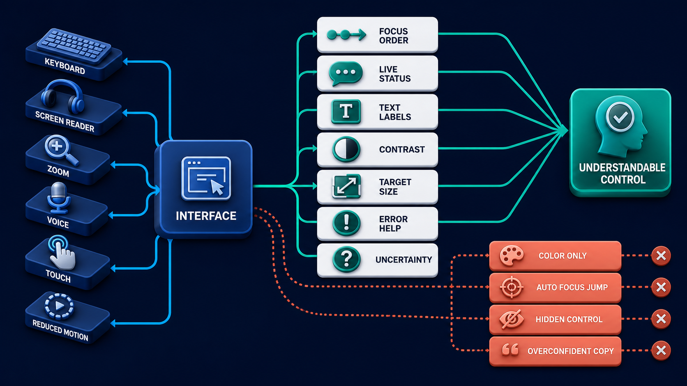

# Diagram 208 — Accessibility, plain language, uncertainty, and trust cues

**Module:** Human control and accessible trust
**Role in the course:** Treat accessibility and understandable trust as core product behavior rather than a final visual checklist.
**Layout:** The diagram shows one interface used by KEYBOARD, SCREEN READER, ZOOM, VOICE, TOUCH, REDUCED MOTION, with a coral risk path, and a teal safe path.

---

## At a glance

**Treat accessibility and understandable trust as core product behavior rather than a final visual checklist.**

- The diagram centers on **KEYBOARD** and its relationship to **UNDERSTANDABLE CONTROL**.

- The teal **UNDERSTANDABLE CONTROL** path shows the safe, authoritative, or consented route.

- Maya's case: Maya uses keyboard navigation and 200 percent zoom. A streaming approval page keeps moving focus and the Accept button disappears below an unscrollable panel.

---

## What the diagram teaches

### 1. Static Homepage Audit Is Not Enough

A static homepage audit is not enough. The diagram makes this concrete through **KEYBOARD**, **SCREEN READER**, **ZOOM**. If the team skips this, an interface can pass a color checker yet remain unusable because streaming steals focus, controls lack names, diagrams have no equivalent explanation, or recovery works only with a mouse. This is the lesson the case study ends with: Accessible trust is understandable state plus operable control across every success and failure path.

### 2. WCAG 2.2 Provides Testable Success Criteria, While WAI-ARIA Supplies Semantics

WCAG 2.2 provides testable success criteria, while WAI-ARIA supplies semantics and APG offers interaction patterns. Do not expose hidden reasoning or invent a confidence percentage without a calibrated meaning. This is visible in the drawing as **KEYBOARD**, **SCREEN READER**, **ZOOM**. Without this step, an interface can pass a color checker yet remain unusable because streaming steals focus, controls lack names, diagrams have no equivalent explanation, or recovery works only with a mouse. In the walkthrough, The layout reflows into one column with the decision summary before the action controls..

### 3. Workflow State And Control To Semantic HTML, Accessible Name, Description

This step asks the team to map every workflow state and control to semantic HTML, accessible name, description, role, value, focus, and keyboard behavior. The diagram shows this through **KEYBOARD**, **FOCUS ORDER**, **AUTO FOCUS JUMP**, which make the abstract step visible and testable. Accessibility means people can perceive, operate, understand, and reliably use the full workflow, including streaming progress, approvals, errors, recovery, diagrams, and dynamic components. ARIA cannot repair a broken keyboard model, hidden focus, misleading state, or inaccessible custom control. If the team skips this, an interface can pass a color checker yet remain unusable because streaming steals focus, controls lack names, diagrams have no equivalent explanation, or recovery works only with a mouse. Maya's case makes this concrete: Maya uses keyboard navigation and 200 percent zoom. A streaming approval page keeps moving focus and the Accept button disappears below an unscrollable panel.

### 4. Status And Alert Announcements For Meaningful Transitions While Suppressing Noisy

Here the product must define status and alert announcements for meaningful transitions while suppressing noisy token-level updates. In the drawing, **LIVE STATUS** carry this responsibility. Announce meaningful stage, error, approval, and completion changes; do not flood a live region with token streams or move focus on every update. Without this step, an interface can pass a color checker yet remain unusable because streaming steals focus, controls lack names, diagrams have no equivalent explanation, or recovery works only with a mouse. The result — Maya can independently understand and complete the same decision workflow as other users. — depends on getting this right.

### 5. Plain Action, Consequence, Evidence, Uncertainty, And Recovery Language Without Relying

The diagram enforces this by showing the team how to write plain action, consequence, evidence, uncertainty, and recovery language without relying on color, icon, or technical jargon. The visual anchors are **UNCERTAINTY**, **COLOR ONLY**; without them the step would be invisible to the user. Plain language states the action, subject, consequence, uncertainty, and next step. Trust cues should name evidence version, freshness, limits, approval scope, and recovery rather than using vague badges such as AI verified. The case study shows the risk: an interface can pass a color checker yet remain unusable because streaming steals focus, controls lack names, diagrams have no equivalent explanation, or recovery works only with a mouse. This is the lesson the case study ends with: Accessible trust is understandable state plus operable control across every success and failure path.

### 6. Reflow, Zoom, Contrast, Target Size, Reduced Motion, Error Recovery

This is the discipline that makes the product test reflow, zoom, contrast, target size, reduced motion, error recovery, and modal behavior across complete workflows. This idea sits on **REDUCED MOTION** and reaches the rest of the diagram through **REDUCED MOTION**, **TARGET SIZE**, **ZOOM**. Accessibility evidence combines automated checks, keyboard walkthroughs, screen-reader testing, zoom and reflow, contrast, motion, touch targets, cognitive review, and user testing across successful and failed workflows. Missing this is how products end up with an interface can pass a color checker yet remain unusable because streaming steals focus, controls lack names, diagrams have no equivalent explanation, or recovery works only with a mouse. In the walkthrough, The layout reflows into one column with the decision summary before the action controls..

### 7. Combine Automated Evidence With Assistive-technology And Human Testing, Then Keep

The team must combine automated evidence with assistive-technology and human testing, then keep failures as permanent regression cases before the interface can be trustworthy. The diagram shows this through **KEYBOARD**, **SCREEN READER**, **ZOOM**, which make the abstract step visible and testable. A system that ignores this will eventually face an interface can pass a color checker yet remain unusable because streaming steals focus, controls lack names, diagrams have no equivalent explanation, or recovery works only with a mouse. The danger the case warns about, Maya uses keyboard navigation and 200 percent zoom. A streaming approval page keeps moving focus and the Accept button disappears below an unscrollable panel. should make this clear.

### 8. The standard in practice

The lesson is not a perfect prototype; it is a product contract. Treat accessibility and understandable trust as core product behavior rather than a final visual checklist.. The diagram makes that contract visible through **KEYBOARD**, **SCREEN READER**, **ZOOM**, so the team can argue about the contract before choosing a framework. The contract is not framework-specific; it is the set of observable promises the product makes to the person using it. Maya's case warns that an interface can pass a color checker yet remain unusable because streaming steals focus, controls lack names, diagrams have no equivalent explanation, or recovery works only with a mouse. The practical standard is this: Accessible trust is understandable state plus operable control across every success and failure path.

### 9. The Next.js and Python surfaces

The same contract appears in both stacks, but the boundary moves with the architecture.
**In Next.js / React:**
- Prefer semantic server-rendered HTML and native controls, then add ARIA only when the required semantics or relationships are not available natively.
- Manage focus after route, dialog, error, approval, and recovery transitions; announce concise status changes through controlled live regions.
- Provide diagram alt text, zoom, text explanation, reading order, reduced motion, keyboard operation, and persistent visible labels at every responsive size.
- Keep the most sensitive payloads and policy decisions on the server and stream only user-visible, safe view models to client components.
**In Python / FastAPI:**
- Include accessible labels, descriptions, status priority, uncertainty category, and action semantics in typed view models instead of leaving meaning to frontend string invention.
- Generate deterministic fixtures for every workflow state so automated browser and assistive-technology tests can reproduce progress, approval, conflict, and recovery.
- Record accessibility failures by component, state, input method, assistive technology, and user impact without collecting unnecessary disability or identity data.
- Treat every framework callback or protocol event as raw input; validate and transform it into the product's own event vocabulary before it reaches the reducer or domain model.
Both implementations must avoid the same trap: an interface can pass a color checker yet remain unusable because streaming steals focus, controls lack names, diagrams have no equivalent explanation, or recovery works only with a mouse.

Diagram 205 — *Interrupt, input request, approval, rejection, and expiry* is the next lens on this idea. The same concepts reappear there with different emphasis, so the two diagrams should be read as a pair.

### 10. Analogy

A well-designed public building has visible signs, tactile guidance, ramps, audible announcements, readable maps, and staff help. Painting one wheelchair symbol on a locked door does not make it accessible. The analogy keeps the lesson grounded. The diagram's **KEYBOARD** plays the same role as the central object in the analogy: it must be visible, labeled, and trustworthy without the user having to infer meaning from a long narrative. The parallel works because both situations require separating the object from the record, the attempt from the proof, and the promise from the evidence.

---

## Case study — Maya

Maya uses keyboard navigation and 200 percent zoom. A streaming approval page keeps moving focus and the Accept button disappears below an unscrollable panel.

### The walkthrough

1. The layout reflows into one column with the decision summary before the action controls.
2. Progress updates announce only stage changes, so focus remains on Maya's review.
3. The approval dialog follows the APG keyboard model and keeps visible focus within a genuinely modal boundary.
4. Evidence, uncertainty, expiry, reject, ask, and approve choices remain readable and operable without color or pointer input.

### The result

Maya can independently understand and complete the same decision workflow as other users.

### The danger

An interface can pass a color checker yet remain unusable because streaming steals focus, controls lack names, diagrams have no equivalent explanation, or recovery works only with a mouse.

### The takeaway

Accessible trust is understandable state plus operable control across every success and failure path.

---

## Composition

The picture is a single-view explainer for *Accessibility, plain language, uncertainty, and trust cues*. On the left, the diagram shows one interface used by KEYBOARD, SCREEN READER, ZOOM, VOICE, TOUCH, REDUCED MOTION. At the top, cards demonstrate FOCUS ORDER, LIVE STATUS, TEXT LABELS, CONTRAST, TARGET SIZE, ERROR HELP, UNCERTAINTY. In the center, coral COLOR ONLY, AUTO FOCUS JUMP, HIDDEN CONTROL, OVERCONFIDENT COPY. To the right, teal UNDERSTANDABLE CONTROL. The eye travels from **KEYBOARD** through the central flow to **UNDERSTANDABLE CONTROL**, with the contrast between coral risk paths and teal recovery paths giving the reader the core message at a glance.

## Element by element

- **KEYBOARD** — one input method the interface must support without relying on pointer or touch.
- **SCREEN READER** — assistive technology that relies on names, roles, values, focus, and live regions.
- **ZOOM** — the zoom one interface used by KEYBOARD, SCREEN READER, ZOOM, VOICE, TOUCH, REDUCED MOTION..
- **VOICE** — the voice one interface used by KEYBOARD, SCREEN READER, ZOOM, VOICE, TOUCH, REDUCED MOTION..
- **TOUCH** — the touch one interface used by KEYBOARD, SCREEN READER, ZOOM, VOICE, TOUCH, REDUCED MOTION..
- **REDUCED MOTION** — the reduced motion one interface used by KEYBOARD, SCREEN READER, ZOOM, VOICE, TOUCH, REDUCED MOTION..
- **FOCUS ORDER** — the sequence in which a keyboard user reaches each control.
- **LIVE STATUS** — an accessible announcement of important state changes.
- **TEXT LABELS** — visible, persistent words that identify a control or state without relying on icons.
- **CONTRAST** — the visual difference between text and background that makes content readable.
- **TARGET SIZE** — the minimum hit area a control needs for touch and pointer use.
- **ERROR HELP** — plain language that explains a failure and the safe next step.
- **UNCERTAINTY** — honest communication about missing, stale, conflicting, or insufficient evidence.
- **COLOR ONLY** — the color only AUTO FOCUS JUMP, HIDDEN CONTROL, OVERCONFIDENT COPY.
- **AUTO FOCUS JUMP** — the auto focus jump COLOR ONLY, AUTO FOCUS JUMP, HIDDEN CONTROL, OVERCONFIDENT COPY;.
- **HIDDEN CONTROL** — one of the items named by **AUTO**; this is the **HIDDEN CONTROL** item.
- **OVERCONFIDENT COPY** — one of the items named by **AUTO**; this is the **OVERCONFIDENT COPY** item.
- **UNDERSTANDABLE CONTROL** — the understandable control .

---

## Colour and flow semantics

The course visual grammar applies directly to this diagram.

- **Cobalt platform** — A browser surface, state store, component catalog, product boundary, workspace, or learning-platform region. Here the cobalt surface under **KEYBOARD** and the surrounding workspace frames the product boundary; it tells the reader that this is a bounded product region, not an uncontrolled chat surface. It marks the product's responsibility to keep the user's workspace distinct from raw model output or runtime internals.

- **Cyan arrow** — A typed event, validated state update, user action, artifact reference, notification, or navigation path. Cyan arrows carry the flow of events, updates, and proposals from left to right, linking the typed cards and records to the reducer or next gate. When the reader sees cyan, they should expect a deliberate, validated transition rather than an accidental or hidden connection.

- **Teal arrow** — Authoritative state, accessible completion, informed consent, safe approval, preserved work, or verified recovery. The teal **UNDERSTANDABLE CONTROL** path shows the safe, authoritative, and consented route through the diagram. This color tells the reader that the product has enough evidence and authority to proceed safely.

- **Coral path** — Conflict, stale UI, unsafe rendering, deceptive state, expired approval, privacy failure, lost work, or blocked action. Coral marks the conflict, stale state, or blocked action that appears when a control is missing or bypassed. It signals that the product should pause, surface the conflict, and offer a recovery path rather than proceed silently.

- **White card** — An event, component, stage, proposal, artifact, receipt, consent record, lesson, checkpoint, or recovery option. The labeled cards and records throughout the diagram are white, marking them as structured events, proposals, receipts, or recovery options. The white background separates user-meaningful records from raw system logs or generated text.

The overall flow moves from the initiating actor or request, through validation and reduction, toward either the teal recovery or completion path or the coral failure path. The color of each arrow and card is a trust cue, not a decoration.

---

## How to present it

- **Start with the user moment.** Maya uses keyboard navigation and 200 percent zoom. Ask the room what they need to see to feel in control. Invite someone to describe the moment before any solution appears.

- **Point at KEYBOARD and ask what it represents.** Then trace the flow from there through the next two or three elements, naming the color and direction of each arrow. Encourage them to name the incoming trigger, the visible state, and the decision the product must make.

- **Point at KEYBOARD for step 1.** Workflow State And Control To Semantic HTML, Accessible Name, Description. Ask what observable evidence the product would produce if this step worked correctly. Have the room identify the color of the path leaving this element and what it tells a user about trust.

- **Point at LIVE STATUS for step 2.** Status And Alert Announcements For Meaningful Transitions While Suppressing Noisy. Ask what observable evidence the product would produce if this step worked correctly. Have the room identify the color of the path leaving this element and what it tells a user about trust.

- **Point at UNCERTAINTY for step 3.** Plain Action, Consequence, Evidence, Uncertainty, And Recovery Language Without Relying. Ask what observable evidence the product would produce if this step worked correctly. Have the room identify the color of the path leaving this element and what it tells a user about trust.

- **Point at REDUCED MOTION for step 4.** Reflow, Zoom, Contrast, Target Size, Reduced Motion, Error Recovery. Ask what observable evidence the product would produce if this step worked correctly. Have the room identify the color of the path leaving this element and what it tells a user about trust.

- **Point at TOUCH for step 5.** Combine Automated Evidence With Assistive-technology And Human Testing, Then Keep. Ask what observable evidence the product would produce if this step worked correctly. Have the room identify the color of the path leaving this element and what it tells a user about trust.

- **Use the analogy.** A well-designed public building has visible signs, tactile guidance, ramps, audible announcements, readable maps, and staff help. Painting one wheelchair symbol on a locked door does not make it accessible. Draw the parallel to the diagram and ask what would break if the two situations were handled the same way.

- **Tell the case study.** Maya uses keyboard navigation and 200 percent zoom Walk through the walkthrough and stop at the moment the old design would have failed. Pause at the step where the old design would have failed and ask how the new interface prevents it.

- **Run the lab.** Audit one complete lesson and one approval workflow against WCAG 2.2 AA. Include keyboard, screen reader, 200 and 400 percent zoom, reflow, contrast, target size, reduced motion, live regions, errors, dialogs, and diagram alternatives. Ask pairs to present one part of the diagram and explain how the other parts reference it without merging their identities.

- **Pose the checkpoint.** Does adding ARIA roles automatically make a custom component accessible? Let the room answer before confirming the principle. Collect answers, then confirm the principle and note any exceptions the team should watch for.

- **Close on the contract.** Accessible trust is understandable state plus operable control across every success and failure path. Ask the team what their own product's equivalent of the contract would be.

---

## Lab and checkpoint

**Lab:** Audit one complete lesson and one approval workflow against WCAG 2.2 AA. Include keyboard, screen reader, 200 and 400 percent zoom, reflow, contrast, target size, reduced motion, live regions, errors, dialogs, and diagram alternatives.

**Checkpoint:** Does adding ARIA roles automatically make a custom component accessible?

**Answer:** No. Semantics, keyboard behavior, focus, visible state, announcements, layout, and human testing must all work together. Prefer native elements when possible.

---

## Glossary

- **Accessible name** — programmatic label identifying a control
- **Live region** — area whose important updates assistive technology can announce
- **Actionable uncertainty** — named limit plus a way to reduce or respond to it

---

## Sources

- [WCAG 2.2](https://www.w3.org/TR/WCAG22/)
- [WAI-ARIA 1.2](https://www.w3.org/TR/wai-aria-1.2/)
- [ARIA Authoring Practices Guide](https://www.w3.org/WAI/ARIA/apg/)
- [Next.js accessibility](https://nextjs.org/docs/architecture/accessibility)

## Related lessons

- Diagram 201 — Progressive disclosure and observable stage labels
- Diagram 205 — Interrupt, input request, approval, rejection, and expiry
- Diagram 214 — Responsive diagrams, zoom, annotations, and reading order

---