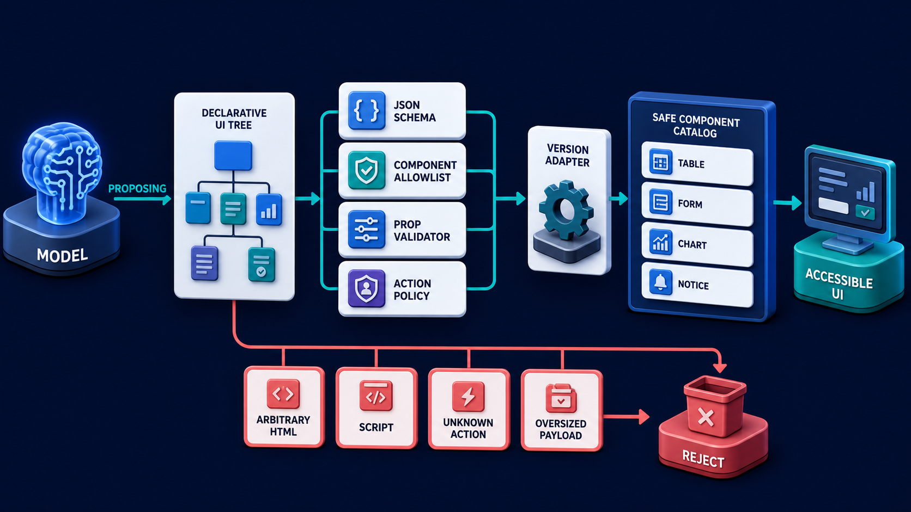

# Diagram 210 — MCP Apps, sandboxed frames, consent, and communication

**Module:** Generative and embedded interfaces
**Role in the course:** Explain how an MCP App can provide a rich embedded experience while the host keeps a visible security and consent boundary.
**Layout:** The diagram shows MCP SERVER exposing TOOL plus UI RESOURCE with UI URI, with a coral risk path.

---

## At a glance

**Explain how an MCP App can provide a rich embedded experience while the host keeps a visible security and consent boundary.**

- The diagram centers on **MCP SERVER** and its relationship to **UNDECLARED CAPABILITY**.

- The diagram separates the tested, legitimate flow from failure paths that must fail closed.

- Maya's case: Maya opens an embedded Acme policy comparison app offered by a third-party MCP server.

---

## What the diagram teaches

### 1. Unsupported Behavior Needs A Safe Fallback

Unsupported behavior needs a safe fallback. The diagram makes this concrete through **MCP SERVER**, **TOOL**, **UI RESOURCE**. If the team skips this, a sandboxed iframe can still mislead users, request excessive data, send forged messages, exploit weak origin checks, or trigger privileged host methods if the bridge is overpowered. This is the lesson the case study ends with: MCP Apps are embedded guests: declare them, sandbox them, negotiate capabilities, minimize data, obtain consent, and audit the bridge.

### 2. Discover The MCP Tool And Its Declared UI Resource Metadata

This step asks the team to discover the MCP tool and its declared UI resource metadata through the normal server connection. The diagram shows this through **UI RESOURCE**, **TOOL**, **MCP SERVER**, which make the abstract step visible and testable. An MCP App pairs an MCP tool with a declared UI resource. The server can advertise a resource URI using the ui scheme, and a supporting host decides whether and how to fetch and display it. If the team skips this, a sandboxed iframe can still mislead users, request excessive data, send forged messages, exploit weak origin checks, or trigger privileged host methods if the bridge is overpowered. Maya's case makes this concrete: Maya opens an embedded Acme policy comparison app offered by a third-party MCP server.

### 3. Fetch And Validate The Resource Under Host Policy, Then Load

Here the product must fetch and validate the resource under host policy, then load it inside a restrictive sandbox with a controlled content policy. In the drawing, **HOST**, **UI RESOURCE**, **DIRECT HOST ACCESS** carry this responsibility. The host renders the app inside a sandboxed iframe rather than merging unknown code directly into its privileged interface. Sandboxing reduces authority, but it is only one control; the host must still validate origins, messages, capabilities, and data flows. Without this step, a sandboxed iframe can still mislead users, request excessive data, send forged messages, exploit weak origin checks, or trigger privileged host methods if the bridge is overpowered. The result — Maya gets a specialized interactive tool without silently turning the third-party app into part of Acme's trusted core. — depends on getting this right.

### 4. Establish The Bridge And Negotiate Supported Capabilities Before Enabling Optional

The diagram enforces this by showing the team how to establish the bridge and negotiate supported capabilities before enabling optional controls. The visual anchors are **APP BRIDGE**; without them the step would be invisible to the user. Capabilities are negotiated. The case study shows the risk: a sandboxed iframe can still mislead users, request excessive data, send forged messages, exploit weak origin checks, or trigger privileged host methods if the bridge is overpowered. This is the lesson the case study ends with: MCP Apps are embedded guests: declare them, sandbox them, negotiate capabilities, minimize data, obtain consent, and audit the bridge.

### 5. Validate Every Message And Require Contextual Consent Or Approval Before

This is the discipline that makes the product validate every message and require contextual consent or approval before data disclosure or side effect. This idea sits on **CONSENT** and reaches the rest of the diagram through **CONSENT**, **DATA MINIMIZATION**. Each side should verify message shape, source window, origin or established channel, request ID, method, capability, and lifecycle state before acting. Consent belongs at the moment a meaningful action or data disclosure is proposed. Missing this is how products end up with a sandboxed iframe can still mislead users, request excessive data, send forged messages, exploit weak origin checks, or trigger privileged host methods if the bridge is overpowered. In the walkthrough, The host identifies the server and loads its declared resource in a sandboxed frame with no blanket access to Acme state..

### 6. Minimized Receipt And Destroy App State, Grants, And Message Channels

The team must record a minimized receipt and destroy app state, grants, and message channels when the frame closes or authority expires before the interface can be trustworthy. The diagram shows this through **APP BRIDGE**, **AUDIT RECEIPT**, which make the abstract step visible and testable. A system that ignores this will eventually face a sandboxed iframe can still mislead users, request excessive data, send forged messages, exploit weak origin checks, or trigger privileged host methods if the bridge is overpowered. The danger the case warns about, Maya opens an embedded Acme policy comparison app offered by a third-party MCP server. should make this clear.

### 7. The standard in practice

The lesson is not a perfect prototype; it is a product contract. Explain how an MCP App can provide a rich embedded experience while the host keeps a visible security and consent boundary.. The diagram makes that contract visible through **MCP SERVER**, **TOOL**, **UI RESOURCE**, so the team can argue about the contract before choosing a framework. The contract is not framework-specific; it is the set of observable promises the product makes to the person using it. Maya's case warns that a sandboxed iframe can still mislead users, request excessive data, send forged messages, exploit weak origin checks, or trigger privileged host methods if the bridge is overpowered. The practical standard is this: MCP Apps are embedded guests: declare them, sandbox them, negotiate capabilities, minimize data, obtain consent, and audit the bridge.

### 8. The Next.js and Python surfaces

The same contract appears in both stacks, but the boundary moves with the architecture.
**In Next.js / React:**
- Keep iframe creation and bridge ownership in a host component that sets sandbox and policy attributes explicitly and validates the expected frame window for every message.
- Route bridge methods through a typed allowlist; check capability, session, tenant, approval, and resource version server-side before any tool or data operation.
- Show the app's server identity, requested data, active grants, and a close or revoke control outside the embedded frame so the app cannot hide host controls.
- Keep the most sensitive payloads and policy decisions on the server and stream only user-visible, safe view models to client components.
**In Python / FastAPI:**
- Expose MCP tool and UI resource metadata deliberately, keeping the resource immutable or content-addressed so audits can identify the exact embedded build.
- Validate bridge-originated tool arguments exactly like any other untrusted client request; the iframe is presentation, not an authentication factor.
- Store short-lived grant records scoped to user, host, server, app resource, capability, data categories, purpose, and expiry, plus revocation events.
- Treat every framework callback or protocol event as raw input; validate and transform it into the product's own event vocabulary before it reaches the reducer or domain model.
Both implementations must avoid the same trap: a sandboxed iframe can still mislead users, request excessive data, send forged messages, exploit weak origin checks, or trigger privileged host methods if the bridge is overpowered.

Diagram 209 — *Typed components, schemas, allowlists, and validation* is the next lens on this idea. The same concepts reappear there with different emphasis, so the two diagrams should be read as a pair.

### 9. Analogy

A visiting specialist can work inside a secure room with an intercom. The host controls the room, decides which files enter, and records approved requests; the visitor does not receive keys to the entire building. The analogy keeps the lesson grounded. The diagram's **MCP SERVER** plays the same role as the central object in the analogy: it must be visible, labeled, and trustworthy without the user having to infer meaning from a long narrative. The parallel works because both situations require separating the object from the record, the attempt from the proof, and the promise from the evidence.

---

## Case study — Maya

Maya opens an embedded Acme policy comparison app offered by a third-party MCP server.

### The walkthrough

1. The host identifies the server and loads its declared resource in a sandboxed frame with no blanket access to Acme state.
2. The app negotiates support for tool invocation and a theme capability but receives no customer data by default.
3. When Maya selects a case, the host explains the exact fields the app requests and asks whether to share them for this comparison.
4. The approved result returns through the bridge, and the host stores a receipt while Maya can revoke the grant or close the frame at any time.

### The result

Maya gets a specialized interactive tool without silently turning the third-party app into part of Acme's trusted core.

### The danger

A sandboxed iframe can still mislead users, request excessive data, send forged messages, exploit weak origin checks, or trigger privileged host methods if the bridge is overpowered.

### The takeaway

MCP Apps are embedded guests: declare them, sandbox them, negotiate capabilities, minimize data, obtain consent, and audit the bridge.

---

## Composition

The picture is a single-view explainer for *MCP Apps, sandboxed frames, consent, and communication*. On the left, the diagram shows MCP SERVER exposing TOOL plus UI RESOURCE with UI URI. At the top, hOST fetches resource into SANDBOXED IFRAME. In the center, aPP BRIDGE exchanges JSON-RPC messages across a narrow boundary. To the right, gates CAPABILITY NEGOTIATION, CONSENT, ORIGIN CHECK, DATA MINIMIZATION, AUDIT RECEIPT. Across the middle, coral DIRECT HOST ACCESS and UNDECLARED CAPABILITY blocked. The eye travels from **MCP SERVER** through the central flow to **UNDECLARED CAPABILITY**, with the contrast between coral risk paths and teal recovery paths giving the reader the core message at a glance.

## Element by element

- **MCP SERVER** — the server that declares tools and, optionally, a UI resource for the host.
- **TOOL** — the tool MCP SERVER exposing TOOL plus UI RESOURCE with UI URI.
- **UI RESOURCE** — the ui resource MCP SERVER exposing TOOL plus UI RESOURCE with UI URI.
- **UI URI** — the ui uri MCP SERVER exposing TOOL plus UI RESOURCE with UI URI.
- **HOST** — the product surface that loads an MCP App and controls the sandbox, bridge, and consent.
- **SANDBOXED IFRAME** — the isolated browsing context that hosts an embedded app without giving it host authority.
- **APP BRIDGE** — the typed JSON-RPC message channel between the embedded app and the host.
- **JSON-RPC** — the json-rpc APP BRIDGE exchanges JSON-RPC messages across a narrow boundary.
- **CAPABILITY NEGOTIATION** — the capability negotiation Gates CAPABILITY NEGOTIATION, CONSENT, ORIGIN CHECK, DATA MINIMIZATION, AUDIT RECEIPT..
- **CONSENT** — the informed, specific, and revocable user choice before data or authority is granted.
- **ORIGIN CHECK** — the validation that a message or resource comes from an expected source.
- **DATA MINIMIZATION** — the practice of sharing only the fields and duration necessary for a purpose.
- **AUDIT RECEIPT** — the record that captures a decision, grant, or event for later inspection.
- **DIRECT HOST ACCESS** — the direct host access and UNDECLARED CAPABILITY blocked..
- **UNDECLARED CAPABILITY** — one of the items named by **DIRECT HOST ACCESS**; this is the **UNDECLARED CAPABILITY** item.

---

## Colour and flow semantics

The course visual grammar applies directly to this diagram.

- **Cobalt platform** — A browser surface, state store, component catalog, product boundary, workspace, or learning-platform region. Here the cobalt surface under **MCP SERVER** and the surrounding workspace frames the product boundary; it tells the reader that this is a bounded product region, not an uncontrolled chat surface. It marks the product's responsibility to keep the user's workspace distinct from raw model output or runtime internals.

- **Cyan arrow** — A typed event, validated state update, user action, artifact reference, notification, or navigation path. Cyan arrows carry the flow of events, updates, and proposals from left to right, linking the typed cards and records to the reducer or next gate. When the reader sees cyan, they should expect a deliberate, validated transition rather than an accidental or hidden connection.

- **Teal arrow** — Authoritative state, accessible completion, informed consent, safe approval, preserved work, or verified recovery. Teal marks the authoritative and safe path, such as the committed receipt or restored state, distinguishing it from the raw request. This color tells the reader that the product has enough evidence and authority to proceed safely.

- **Coral path** — Conflict, stale UI, unsafe rendering, deceptive state, expired approval, privacy failure, lost work, or blocked action. Coral marks the conflict, stale state, or blocked action that appears when a control is missing or bypassed. It signals that the product should pause, surface the conflict, and offer a recovery path rather than proceed silently.

- **White card** — An event, component, stage, proposal, artifact, receipt, consent record, lesson, checkpoint, or recovery option. **AUDIT RECEIPT** appear as white cards, showing that they are records, proposals, or evidence rather than raw data or system internals. The white background separates user-meaningful records from raw system logs or generated text.

The overall flow moves from the initiating actor or request, through validation and reduction, toward either the teal recovery or completion path or the coral failure path. The color of each arrow and card is a trust cue, not a decoration.

---

## How to present it

- **Start with the user moment.** Maya opens an embedded Acme policy comparison app offered by a third-party MCP server. Ask the room what they need to see to feel in control. Invite someone to describe the moment before any solution appears.

- **Point at MCP SERVER and ask what it represents.** Then trace the flow from there through the next two or three elements, naming the color and direction of each arrow. Encourage them to name the incoming trigger, the visible state, and the decision the product must make.

- **Point at UI RESOURCE for step 1.** Discover The MCP Tool And Its Declared UI Resource Metadata. Ask what observable evidence the product would produce if this step worked correctly. Have the room identify the color of the path leaving this element and what it tells a user about trust.

- **Point at HOST for step 2.** Fetch And Validate The Resource Under Host Policy, Then Load. Ask what observable evidence the product would produce if this step worked correctly. Have the room identify the color of the path leaving this element and what it tells a user about trust.

- **Point at APP BRIDGE for step 3.** Establish The Bridge And Negotiate Supported Capabilities Before Enabling Optional. Ask what observable evidence the product would produce if this step worked correctly. Have the room identify the color of the path leaving this element and what it tells a user about trust.

- **Point at CONSENT for step 4.** Validate Every Message And Require Contextual Consent Or Approval Before. Ask what observable evidence the product would produce if this step worked correctly. Have the room identify the color of the path leaving this element and what it tells a user about trust.

- **Point at APP BRIDGE for step 5.** Minimized Receipt And Destroy App State, Grants, And Message Channels. Ask what observable evidence the product would produce if this step worked correctly. Have the room identify the color of the path leaving this element and what it tells a user about trust.

- **Use the analogy.** A visiting specialist can work inside a secure room with an intercom. The host controls the room, decides which files enter, and records approved requests; the visitor does not receive keys to the entire building. Draw the parallel to the diagram and ask what would break if the two situations were handled the same way.

- **Tell the case study.** Maya opens an embedded Acme policy comparison app offered by a third-party MCP server Walk through the walkthrough and stop at the moment the old design would have failed. Pause at the step where the old design would have failed and ask how the new interface prevents it.

- **Run the lab.** Write a host-app threat model with assets, actors, trust boundaries, twelve bridge methods, capability checks, consent text, origin/source validation, CSP and sandbox settings, revocation, expiry, fallback, and receipt fields. Include clickjacking and confused-deputy tests. Ask pairs to present one part of the diagram and explain how the other parts reference it without merging their identities.

- **Pose the checkpoint.** Does iframe sandboxing remove the need to validate messages and tool arguments? Let the room answer before confirming the principle. Collect answers, then confirm the principle and note any exceptions the team should watch for.

- **Close on the contract.** MCP Apps are embedded guests: declare them, sandbox them, negotiate capabilities, minimize data, obtain consent, and audit the bridge. Ask the team what their own product's equivalent of the contract would be.

---

## Lab and checkpoint

**Lab:** Write a host-app threat model with assets, actors, trust boundaries, twelve bridge methods, capability checks, consent text, origin/source validation, CSP and sandbox settings, revocation, expiry, fallback, and receipt fields. Include clickjacking and confused-deputy tests.

**Checkpoint:** Does iframe sandboxing remove the need to validate messages and tool arguments?

**Answer:** No. Sandboxing limits browser authority, but the bridge can still expose powerful host behavior. Every message, capability, user decision, argument, and server-side authorization must be validated.

---

## Glossary

- **UI resource** — MCP-declared content a supporting host may render
- **Sandboxed iframe** — isolated browsing context with restricted capabilities
- **App bridge** — typed message channel between embedded app and host

---

## Sources

- [MCP Apps overview](https://modelcontextprotocol.io/extensions/apps/overview)
- [MCP Apps stable specification](https://apps.extensions.modelcontextprotocol.io/)
- [HTML Living Standard web messaging](https://html.spec.whatwg.org/multipage/web-messaging.html)
- [HTML Living Standard iframe sandbox](https://html.spec.whatwg.org/multipage/iframe-embed-object.html#attr-iframe-sandbox)

## Related lessons

- Diagram 205 — Interrupt, input request, approval, rejection, and expiry
- Diagram 209 — Typed components, schemas, allowlists, and validation
- Diagram 212 — Interface security, data exposure, and safe rendering

---