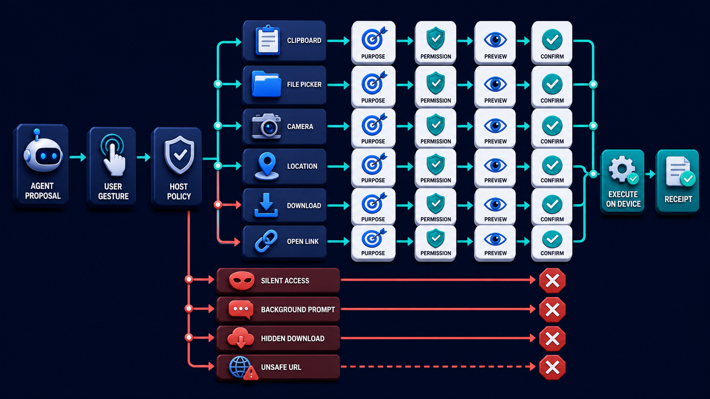
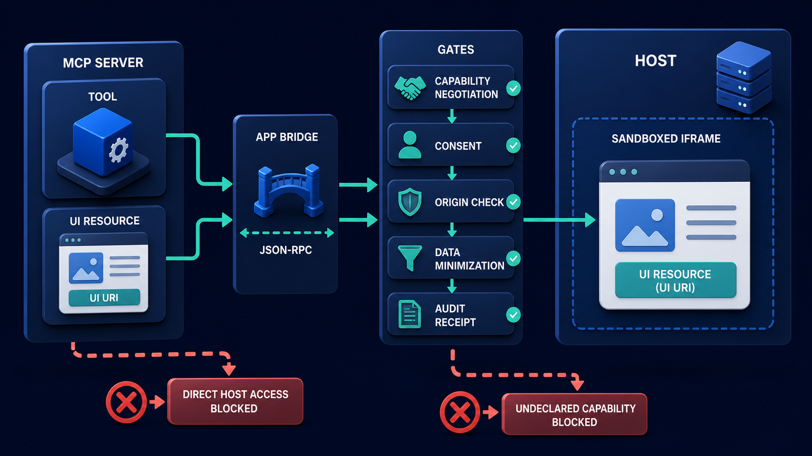

# Diagram 211 — Frontend tool calls and user-device actions

**Module:** Generative and embedded interfaces
**Role in the course:** Design browser and device actions as visible, scoped user choices instead of invisible agent powers.
**Layout:** The diagram shows AGENT PROPOSAL entering USER GESTURE and HOST POLICY, with a coral risk path, and a teal safe path.

---

## At a glance

**Design browser and device actions as visible, scoped user choices instead of invisible agent powers.**

- The diagram centers on **AGENT PROPOSAL** and its relationship to **UNSAFE URL**.

- The diagram separates the tested, legitimate flow from failure paths that must fail closed.

- Maya's case: The Acme agent asks Maya to upload a customer letter and use her location to choose a regional policy.

---

## What the diagram teaches

### 1. Links And Downloads Are Side Effects Too

Links and downloads are side effects too. The diagram makes this concrete through **DOWNLOAD**. If the team skips this, a friendly agent message can become coercive if the browser prompts unexpectedly, refusal breaks the workflow, or a generic device tool can reach arbitrary files and destinations. This is the lesson the case study ends with: The agent proposes; the host explains; the user gestures; the browser mediates; the server revalidates; the receipt proves the result.

### 2. Validate Schemes And Destinations, Prevent Opener Abuse, Label File Type

Validate schemes and destinations, prevent opener abuse, label file type and size, scan generated content when appropriate, and never disguise an executable as a document. This is visible in the drawing as **FILE PICKER**. Without this step, a friendly agent message can become coercive if the browser prompts unexpectedly, refusal breaks the workflow, or a generic device tool can reach arbitrary files and destinations. In the walkthrough, The interface explains that location is optional and offers manual region selection, so Maya chooses the manual path..

### 3. Convert The Agent Suggestion Into A Typed Frontend Proposal

This step asks the team to convert the agent suggestion into a typed frontend proposal with purpose, scope, destination, and required browser capability. The diagram shows this through **PURPOSE**, **AGENT PROPOSAL**, which make the abstract step visible and testable. A remote agent should propose these actions, not pretend it directly owns the device. If Maya declines location, camera, or upload access, the workflow should offer manual entry, paste, existing artifacts, or a reduced-capability path without punishment or endless prompts. If the team skips this, a friendly agent message can become coercive if the browser prompts unexpectedly, refusal breaks the workflow, or a generic device tool can reach arbitrary files and destinations. Maya's case makes this concrete: The Acme agent asks Maya to upload a customer letter and use her location to choose a regional policy.

### 4. Check Host Policy And Feature Availability Before Presenting A Control

Here the product must check host policy and feature availability before presenting a control that cannot work. In the drawing, **HOST POLICY** carry this responsibility. Without this step, a friendly agent message can become coercive if the browser prompts unexpectedly, refusal breaks the workflow, or a generic device tool can reach arbitrary files and destinations. The result — Maya completes the task while refusing one permission and knowingly approving the minimum necessary file disclosure. — depends on getting this right.

### 5. Let The User Initiate The Real Browser Action And Preview

The diagram enforces this by showing the team how to let the user initiate the real browser action and preview the selected data or destination before disclosure or execution. The visual anchors are **PREVIEW**, **USER GESTURE**; without them the step would be invisible to the user. Some useful actions belong on the user's device: choosing a file, copying a result, opening a location, downloading an artifact, or invoking a camera. Browsers protect many capabilities with secure-context rules, permissions, and transient user activation. The case study shows the risk: a friendly agent message can become coercive if the browser prompts unexpectedly, refusal breaks the workflow, or a generic device tool can reach arbitrary files and destinations. This is the lesson the case study ends with: The agent proposes; the host explains; the user gestures; the browser mediates; the server revalidates; the receipt proves the result.

### 6. Execute Only The Approved Bounded Action, Then Reconcile Its Result

This is the discipline that makes the product execute only the approved bounded action, then reconcile its result with authoritative product state. This idea sits on **EXECUTE ON DEVICE** and reaches the rest of the diagram through **EXECUTE ON DEVICE**. The contract must be narrower than a generic execute command. Refusal is a normal state. Missing this is how products end up with a friendly agent message can become coercive if the browser prompts unexpectedly, refusal breaks the workflow, or a generic device tool can reach arbitrary files and destinations. In the walkthrough, The interface explains that location is optional and offers manual region selection, so Maya chooses the manual path..

### 7. Receipt Or Clear Local-only Result And Provide A Refusal, Retry

The team must show a receipt or clear local-only result and provide a refusal, retry, revoke, or alternative path before the interface can be trustworthy. The diagram shows this through **RECEIPT**, which make the abstract step visible and testable. Local-first processing can reduce exposure. The interface must distinguish local preparation from upload. A system that ignores this will eventually face a friendly agent message can become coercive if the browser prompts unexpectedly, refusal breaks the workflow, or a generic device tool can reach arbitrary files and destinations. The danger the case warns about, The Acme agent asks Maya to upload a customer letter and use her location to choose a regional policy. should make this clear.

### 8. The standard in practice

The lesson is not a perfect prototype; it is a product contract. Design browser and device actions as visible, scoped user choices instead of invisible agent powers.. The diagram makes that contract visible through **AGENT PROPOSAL**, **USER GESTURE**, **HOST POLICY**, so the team can argue about the contract before choosing a framework. The contract is not framework-specific; it is the set of observable promises the product makes to the person using it. Maya's case warns that a friendly agent message can become coercive if the browser prompts unexpectedly, refusal breaks the workflow, or a generic device tool can reach arbitrary files and destinations. The practical standard is this: The agent proposes; the host explains; the user gestures; the browser mediates; the server revalidates; the receipt proves the result.

### 9. The Next.js and Python surfaces

The same contract appears in both stacks, but the boundary moves with the architecture.
**In Next.js / React:**
- Keep device APIs inside client components reached through explicit visible controls; perform capability detection and render a meaningful alternative before requesting permission.
- Validate files by size, declared and detected type, count, and purpose; show upload progress separately from local selection and use signed, narrow destinations.
- Represent agent suggestions as inert typed intents. Only a genuine user event can invoke clipboard, picker, download, navigation, camera, or location behavior.
- Keep the most sensitive payloads and policy decisions on the server and stream only user-visible, safe view models to client components.
**In Python / FastAPI:**
- Issue short-lived upload or action tokens scoped to session, tenant, object type, maximum size, content purpose, and expiry; revalidate at ingestion.
- Quarantine and scan uploaded artifacts where the risk requires it, strip unnecessary metadata, and do not trust browser MIME declarations.
- Return durable artifact IDs and processing receipts rather than exposing storage paths, infrastructure credentials, or raw internal exceptions.
- Treat every framework callback or protocol event as raw input; validate and transform it into the product's own event vocabulary before it reaches the reducer or domain model.
Both implementations must avoid the same trap: a friendly agent message can become coercive if the browser prompts unexpectedly, refusal breaks the workflow, or a generic device tool can reach arbitrary files and destinations.

### 10. Analogy

A travel assistant may prepare the address and explain the route, but you still decide whether to open the map, share your location, or hand over a document from your bag. The analogy keeps the lesson grounded. The diagram's **AGENT PROPOSAL** plays the same role as the central object in the analogy: it must be visible, labeled, and trustworthy without the user having to infer meaning from a long narrative. The parallel works because both situations require separating the object from the record, the attempt from the proof, and the promise from the evidence.

Diagram 210 — *MCP Apps, sandboxed frames, consent, and communication* is the next lens on this idea. The same concepts reappear there with different emphasis, so the two diagrams should be read as a pair.

---

## Case study — Maya

The Acme agent asks Maya to upload a customer letter and use her location to choose a regional policy.

### The walkthrough

1. The interface explains that location is optional and offers manual region selection, so Maya chooses the manual path.
2. A real file picker opens only when Maya presses Choose letter; no file is read beforehand.
3. Maya previews the filename, type, size, fields to redact, upload destination, retention, and purpose.
4. After confirmation, the server scans and stores the file, returns an artifact receipt, and the UI links that exact version to the review.

### The result

Maya completes the task while refusing one permission and knowingly approving the minimum necessary file disclosure.

### The danger

A friendly agent message can become coercive if the browser prompts unexpectedly, refusal breaks the workflow, or a generic device tool can reach arbitrary files and destinations.

### The takeaway

The agent proposes; the host explains; the user gestures; the browser mediates; the server revalidates; the receipt proves the result.

---

## Composition

The picture is a single-view explainer for *Frontend tool calls and user-device actions*. On the left, the diagram shows AGENT PROPOSAL entering USER GESTURE and HOST POLICY. At the top, device tools CLIPBOARD, FILE PICKER, CAMERA, LOCATION, DOWNLOAD, OPEN LINK sit behind PURPOSE, PERMISSION, PREVIEW, CONFIRM. In the center, teal EXECUTE ON DEVICE to RECEIPT. To the right, coral SILENT ACCESS, BACKGROUND PROMPT, HIDDEN DOWNLOAD, UNSAFE URL blocked. The eye travels from **AGENT PROPOSAL** through the central flow to **UNSAFE URL**, with the contrast between coral risk paths and teal recovery paths giving the reader the core message at a glance.

## Element by element

- **AGENT PROPOSAL** — the typed suggestion the agent makes to use a device or browser capability.
- **USER GESTURE** — the genuine human interaction required to activate a browser or device feature.
- **HOST POLICY** — the product rule that decides which device actions are allowed for a purpose.
- **CLIPBOARD** — the clipboard Device tools CLIPBOARD, FILE PICKER, CAMERA, LOCATION, DOWNLOAD, OPEN LINK sit behind PURPOSE, PERMISSION, PREVIEW, CONFIRM..
- **FILE PICKER** — the file picker Device tools CLIPBOARD, FILE PICKER, CAMERA, LOCATION, DOWNLOAD, OPEN LINK sit behind PURPOSE, PERMISSION, PREVIEW, CONFIRM..
- **CAMERA** — the camera Device tools CLIPBOARD, FILE PICKER, CAMERA, LOCATION, DOWNLOAD, OPEN LINK sit behind PURPOSE, PERMISSION, PREVIEW, CONFIRM..
- **LOCATION** — the location Device tools CLIPBOARD, FILE PICKER, CAMERA, LOCATION, DOWNLOAD, OPEN LINK sit behind PURPOSE, PERMISSION, PREVIEW, CONFIRM..
- **DOWNLOAD** — the download Device tools CLIPBOARD, FILE PICKER, CAMERA, LOCATION, DOWNLOAD, OPEN LINK sit behind PURPOSE, PERMISSION, PREVIEW, CONFIRM..
- **OPEN LINK** — the open link Device tools CLIPBOARD, FILE PICKER, CAMERA, LOCATION, DOWNLOAD, OPEN LINK sit behind PURPOSE, PERMISSION, PREVIEW, CONFIRM..
- **PURPOSE** — one of the items named by **OPEN LINK**; this is the **PURPOSE** item.
- **PERMISSION** — one of the items named by **OPEN LINK**; this is the **PERMISSION** item.
- **PREVIEW** — one of the items named by **OPEN LINK**; this is the **PREVIEW** item.
- **CONFIRM** — one of the items named by **OPEN LINK**; this is the **CONFIRM** item.
- **EXECUTE ON DEVICE** — the safe completion of a browser or device action after user confirmation.
- **RECEIPT** — durable proof of a decision, effect, or user-visible transition.
- **SILENT ACCESS** — the silent access BACKGROUND PROMPT, HIDDEN DOWNLOAD, UNSAFE URL blocked..
- **BACKGROUND PROMPT** — the background prompt SILENT ACCESS, BACKGROUND PROMPT, HIDDEN DOWNLOAD, UNSAFE URL blocked..
- **HIDDEN DOWNLOAD** — the hidden download SILENT ACCESS, BACKGROUND PROMPT, HIDDEN DOWNLOAD, UNSAFE URL blocked..
- **UNSAFE URL** — the unsafe url SILENT ACCESS, BACKGROUND PROMPT, HIDDEN DOWNLOAD, UNSAFE URL blocked..

---

## Colour and flow semantics

The course visual grammar applies directly to this diagram.

- **Cobalt platform** — A browser surface, state store, component catalog, product boundary, workspace, or learning-platform region. Here the cobalt surface under **AGENT PROPOSAL** and the surrounding workspace frames the product boundary; it tells the reader that this is a bounded product region, not an uncontrolled chat surface. It marks the product's responsibility to keep the user's workspace distinct from raw model output or runtime internals.

- **Cyan arrow** — A typed event, validated state update, user action, artifact reference, notification, or navigation path. Cyan arrows carry the flow of events, updates, and proposals from left to right, linking the typed cards and records to the reducer or next gate. When the reader sees cyan, they should expect a deliberate, validated transition rather than an accidental or hidden connection.

- **Teal arrow** — Authoritative state, accessible completion, informed consent, safe approval, preserved work, or verified recovery. Teal marks the authoritative and safe path, such as the committed receipt or restored state, distinguishing it from the raw request. This color tells the reader that the product has enough evidence and authority to proceed safely.

- **Coral path** — Conflict, stale UI, unsafe rendering, deceptive state, expired approval, privacy failure, lost work, or blocked action. Coral marks the conflict, stale state, or blocked action that appears when a control is missing or bypassed. It signals that the product should pause, surface the conflict, and offer a recovery path rather than proceed silently.

- **White card** — An event, component, stage, proposal, artifact, receipt, consent record, lesson, checkpoint, or recovery option. **AGENT PROPOSAL**, **RECEIPT** appear as white cards, showing that they are records, proposals, or evidence rather than raw data or system internals. The white background separates user-meaningful records from raw system logs or generated text.

The overall flow moves from the initiating actor or request, through validation and reduction, toward either the teal recovery or completion path or the coral failure path. The color of each arrow and card is a trust cue, not a decoration.

---

## How to present it

- **Start with the user moment.** The Acme agent asks Maya to upload a customer letter and use her location to choose a regional policy. Ask the room what they need to see to feel in control. Invite someone to describe the moment before any solution appears.

- **Point at AGENT PROPOSAL and ask what it represents.** Then trace the flow from there through the next two or three elements, naming the color and direction of each arrow. Encourage them to name the incoming trigger, the visible state, and the decision the product must make.

- **Point at PURPOSE for step 1.** Convert The Agent Suggestion Into A Typed Frontend Proposal. Ask what observable evidence the product would produce if this step worked correctly. Have the room identify the color of the path leaving this element and what it tells a user about trust.

- **Point at HOST POLICY for step 2.** Check Host Policy And Feature Availability Before Presenting A Control. Ask what observable evidence the product would produce if this step worked correctly. Have the room identify the color of the path leaving this element and what it tells a user about trust.

- **Point at PREVIEW for step 3.** Let The User Initiate The Real Browser Action And Preview. Ask what observable evidence the product would produce if this step worked correctly. Have the room identify the color of the path leaving this element and what it tells a user about trust.

- **Point at EXECUTE ON DEVICE for step 4.** Execute Only The Approved Bounded Action, Then Reconcile Its Result. Ask what observable evidence the product would produce if this step worked correctly. Have the room identify the color of the path leaving this element and what it tells a user about trust.

- **Point at RECEIPT for step 5.** Receipt Or Clear Local-only Result And Provide A Refusal, Retry. Ask what observable evidence the product would produce if this step worked correctly. Have the room identify the color of the path leaving this element and what it tells a user about trust.

- **Use the analogy.** A travel assistant may prepare the address and explain the route, but you still decide whether to open the map, share your location, or hand over a document from your bag. Draw the parallel to the diagram and ask what would break if the two situations were handled the same way.

- **Tell the case study.** The Acme agent asks Maya to upload a customer letter and use her location to choose a regional policy Walk through the walkthrough and stop at the moment the old design would have failed. Pause at the step where the old design would have failed and ask how the new interface prevents it.

- **Run the lab.** Specify clipboard, file upload, download, open-link, camera, and location tools. For each, document user activation, browser permission, purpose, preview, data flow, refusal alternative, server revalidation, cancellation, error, privacy, and receipt. Ask pairs to present one part of the diagram and explain how the other parts reference it without merging their identities.

- **Pose the checkpoint.** May an agent call a browser file picker automatically after writing 'Please upload a file'? Let the room answer before confirming the principle. Collect answers, then confirm the principle and note any exceptions the team should watch for.

- **Close on the contract.** The agent proposes; the host explains; the user gestures; the browser mediates; the server revalidates; the receipt proves the result. Ask the team what their own product's equivalent of the contract would be.

---

## Lab and checkpoint

**Lab:** Specify clipboard, file upload, download, open-link, camera, and location tools. For each, document user activation, browser permission, purpose, preview, data flow, refusal alternative, server revalidation, cancellation, error, privacy, and receipt.

**Checkpoint:** May an agent call a browser file picker automatically after writing 'Please upload a file'?

**Answer:** No. The product should present a clear control and let a genuine user gesture invoke the picker. The message is a proposal, not permission or activation.

---

## Glossary

- **User activation** — browser-recognized human interaction required for some capabilities
- **Frontend tool** — typed device or browser action mediated by the host
- **Local-first** — processing data on the device before optional disclosure

---

## Sources

- [HTML Living Standard web messaging](https://html.spec.whatwg.org/multipage/web-messaging.html)
- [Permissions Policy](https://www.w3.org/TR/permissions-policy-1/)
- [OWASP HTML5 Security](https://cheatsheetseries.owasp.org/cheatsheets/HTML5_Security_Cheat_Sheet.html)
- [Next.js App Router](https://nextjs.org/docs/app)

## Related lessons

- Diagram 205 — Interrupt, input request, approval, rejection, and expiry
- Diagram 210 — MCP Apps, sandboxed frames, consent, and communication
- Diagram 218 — Privacy controls, consent, memory settings, and deletion

---