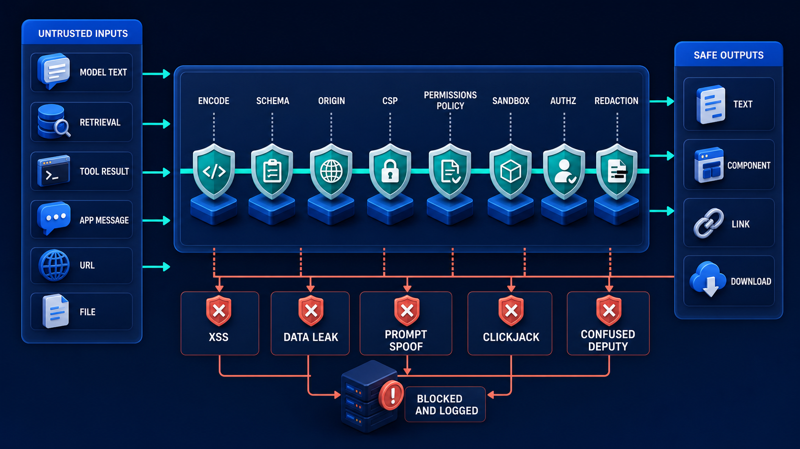

# Diagram 212 — Interface security, data exposure, and safe rendering

**Module:** Generative and embedded interfaces
**Role in the course:** Apply ordinary web security and agent-specific trust boundaries to every dynamic interface input and action.
**Layout:** The diagram shows UNTRUSTED INPUTS MODEL TEXT RETRIEVAL TOOL RESULT APP MESSAGE URL FILE entering ENCODE, SANITIZE WHERE NEEDED, SCHEMA, ORIGIN, CSP, PERMISSIONS POLICY,...

---

## At a glance

**Apply ordinary web security and agent-specific trust boundaries to every dynamic interface input and action.**

- The diagram centers on **UNTRUSTED INPUTS MODEL TEXT RETRIEVAL TOOL RESULT APP MESSAGE URL FILE** and its relationship to **XSS DATA LEAK PROMPT SPOOF CLICKJACK CONFUSED DEPUTY**.

- The diagram separates the tested, legitimate flow from failure paths that must fail closed.

- Maya's case: A retrieved policy contains hidden markup designed to create a fake Acme approval button and send customer data to an external URL.

---

## What the diagram teaches

### 1. Sanitization Is Needed Only When The Product Intentionally Supports

Sanitization is needed only when the product intentionally supports a limited markup language, and the sanitizer configuration becomes security-critical. The diagram makes this concrete through **SANITIZE WHERE NEEDED**. If the team skips this, agent systems widen the input surface: one unsafe renderer can turn model, RAG, tool, or embedded-app content into code or a believable fake control. This is the lesson the case study ends with: Treat every dynamic source as data, expose the minimum, authorize effects on the server, and layer browser defenses around mistakes.

### 2. Avoid Raw HTML Whenever Structured Components Can Express The Same

Avoid raw HTML whenever structured components can express the same meaning. Iframe sandboxing restricts embedded code. This is visible in the drawing as **UNTRUSTED INPUTS MODEL TEXT RETRIEVAL TOOL RESULT APP MESSAGE URL FILE**, **ENCODE**, **SANITIZE WHERE NEEDED**. Without this step, agent systems widen the input surface: one unsafe renderer can turn model, RAG, tool, or embedded-app content into code or a believable fake control. In the walkthrough, Retrieval returns the content as untrusted evidence text, not as UI code..

### 3. Inventory Every Interface Input, Renderer, Frame, Bridge, Browser Capability, Action

This step asks the team to inventory every interface input, renderer, frame, bridge, browser capability, action endpoint, data field, and external destination. The diagram shows this through **XSS DATA LEAK PROMPT SPOOF CLICKJACK CONFUSED DEPUTY**, which make the abstract step visible and testable. Permissions Policy limits powerful browser features. Data minimization happens before rendering. If the team skips this, agent systems widen the input surface: one unsafe renderer can turn model, RAG, tool, or embedded-app content into code or a believable fake control. Maya's case makes this concrete: A retrieved policy contains hidden markup designed to create a fake Acme approval button and send customer data to an external URL.

### 4. Classify Trust Boundaries And Apply Schema, Size, Encoding, URL, Origin

Here the product must classify trust boundaries and apply schema, size, encoding, URL, origin, content, and tenant rules before the component layer. In the drawing, **SCHEMA**, **ORIGIN**, **UNTRUSTED INPUTS MODEL TEXT RETRIEVAL TOOL RESULT APP MESSAGE URL FILE** carry this responsibility. Fluency, an internal source, or a signed-in user does not make content safe to execute. Contextual output encoding is the default defense for text. Without this step, agent systems widen the input surface: one unsafe renderer can turn model, RAG, tool, or embedded-app content into code or a believable fake control. The result — The malicious document cannot impersonate product controls or exfiltrate customer data, and Maya can continue with the safe evidence. — depends on getting this right.

### 5. Strict CSP, Restrictive Frame And Permissions Policies, Secure Cookies, Anti-CSRF

The diagram enforces this by showing the team how to use strict CSP, restrictive frame and permissions policies, secure cookies, anti-CSRF controls, and server-side authorization appropriate to the architecture. The visual anchors are **CSP**, **PERMISSIONS POLICY**; without them the step would be invisible to the user. CSP limits where scripts, frames, styles, images, and connections may come from. These controls overlap but do not replace validation, authorization, or safe component design. The case study shows the risk: agent systems widen the input surface: one unsafe renderer can turn model, RAG, tool, or embedded-app content into code or a believable fake control. This is the lesson the case study ends with: Treat every dynamic source as data, expose the minimum, authorize effects on the server, and layer browser defenses around mistakes.

Diagram 210 — *MCP Apps, sandboxed frames, consent, and communication* is the next lens on this idea. The same concepts reappear there with different emphasis, so the two diagrams should be read as a pair.

### 6. Stored And Reflected XSS, Malicious Markdown, Unsafe Links, Oversized Trees

This is the discipline that makes the product test stored and reflected XSS, malicious Markdown, unsafe links, oversized trees, spoofed approvals, cross-tenant IDs, forged app messages, and clickjacking. This idea sits on **UNTRUSTED INPUTS MODEL TEXT RETRIEVAL TOOL RESULT APP MESSAGE URL FILE** and reaches the rest of the diagram through **UNTRUSTED INPUTS MODEL TEXT RETRIEVAL TOOL RESULT APP MESSAGE URL FILE**, **XSS DATA LEAK PROMPT SPOOF CLICKJACK CONFUSED DEPUTY**. Model output, retrieved documents, tool results, MCP App messages, filenames, URLs, and generated component payloads are untrusted input. Never dump the malicious payload or stack trace into the page. Missing this is how products end up with agent systems widen the input surface: one unsafe renderer can turn model, RAG, tool, or embedded-app content into code or a believable fake control. In the walkthrough, Retrieval returns the content as untrusted evidence text, not as UI code..

### 7. Bounded Recovery, Rotate Or Revoke Exposed Authority, Preserve Evidence

The team must render bounded recovery, rotate or revoke exposed authority, preserve evidence, and convert every incident into a regression case before the interface can be trustworthy. The diagram shows this through **UNTRUSTED INPUTS MODEL TEXT RETRIEVAL TOOL RESULT APP MESSAGE URL FILE**, **ENCODE**, **SANITIZE WHERE NEEDED**, which make the abstract step visible and testable. A system that ignores this will eventually face agent systems widen the input surface: one unsafe renderer can turn model, RAG, tool, or embedded-app content into code or a believable fake control. The danger the case warns about, A retrieved policy contains hidden markup designed to create a fake Acme approval button and send customer data to an external URL. should make this clear.

### 8. The standard in practice

The lesson is not a perfect prototype; it is a product contract. Apply ordinary web security and agent-specific trust boundaries to every dynamic interface input and action.. The diagram makes that contract visible through **UNTRUSTED INPUTS MODEL TEXT RETRIEVAL TOOL RESULT APP MESSAGE URL FILE**, **ENCODE**, **SANITIZE WHERE NEEDED**, so the team can argue about the contract before choosing a framework. The contract is not framework-specific; it is the set of observable promises the product makes to the person using it. Maya's case warns that agent systems widen the input surface: one unsafe renderer can turn model, RAG, tool, or embedded-app content into code or a believable fake control. The practical standard is this: Treat every dynamic source as data, expose the minimum, authorize effects on the server, and layer browser defenses around mistakes.

### 9. The Next.js and Python surfaces

The same contract appears in both stacks, but the boundary moves with the architecture.
**In Next.js / React:**
- Keep secrets and privileged data in Server Components or server modules; pass client components minimal serialized view models rather than database records or provider responses.
- Render text as text, allow links only after scheme and destination policy, avoid dangerous HTML sinks, and configure CSP with nonces or hashes rather than broad unsafe directives.
- Reauthorize every Server Action and route handler, bind actions to current resource revisions, and treat client-supplied role, tenant, price, approval, and artifact fields as assertions to verify.
- Keep the most sensitive payloads and policy decisions on the server and stream only user-visible, safe view models to client components.
**In Python / FastAPI:**
- Centralize tenant-scoped authorization and redaction before response serialization; use explicit response models so accidental fields do not leak.
- Validate URLs, content types, bridge methods, component schemas, identifiers, and size limits at ingress, and use safe libraries rather than custom parsers.
- Create security fixtures for hostile retrieved text, tool outputs, app messages, and uploads, then run them through API, renderer, and browser tests as one end-to-end story.
- Treat every framework callback or protocol event as raw input; validate and transform it into the product's own event vocabulary before it reaches the reducer or domain model.
Both implementations must avoid the same trap: agent systems widen the input surface: one unsafe renderer can turn model, RAG, tool, or embedded-app content into code or a believable fake control.

### 10. Analogy

A mailroom treats every package as unopened and potentially unsafe. A familiar return address may guide routing, but it does not bypass scanning, recipient checks, or access-controlled delivery. The analogy keeps the lesson grounded. The diagram's **UNTRUSTED INPUTS MODEL TEXT RETRIEVAL TOOL RESULT APP MESSAGE URL FILE** plays the same role as the central object in the analogy: it must be visible, labeled, and trustworthy without the user having to infer meaning from a long narrative. The parallel works because both situations require separating the object from the record, the attempt from the proof, and the promise from the evidence.

---

## Case study — Maya

A retrieved policy contains hidden markup designed to create a fake Acme approval button and send customer data to an external URL.

### The walkthrough

1. Retrieval returns the content as untrusted evidence text, not as UI code.
2. The component renderer encodes the markup, and link policy blocks the unapproved destination.
3. CSP prevents unexpected script and connection sources even if a future renderer mistake occurs.
4. The security event receives a redacted correlation reference, the legitimate evidence remains available, and the payload becomes a permanent regression fixture.

### The result

The malicious document cannot impersonate product controls or exfiltrate customer data, and Maya can continue with the safe evidence.

### The danger

Agent systems widen the input surface: one unsafe renderer can turn model, RAG, tool, or embedded-app content into code or a believable fake control.

### The takeaway

Treat every dynamic source as data, expose the minimum, authorize effects on the server, and layer browser defenses around mistakes.

---

## Composition

The picture is a single-view explainer for *Interface security, data exposure, and safe rendering*. On the left, the diagram shows UNTRUSTED INPUTS MODEL TEXT RETRIEVAL TOOL RESULT APP MESSAGE URL FILE entering ENCODE, SANITIZE WHERE NEEDED, SCHEMA, ORIGIN, CSP, PERMISSIONS POLICY, SANDBOX, AUTHZ, REDACTION. At the top, safe outputs TEXT COMPONENT LINK DOWNLOAD. In the center, coral XSS DATA LEAK PROMPT SPOOF CLICKJACK CONFUSED DEPUTY blocked and logged. The eye travels from **UNTRUSTED INPUTS MODEL TEXT RETRIEVAL TOOL RESULT APP MESSAGE URL FILE** through the central flow to **XSS DATA LEAK PROMPT SPOOF CLICKJACK CONFUSED DEPUTY**, with the contrast between coral risk paths and teal recovery paths giving the reader the core message at a glance.

## Element by element

- **UNTRUSTED INPUTS MODEL TEXT RETRIEVAL TOOL RESULT APP MESSAGE URL FILE** — the untrusted inputs model text retrieval tool result app message url file entering ENCODE, SANITIZE WHERE NEEDED, SCHEMA, ORIGIN, CSP, PERMISSIONS POLICY, SANDBOX, AUTHZ, REDACTION..
- **ENCODE** — the contextual escaping that makes data safe for its exact rendering context.
- **SANITIZE WHERE NEEDED** — one of the items named by **UNTRUSTED INPUTS MODEL TEXT RETRIEVAL TOOL RESULT APP MESSAGE URL FILE**; this is the **SANITIZE WHERE NEEDED** item.
- **SCHEMA** — one of the items named by **UNTRUSTED INPUTS MODEL TEXT RETRIEVAL TOOL RESULT APP MESSAGE URL FILE**; this is the **SCHEMA** item.
- **ORIGIN** — one of the items named by **UNTRUSTED INPUTS MODEL TEXT RETRIEVAL TOOL RESULT APP MESSAGE URL FILE**; this is the **ORIGIN** item.
- **CSP** — the Content Security Policy that limits where scripts, frames, and connections may originate.
- **PERMISSIONS POLICY** — the browser policy that restricts powerful features such as camera or location.
- **SANDBOX** — the iframe attribute that isolates embedded content from the host's authority.
- **AUTHZ** — the server-side authorization that checks identity, tenant, resource, and policy before any effect.
- **REDACTION** — the removal of sensitive fields before data reaches a component or log.
- **TEXT COMPONENT LINK DOWNLOAD** — the text component link download Safe outputs TEXT COMPONENT LINK DOWNLOAD..
- **XSS DATA LEAK PROMPT SPOOF CLICKJACK CONFUSED DEPUTY** — the xss data leak prompt spoof clickjack confused deputy blocked and logged..

---

## Colour and flow semantics

The course visual grammar applies directly to this diagram.

- **Cobalt platform** — A browser surface, state store, component catalog, product boundary, workspace, or learning-platform region. Here the cobalt surface under **UNTRUSTED INPUTS MODEL TEXT RETRIEVAL TOOL RESULT APP MESSAGE URL FILE** and the surrounding workspace frames the product boundary; it tells the reader that this is a bounded product region, not an uncontrolled chat surface. It marks the product's responsibility to keep the user's workspace distinct from raw model output or runtime internals.

- **Cyan arrow** — A typed event, validated state update, user action, artifact reference, notification, or navigation path. Cyan arrows carry the flow of events, updates, and proposals from left to right, linking the typed cards and records to the reducer or next gate. When the reader sees cyan, they should expect a deliberate, validated transition rather than an accidental or hidden connection.

- **Teal arrow** — Authoritative state, accessible completion, informed consent, safe approval, preserved work, or verified recovery. Teal marks the authoritative and safe path, such as the committed receipt or restored state, distinguishing it from the raw request. This color tells the reader that the product has enough evidence and authority to proceed safely.

- **Coral path** — Conflict, stale UI, unsafe rendering, deceptive state, expired approval, privacy failure, lost work, or blocked action. Coral marks the conflict, stale state, or blocked action that appears when a control is missing or bypassed. It signals that the product should pause, surface the conflict, and offer a recovery path rather than proceed silently.

- **White card** — An event, component, stage, proposal, artifact, receipt, consent record, lesson, checkpoint, or recovery option. The labeled cards and records throughout the diagram are white, marking them as structured events, proposals, receipts, or recovery options. The white background separates user-meaningful records from raw system logs or generated text.

The overall flow moves from the initiating actor or request, through validation and reduction, toward either the teal recovery or completion path or the coral failure path. The color of each arrow and card is a trust cue, not a decoration.

---

## How to present it

- **Start with the user moment.** A retrieved policy contains hidden markup designed to create a fake Acme approval button and send customer data to an external URL. Ask the room what they need to see to feel in control. Invite someone to describe the moment before any solution appears.

- **Point at UNTRUSTED INPUTS MODEL TEXT RETRIEVAL TOOL RESULT APP MESSAGE URL FILE and ask what it represents.** Then trace the flow from there through the next two or three elements, naming the color and direction of each arrow. Encourage them to name the incoming trigger, the visible state, and the decision the product must make.

- **Point at XSS DATA LEAK PROMPT SPOOF CLICKJACK CONFUSED DEPUTY for step 1.** Inventory Every Interface Input, Renderer, Frame, Bridge, Browser Capability, Action. Ask what observable evidence the product would produce if this step worked correctly. Have the room identify the color of the path leaving this element and what it tells a user about trust.

- **Point at SCHEMA for step 2.** Classify Trust Boundaries And Apply Schema, Size, Encoding, URL, Origin. Ask what observable evidence the product would produce if this step worked correctly. Have the room identify the color of the path leaving this element and what it tells a user about trust.

- **Point at CSP for step 3.** Strict CSP, Restrictive Frame And Permissions Policies, Secure Cookies, Anti-CSRF. Ask what observable evidence the product would produce if this step worked correctly. Have the room identify the color of the path leaving this element and what it tells a user about trust.

- **Point at UNTRUSTED INPUTS MODEL TEXT RETRIEVAL TOOL RESULT APP MESSAGE URL FILE for step 4.** Stored And Reflected XSS, Malicious Markdown, Unsafe Links, Oversized Trees. Ask what observable evidence the product would produce if this step worked correctly. Have the room identify the color of the path leaving this element and what it tells a user about trust.

- **Point at ORIGIN for step 5.** Bounded Recovery, Rotate Or Revoke Exposed Authority, Preserve Evidence. Ask what observable evidence the product would produce if this step worked correctly. Have the room identify the color of the path leaving this element and what it tells a user about trust.

- **Use the analogy.** A mailroom treats every package as unopened and potentially unsafe. A familiar return address may guide routing, but it does not bypass scanning, recipient checks, or access-controlled delivery. Draw the parallel to the diagram and ask what would break if the two situations were handled the same way.

- **Tell the case study.** A retrieved policy contains hidden markup designed to create a fake Acme approval button and send customer data to an external URL Walk through the walkthrough and stop at the moment the old design would have failed. Pause at the step where the old design would have failed and ask how the new interface prevents it.

- **Run the lab.** Threat-model a generated comparison screen from source to browser. Add at least twenty abuse cases covering XSS, unsafe URLs, data overexposure, forged actions, cross-tenant access, iframe messages, CSP bypass, clickjacking, downloads, denial of service, and misleading consent. Define prevention, detection, recovery, and regression evidence. Ask pairs to present one part of the diagram and explain how the other parts reference it without merging their identities.

- **Pose the checkpoint.** If CSP blocks inline scripts, may the application safely render arbitrary model HTML? Let the room answer before confirming the principle. Collect answers, then confirm the principle and note any exceptions the team should watch for.

- **Close on the contract.** Treat every dynamic source as data, expose the minimum, authorize effects on the server, and layer browser defenses around mistakes. Ask the team what their own product's equivalent of the contract would be.

---

## Lab and checkpoint

**Lab:** Threat-model a generated comparison screen from source to browser. Add at least twenty abuse cases covering XSS, unsafe URLs, data overexposure, forged actions, cross-tenant access, iframe messages, CSP bypass, clickjacking, downloads, denial of service, and misleading consent. Define prevention, detection, recovery, and regression evidence.

**Checkpoint:** If CSP blocks inline scripts, may the application safely render arbitrary model HTML?

**Answer:** No. CSP is defense in depth and has limits and configuration risks. Arbitrary HTML can still spoof controls, leak data through allowed channels, abuse links, or exploit a future mistake. Prefer typed components and contextual encoding.

---

## Glossary

- **Contextual encoding** — escaping data for its exact HTML, attribute, URL, or script context
- **CSP** — browser policy restricting content sources and execution
- **Confused deputy** — privileged component tricked into using its authority for an untrusted requester

---

## Sources

- [Content Security Policy Level 3](https://www.w3.org/TR/CSP3/)
- [Permissions Policy](https://www.w3.org/TR/permissions-policy-1/)
- [OWASP DOM XSS Prevention](https://cheatsheetseries.owasp.org/cheatsheets/DOM_based_XSS_Prevention_Cheat_Sheet.html)
- [OWASP Content Security Policy](https://cheatsheetseries.owasp.org/cheatsheets/Content_Security_Policy_Cheat_Sheet.html)
- [OWASP HTML5 Security](https://cheatsheetseries.owasp.org/cheatsheets/HTML5_Security_Cheat_Sheet.html)

## Related lessons

- Diagram 209 — Typed components, schemas, allowlists, and validation
- Diagram 210 — MCP Apps, sandboxed frames, consent, and communication
- Diagram 218 — Privacy controls, consent, memory settings, and deletion

---