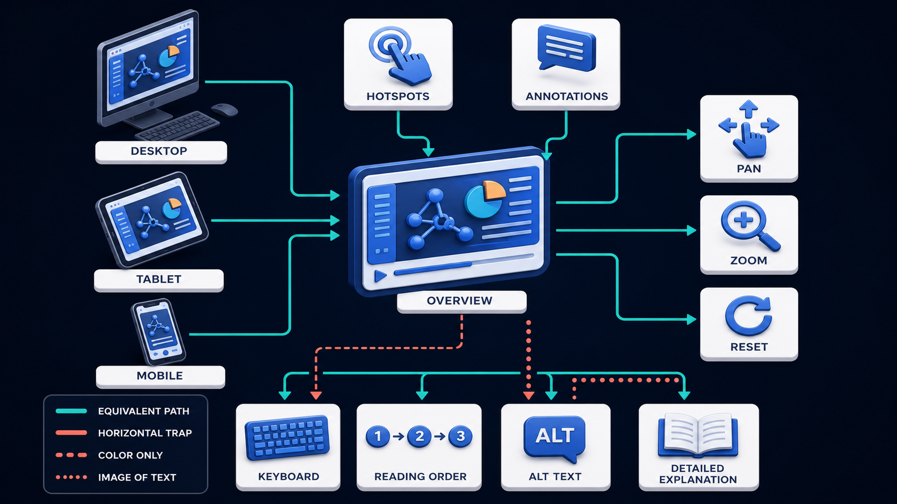

# Diagram 213 — A reusable visual lesson content model

**Module:** The future visual-learning website
**Role in the course:** Design one durable lesson source that can power documents, a website, search, accessibility, and future learning experiences.
**Layout:** The diagram shows AUTHORING SOURCE feeding VALIDATED LESSON MODEL with OUTCOME, STATUS, DIAGRAM, ALT, EXPLANATION, TRACE, ANALOGY, NEXTJS, PYTHON, CASE STUDY, LAB, CHECKPOINT,...

---

## At a glance

**Design one durable lesson source that can power documents, a website, search, accessibility, and future learning experiences.**

- The diagram centers on **AUTHORING SOURCE** and its relationship to **COPY PASTE DRIFT**.

- The coral **COPY PASTE DRIFT** path shows the risk the product must prevent.

- Maya's case: Maya corrects one explanation and adds a new source. In the old workflow she must update the DOCX, website, search index, and quiz notes separately.

---

## What the diagram teaches

### 1. Website Should Not Begin By Copying Paragraphs Out Of Word

The website should not begin by copying paragraphs out of Word files. The diagram makes this concrete through **DOCX WEBSITE SEARCH OFFLINE QUIZ**. If the team skips this, copying content between formats creates silent differences, stale citations, missing alt text, broken checkpoints, and corrections that reach only some learners. This is the lesson the case study ends with: One semantic lesson model, many verified projections, stable IDs, explicit versions, and no copy-and-paste publishing.

### 2. Migration Should Preserve Author Intent, Report Information Loss, And Leave

A migration should preserve author intent, report information loss, and leave a reversible record of what changed. This is visible in the drawing as **SCHEMA VERSION MIGRATION**. Without this step, copying content between formats creates silent differences, stale citations, missing alt text, broken checkpoints, and corrections that reach only some learners. In the walkthrough, Maya edits the lesson source once and increments the content revision, not the stable lesson ID..

### 3. Stable Course, Module, Lesson, Source, Term, Checkpoint, And Asset Identities

This step asks the team to define stable course, module, lesson, source, term, checkpoint, and asset identities plus explicit relationships. The diagram shows this through **CHECKPOINT**, **AUTHORING SOURCE**, **VALIDATED LESSON MODEL**, which make the abstract step visible and testable. Each lesson needs a stable ID and slug, module, title, learning outcome, standards status, diagram asset, alt text, detailed explanation, visual trace, analogy, technology mappings, case study, lab, checkpoint, glossary, relations, and cited sources. Stable identifiers matter more than filenames. If the team skips this, copying content between formats creates silent differences, stale citations, missing alt text, broken checkpoints, and corrections that reach only some learners. Maya's case makes this concrete: Maya corrects one explanation and adds a new source. In the old workflow she must update the DOCX, website, search index, and quiz notes separately.

### 4. Versioned JSON Schema Or Equivalent Typed Model With Required Semantic

Here the product must create a versioned JSON Schema or equivalent typed model with required semantic fields and bounded content rules. In the drawing, **VALIDATED LESSON MODEL**, **SCHEMA VERSION MIGRATION** carry this responsibility. The schema needs a version and migration policy. Additive optional fields are easier than silent meaning changes. Without this step, copying content between formats creates silent differences, stale citations, missing alt text, broken checkpoints, and corrections that reach only some learners. The result — Every format presents the same corrected lesson, and the team can prove which source produced it. — depends on getting this right.

### 5. Validate Authoring Input, Cross-references, Accessibility Equivalents, URLs, Assets, And Source

The diagram enforces this by showing the team how to validate authoring input, cross-references, accessibility equivalents, URLs, assets, and source freshness before building. The visual anchors are **AUTHORING SOURCE**; without them the step would be invisible to the user. Validation belongs in authoring and CI. The case study shows the risk: copying content between formats creates silent differences, stale citations, missing alt text, broken checkpoints, and corrections that reach only some learners. This is the lesson the case study ends with: One semantic lesson model, many verified projections, stable IDs, explicit versions, and no copy-and-paste publishing.

### 6. Generate DOCX, Web Routes, Search Documents, Offline Manifests, Feeds

This is the discipline that makes the product generate DOCX, web routes, search documents, offline manifests, feeds, and quiz payloads from the same validated snapshot. This idea sits on **DOCX WEBSITE SEARCH OFFLINE QUIZ** and reaches the rest of the diagram through **DOCX WEBSITE SEARCH OFFLINE QUIZ**, **VALIDATED LESSON MODEL**. A structured content model becomes the source of truth, while DOCX, web pages, search records, offline packs, quizzes, and future formats become projections. Missing this is how products end up with copying content between formats creates silent differences, stale citations, missing alt text, broken checkpoints, and corrections that reach only some learners. In the walkthrough, Maya edits the lesson source once and increments the content revision, not the stable lesson ID..

### 7. Store The Content Version And Build Receipt With Every Published

The team must store the content version and build receipt with every published artifact so a learner or editor can reproduce it before the interface can be trustworthy. The diagram shows this through **SCHEMA VERSION MIGRATION**, which make the abstract step visible and testable. A system that ignores this will eventually face copying content between formats creates silent differences, stale citations, missing alt text, broken checkpoints, and corrections that reach only some learners. The danger the case warns about, Maya corrects one explanation and adds a new source. In the old workflow she must update the DOCX, website, search index, and quiz notes separately. should make this clear.

### 8. The standard in practice

The lesson is not a perfect prototype; it is a product contract. Design one durable lesson source that can power documents, a website, search, accessibility, and future learning experiences.. The diagram makes that contract visible through **AUTHORING SOURCE**, **VALIDATED LESSON MODEL**, **OUTCOME**, so the team can argue about the contract before choosing a framework. The contract is not framework-specific; it is the set of observable promises the product makes to the person using it. Maya's case warns that copying content between formats creates silent differences, stale citations, missing alt text, broken checkpoints, and corrections that reach only some learners. The practical standard is this: One semantic lesson model, many verified projections, stable IDs, explicit versions, and no copy-and-paste publishing.

### 9. The Next.js and Python surfaces

The same contract appears in both stacks, but the boundary moves with the architecture.
**In Next.js / React:**
- Validate course JSON during the build, generate static lesson routes from stable slugs, and derive navigation, metadata, structured data, source panels, and related lessons from the same object.
- Keep rich prose in a controlled Markdown or portable-document AST field if needed, with a strict renderer and semantic components rather than arbitrary MDX execution.
- Emit contentVersion and schemaVersion into page metadata and cache tags so corrections can invalidate exactly the lessons and indexes that changed.
- Keep the most sensitive payloads and policy decisions on the server and stream only user-visible, safe view models to client components.
**In Python / FastAPI:**
- Model the schema with Pydantic, including validators for unique IDs, module membership, source references, related-lesson existence, alt text, and complete case studies.
- Build deterministic exporters for JSON, DOCX input, search records, glossary indexes, and offline manifests from one immutable course snapshot.
- Write explicit migrations from each supported schema version, test round trips, and retain an audit report of changed, defaulted, or dropped fields.
- Treat every framework callback or protocol event as raw input; validate and transform it into the product's own event vocabulary before it reaches the reducer or domain model.
Both implementations must avoid the same trap: copying content between formats creates silent differences, stale citations, missing alt text, broken checkpoints, and corrections that reach only some learners.

### 10. Analogy

A well-organized kitchen keeps ingredients in labeled containers and uses recipes for different meals. Copying a finished casserole to make soup is fragile; starting from the same ingredients and recipe data is repeatable. The analogy keeps the lesson grounded. The diagram's **AUTHORING SOURCE** plays the same role as the central object in the analogy: it must be visible, labeled, and trustworthy without the user having to infer meaning from a long narrative. The parallel works because both situations require separating the object from the record, the attempt from the proof, and the promise from the evidence.

Diagram 214 — *Responsive diagrams, zoom, annotations, and reading order* is the next lens on this idea. The same concepts reappear there with different emphasis, so the two diagrams should be read as a pair.

---

## Case study — Maya

Maya corrects one explanation and adds a new source. In the old workflow she must update the DOCX, website, search index, and quiz notes separately.

### The walkthrough

1. Maya edits the lesson source once and increments the content revision, not the stable lesson ID.
2. Validation confirms the source label exists, the relation graph is valid, and every accessibility field remains complete.
3. The build regenerates the lesson page, document section, source register, search record, and offline manifest from the same snapshot.
4. A receipt lists changed outputs and content hashes, while unchanged lessons remain cached.

### The result

Every format presents the same corrected lesson, and the team can prove which source produced it.

### The danger

Copying content between formats creates silent differences, stale citations, missing alt text, broken checkpoints, and corrections that reach only some learners.

### The takeaway

One semantic lesson model, many verified projections, stable IDs, explicit versions, and no copy-and-paste publishing.

---

## Composition

The picture is a single-view explainer for *A reusable visual lesson content model*. On the left, the diagram shows AUTHORING SOURCE feeding VALIDATED LESSON MODEL with OUTCOME, STATUS, DIAGRAM, ALT, EXPLANATION, TRACE, ANALOGY, NEXTJS, PYTHON, CASE STUDY, LAB, CHECKPOINT, GLOSSARY, SOURCES, LINKS. At the top, outputs DOCX WEBSITE SEARCH OFFLINE QUIZ. In the center, the diagram also includes SCHEMA VERSION MIGRATION and coral COPY PASTE DRIFT. The eye travels from **AUTHORING SOURCE** through the central flow to **COPY PASTE DRIFT**, with the contrast between coral risk paths and teal recovery paths giving the reader the core message at a glance.

## Element by element

- **AUTHORING SOURCE** — the structured lesson data that feeds all published formats.
- **VALIDATED LESSON MODEL** — the versioned, schema-validated representation of one lesson.
- **OUTCOME** — one of the items named by **AUTHORING SOURCE**; this is the **OUTCOME** item.
- **STATUS** — one of the items named by **AUTHORING SOURCE**; this is the **STATUS** item.
- **DIAGRAM** — one of the items named by **AUTHORING SOURCE**; this is the **DIAGRAM** item.
- **ALT** — one of the items named by **AUTHORING SOURCE**; this is the **ALT** item.
- **EXPLANATION** — one of the items named by **AUTHORING SOURCE**; this is the **EXPLANATION** item.
- **TRACE** — one of the items named by **AUTHORING SOURCE**; this is the **TRACE** item.
- **ANALOGY** — one of the items named by **AUTHORING SOURCE**; this is the **ANALOGY** item.
- **NEXTJS** — the React framework used for the web shell, accessible views, and client components.
- **PYTHON** — one of the items named by **AUTHORING SOURCE**; this is the **PYTHON** item.
- **CASE STUDY** — one of the items named by **AUTHORING SOURCE**; this is the **CASE STUDY** item.
- **LAB** — one of the items named by **AUTHORING SOURCE**; this is the **LAB** item.
- **CHECKPOINT** — one of the items named by **AUTHORING SOURCE**; this is the **CHECKPOINT** item.
- **GLOSSARY** — one of the items named by **AUTHORING SOURCE**; this is the **GLOSSARY** item.
- **SOURCES** — one of the items named by **AUTHORING SOURCE**; this is the **SOURCES** item.
- **DOCX WEBSITE SEARCH OFFLINE QUIZ** — the docx website search offline quiz Outputs DOCX WEBSITE SEARCH OFFLINE QUIZ..
- **SCHEMA VERSION MIGRATION** — the explicit path that updates content from one schema version to the next.
- **COPY PASTE DRIFT** — one of the items named by **SCHEMA VERSION MIGRATION**; this is the **COPY PASTE DRIFT** item.

---

## Colour and flow semantics

The course visual grammar applies directly to this diagram.

- **Cobalt platform** — A browser surface, state store, component catalog, product boundary, workspace, or learning-platform region. Here the cobalt surface under **AUTHORING SOURCE** and the surrounding workspace frames the product boundary; it tells the reader that this is a bounded product region, not an uncontrolled chat surface. It marks the product's responsibility to keep the user's workspace distinct from raw model output or runtime internals.

- **Cyan arrow** — A typed event, validated state update, user action, artifact reference, notification, or navigation path. Cyan arrows carry the flow of events, updates, and proposals from left to right, linking the typed cards and records to the reducer or next gate. When the reader sees cyan, they should expect a deliberate, validated transition rather than an accidental or hidden connection.

- **Teal arrow** — Authoritative state, accessible completion, informed consent, safe approval, preserved work, or verified recovery. Teal marks the authoritative and safe path, such as the committed receipt or restored state, distinguishing it from the raw request. This color tells the reader that the product has enough evidence and authority to proceed safely.

- **Coral path** — Conflict, stale UI, unsafe rendering, deceptive state, expired approval, privacy failure, lost work, or blocked action. The coral **COPY PASTE DRIFT** path shows the risk, conflict, or blocked outcome the product must prevent. It signals that the product should pause, surface the conflict, and offer a recovery path rather than proceed silently.

- **White card** — An event, component, stage, proposal, artifact, receipt, consent record, lesson, checkpoint, or recovery option. The labeled cards and records throughout the diagram are white, marking them as structured events, proposals, receipts, or recovery options. The white background separates user-meaningful records from raw system logs or generated text.

The overall flow moves from the initiating actor or request, through validation and reduction, toward either the teal recovery or completion path or the coral failure path. The color of each arrow and card is a trust cue, not a decoration.

---

## How to present it

- **Start with the user moment.** Maya corrects one explanation and adds a new source. Ask the room what they need to see to feel in control. Invite someone to describe the moment before any solution appears.

- **Point at AUTHORING SOURCE and ask what it represents.** Then trace the flow from there through the next two or three elements, naming the color and direction of each arrow. Encourage them to name the incoming trigger, the visible state, and the decision the product must make.

- **Point at CHECKPOINT for step 1.** Stable Course, Module, Lesson, Source, Term, Checkpoint, And Asset Identities. Ask what observable evidence the product would produce if this step worked correctly. Have the room identify the color of the path leaving this element and what it tells a user about trust.

- **Point at VALIDATED LESSON MODEL for step 2.** Versioned JSON Schema Or Equivalent Typed Model With Required Semantic. Ask what observable evidence the product would produce if this step worked correctly. Have the room identify the color of the path leaving this element and what it tells a user about trust.

- **Point at AUTHORING SOURCE for step 3.** Validate Authoring Input, Cross-references, Accessibility Equivalents, URLs, Assets, And Source. Ask what observable evidence the product would produce if this step worked correctly. Have the room identify the color of the path leaving this element and what it tells a user about trust.

- **Point at DOCX WEBSITE SEARCH OFFLINE QUIZ for step 4.** Generate DOCX, Web Routes, Search Documents, Offline Manifests, Feeds. Ask what observable evidence the product would produce if this step worked correctly. Have the room identify the color of the path leaving this element and what it tells a user about trust.

- **Point at SCHEMA VERSION MIGRATION for step 5.** Store The Content Version And Build Receipt With Every Published. Ask what observable evidence the product would produce if this step worked correctly. Have the room identify the color of the path leaving this element and what it tells a user about trust.

- **Use the analogy.** A well-organized kitchen keeps ingredients in labeled containers and uses recipes for different meals. Copying a finished casserole to make soup is fragile; starting from the same ingredients and recipe data is repeatable. Draw the parallel to the diagram and ask what would break if the two situations were handled the same way.

- **Tell the case study.** Maya corrects one explanation and adds a new source Walk through the walkthrough and stop at the moment the old design would have failed. Pause at the step where the old design would have failed and ask how the new interface prevents it.

- **Run the lab.** Create a JSON Schema for one Volume 9 lesson and three valid fixtures. Add twenty invalid fixtures covering IDs, relations, sources, alt text, empty arrays, oversized fields, unsafe rich text, wrong module, missing case-study fields, and future schema versions. Define a v1-to-v2 migration. Ask pairs to present one part of the diagram and explain how the other parts reference it without merging their identities.

- **Pose the checkpoint.** Should the DOCX file itself be the database for the future website? Let the room answer before confirming the principle. Collect answers, then confirm the principle and note any exceptions the team should watch for.

- **Close on the contract.** One semantic lesson model, many verified projections, stable IDs, explicit versions, and no copy-and-paste publishing. Ask the team what their own product's equivalent of the contract would be.

---

## Lab and checkpoint

**Lab:** Create a JSON Schema for one Volume 9 lesson and three valid fixtures. Add twenty invalid fixtures covering IDs, relations, sources, alt text, empty arrays, oversized fields, unsafe rich text, wrong module, missing case-study fields, and future schema versions. Define a v1-to-v2 migration.

**Checkpoint:** Should the DOCX file itself be the database for the future website?

**Answer:** No. Keep a structured, versioned semantic source and generate both DOCX and website from it. A document can remain a polished deliverable without becoming the canonical data model.

---

## Glossary

- **Content model** — typed structure and relationships describing learning material
- **Stable ID** — identity that survives title and URL changes
- **Projection** — output generated from the same authoritative content snapshot

---

## Sources

- [JSON Schema 2020-12](https://json-schema.org/draft/2020-12)
- [Next.js App Router](https://nextjs.org/docs/app)
- [Web App Manifest](https://www.w3.org/TR/appmanifest/)

## Related lessons

- Diagram 209 — Typed components, schemas, allowlists, and validation
- Diagram 214 — Responsive diagrams, zoom, annotations, and reading order
- Diagram 215 — Glossary, citations, search, prerequisites, and cross-links

---