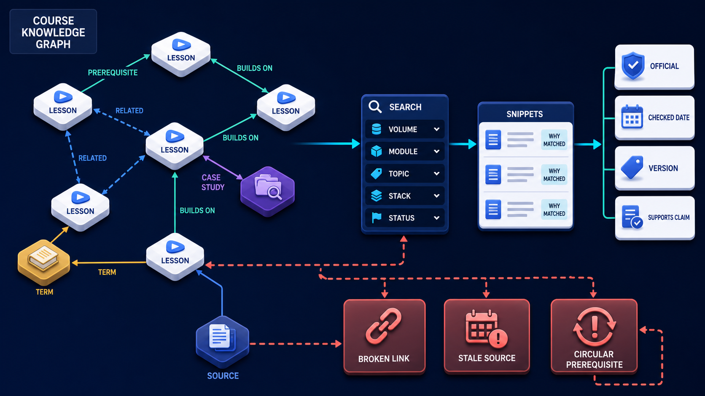

# Diagram 215 — Glossary, citations, search, prerequisites, and cross-links

**Module:** The future visual-learning website
**Role in the course:** Turn many visual lessons into a navigable body of knowledge rather than a long folder of isolated pages.
**Layout:** The diagram shows COURSE KNOWLEDGE GRAPH with LESSON nodes linked by PREREQUISITE, RELATED, BUILDS ON, CASE STUDY, TERM, SOURCE, with a coral risk path.

---

## At a glance

**Turn many visual lessons into a navigable body of knowledge rather than a long folder of isolated pages.**

- The diagram centers on **COURSE KNOWLEDGE GRAPH** and its relationship to **BROKEN LINK STALE SOURCE CIRCULAR PREREQUISITE**.

- The diagram separates the tested, legitimate flow from failure paths that must fail closed.

- Maya's case: Maya searches 'how do I stop an agent after it already sent money' without knowing the words compensation or point of no return.

---

## What the diagram teaches

### 1. Course Becomes Easier To Learn When Relationships Are Explicit

A course becomes easier to learn when relationships are explicit. The diagram makes this concrete through **COURSE KNOWLEDGE GRAPH**. If the team skips this, opaque semantic search can return an advanced or stale lesson with no explanation, while a flat keyword search can miss the learner's everyday language entirely. This is the lesson the case study ends with: Model the knowledge relationships, explain search matches, expose source status, and guide beginners through prerequisites deliberately.

### 2. These Labels Should Not Be Collapsed Into One Vague More

These labels should not be collapsed into one vague More like this list. Inline definitions help beginners without forcing constant page changes. This is visible in the drawing as **COURSE KNOWLEDGE GRAPH**, **LESSON**, **PREREQUISITE**. Without this step, opaque semantic search can return an advanced or stale lesson with no explanation, while a flat keyword search can miss the learner's everyday language entirely. In the walkthrough, Semantic and lexical retrieval find the cancellation and compensation lesson using the plain-language explanation and glossary aliases..

### 3. Stable Records For Lessons, Terms, Sources, Topics, Technologies, And Relation

This step asks the team to create stable records for lessons, terms, sources, topics, technologies, and relation types. The diagram shows this through **LESSON**, **TERM**, **SOURCE**, which make the abstract step visible and testable. The glossary gives each term one stable identity, plain definition, aliases, first-use link, lessons that use it, and version notes where protocols disagree. Citations should connect a lesson claim to an authoritative source label, direct URL, checked date, relevant specification version, and status such as stable, candidate, or project-specific. If the team skips this, opaque semantic search can return an advanced or stale lesson with no explanation, while a flat keyword search can miss the learner's everyday language entirely. Maya's case makes this concrete: Maya searches 'how do I stop an agent after it already sent money' without knowing the words compensation or point of no return.

### 4. Validate The Prerequisite Graph As A Directed Acyclic Learning Path

Here the product must validate the prerequisite graph as a directed acyclic learning path while allowing ordinary related links in both directions. In the drawing, **PREREQUISITE**, **RELATED**, **COURSE KNOWLEDGE GRAPH** carry this responsibility. Prerequisite means knowledge required first; related means useful nearby material; builds on means a stronger conceptual dependency. Without this step, opaque semantic search can return an advanced or stale lesson with no explanation, while a flat keyword search can miss the learner's everyday language entirely. The result — Maya learns the right vocabulary and sequence even though she did not know the protocol or product-design term beforehand. — depends on getting this right.

### 5. Lexical And Optional Semantic Indexes From Approved Public Lesson Fields

The diagram enforces this by showing the team how to build lexical and optional semantic indexes from approved public lesson fields, never from hidden author notes or private learner data. The visual anchors are **LESSON**; without them the step would be invisible to the user. A source register is not enough if readers cannot tell which lesson used it. Search needs lexical matching for exact terms and may add semantic retrieval for plain-language questions. The case study shows the risk: opaque semantic search can return an advanced or stale lesson with no explanation, while a flat keyword search can miss the learner's everyday language entirely. This is the lesson the case study ends with: Model the knowledge relationships, explain search matches, expose source status, and guide beginners through prerequisites deliberately.

### 6. Rank And Explain Results With Outcome, Matching Passage, Filters, Status

This is the discipline that makes the product rank and explain results with outcome, matching passage, filters, status, freshness, and prerequisite context. This idea sits on **PREREQUISITE** and reaches the rest of the diagram through **PREREQUISITE**, **FILTER VOLUME MODULE TOPIC STACK STATUS**, **BROKEN LINK STALE SOURCE CIRCULAR PREREQUISITE**. Results should show why they matched, the lesson outcome, volume and module, standards status, and prerequisite warnings. Filters support different journeys: topic, protocol, technology stack, difficulty, artifact type, volume, module, status, lab, and case study. Missing this is how products end up with opaque semantic search can return an advanced or stale lesson with no explanation, while a flat keyword search can miss the learner's everyday language entirely. In the walkthrough, Semantic and lexical retrieval find the cancellation and compensation lesson using the plain-language explanation and glossary aliases..

### 7. Schedule Link, Version, Freshness, Orphan, Duplicate, And Graph-integrity Checks

The team must schedule link, version, freshness, orphan, duplicate, and graph-integrity checks and route failures to an editorial queue before the interface can be trustworthy. The diagram shows this through **VERSION**, **COURSE KNOWLEDGE GRAPH**, **BROKEN LINK STALE SOURCE CIRCULAR PREREQUISITE**, which make the abstract step visible and testable. A system that ignores this will eventually face opaque semantic search can return an advanced or stale lesson with no explanation, while a flat keyword search can miss the learner's everyday language entirely. The danger the case warns about, Maya searches 'how do I stop an agent after it already sent money' without knowing the words compensation or point of no return. should make this clear.

### 8. The standard in practice

The lesson is not a perfect prototype; it is a product contract. Turn many visual lessons into a navigable body of knowledge rather than a long folder of isolated pages.. The diagram makes that contract visible through **COURSE KNOWLEDGE GRAPH**, **LESSON**, **PREREQUISITE**, so the team can argue about the contract before choosing a framework. The contract is not framework-specific; it is the set of observable promises the product makes to the person using it. Maya's case warns that opaque semantic search can return an advanced or stale lesson with no explanation, while a flat keyword search can miss the learner's everyday language entirely. The practical standard is this: Model the knowledge relationships, explain search matches, expose source status, and guide beginners through prerequisites deliberately.

### 9. The Next.js and Python surfaces

The same contract appears in both stacks, but the boundary moves with the architecture.
**In Next.js / React:**
- Generate term, source, and topic indexes at build time; provide URL-addressable filters and server-rendered result summaries that work without client JavaScript.
- Use a search endpoint that returns result ID, outcome, safe snippet, match reason, status, prerequisites, and source freshness rather than raw internal vectors or scores alone.
- Render source links with direct destinations, checked dates, versions, and external-link cues; keep cross-links typed and accessible instead of relying on color or hover.
- Keep the most sensitive payloads and policy decisions on the server and stream only user-visible, safe view models to client components.
**In Python / FastAPI:**
- Build normalized search documents from the validated course model, with separate fields and weights for title, outcome, glossary, explanation, technologies, and sources.
- Validate graph cycles, orphan nodes, duplicate slugs, missing reverse relations where required, URL health, source review dates, and unsupported source labels in CI.
- If embeddings are used, version the model and index, retain lexical fallback, test known beginner queries, and expose an understandable match explanation.
- Treat every framework callback or protocol event as raw input; validate and transform it into the product's own event vocabulary before it reaches the reducer or domain model.
Both implementations must avoid the same trap: opaque semantic search can return an advanced or stale lesson with no explanation, while a flat keyword search can miss the learner's everyday language entirely.

### 10. Analogy

A library needs more than shelves. The catalog, subject headings, cross-references, edition records, and a librarian's explanation help a beginner find the right book in the right order. The analogy keeps the lesson grounded. The diagram's **COURSE KNOWLEDGE GRAPH** plays the same role as the central object in the analogy: it must be visible, labeled, and trustworthy without the user having to infer meaning from a long narrative. The parallel works because both situations require separating the object from the record, the attempt from the proof, and the promise from the evidence.

Diagram 216 — *Progress, checkpoints, quizzes, accessibility, and offline use* is the next lens on this idea. The same concepts reappear there with different emphasis, so the two diagrams should be read as a pair.

---

## Case study — Maya

Maya searches 'how do I stop an agent after it already sent money' without knowing the words compensation or point of no return.

### The walkthrough

1. Semantic and lexical retrieval find the cancellation and compensation lesson using the plain-language explanation and glossary aliases.
2. The result says why it matched and distinguishes cancel, undo, and compensate before Maya opens it.
3. The page recommends the approval and authoritative-state prerequisites and links directly to the RFC and risk sources used.
4. Maya follows a typed Builds on path to the product-operations capstone without losing her original search filters.

### The result

Maya learns the right vocabulary and sequence even though she did not know the protocol or product-design term beforehand.

### The danger

Opaque semantic search can return an advanced or stale lesson with no explanation, while a flat keyword search can miss the learner's everyday language entirely.

### The takeaway

Model the knowledge relationships, explain search matches, expose source status, and guide beginners through prerequisites deliberately.

---

## Composition

The picture is a single-view explainer for *Glossary, citations, search, prerequisites, and cross-links*. On the left, the diagram shows COURSE KNOWLEDGE GRAPH with LESSON nodes linked by PREREQUISITE, RELATED, BUILDS ON, CASE STUDY, TERM, SOURCE. At the top, sEARCH box applies QUERY, FILTER VOLUME MODULE TOPIC STACK STATUS, returns SNIPPETS with WHY MATCHED. In the center, sOURCE cards show OFFICIAL, CHECKED DATE, VERSION, SUPPORTS CLAIM. To the right, coral BROKEN LINK STALE SOURCE CIRCULAR PREREQUISITE. The eye travels from **COURSE KNOWLEDGE GRAPH** through the central flow to **BROKEN LINK STALE SOURCE CIRCULAR PREREQUISITE**, with the contrast between coral risk paths and teal recovery paths giving the reader the core message at a glance.

## Element by element

- **COURSE KNOWLEDGE GRAPH** — the web of lessons, terms, sources, and relationships that supports navigation.
- **LESSON** — one visual teaching unit with outcome, diagram, trace, case study, and glossary.
- **PREREQUISITE** — a relationship that says one lesson should be understood before another.
- **RELATED** — one of the items named by **COURSE KNOWLEDGE GRAPH**; this is the **RELATED** item.
- **CASE STUDY** — one of the items named by **COURSE KNOWLEDGE GRAPH**; this is the **CASE STUDY** item.
- **TERM** — one of the items named by **COURSE KNOWLEDGE GRAPH**; this is the **TERM** item.
- **SOURCE** — an authoritative reference with label, URL, checked date, and version.
- **SEARCH** — the indexed view that lets learners find lessons, terms, and sources.
- **QUERY** — one of the items named by **SEARCH**; this is the **QUERY** item.
- **FILTER VOLUME MODULE TOPIC STACK STATUS** — one of the items named by **SEARCH**; this is the **FILTER VOLUME MODULE TOPIC STACK STATUS** item.
- **SNIPPETS** — one of the items named by **SEARCH**; this is the **SNIPPETS** item.
- **WHY MATCHED** — one of the items named by **SEARCH**; this is the **WHY MATCHED** item.
- **OFFICIAL** — one of the cards named by **SOURCE**; this is the **OFFICIAL** card.
- **CHECKED DATE** — one of the cards named by **SOURCE**; this is the **CHECKED DATE** card.
- **VERSION** — one of the cards named by **SOURCE**; this is the **VERSION** card.
- **SUPPORTS CLAIM** — one of the cards named by **SOURCE**; this is the **SUPPORTS CLAIM** card.
- **BROKEN LINK STALE SOURCE CIRCULAR PREREQUISITE** — the broken link stale source circular prerequisite ..

---

## Colour and flow semantics

The course visual grammar applies directly to this diagram.

- **Cobalt platform** — A browser surface, state store, component catalog, product boundary, workspace, or learning-platform region. Here the cobalt surface under **COURSE KNOWLEDGE GRAPH** and the surrounding workspace frames the product boundary; it tells the reader that this is a bounded product region, not an uncontrolled chat surface. It marks the product's responsibility to keep the user's workspace distinct from raw model output or runtime internals.

- **Cyan arrow** — A typed event, validated state update, user action, artifact reference, notification, or navigation path. Cyan arrows carry the flow of events, updates, and proposals from left to right, linking the typed cards and records to the reducer or next gate. When the reader sees cyan, they should expect a deliberate, validated transition rather than an accidental or hidden connection.

- **Teal arrow** — Authoritative state, accessible completion, informed consent, safe approval, preserved work, or verified recovery. Teal marks the authoritative and safe path, such as the committed receipt or restored state, distinguishing it from the raw request. This color tells the reader that the product has enough evidence and authority to proceed safely.

- **Coral path** — Conflict, stale UI, unsafe rendering, deceptive state, expired approval, privacy failure, lost work, or blocked action. Coral marks the conflict, stale state, or blocked action that appears when a control is missing or bypassed. It signals that the product should pause, surface the conflict, and offer a recovery path rather than proceed silently.

- **White card** — An event, component, stage, proposal, artifact, receipt, consent record, lesson, checkpoint, or recovery option. The labeled cards and records throughout the diagram are white, marking them as structured events, proposals, receipts, or recovery options. The white background separates user-meaningful records from raw system logs or generated text.

The overall flow moves from the initiating actor or request, through validation and reduction, toward either the teal recovery or completion path or the coral failure path. The color of each arrow and card is a trust cue, not a decoration.

---

## How to present it

- **Start with the user moment.** Maya searches 'how do I stop an agent after it already sent money' without knowing the words compensation or point of no return. Ask the room what they need to see to feel in control. Invite someone to describe the moment before any solution appears.

- **Point at COURSE KNOWLEDGE GRAPH and ask what it represents.** Then trace the flow from there through the next two or three elements, naming the color and direction of each arrow. Encourage them to name the incoming trigger, the visible state, and the decision the product must make.

- **Point at LESSON for step 1.** Stable Records For Lessons, Terms, Sources, Topics, Technologies, And Relation. Ask what observable evidence the product would produce if this step worked correctly. Have the room identify the color of the path leaving this element and what it tells a user about trust.

- **Point at PREREQUISITE for step 2.** Validate The Prerequisite Graph As A Directed Acyclic Learning Path. Ask what observable evidence the product would produce if this step worked correctly. Have the room identify the color of the path leaving this element and what it tells a user about trust.

- **Point at LESSON for step 3.** Lexical And Optional Semantic Indexes From Approved Public Lesson Fields. Ask what observable evidence the product would produce if this step worked correctly. Have the room identify the color of the path leaving this element and what it tells a user about trust.

- **Point at PREREQUISITE for step 4.** Rank And Explain Results With Outcome, Matching Passage, Filters, Status. Ask what observable evidence the product would produce if this step worked correctly. Have the room identify the color of the path leaving this element and what it tells a user about trust.

- **Point at VERSION for step 5.** Schedule Link, Version, Freshness, Orphan, Duplicate, And Graph-integrity Checks. Ask what observable evidence the product would produce if this step worked correctly. Have the room identify the color of the path leaving this element and what it tells a user about trust.

- **Use the analogy.** A library needs more than shelves. The catalog, subject headings, cross-references, edition records, and a librarian's explanation help a beginner find the right book in the right order. Draw the parallel to the diagram and ask what would break if the two situations were handled the same way.

- **Tell the case study.** Maya searches 'how do I stop an agent after it already sent money' without knowing the words compensation or point of no return Walk through the walkthrough and stop at the moment the old design would have failed. Pause at the step where the old design would have failed and ask how the new interface prevents it.

- **Run the lab.** Create a graph for Volumes 8 and 9 with all lessons, terms, sources, and at least four relation types. Write twenty beginner queries and expected results, including synonyms and misconceptions. Add tests for cycles, orphans, broken sources, stale versions, unsafe snippets, empty results, and privacy-safe query logging. Ask pairs to present one part of the diagram and explain how the other parts reference it without merging their identities.

- **Pose the checkpoint.** Are Related and Prerequisite interchangeable relationships? Let the room answer before confirming the principle. Collect answers, then confirm the principle and note any exceptions the team should watch for.

- **Close on the contract.** Model the knowledge relationships, explain search matches, expose source status, and guide beginners through prerequisites deliberately. Ask the team what their own product's equivalent of the contract would be.

---

## Lab and checkpoint

**Lab:** Create a graph for Volumes 8 and 9 with all lessons, terms, sources, and at least four relation types. Write twenty beginner queries and expected results, including synonyms and misconceptions. Add tests for cycles, orphans, broken sources, stale versions, unsafe snippets, empty results, and privacy-safe query logging.

**Checkpoint:** Are Related and Prerequisite interchangeable relationships?

**Answer:** No. A prerequisite says the learner should understand something first; related material is useful but not required. The interface and graph validation should preserve that difference.

---

## Glossary

- **Knowledge graph** — typed entities and relationships supporting navigation
- **Lexical search** — matching words and phrases
- **Semantic search** — matching meaning using a representation such as embeddings

---

## Sources

- [Next.js App Router](https://nextjs.org/docs/app)
- [JSON Schema 2020-12](https://json-schema.org/draft/2020-12)
- [NIST AI Risk Management Framework](https://www.nist.gov/itl/ai-risk-management-framework)

## Related lessons

- Diagram 213 — A reusable visual lesson content model
- Diagram 216 — Progress, checkpoints, quizzes, accessibility, and offline use
- Diagram 219 — Product analytics, feedback, evaluation, and experiment ethics

---