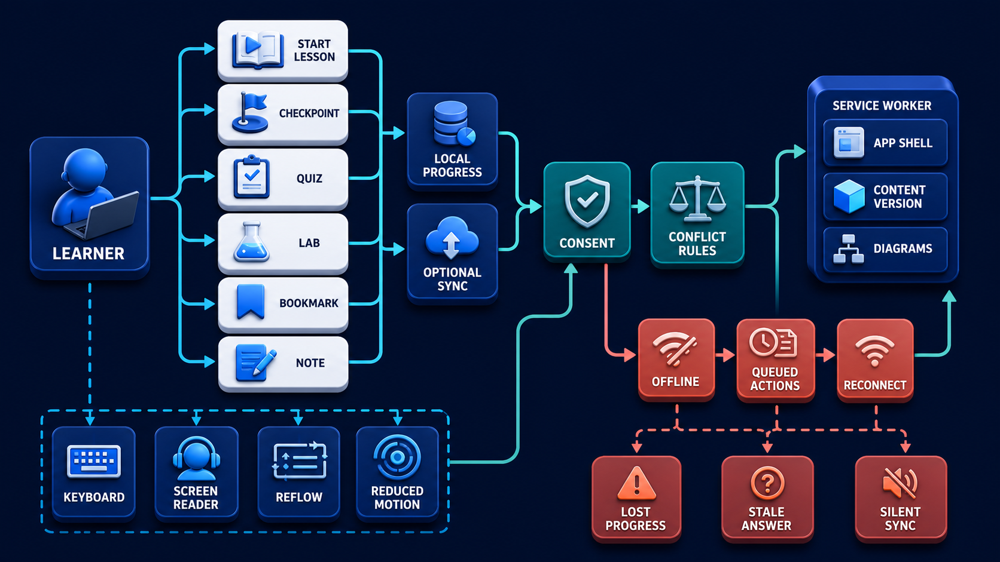
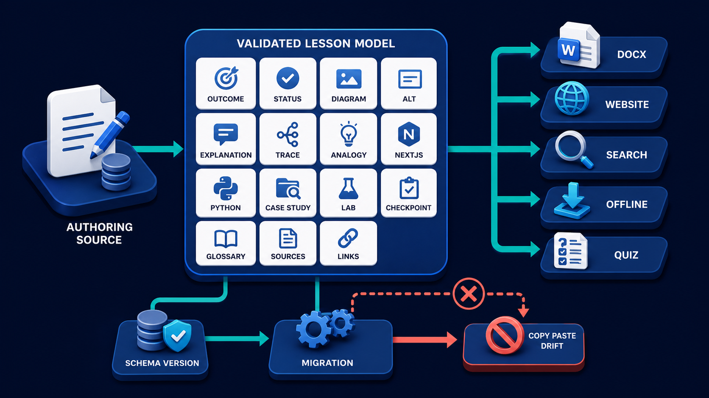

# Diagram 216 — Progress, checkpoints, quizzes, accessibility, and offline use

**Module:** The future visual-learning website
**Role in the course:** Design a learning experience that preserves progress, supports practice, remains accessible, and behaves honestly offline.
**Layout:** The diagram shows LEARNER choosing START LESSON, CHECKPOINT, QUIZ, LAB, BOOKMARK, NOTE, with a coral risk path.

---

## At a glance

**Design a learning experience that preserves progress, supports practice, remains accessible, and behaves honestly offline.**

- The diagram centers on **LEARNER** and its relationship to **LOST PROGRESS STALE ANSWER SILENT SYNC**.

- The diagram separates the tested, legitimate flow from failure paths that must fail closed.

- Maya's case: Maya downloads Volume 9 before a flight, completes two lessons offline, changes a note on two devices, and reconnects later.

---

## What the diagram teaches

### 1. Checkpoints Give Immediate Retrieval Practice; Quizzes Measure A Broader Set

Checkpoints give immediate retrieval practice; quizzes measure a broader set of outcomes; labs produce evidence of application. The diagram makes this concrete through **CHECKPOINT**, **QUIZ**, **LAB**. If the team skips this, a decorative offline icon can hide stale content, broken source links, lost answers, duplicate submissions, silent account sync, and inaccessible conflict dialogs. This is the lesson the case study ends with: Offline is a complete state model: version what is cached, preserve learner work, reconcile explicitly, and keep consent and accessibility intact.

### 2. Explanations Should Teach After An Answer And Allow Retry Without

Explanations should teach after an answer and allow retry without shame, tricks, or dark-pattern streak pressure. Queued writes need idempotency and conflict rules. This is visible in the drawing as **LOST PROGRESS STALE ANSWER SILENT SYNC**. Without this step, a decorative offline icon can hide stale content, broken source links, lost answers, duplicate submissions, silent account sync, and inaccessible conflict dialogs. In the walkthrough, The offline banner names the installed content version and explains that external standards links cannot be checked until reconnect..

### 3. Learner-owned Progress Model Using Stable Lesson, Activity, Question, And Content-version

This step asks the team to define a learner-owned progress model using stable lesson, activity, question, and content-version IDs. The diagram shows this through **LEARNER**, **APP SHELL CONTENT VERSION DIAGRAMS**, **START LESSON**, which make the abstract step visible and testable. Progress should represent meaningful learner actions, not time on page. Distinguish opened, viewed, checkpoint attempted, checkpoint understood, lab attempted, quiz completed, and learner-marked complete rather than manufacturing one percentage. If the team skips this, a decorative offline icon can hide stale content, broken source links, lost answers, duplicate submissions, silent account sync, and inaccessible conflict dialogs. Maya's case makes this concrete: Maya downloads Volume 9 before a flight, completes two lessons offline, changes a note on two devices, and reconnects later.

### 4. Store Essential Local Progress In IndexedDB Or An Appropriate Local

Here the product must store essential local progress in IndexedDB or an appropriate local store and make account sync optional and consented. In the drawing, **LOCAL PROGRESS**, **CONSENT**, **OPTIONAL SYNC** carry this responsibility. Progress can begin locally with no account. If cloud sync is offered, explain the benefit, data fields, retention, devices, conflict policy, and deletion. Without this step, a decorative offline icon can hide stale content, broken source links, lost answers, duplicate submissions, silent account sync, and inaccessible conflict dialogs. The result — Maya learns continuously without losing work or unknowingly sending data, even when connectivity and devices change. — depends on getting this right.

### 5. Precache A Bounded Versioned Offline Pack, Report Storage And Freshness

The diagram enforces this by showing the team how to precache a bounded versioned offline pack, report storage and freshness, and remove obsolete caches safely after activation. The visual anchors are **OFFLINE**; without them the step would be invisible to the user. The product must label what is available offline and which links, dynamic searches, or source checks require a connection. The case study shows the risk: a decorative offline icon can hide stale content, broken source links, lost answers, duplicate submissions, silent account sync, and inaccessible conflict dialogs. This is the lesson the case study ends with: Offline is a complete state model: version what is cached, preserve learner work, reconcile explicitly, and keep consent and accessibility intact.

Diagram 213 — *A reusable visual lesson content model* is the next lens on this idea. The same concepts reappear there with different emphasis, so the two diagrams should be read as a pair.

### 6. Queue Idempotent Offline Changes With Timestamps And Base Versions

This is the discipline that makes the product queue idempotent offline changes with timestamps and base versions, then reconcile explicitly after reconnect. This idea sits on **OFFLINE** and reaches the rest of the diagram through **OFFLINE**, **RECONNECT**. Missing this is how products end up with a decorative offline icon can hide stale content, broken source links, lost answers, duplicate submissions, silent account sync, and inaccessible conflict dialogs. In the walkthrough, The offline banner names the installed content version and explains that external standards links cannot be checked until reconnect..

### 7. Learning, Assessment, Conflicts, Deletion, Export, And Recovery Across Keyboard, Screen

The team must test learning, assessment, conflicts, deletion, export, and recovery across keyboard, screen readers, zoom, reduced motion, offline, and constrained storage before the interface can be trustworthy. The diagram shows this through **OFFLINE**, **KEYBOARD SCREEN READER REFLOW REDUCED MOTION**, which make the abstract step visible and testable. Accessibility covers the entire practice loop: answer controls, validation messages, explanations, score summaries, progress visuals, timers, drag alternatives, offline banners, synchronization conflicts, and saved-state announcements. A system that ignores this will eventually face a decorative offline icon can hide stale content, broken source links, lost answers, duplicate submissions, silent account sync, and inaccessible conflict dialogs. The danger the case warns about, Maya downloads Volume 9 before a flight, completes two lessons offline, changes a note on two devices, and reconnects later. should make this clear.

### 8. The standard in practice

The lesson is not a perfect prototype; it is a product contract. Design a learning experience that preserves progress, supports practice, remains accessible, and behaves honestly offline.. The diagram makes that contract visible through **LEARNER**, **START LESSON**, **CHECKPOINT**, so the team can argue about the contract before choosing a framework. The contract is not framework-specific; it is the set of observable promises the product makes to the person using it. Maya's case warns that a decorative offline icon can hide stale content, broken source links, lost answers, duplicate submissions, silent account sync, and inaccessible conflict dialogs. The practical standard is this: Offline is a complete state model: version what is cached, preserve learner work, reconcile explicitly, and keep consent and accessibility intact.

### 9. The Next.js and Python surfaces

The same contract appears in both stacks, but the boundary moves with the architecture.
**In Next.js / React:**
- Render lesson and checkpoint fundamentals on the server, then progressively enhance local progress, notes, offline installation, and synchronization in isolated client components.
- Use a versioned service worker strategy that precaches the shell and selected course packs, verifies content hashes, and shows explicit offline and update-ready states.
- Key local records by stable content and activity versions; merge only safe fields automatically and surface note or answer conflicts with understandable choices.
- Keep the most sensitive payloads and policy decisions on the server and stream only user-visible, safe view models to client components.
**In Python / FastAPI:**
- Expose sync endpoints accepting idempotency keys, device record versions, content versions, and bounded mutations; return per-record accepted, conflict, or invalid results.
- Keep progress, quiz attempts, notes, consent, and analytics in separable data domains with export and deletion workflows that can be verified.
- Generate signed course manifests listing offline assets and hashes, and test installation, partial download, quota failure, stale packs, upgrade, rollback, and cache cleanup.
- Treat every framework callback or protocol event as raw input; validate and transform it into the product's own event vocabulary before it reaches the reducer or domain model.
Both implementations must avoid the same trap: a decorative offline icon can hide stale content, broken source links, lost answers, duplicate submissions, silent account sync, and inaccessible conflict dialogs.

### 10. Analogy

A paper workbook works anywhere, shows your pencil marks, and does not erase answers when the library closes. A digital course should preserve that confidence while adding optional synchronization and feedback. The analogy keeps the lesson grounded. The diagram's **LEARNER** plays the same role as the central object in the analogy: it must be visible, labeled, and trustworthy without the user having to infer meaning from a long narrative. The parallel works because both situations require separating the object from the record, the attempt from the proof, and the promise from the evidence.

---

## Case study — Maya

Maya downloads Volume 9 before a flight, completes two lessons offline, changes a note on two devices, and reconnects later.

### The walkthrough

1. The offline banner names the installed content version and explains that external standards links cannot be checked until reconnect.
2. Checkpoints, diagrams, glossary, and saved progress work without a network, while actions awaiting sync are visibly queued.
3. The server accepts idempotent lesson progress and presents both note versions instead of silently choosing the latest timestamp.
4. Maya merges the note, sees a sync receipt, and can export or delete all learner data from one privacy control.

### The result

Maya learns continuously without losing work or unknowingly sending data, even when connectivity and devices change.

### The danger

A decorative offline icon can hide stale content, broken source links, lost answers, duplicate submissions, silent account sync, and inaccessible conflict dialogs.

### The takeaway

Offline is a complete state model: version what is cached, preserve learner work, reconcile explicitly, and keep consent and accessibility intact.

---

## Composition

The picture is a single-view explainer for *Progress, checkpoints, quizzes, accessibility, and offline use*. On the left, the diagram shows LEARNER choosing START LESSON, CHECKPOINT, QUIZ, LAB, BOOKMARK, NOTE. At the top, lOCAL PROGRESS and OPTIONAL SYNC merge through CONSENT and CONFLICT RULES. In the center, sERVICE WORKER caches APP SHELL CONTENT VERSION DIAGRAMS. To the right, oFFLINE badge leads to QUEUED ACTIONS then RECONNECT. Across the middle, accessibility gates KEYBOARD SCREEN READER REFLOW REDUCED MOTION. The eye travels from **LEARNER** through the central flow to **LOST PROGRESS STALE ANSWER SILENT SYNC**, with the contrast between coral risk paths and teal recovery paths giving the reader the core message at a glance.

## Element by element

- **LEARNER** — the person using the visual course to understand agentic product design.
- **START LESSON** — one of the items named by **LEARNER**; this is the **START LESSON** item.
- **CHECKPOINT** — one of the items named by **LEARNER**; this is the **CHECKPOINT** item.
- **QUIZ** — the practice and assessment projection generated from the lesson model.
- **LAB** — one of the items named by **LEARNER**; this is the **LAB** item.
- **BOOKMARK** — one of the items named by **LEARNER**; this is the **BOOKMARK** item.
- **NOTE** — one of the items named by **LEARNER**; this is the **NOTE** item.
- **LOCAL PROGRESS** — the learner-owned record of completed activities, kept on the device first.
- **OPTIONAL SYNC** — the consented upload of learner data to another device or account.
- **CONSENT** — the informed, specific, and revocable user choice before data or authority is granted.
- **CONFLICT RULES** — one of the items named by **LOCAL PROGRESS**; this is the **CONFLICT RULES** item.
- **SERVICE WORKER** — the script that caches the app shell and versioned course packs for offline use.
- **APP SHELL CONTENT VERSION DIAGRAMS** — the app shell content version diagrams SERVICE WORKER caches APP SHELL CONTENT VERSION DIAGRAMS.
- **OFFLINE** — the cached pack that lets learners continue without a network connection.
- **QUEUED ACTIONS** — the offline writes that wait for reconnection and reconciliation.
- **RECONNECT** — the process of restoring the online state after an offline period.
- **KEYBOARD SCREEN READER REFLOW REDUCED MOTION** — the keyboard screen reader reflow reduced motion Accessibility gates KEYBOARD SCREEN READER REFLOW REDUCED MOTION..
- **LOST PROGRESS STALE ANSWER SILENT SYNC** — the lost progress stale answer silent sync ..

---

## Colour and flow semantics

The course visual grammar applies directly to this diagram.

- **Cobalt platform** — A browser surface, state store, component catalog, product boundary, workspace, or learning-platform region. Here the cobalt surface under **LEARNER** and the surrounding workspace frames the product boundary; it tells the reader that this is a bounded product region, not an uncontrolled chat surface. It marks the product's responsibility to keep the user's workspace distinct from raw model output or runtime internals.

- **Cyan arrow** — A typed event, validated state update, user action, artifact reference, notification, or navigation path. Cyan arrows carry the flow of events, updates, and proposals from left to right, linking the typed cards and records to the reducer or next gate. When the reader sees cyan, they should expect a deliberate, validated transition rather than an accidental or hidden connection.

- **Teal arrow** — Authoritative state, accessible completion, informed consent, safe approval, preserved work, or verified recovery. Teal marks the authoritative and safe path, such as the committed receipt or restored state, distinguishing it from the raw request. This color tells the reader that the product has enough evidence and authority to proceed safely.

- **Coral path** — Conflict, stale UI, unsafe rendering, deceptive state, expired approval, privacy failure, lost work, or blocked action. Coral marks the conflict, stale state, or blocked action that appears when a control is missing or bypassed. It signals that the product should pause, surface the conflict, and offer a recovery path rather than proceed silently.

- **White card** — An event, component, stage, proposal, artifact, receipt, consent record, lesson, checkpoint, or recovery option. The labeled cards and records throughout the diagram are white, marking them as structured events, proposals, receipts, or recovery options. The white background separates user-meaningful records from raw system logs or generated text.

The overall flow moves from the initiating actor or request, through validation and reduction, toward either the teal recovery or completion path or the coral failure path. The color of each arrow and card is a trust cue, not a decoration.

---

## How to present it

- **Start with the user moment.** Maya downloads Volume 9 before a flight, completes two lessons offline, changes a note on two devices, and reconnects later. Ask the room what they need to see to feel in control. Invite someone to describe the moment before any solution appears.

- **Point at LEARNER and ask what it represents.** Then trace the flow from there through the next two or three elements, naming the color and direction of each arrow. Encourage them to name the incoming trigger, the visible state, and the decision the product must make.

- **Point at LEARNER for step 1.** Learner-owned Progress Model Using Stable Lesson, Activity, Question, And Content-version. Ask what observable evidence the product would produce if this step worked correctly. Have the room identify the color of the path leaving this element and what it tells a user about trust.

- **Point at LOCAL PROGRESS for step 2.** Store Essential Local Progress In IndexedDB Or An Appropriate Local. Ask what observable evidence the product would produce if this step worked correctly. Have the room identify the color of the path leaving this element and what it tells a user about trust.

- **Point at OFFLINE for step 3.** Precache A Bounded Versioned Offline Pack, Report Storage And Freshness. Ask what observable evidence the product would produce if this step worked correctly. Have the room identify the color of the path leaving this element and what it tells a user about trust.

- **Point at OFFLINE for step 4.** Queue Idempotent Offline Changes With Timestamps And Base Versions. Ask what observable evidence the product would produce if this step worked correctly. Have the room identify the color of the path leaving this element and what it tells a user about trust.

- **Point at OFFLINE for step 5.** Learning, Assessment, Conflicts, Deletion, Export, And Recovery Across Keyboard, Screen. Ask what observable evidence the product would produce if this step worked correctly. Have the room identify the color of the path leaving this element and what it tells a user about trust.

- **Use the analogy.** A paper workbook works anywhere, shows your pencil marks, and does not erase answers when the library closes. A digital course should preserve that confidence while adding optional synchronization and feedback. Draw the parallel to the diagram and ask what would break if the two situations were handled the same way.

- **Tell the case study.** Maya downloads Volume 9 before a flight, completes two lessons offline, changes a note on two devices, and reconnects later Walk through the walkthrough and stop at the moment the old design would have failed. Pause at the step where the old design would have failed and ask how the new interface prevents it.

- **Run the lab.** Design an offline pack and synchronization protocol for four lessons. Include asset manifest, content versions, quota failure, cache update, local progress, notes, quiz attempts, idempotency, two-device conflicts, optional account sync, export, deletion, accessibility, and twenty reconnect tests. Ask pairs to present one part of the diagram and explain how the other parts reference it without merging their identities.

- **Pose the checkpoint.** May the course silently upload locally stored notes when a learner later creates an account? Let the room answer before confirming the principle. Collect answers, then confirm the principle and note any exceptions the team should watch for.

- **Close on the contract.** Offline is a complete state model: version what is cached, preserve learner work, reconcile explicitly, and keep consent and accessibility intact. Ask the team what their own product's equivalent of the contract would be.

---

## Lab and checkpoint

**Lab:** Design an offline pack and synchronization protocol for four lessons. Include asset manifest, content versions, quota failure, cache update, local progress, notes, quiz attempts, idempotency, two-device conflicts, optional account sync, export, deletion, accessibility, and twenty reconnect tests.

**Checkpoint:** May the course silently upload locally stored notes when a learner later creates an account?

**Answer:** No. Explain what will sync, obtain an informed choice, minimize the data, provide a local-only option, and make export, revocation, and deletion available.

---

## Glossary

- **Offline pack** — versioned set of application and course assets available without a network
- **Idempotency key** — identifier making a repeated mutation safe to recognize
- **Progress evidence** — specific learning action rather than an invented engagement percentage

---

## Sources

- [Service Workers](https://www.w3.org/TR/service-workers/)
- [Indexed Database API 3.0](https://www.w3.org/TR/IndexedDB-3/)
- [Web App Manifest](https://www.w3.org/TR/appmanifest/)
- [WCAG 2.2](https://www.w3.org/TR/WCAG22/)

## Related lessons

- Diagram 208 — Accessibility, plain language, uncertainty, and trust cues
- Diagram 213 — A reusable visual lesson content model
- Diagram 218 — Privacy controls, consent, memory settings, and deletion

---