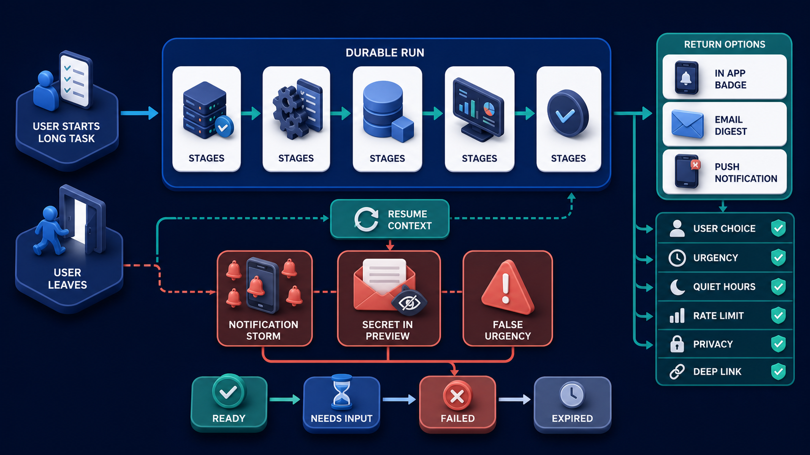
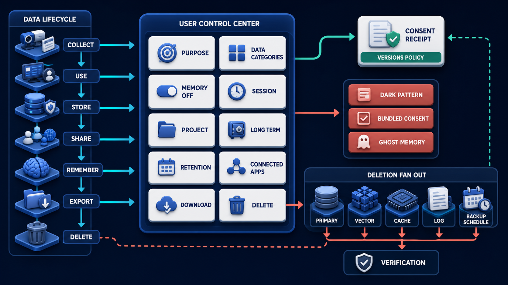

# Diagram 217 — Asynchronous return, notifications, and attention management

**Module:** Agentic product operations
**Role in the course:** Let long-running agent work release the user's attention and call it back only when the timing and reason are genuinely useful.
**Layout:** The diagram shows USER STARTS LONG TASK then LEAVES, with a coral risk path, and a teal safe path.

---

## At a glance

**Let long-running agent work release the user's attention and call it back only when the timing and reason are genuinely useful.**

- The diagram centers on **USER STARTS LONG TASK** and its relationship to **RESUME CONTEXT**.

- The diagram separates the tested, legitimate flow from failure paths that must fail closed.

- Maya's case: Maya starts a forty-minute policy comparison, closes her laptop, and asks to be notified only if a decision is needed or the report is ready.

---

## What the diagram teaches

### 1. Product Stores A Durable Run, Explains What Can Continue

The product stores a durable run, explains what can continue, and lets her leave while preserving a clear way to return. The diagram makes this concrete through **DURABLE RUN**, **RETURN OPTIONS IN APP BADGE**. If the team skips this, notification storms, false urgency, sensitive lock-screen previews, and stale deep links can turn a helpful asynchronous agent into a distracting or privacy-invasive product. This is the lesson the case study ends with: Durable work earns the right to wait; explicit attention policy earns the right to interrupt.

### 2. Notifications Are An Attention Budget, Not Proof That The System

Notifications are an attention budget, not proof that the system is alive. Token updates and every tool call do not deserve interruption. This is visible in the drawing as **USER STARTS LONG TASK**, **DURABLE RUN**, **STAGES**. Without this step, notification storms, false urgency, sensitive lock-screen previews, and stale deep links can turn a helpful asynchronous agent into a distracting or privacy-invasive product. In the walkthrough, Acme persists the run and confirms that research can continue while Maya is away..

### 3. Classify Task Transitions As Silent, Inbox, Digest, Interruptive, Or Prohibited

This step asks the team to classify task transitions as silent, inbox, digest, interruptive, or prohibited using user value and risk. The diagram shows this through **USER STARTS LONG TASK**, **EMAIL DIGEST**, **USER CHOICE**, which make the abstract step visible and testable. A long task should not hold Maya hostage to an open tab. Channel choice belongs to the user. If the team skips this, notification storms, false urgency, sensitive lock-screen previews, and stale deep links can turn a helpful asynchronous agent into a distracting or privacy-invasive product. Maya's case makes this concrete: Maya starts a forty-minute policy comparison, closes her laptop, and asks to be notified only if a decision is needed or the report is ready.

### 4. Channel Consent, Capability, Quiet Hours, Rate Limits, Deduplication, Locale

Here the product must apply channel consent, capability, quiet hours, rate limits, deduplication, locale, and privacy before delivery. In the drawing, **QUIET HOURS**, **RATE LIMIT**, **PRIVACY** carry this responsibility. In-app inbox, badge, email digest, browser push, or no external notification should have separate consent, urgency, quiet hours, frequency, preview-privacy, and revocation settings. Deduplication and escalation rules prevent storms. Without this step, notification storms, false urgency, sensitive lock-screen previews, and stale deep links can turn a helpful asynchronous agent into a distracting or privacy-invasive product. The result — The task progresses without occupying Maya's attention, and Acme interrupts only within the boundaries she selected. — depends on getting this right.

Diagram 218 — *Privacy controls, consent, memory settings, and deletion* is the next lens on this idea. The same concepts reappear there with different emphasis, so the two diagrams should be read as a pair.

### 5. Minimal Notification That Names The Task And Required Next Step

The diagram enforces this by showing the team how to create a minimal notification that names the task and required next step without exposing sensitive content. The visual anchors are **USER STARTS LONG TASK**, **PUSH NOTIFICATION**, **NOTIFICATION STORM**; without them the step would be invisible to the user. A notification contains the minimum safe preview. Customer names, policy details, secrets, health or financial facts, and sensitive outcomes may appear on a lock screen or shared device, so the deep link should reveal protected detail after authentication. The case study shows the risk: notification storms, false urgency, sensitive lock-screen previews, and stale deep links can turn a helpful asynchronous agent into a distracting or privacy-invasive product. This is the lesson the case study ends with: Durable work earns the right to wait; explicit attention policy earns the right to interrupt.

### 6. Open An Authenticated Deep Link That Loads Current Authoritative State

This is the discipline that makes the product open an authenticated deep link that loads current authoritative state rather than replaying the stale notification body. This idea sits on **DEEP LINK** and reaches the rest of the diagram through **DEEP LINK**, **PUSH NOTIFICATION**, **NOTIFICATION STORM**. Deep links restore context: task identity, current authoritative stage, preserved artifacts, decisions needed, expiry, last seen position, and recovery choices. Missing this is how products end up with notification storms, false urgency, sensitive lock-screen previews, and stale deep links can turn a helpful asynchronous agent into a distracting or privacy-invasive product. In the walkthrough, Acme persists the run and confirms that research can continue while Maya is away..

### 7. Delivery, Replacement, Acknowledgement, Expiry, Revocation, And User Preference Changes

The team must record delivery, replacement, acknowledgement, expiry, revocation, and user preference changes as privacy-minimized receipts before the interface can be trustworthy. The diagram shows this through **PRIVACY**, **USER STARTS LONG TASK**, **USER CHOICE**, which make the abstract step visible and testable. Useful reasons include a decision that blocks progress, completion of a requested deliverable, a recoverable failure, or an expiry that truly matters. A system that ignores this will eventually face notification storms, false urgency, sensitive lock-screen previews, and stale deep links can turn a helpful asynchronous agent into a distracting or privacy-invasive product. The danger the case warns about, Maya starts a forty-minute policy comparison, closes her laptop, and asks to be notified only if a decision is needed or the report is ready. should make this clear.

### 8. The standard in practice

The lesson is not a perfect prototype; it is a product contract. Let long-running agent work release the user's attention and call it back only when the timing and reason are genuinely useful.. The diagram makes that contract visible through **USER STARTS LONG TASK**, **DURABLE RUN**, **STAGES**, so the team can argue about the contract before choosing a framework. The contract is not framework-specific; it is the set of observable promises the product makes to the person using it. Maya's case warns that notification storms, false urgency, sensitive lock-screen previews, and stale deep links can turn a helpful asynchronous agent into a distracting or privacy-invasive product. The practical standard is this: Durable work earns the right to wait; explicit attention policy earns the right to interrupt.

### 9. The Next.js and Python surfaces

The same contract appears in both stacks, but the boundary moves with the architecture.
**In Next.js / React:**
- Build an authenticated task inbox as the reliable return surface; treat push or email as optional pointers whose links resolve current state on the server.
- Store notification preferences by channel, category, quiet hours, locale, and privacy level, and check them again at send time rather than at task creation only.
- Use the Notifications API only after an understandable user request, and render permission-denied and unsupported states without blocking the underlying task.
- Keep the most sensitive payloads and policy decisions on the server and stream only user-visible, safe view models to client components.
**In Python / FastAPI:**
- Emit domain notification candidates from durable task transitions, then let a policy worker group, deduplicate, schedule, suppress, or deliver them idempotently.
- Keep channel adapters separate from business events, use opaque deep-link identifiers, short expiries where appropriate, and server-side authorization on return.
- Track delivery outcome and user acknowledgement without storing sensitive message bodies longer than necessary; honor revocation before queued delivery.
- Treat every framework callback or protocol event as raw input; validate and transform it into the product's own event vocabulary before it reaches the reducer or domain model.
Both implementations must avoid the same trap: notification storms, false urgency, sensitive lock-screen previews, and stale deep links can turn a helpful asynchronous agent into a distracting or privacy-invasive product.

### 10. Analogy

A good hotel concierge does not knock every minute to say work is continuing. They contact you at the agreed time when the room is ready or when a real decision cannot wait. The analogy keeps the lesson grounded. The diagram's **USER STARTS LONG TASK** plays the same role as the central object in the analogy: it must be visible, labeled, and trustworthy without the user having to infer meaning from a long narrative. The parallel works because both situations require separating the object from the record, the attempt from the proof, and the promise from the evidence.

---

## Case study — Maya

Maya starts a forty-minute policy comparison, closes her laptop, and asks to be notified only if a decision is needed or the report is ready.

### The walkthrough

1. Acme persists the run and confirms that research can continue while Maya is away.
2. Intermediate tool and stage events remain in the task record but do not generate notifications.
3. A decision request arrives during quiet hours, so it waits in the inbox because its expiry is safely after quiet hours.
4. Maya returns through a minimal notification and sees current evidence, proposal version, remaining time, preserved artifacts, and all response choices.

### The result

The task progresses without occupying Maya's attention, and Acme interrupts only within the boundaries she selected.

### The danger

Notification storms, false urgency, sensitive lock-screen previews, and stale deep links can turn a helpful asynchronous agent into a distracting or privacy-invasive product.

### The takeaway

Durable work earns the right to wait; explicit attention policy earns the right to interrupt.

---

## Composition

The picture is a single-view explainer for *Asynchronous return, notifications, and attention management*. On the left, the diagram shows USER STARTS LONG TASK then LEAVES. At the top, dURABLE RUN continues through STAGES. In the center, rETURN OPTIONS IN APP BADGE, EMAIL DIGEST, PUSH NOTIFICATION behind USER CHOICE, URGENCY, QUIET HOURS, RATE LIMIT, PRIVACY, DEEP LINK. To the right, states READY NEEDS INPUT FAILED EXPIRED. Across the middle, coral NOTIFICATION STORM, SECRET IN PREVIEW, FALSE URGENCY. The eye travels from **USER STARTS LONG TASK** through the central flow to **RESUME CONTEXT**, with the contrast between coral risk paths and teal recovery paths giving the reader the core message at a glance.

## Element by element

- **USER STARTS LONG TASK** — the user starts long task then LEAVES..
- **DURABLE RUN** — the persistent task that continues after the user leaves the workspace.
- **STAGES** — the stages DURABLE RUN continues through STAGES.
- **RETURN OPTIONS IN APP BADGE** — the return options in app badge EMAIL DIGEST, PUSH NOTIFICATION behind USER CHOICE, URGENCY, QUIET HOURS, RATE LIMIT, PRIVACY, DEEP LINK..
- **EMAIL DIGEST** — a batched summary sent to the user's email.
- **PUSH NOTIFICATION** — a permission-based alert delivered by the browser or operating system.
- **USER CHOICE** — one of the options named by **RETURN OPTIONS IN**; this is the **USER CHOICE** option.
- **URGENCY** — one of the options named by **RETURN OPTIONS IN**; this is the **URGENCY** option.
- **QUIET HOURS** — the user's chosen times when interruptions should not occur.
- **RATE LIMIT** — one of the options named by **RETURN OPTIONS IN**; this is the **RATE LIMIT** option.
- **PRIVACY** — the cross-cutting requirement that data collection, memory, and deletion remain under user control.
- **DEEP LINK** — one of the options named by **RETURN OPTIONS IN**; this is the **DEEP LINK** option.
- **READY NEEDS INPUT FAILED EXPIRED** — the ready needs input failed expired States READY NEEDS INPUT FAILED EXPIRED..
- **NOTIFICATION STORM** — the notification storm SECRET IN PREVIEW, FALSE URGENCY..
- **SECRET IN PREVIEW** — the secret in preview NOTIFICATION STORM, SECRET IN PREVIEW, FALSE URGENCY..
- **FALSE URGENCY** — one of the items named by **SECRET**; this is the **FALSE URGENCY** item.
- **RESUME CONTEXT** — the resume context ..

---

## Colour and flow semantics

The course visual grammar applies directly to this diagram.

- **Cobalt platform** — A browser surface, state store, component catalog, product boundary, workspace, or learning-platform region. Here the cobalt surface under **USER STARTS LONG TASK** and the surrounding workspace frames the product boundary; it tells the reader that this is a bounded product region, not an uncontrolled chat surface. It marks the product's responsibility to keep the user's workspace distinct from raw model output or runtime internals.

- **Cyan arrow** — A typed event, validated state update, user action, artifact reference, notification, or navigation path. Cyan arrows carry the flow of events, updates, and proposals from left to right, linking the typed cards and records to the reducer or next gate. When the reader sees cyan, they should expect a deliberate, validated transition rather than an accidental or hidden connection.

- **Teal arrow** — Authoritative state, accessible completion, informed consent, safe approval, preserved work, or verified recovery. Teal marks the authoritative and safe path, such as the committed receipt or restored state, distinguishing it from the raw request. This color tells the reader that the product has enough evidence and authority to proceed safely.

- **Coral path** — Conflict, stale UI, unsafe rendering, deceptive state, expired approval, privacy failure, lost work, or blocked action. Coral marks the conflict, stale state, or blocked action that appears when a control is missing or bypassed. It signals that the product should pause, surface the conflict, and offer a recovery path rather than proceed silently.

- **White card** — An event, component, stage, proposal, artifact, receipt, consent record, lesson, checkpoint, or recovery option. The labeled cards and records throughout the diagram are white, marking them as structured events, proposals, receipts, or recovery options. The white background separates user-meaningful records from raw system logs or generated text.

The overall flow moves from the initiating actor or request, through validation and reduction, toward either the teal recovery or completion path or the coral failure path. The color of each arrow and card is a trust cue, not a decoration.

---

## How to present it

- **Start with the user moment.** Maya starts a forty-minute policy comparison, closes her laptop, and asks to be notified only if a decision is needed or the report is ready. Ask the room what they need to see to feel in control. Invite someone to describe the moment before any solution appears.

- **Point at USER STARTS LONG TASK and ask what it represents.** Then trace the flow from there through the next two or three elements, naming the color and direction of each arrow. Encourage them to name the incoming trigger, the visible state, and the decision the product must make.

- **Point at USER STARTS LONG TASK for step 1.** Classify Task Transitions As Silent, Inbox, Digest, Interruptive, Or Prohibited. Ask what observable evidence the product would produce if this step worked correctly. Have the room identify the color of the path leaving this element and what it tells a user about trust.

- **Point at QUIET HOURS for step 2.** Channel Consent, Capability, Quiet Hours, Rate Limits, Deduplication, Locale. Ask what observable evidence the product would produce if this step worked correctly. Have the room identify the color of the path leaving this element and what it tells a user about trust.

- **Point at USER STARTS LONG TASK for step 3.** Minimal Notification That Names The Task And Required Next Step. Ask what observable evidence the product would produce if this step worked correctly. Have the room identify the color of the path leaving this element and what it tells a user about trust.

- **Point at DEEP LINK for step 4.** Open An Authenticated Deep Link That Loads Current Authoritative State. Ask what observable evidence the product would produce if this step worked correctly. Have the room identify the color of the path leaving this element and what it tells a user about trust.

- **Point at PRIVACY for step 5.** Delivery, Replacement, Acknowledgement, Expiry, Revocation, And User Preference Changes. Ask what observable evidence the product would produce if this step worked correctly. Have the room identify the color of the path leaving this element and what it tells a user about trust.

- **Use the analogy.** A good hotel concierge does not knock every minute to say work is continuing. They contact you at the agreed time when the room is ready or when a real decision cannot wait. Draw the parallel to the diagram and ask what would break if the two situations were handled the same way.

- **Tell the case study.** Maya starts a forty-minute policy comparison, closes her laptop, and asks to be notified only if a decision is needed or the report is ready Walk through the walkthrough and stop at the moment the old design would have failed. Pause at the step where the old design would have failed and ask how the new interface prevents it.

- **Run the lab.** Create an attention matrix for twenty task events across inbox, badge, digest, email, and push. Define consent, urgency, quiet hours, grouping, deduplication, expiry, preview privacy, deep-link state, unsupported behavior, revocation, and accessibility. Simulate a storm and prove suppression works. Ask pairs to present one part of the diagram and explain how the other parts reference it without merging their identities.

- **Pose the checkpoint.** Should every successful tool call send a notification so the user knows the agent is active? Let the room answer before confirming the principle. Collect answers, then confirm the principle and note any exceptions the team should watch for.

- **Close on the contract.** Durable work earns the right to wait; explicit attention policy earns the right to interrupt. Ask the team what their own product's equivalent of the contract would be.

---

## Lab and checkpoint

**Lab:** Create an attention matrix for twenty task events across inbox, badge, digest, email, and push. Define consent, urgency, quiet hours, grouping, deduplication, expiry, preview privacy, deep-link state, unsupported behavior, revocation, and accessibility. Simulate a storm and prove suppression works.

**Checkpoint:** Should every successful tool call send a notification so the user knows the agent is active?

**Answer:** No. Tool events belong in the task record. Notify only for user-valuable transitions under the person's channel, urgency, quiet-hour, privacy, and frequency choices.

---

## Glossary

- **Attention policy** — rules deciding whether and how a product may interrupt
- **Deep link** — URL restoring a specific authenticated product context
- **Notification candidate** — domain event proposed for delivery but not yet approved by channel policy

---

## Sources

- [Notifications API](https://notifications.spec.whatwg.org/)
- [Service Workers](https://www.w3.org/TR/service-workers/)
- [Web App Manifest](https://www.w3.org/TR/appmanifest/)
- [NIST Privacy Framework](https://www.nist.gov/privacy-framework)

## Related lessons

- Diagram 201 — Progressive disclosure and observable stage labels
- Diagram 205 — Interrupt, input request, approval, rejection, and expiry
- Diagram 218 — Privacy controls, consent, memory settings, and deletion

---