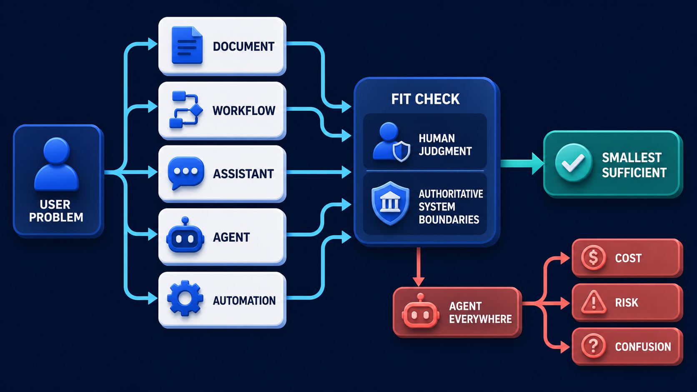

# Diagram 221 — Problem, workflow, assistant, agent, and automation boundaries

**Module:** Choose the right problem
**Role in the course:** Choose whether a problem needs information, a fixed workflow, an assistant, an agent, or deterministic automation before selecting protocols or frameworks.
**Layout:** USER PROBLEM begins on the left and the diagram flows toward FIT; a teal **FIT** path is the desired route and a coral **AGENT EVERYWHERE** path is blocked or contained.

---

## At a glance

**Problem, workflow, assistant, agent, and automation boundaries** — Choose whether a problem needs information, a fixed workflow, an assistant, an agent, or deterministic automation before selecting protocols or frameworks.

- The central takeaway is: Use the smallest amount of agency that solves the real problem, and keep authority visible.
- The visual begins with **USER PROBLEM** and ends with the diagram's outcome, not a technology name.
- The safe or selected path is marked **teal**: FIT path selects the smallest sufficient choice.
- The blocked or dangerous path is marked **coral**: AGENT EVERYWHERE path creates COST, RISK, and CONFUSION.
- The analogy is: A kitchen uses a recipe for repeatable steps, a cook for judgment, a timer for automation, and a head chef for consequential decisions. Calling every appliance a chef would make responsibilities less clear, not more advanced.

---

## What the diagram teaches

### 1. Problem, workflow, assistant, agent, and automation boundaries

An assistant helps a person decide. In the diagram, **USER PROBLEM**, **AGENT EVERYWHERE**, **WORKFLOW** appear at the left, turning this idea into something a reviewer can point at.

### 2. Start with the User Outcome and Current Pain Without Naming a Technology.

A business problem is a gap between the outcome a person needs and what the current system reliably provides. The visual places **USER PROBLEM** at the center; the arrows between them are the physical expression of this principle. If this is skipped, beginning with an agent label can hide that a simple workflow would be cheaper, safer, easier to test, and easier for Maya to explain.

### 3. Separate Known Repeatable Steps from Uncertain Judgment or Research.

A workflow follows known steps. This map prevents architecture theatre. The trace asks the team to separate known repeatable steps from uncertain judgment or research. Look at **HUMAN JUDGMENT** on the top: the diagram uses those elements to show where this decision lives.

### 4. Match Each Step to Documentation, Workflow, Assistant, Agent, or Automation.

Documentation explains. Automation executes a stable decision rule. The picture shows **AGENT EVERYWHERE**, **WORKFLOW**, **ASSISTANT** as the visual anchor for this idea, with the surrounding paths showing the flow. The project confirms the point: Maya maps the real need: gather case facts, find policy, compare evidence, explain an exception, and submit an approved refund.

### 5. Place Human Decisions and Authoritative Business Commits Outside Model Authority.

The first architecture decision is not which model to use; it is which kind of behavior closes that gap with the least unnecessary uncertainty. The authoritative system still owns customer, policy, payment, and receipt truth. A model may propose, summarize, retrieve, compare, or coordinate, but it does not become the business database because its prose sounds confident. Reviewers can see exactly where uncertainty is valuable, where determinism is required, and where a human retains authority rather than accepting one vague box marked AI agent. To put this into practice, the team should place human decisions and authoritative business commits outside model authority. At the bottom, **HUMAN JUDGMENT**, **AUTHORITATIVE SYSTEM** is the element that makes this concept concrete before any code is written.

Diagram 222 — *Use-case selection, value, frequency, uncertainty, and reversibility* is the next lens on this idea. The same concepts reappear there with different emphasis, so the two diagrams should be read as a pair.

### 6. Record Forbidden Actions, Recovery, Owner, and the Evidence Required Before Implementation.

An agent selects or sequences actions under constraints. A good boundary statement names the trigger, inputs, allowed choices, tools, stop conditions, human decisions, committed effects, evidence, and recovery. It also names what the component is forbidden to do. In the diagram, **USER PROBLEM**, **HUMAN JUDGMENT**, **AUTHORITATIVE SYSTEM** appear at the lower right, turning this idea into something a reviewer can point at. If this is skipped, beginning with an agent label can hide that a simple workflow would be cheaper, safer, easier to test, and easier for Maya to explain.

### 7. Use the smallest amount of agency that solves the real problem

One product may use several, but each part needs a named boundary. Agency is useful when the path cannot be completely listed in advance and the system must adapt using evidence. It is wasteful when a form, query, rule, or ordinary service already solves the problem more predictably. The visual places **USER PROBLEM** at the upper left; the arrows between them are the physical expression of this principle.

### Analogy

A kitchen uses a recipe for repeatable steps, a cook for judgment, a timer for automation, and a head chef for consequential decisions. Calling every appliance a chef would make responsibilities less clear, not more advanced. Look at **USER PROBLEM**, **HUMAN JUDGMENT**, **AUTHORITATIVE SYSTEM** on the left: the diagram uses those elements to show where this decision lives. The project confirms the point: Acme asks for an agent that handles refunds from start to finish because agents sound modern.

### The Next.js surface

The Next.js surface must own the human experience while keeping authority and secrets on the server side. In this diagram, that means the web boundary stops the coral anti-patterns before they reach the browser.

- Model the future web flow as explicit routes and user states before adding chat; ordinary forms and Server Actions should handle deterministic work.
- Use client components only where live interaction is needed, and label proposals, human decisions, and committed receipts as different states.
- Create a boundary fixture page showing which steps are documents, fixed workflow, assistant help, agent work, and authoritative server actions.

Together these choices prevent the mistakes in the Acme case—Acme asks for an agent that handles refunds from start to finish because agents sound modern.—from becoming the architecture.

### The Python surface

The Python surface must keep business rules, protocols, and persistence in cleanly separated layers. In this diagram, that means FastAPI is one edge of a domain that does not leak into adapters or the model.

- Represent the workflow as services and typed state transitions; call a model only inside the steps that require uncertainty or language understanding.
- Keep domain commands and idempotent commits separate from agent planning, retrieval, and summaries.
- Write policy tests proving that the agent cannot bypass the human decision or directly mutate the authoritative refund record.

These boundaries make the Acme case—Acme asks for an agent that handles refunds from start to finish because agents sound modern.—testable and replaceable.

---

## Case study — Acme asks for an agent that handles refunds from start

Acme asks for an agent that handles refunds from start to finish because agents sound modern.

### The walkthrough

1. Maya maps the real need: gather case facts, find policy, compare evidence, explain an exception, and submit an approved refund.
2. Facts and policy retrieval become tools; comparison and draft explanation become assistant or agent work.
3. Maya keeps the exception decision, while the payment service keeps the final idempotent commit.
4. The blueprint records the boundaries and refuses the original unrestricted end-to-end agent description.

### The result

Acme gets useful adaptive help without turning human authority or payment truth into model-owned behavior.

### The danger

Beginning with an agent label can hide that a simple workflow would be cheaper, safer, easier to test, and easier for Maya to explain.

### The takeaway

Use the smallest amount of agency that solves the real problem, and keep authority visible.

---

## Composition

The picture is a left-to-right decision map. On the left, a **USER PROBLEM** card begins the scene and sends a cyan path toward the center. In the center, five white choice cards—**DOCUMENT**, **WORKFLOW**, **ASSISTANT**, **AGENT**, **AUTOMATION**—sit on a cobalt platform. Two rails, **HUMAN JUDGMENT** and **AUTHORITATIVE SYSTEM**, frame the top and bottom of the choice row. A teal **FIT** path leaves the problem and reaches the smallest sufficient choice, while a coral **AGENT EVERYWHERE** path forks to the right and spills into **COST**, **RISK**, and **CONFUSION**. The whole composition reads from uncertainty on the left to consequence on the right.

## Element by element

- **USER PROBLEM** — the starting gap between the outcome a person needs and what the current system reliably provides; it is the only input that should begin the architecture decision.
- **HUMAN JUDGMENT** — a guard rail added to the decision path that frames the choice with human oversight and responsibility rather than model authority.
- **AUTHORITATIVE SYSTEM** — The authoritative system still owns customer, policy, payment, and receipt truth.
- **AGENT EVERYWHERE** — the coral default of applying the agent label to every problem, leading to unnecessary cost, risk, and confusion.
- **DOCUMENT** — a bounded choice in the decision path; it represents information that is fixed enough to present without reasoning or action.
- **WORKFLOW** — A workflow follows known steps.
- **ASSISTANT** — An assistant helps a person decide.
- **AGENT** — An agent selects or sequences actions under constraints.
- **AUTOMATION** — Automation executes a stable decision rule.
- **FIT** — the teal path that selects the smallest sufficient pattern for the user problem.
- **COST** — a consequence of the coral AGENT EVERYWHERE path; it represents the wasted money and effort from applying an agent to problems a simpler pattern would solve.
- **RISK** — a consequence of the coral AGENT EVERYWHERE path; it represents the added danger from letting unconstrained agency touch business truth.
- **CONFUSION** — a consequence of the coral AGENT EVERYWHERE path; it represents the unclear responsibility that follows from labeling every tool an agent.

---

## Colour and flow semantics

The course visual grammar uses color to separate platforms, requests, safe paths, danger, and records. In this diagram those colors are assigned as follows:
- **Cobalt platform** — a product, service, environment, or boundary. The main structural cards such as **USER PROBLEM**, **HUMAN JUDGMENT**, **AUTHORITATIVE SYSTEM**, **DOCUMENT**, **WORKFLOW**, **ASSISTANT** sit on glowing cobalt platforms.
- **Cyan arrow** — a typed request, event, artifact, deployment, test, or evidence handoff. The cyan paths between **USER PROBLEM**, **HUMAN JUDGMENT**, **AUTHORITATIVE SYSTEM**, **DOCUMENT** carry the forward motion of the architecture.
- **Teal arrow** — an authoritative decision, verified contract, passing gate, safe release, or recovered service. The teal elements **FIT** show the path the design wants to keep open.
- **Coral path** — an unacceptable outcome, failed boundary, broken contract, unsafe release, or unrecovered effect. The coral elements **AGENT EVERYWHERE**, **COST**, **RISK**, **CONFUSION** show what must be blocked or contained.
- **White card** — a requirement, schema, service, test, gate, owner, artifact, or receipt. The white cards such as **USER PROBLEM**, **HUMAN JUDGMENT**, **AUTHORITATIVE SYSTEM**, **DOCUMENT**, **WORKFLOW**, **ASSISTANT**, **AGENT**, **AUTOMATION** are the readable records the diagram communicates.

---

## How to present it

- Point to **USER PROBLEM** and ask the room to state the human problem or outcome before naming any technology, protocol, or model.
- Point to **USER PROBLEM** and ask what would have to change for the team to write the user outcome and current pain without naming a technology, and who would own that change.
- Point to **HUMAN JUDGMENT** and ask what evidence would show the team has already separate known repeatable steps from uncertain judgment or research, and what test would fail first if it is missing.
- Point to **AGENT EVERYWHERE** and ask who else in the room must agree before the team can match each step to documentation, workflow, assistant, agent, or automation, and what would change their mind.
- Point to **AUTHORITATIVE SYSTEM** and ask what the smallest version of place human decisions and authoritative business commits outside model authority looks like, and what would be left out of that version.
- Point to **DOCUMENT** and ask what would have to change for the team to record forbidden actions, recovery, owner, and the evidence required before implementation, and who would own that change.
- Trace the **teal** path (FIT path selects the smallest sufficient choice) and ask what evidence would prove the real system follows it, who collects that evidence, and how often it is refreshed.
- Show the **coral** path (AGENT EVERYWHERE path creates COST, RISK, and CONFUSION) and ask what control, owner, or test would catch it before a user is harmed, and what the safe state would be if it is triggered.
- Use the analogy: A kitchen uses a recipe for repeatable steps, a cook for judgment, a timer for automation, and a head chef for consequential decisions. Calling every appliance a chef would make responsibilities less clear, not more advanced. Ask how the same failure would appear in the team's current code or process.
- Return to the whole diagram and ask the room to name one thing they will stop, one thing they will start, and one thing they will own differently before the next build.
- Run the lab: Map a familiar support process into documentation, workflow, assistant, agent, and automation. For every step, name its trigger, owner, inputs, uncertainty, tools, human decision, committed effect, forbidden actions, and recovery path.
- Pose the checkpoint: *Does a multi-step process automatically require an agent?*

---

## Lab and checkpoint

**Lab:** Map a familiar support process into documentation, workflow, assistant, agent, and automation. For every step, name its trigger, owner, inputs, uncertainty, tools, human decision, committed effect, forbidden actions, and recovery path.

**Checkpoint:** Does a multi-step process automatically require an agent?

**Answer:** No. A fixed workflow can contain many steps. An agent is useful only where the path or choice must adapt under evidence and constraints.

---

## Glossary

- **Agency** — bounded freedom to choose or sequence actions
- **Authoritative system** — record trusted to establish what really happened
- **Boundary** — explicit limit on responsibility, data, or action

---

## Sources

- NIST AI Risk Management Framework
- MCP 2026-07-28 specification
- A2A and MCP

---

## Related lessons

- **Lesson 222** — Use-case selection, value, frequency, uncertainty, and reversibility (`use-case-selection-scorecard`)
- **Lesson 225** — Capability, context, model, tool, and authority boundaries (`enterprise-boundary-stack`)
- **Lesson 227** — MCP, A2A, AG-UI, HTTP, queue, and internal boundaries (`protocol-boundary-routing-map`)
---

### Why this diagram must precede the build

The team should not begin with code, prompts, or models for Problem, workflow, assistant, agent, and automation boundaries until the diagram is legible to every reviewer. Choose whether a problem needs information, a fixed workflow, an assistant, an agent, or deterministic automation before selecting protocols or frameworks. The trace moves through 5 decisions: Write the user outcome and current pain without naming a technology.; Separate known repeatable steps from uncertain judgment or research.; Match each step to documentation, workflow, assistant, agent, or automation.; Place human decisions and authoritative business commits outside model authority.; Record forbidden actions, recovery, owner, and the evidence required before implementation.. Each decision maps to a labeled element in the picture, and each label must have an owner, a contract, and an acceptance test before the corresponding code is written.

The case study—Acme asks for an agent that handles refunds from start to finish because agents sound modern.—shows that Use the smallest amount of agency that solves the real problem, and keep authority visible. If the team skips this, Beginning with an agent label can hide that a simple workflow would be cheaper, safer, easier to test, and easier for Maya to explain. The diagram is the contract the two projects share. Until the team can trace the problem through the labels, assign owners to each card, and write the corresponding test, the build will drift from the architecture.

Before writing the first route, prompt, or adapter, the team should be able to answer: what is the user outcome this diagram protects, which card owns each decision, what evidence moves across each arrow, where the coral anti-patterns first appear, what test or gate proves the real system matches the picture, and which fixture will catch the next regression. When those answers are visible and reviewable, the build becomes a direct translation of the architecture rather than a guess about it. The diagram is the earliest acceptance test the project can write. Keeping it current is cheaper than debugging the drift it prevents. A reviewer who cannot read the diagram will not be able to read the build. Start every build review by pointing at the diagram, not the code.