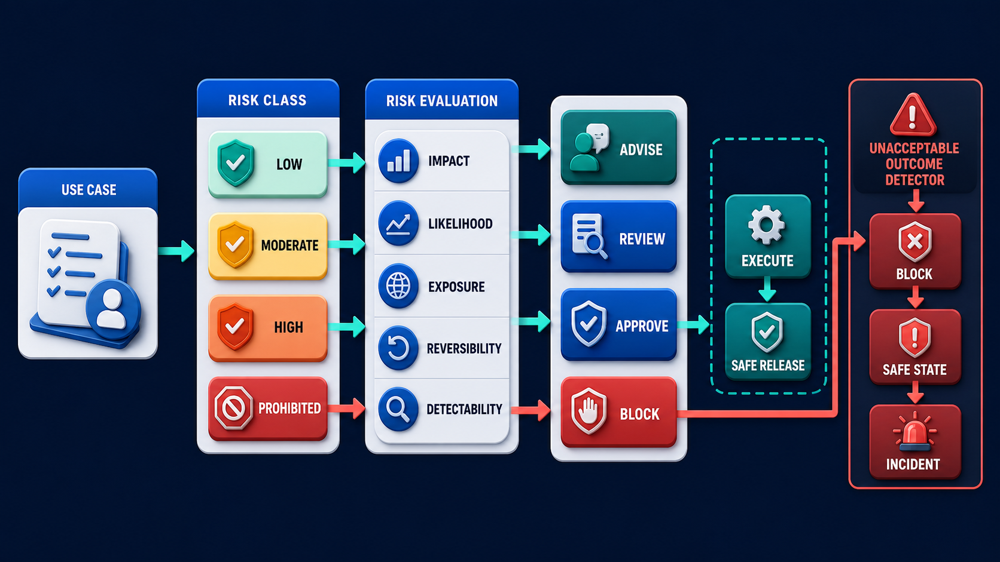
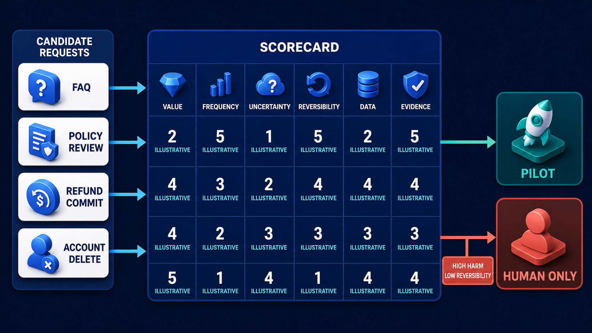

# Diagram 223 — Risk classification, human authority, and unacceptable outcomes

**Module:** Choose the right problem
**Role in the course:** Turn broad safety concerns into a usable classification, an explicit human-authority model, and hard unacceptable-outcome rules.
**Layout:** USE CASE begins on the left and the diagram flows toward SAFE STATE; a teal **BLOCK** path is the desired route and a coral **UNACCEPTABLE OUTCOME** path is blocked or contained.

---

## At a glance

**Risk classification, human authority, and unacceptable outcomes** — Turn broad safety concerns into a usable classification, an explicit human-authority model, and hard unacceptable-outcome rules.

- The central takeaway is: Classify the harm, bind the authority, and make unacceptable outcomes executable release rules.
- The visual begins with **USE CASE** and ends with the diagram's outcome, not a technology name.
- The safe or selected path is marked **teal**: response cards—**BLOCK**, **SAFE STATE**, **INCIDENT**.
- The blocked or dangerous path is marked **coral**: UNACCEPTABLE OUTCOME triggers BLOCK, SAFE STATE, INCIDENT.
- The analogy is: A building uses different rules for a light switch, a fire alarm, an elevator, and a gas valve. Saying a person is somewhere in the loop would not define who may open the valve or what must happen when a leak is detected.

---

## What the diagram teaches

### 1. Risk classification, human authority, and unacceptable outcomes

Controls should match the risk path. In the diagram, **HUMAN AUTHORITY**, **RISK CLASS LOW**, **UNACCEPTABLE OUTCOME** appear at the left, turning this idea into something a reviewer can point at.

### 2. Describe Credible Harms and the People, Data, and Services Exposed.

Risk is the possibility that an outcome harms people, the business, data, rights, or service reliability. The visual places **USE CASE**, **RISK CLASS LOW**, **HUMAN AUTHORITY** at the center; the arrows between them are the physical expression of this principle. If this is skipped, risk is the possibility that an outcome harms people, the business, data, rights, or service reliability.

### 3. Classify Impact, Likelihood, Exposure, Reversibility, and Detectability with Evidence.

Diagram 222 — *Use-case selection, value, frequency, uncertainty, and reversibility* is the next lens on this idea. The same concepts reappear there with different emphasis, so the two diagrams should be read as a pair.

Classification combines the severity of impact with likelihood, exposure, reversibility, and how quickly the problem can be detected. The trace asks the team to classify impact, likelihood, exposure, reversibility, and detectability with evidence. Look at **IMPACT**, **LIKELIHOOD**, **EXPOSURE** on the top: the diagram uses those elements to show where this decision lives.

### 4. Assign the Exact Human Authority Level for Each Consequential Transition.

Human in the loop is too vague. A safe pilot does not automatically justify a broader production authority level. The picture shows **HUMAN AUTHORITY** as the visual anchor for this idea, with the surrounding paths showing the flow. The project confirms the point: Acme classifies stale approval as a high-risk path because it can commit money under superseded evidence.

### 5. Start with Unacceptable Outcomes as Invariants with Block, Alert, Safe-state, and Recovery Behavior.

It becomes a testable invariant and a release blocker. Prevention blocks the event, detection reveals it quickly, containment limits reach, recovery restores safe service, and learning turns the scenario into a permanent test fixture. To put this into practice, the team should write unacceptable outcomes as invariants with block, alert, safe-state, and recovery behavior. At the bottom, **SAFE STATE**, **UNACCEPTABLE OUTCOME**, **BLOCK** is the element that makes this concept concrete before any code is written.

### 6. Name the Risk Owner, Review Trigger, Evidence Pack, and Release Gate.

An unacceptable outcome is a condition the system must never knowingly permit, such as cross-tenant disclosure, duplicate payment, approval on stale evidence, or silent deletion. Risk ownership stays with named people and teams. Review the classification when tools, data, users, geography, autonomy, model, or failure evidence changes. In the diagram, **RISK CLASS LOW**, **REVIEW** appear at the lower right, turning this idea into something a reviewer can point at. If this is skipped, an unacceptable outcome is a condition the system must never knowingly permit, such as cross-tenant disclosure, duplicate payment, approval on stale evidence, or silent deletion.

### 7. Classify the harm, bind the authority

The blueprint must say whether the system may advise, draft, recommend, request approval, execute after approval, or execute automatically within a tiny reversible envelope. A protocol, model provider, or policy engine can supply signals, but none can accept organizational accountability on Acme's behalf. The visual places **HUMAN AUTHORITY** at the upper left; the arrows between them are the physical expression of this principle.

### Analogy

A building uses different rules for a light switch, a fire alarm, an elevator, and a gas valve. Saying a person is somewhere in the loop would not define who may open the valve or what must happen when a leak is detected. Look at **USE CASE**, **RISK CLASS LOW**, **HUMAN AUTHORITY** on the left: the diagram uses those elements to show where this decision lives. The project confirms the point: A refund proposal is correct, but it was approved in a browser tab before the policy and refund amount changed.

### The Next.js surface

The Next.js surface must own the human experience while keeping authority and secrets on the server side. In this diagram, that means the web boundary stops the coral anti-patterns before they reach the browser.

- Render authority as explicit proposal, review, approval, committed, blocked, and expired states; never hide consequential scope behind a generic Continue button.
- Disable sensitive controls when evidence revision, identity, tenant, or policy checks are uncertain, while preserving the user's notes.
- Create a risk-fixture gallery that demonstrates every unacceptable outcome and its accessible blocked or recovery state.

Together these choices prevent the mistakes in the Acme case—A refund proposal is correct, but it was approved in a browser tab before the policy and refund amount changed.—from becoming the architecture.

### The Python surface

The Python surface must keep business rules, protocols, and persistence in cleanly separated layers. In this diagram, that means FastAPI is one edge of a domain that does not leak into adapters or the model.

- Encode policy invariants outside prompts and enforce them again at authoritative command handlers.
- Model actor, subject, action, resource, tenant, evidence version, approval, expiry, and risk class in each decision envelope.
- Emit durable security or risk events and test fail-closed behavior when identity, policy, or evidence services are unavailable.

These boundaries make the Acme case—A refund proposal is correct, but it was approved in a browser tab before the policy and refund amount changed.—testable and replaceable.

---

## Case study — A refund proposal is correct

A refund proposal is correct, but it was approved in a browser tab before the policy and refund amount changed.

### The walkthrough

1. Acme classifies stale approval as a high-risk path because it can commit money under superseded evidence.
2. The approval is bound to subject, amount, policy revision, actor, tenant, and expiry.
3. The service rejects the stale commit, preserves Maya's note, and returns the new comparison for review.
4. The rejected path becomes a security and acceptance fixture required for every release.

### The result

Human approval remains meaningful because it authorizes one bounded current proposal rather than an open-ended future action.

### The danger

A visible approval button provides no safety if the backend accepts a changed subject, amount, evidence set, tenant, or expired decision.

### The takeaway

Classify the harm, bind the authority, and make unacceptable outcomes executable release rules.

---

## Composition

The picture is a risk classifier. At the top, a **USE CASE** card enters a row of four class boxes—**LOW**, **MODERATE**, **HIGH**, **PROHIBITED**. Below them, five evidence cards—**IMPACT**, **LIKELIHOOD**, **EXPOSURE**, **REVERSIBILITY**, **DETECTABILITY**—feed the classification. In the middle, four **HUMAN AUTHORITY** gates—**ADVISE**, **REVIEW**, **APPROVE**, **EXECUTE**—stack vertically. On the right, a coral **UNACCEPTABLE OUTCOME** box triggers three teal response cards—**BLOCK**, **SAFE STATE**, **INCIDENT**. The composition reads top-down from use case to consequence.

## Element by element

- **USE CASE** — a labeled visual element in this diagram; the prompt shows it as USE CASE entering RISK CLASS LOW.
- **RISK CLASS LOW** — a labeled visual element in this diagram; the prompt shows it as USE CASE entering RISK CLASS LOW.
- **HUMAN AUTHORITY** — Turn broad safety concerns into a usable classification, an explicit human-authority model, and hard unacceptable-outcome rules.
- **UNACCEPTABLE OUTCOME** — An unacceptable outcome is a condition the system must never knowingly permit, such as cross-tenant disclosure, duplicate payment, approval on stale evidence, or silent deletion.
- **SAFE STATE** — Write unacceptable outcomes as invariants with block, alert, safe-state, and recovery behavior.
- **MODERATE** — a risk class for use cases with real but bounded harm that require review before action.
- **HIGH** — Acme classifies stale approval as a high-risk path because it can commit money under superseded evidence.
- **PROHIBITED** — a risk class for use cases that must not proceed automatically because the harm is unacceptable.
- **IMPACT** — Classification combines the severity of impact with likelihood, exposure, reversibility, and how quickly the problem can be detected.
- **LIKELIHOOD** — Classification combines the severity of impact with likelihood, exposure, reversibility, and how quickly the problem can be detected.
- **EXPOSURE** — Classification combines the severity of impact with likelihood, exposure, reversibility, and how quickly the problem can be detected.
- **REVERSIBILITY** — Classification combines the severity of impact with likelihood, exposure, reversibility, and how quickly the problem can be detected.
- **DETECTABILITY** — Classify impact, likelihood, exposure, reversibility, and detectability with evidence.
- **ADVISE** — The blueprint must say whether the system may advise, draft, recommend, request approval, execute after approval, or execute automatically within a tiny reversible envelope.
- **REVIEW** — Review the classification when tools, data, users, geography, autonomy, model, or failure evidence changes.
- **APPROVE** — a human authority gate where a person explicitly authorizes a specific bounded action.
- **EXECUTE** — The blueprint must say whether the system may advise, draft, recommend, request approval, execute after approval, or execute automatically within a tiny reversible envelope.
- **BLOCK** — Write unacceptable outcomes as invariants with block, alert, safe-state, and recovery behavior.
- **INCIDENT** — the safe, verified, or authoritative element marked in teal; in this diagram response cards—**BLOCK**, **SAFE STATE**, **INCIDENT**.
- **LOW** — a risk class for use cases with limited, manageable harm that may still need review.

---

## Colour and flow semantics

The course visual grammar uses color to separate platforms, requests, safe paths, danger, and records. In this diagram those colors are assigned as follows:
- **Cobalt platform** — a product, service, environment, or boundary. The main structural cards such as **USE CASE**, **RISK CLASS LOW**, **HUMAN AUTHORITY**, **MODERATE**, **HIGH**, **PROHIBITED** sit on glowing cobalt platforms.
- **Cyan arrow** — a typed request, event, artifact, deployment, test, or evidence handoff. The cyan paths between **USE CASE**, **RISK CLASS LOW**, **HUMAN AUTHORITY**, **MODERATE** carry the forward motion of the architecture.
- **Teal arrow** — an authoritative decision, verified contract, passing gate, safe release, or recovered service. The teal elements **BLOCK**, **SAFE STATE**, **INCIDENT** show the path the design wants to keep open.
- **Coral path** — an unacceptable outcome, failed boundary, broken contract, unsafe release, or unrecovered effect. The coral elements **UNACCEPTABLE OUTCOME** show what must be blocked or contained.
- **White card** — a requirement, schema, service, test, gate, owner, artifact, or receipt. The white cards such as **USE CASE**, **RISK CLASS LOW**, **HUMAN AUTHORITY**, **MODERATE**, **HIGH**, **PROHIBITED**, **IMPACT**, **LIKELIHOOD** are the readable records the diagram communicates.

---

## How to present it

- Point to **USE CASE** and ask the room to state the human problem or outcome before naming any technology, protocol, or model.
- Point to **RISK CLASS LOW** and ask what would have to change for the team to describe credible harms and the people, data, and services exposed, and who would own that change.
- Point to **IMPACT** and ask what evidence would show the team has already classify impact, likelihood, exposure, reversibility, and detectability with evidence, and what test would fail first if it is missing.
- Point to **HUMAN AUTHORITY** and ask who else in the room must agree before the team can assign the exact human authority level for each consequential transition, and what would change their mind.
- Point to **SAFE STATE** and ask what the smallest version of write unacceptable outcomes as invariants with block, alert, safe-state, and recovery behavior looks like, and what would be left out of that version.
- Point to **REVIEW** and ask what would have to change for the team to name the risk owner, review trigger, evidence pack, and release gate, and who would own that change.
- Trace the **teal** path (response cards—**BLOCK**, **SAFE STATE**, **INCIDENT**) and ask what evidence would prove the real system follows it, who collects that evidence, and how often it is refreshed.
- Show the **coral** path (UNACCEPTABLE OUTCOME triggers BLOCK, SAFE STATE, INCIDENT) and ask what control, owner, or test would catch it before a user is harmed, and what the safe state would be if it is triggered.
- Point to **HUMAN AUTHORITY** and ask who owns it, what evidence it needs, what happens when that evidence is missing, and which test proves the gate cannot be bypassed.
- Use the analogy: A building uses different rules for a light switch, a fire alarm, an elevator, and a gas valve. Saying a person is somewhere in the loop would not define who may open the valve or what must happen when a leak is detected. Ask how the same failure would appear in the team's current code or process.
- Return to the whole diagram and ask the room to name one thing they will stop, one thing they will start, and one thing they will own differently before the next build.
- Run the lab: Create a risk register for the Acme policy-review use case. Include ten harm scenarios, five classification dimensions, authority levels, four unacceptable outcomes, preventive and detective controls, safe states, recovery, owners, review triggers, and acceptance tests.
- Pose the checkpoint: *Is a human approval sufficient if the underlying proposal can change afterward?*

---

## Lab and checkpoint

**Lab:** Create a risk register for the Acme policy-review use case. Include ten harm scenarios, five classification dimensions, authority levels, four unacceptable outcomes, preventive and detective controls, safe states, recovery, owners, review triggers, and acceptance tests.

**Checkpoint:** Is a human approval sufficient if the underlying proposal can change afterward?

**Answer:** No. Approval must be bound to the exact subject, scope, evidence, revision, actor, tenant, and expiry that the person reviewed.

---

## Glossary

- **Invariant** — rule that must remain true
- **Risk owner** — accountable person or role for a risk decision
- **Fail closed** — refuse a sensitive action when required proof is missing

---

## Sources

- NIST AI Risk Management Framework
- NIST Generative AI Profile
- OWASP Agentic Applications 2026

---

## Related lessons

- **Lesson 222** — Use-case selection, value, frequency, uncertainty, and reversibility (`use-case-selection-scorecard`)
- **Lesson 233** — Authentication, secrets, tenants, policy, and audit services (`identity-policy-audit-services`)
- **Lesson 239** — Threat, evaluation, accessibility, privacy, and readiness gates (`readiness-gate-system`)
---

### Why this diagram must precede the build

The team should not begin with code, prompts, or models for Risk classification, human authority, and unacceptable outcomes until the diagram is legible to every reviewer. Turn broad safety concerns into a usable classification, an explicit human-authority model, and hard unacceptable-outcome rules. The trace moves through 5 decisions: Describe credible harms and the people, data, and services exposed.; Classify impact, likelihood, exposure, reversibility, and detectability with evidence.; Assign the exact human authority level for each consequential transition.; Write unacceptable outcomes as invariants with block, alert, safe-state, and recovery behavior.; Name the risk owner, review trigger, evidence pack, and release gate.. Each decision maps to a labeled element in the picture, and each label must have an owner, a contract, and an acceptance test before the corresponding code is written.

The case study—A refund proposal is correct, but it was approved in a browser tab before the policy and refund amount changed.—shows that Classify the harm, bind the authority, and make unacceptable outcomes executable release rules. If the team skips this, A visible approval button provides no safety if the backend accepts a changed subject, amount, evidence set, tenant, or expired decision. The diagram is the contract the two projects share. Until the team can trace the problem through the labels, assign owners to each card, and write the corresponding test, the build will drift from the architecture.

Before writing the first route, prompt, or adapter, the team should be able to answer: what is the user outcome this diagram protects, which card owns each decision, what evidence moves across each arrow, where the coral anti-patterns first appear, what test or gate proves the real system matches the picture, and which fixture will catch the next regression. When those answers are visible and reviewable, the build becomes a direct translation of the architecture rather than a guess about it. The diagram is the earliest acceptance test the project can write. Keeping it current is cheaper than debugging the drift it prevents. A reviewer who cannot read the diagram will not be able to read the build. Start every build review by pointing at the diagram, not the code.