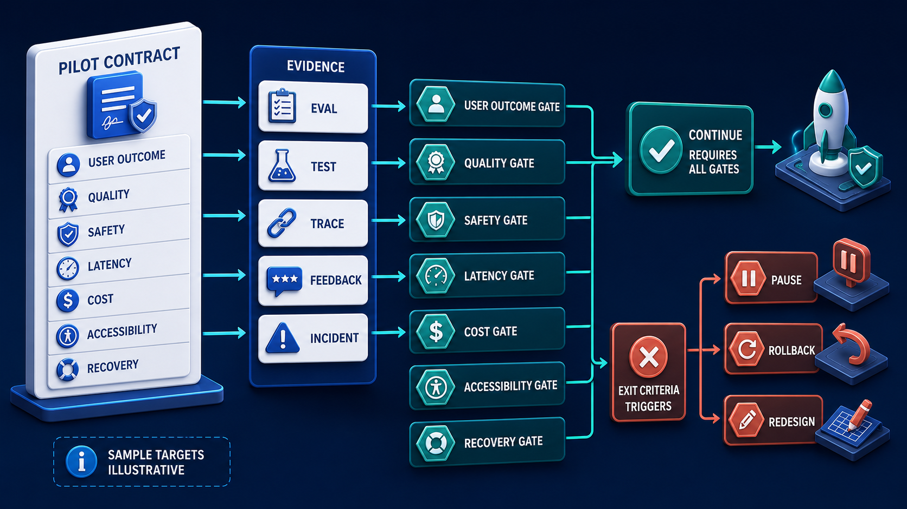

# Diagram 224 — Success criteria, exit criteria, and evidence requirements

**Module:** Choose the right problem
**Role in the course:** Define success and stopping rules with named evidence before the team starts building or collecting convenient metrics.
**Layout:** PILOT CONTRACT begins on the left and the diagram flows toward CONTINUE; a teal **CONTINUE** path is the desired route and a coral **EXIT CRITERIA** path is blocked or contained.

---

## At a glance

**Success criteria, exit criteria, and evidence requirements** — Define success and stopping rules with named evidence before the team starts building or collecting convenient metrics.

- The central takeaway is: Decide how you will prove success—and when you will stop—before the demo starts persuading you.
- The visual begins with **PILOT CONTRACT** and ends with the diagram's outcome, not a technology name.
- The safe or selected path is marked **teal**: CONTINUE requires all gates.
- The blocked or dangerous path is marked **coral**: EXIT CRITERIA triggers PAUSE, ROLLBACK, REDESIGN.
- The analogy is: Before a long hike, a group defines the destination, daylight, weather limits, water reserve, turnaround time, and emergency route. Reaching a scenic viewpoint does not cancel the agreed turnaround rule.

---

## What the diagram teaches

### 1. Success criteria, exit criteria, and evidence requirements

Exit criteria say when to pause, narrow, roll back, or abandon the approach. In the diagram, **EXIT CRITERIA**, **EVIDENCE** appear at the left, turning this idea into something a reviewer can point at.

### 2. Start with One User Outcome and the Unacceptable Outcomes That Constrain It.

Evidence comes from several layers: deterministic tests, contract fixtures, controlled evaluations, traces, incident scenarios, accessibility testing, user research, and real product outcomes. The visual places **USER OUTCOME** at the center; the arrows between them are the physical expression of this principle. If this is skipped, a metric without denominator, version, population, and decision rule can be selected after the fact to support almost any story.

### 3. Define Quality, Safety, Latency, Cost, Accessibility, and Recovery Measures with Denominators.

Success criteria describe what good looks like for users, quality, safety, operations, accessibility, cost, and recovery. It becomes a measured result only after the later project defines instrumentation, collects valid data, and records the actual run. The trace asks the team to define quality, safety, latency, cost, accessibility, and recovery measures with denominators. Look at **QUALITY**, **SAFETY**, **LATENCY** on the top: the diagram uses those elements to show where this decision lives.

### 4. Assign Each Criterion a Source of Evidence, Owner, Review Frequency, and Limitation.

Diagram 222 — *Use-case selection, value, frequency, uncertainty, and reversibility* is the next lens on this idea. The same concepts reappear there with different emphasis, so the two diagrams should be read as a pair.

They must include a measurement method, population, denominator, owner, time window, and known limitations. That chain lets Maya and a portfolio reviewer see why the team continued, paused, or changed course. The picture shows **EVIDENCE** as the visual anchor for this idea, with the surrounding paths showing the flow. The project confirms the point: Maya returns to the prewritten pilot contract and sees that adversarial evidence, keyboard testing, stale-policy recovery, and rollback rehearsal are incomplete.

### 5. Add Explicit Pause, Rollback, Redesign, and Abandon Conditions Before the Pilot Begins.

The blueprint needs both. Every target written before implementation is a proposed or illustrative target. To put this into practice, the team should add explicit pause, rollback, redesign, and abandon conditions before the pilot begins. At the bottom, **PILOT CONTRACT**, **PAUSE**, **ROLLBACK** is the element that makes this concept concrete before any code is written.

### 6. Version the Evidence Manifest and Record the Decision Reached at Every Gate.

Leading evidence appears before harm, such as rising tool denial or stale-evidence rates. Lagging evidence appears after an outcome, such as a duplicate payment or support escalation. The evidence manifest ties requirement, version, dataset, code, environment, run, result, reviewer, and decision together. In the diagram, **EVIDENCE** appear at the lower right, turning this idea into something a reviewer can point at. If this is skipped, a metric without denominator, version, population, and decision rule can be selected after the fact to support almost any story.

### 7. Decide how you will prove success—and when you will stop—before the demo

They protect the team from continuing because of sunk cost, an attractive demo, or a single improving metric. No single benchmark proves production fitness. The visual places **PILOT CONTRACT**, **USER OUTCOME**, **EXIT CRITERIA** at the upper left; the arrows between them are the physical expression of this principle.

### Analogy

Before a long hike, a group defines the destination, daylight, weather limits, water reserve, turnaround time, and emergency route. Reaching a scenic viewpoint does not cancel the agreed turnaround rule. Look at **PILOT CONTRACT**, **USER OUTCOME**, **EXIT CRITERIA** on the left: the diagram uses those elements to show where this decision lives. The project confirms the point: Acme's prototype gives convincing policy summaries, and the team wants to call the pilot successful after several friendly demonstrations.

### The Next.js surface

The Next.js surface must own the human experience while keeping authority and secrets on the server side. In this diagram, that means the web boundary stops the coral anti-patterns before they reach the browser.

- Build an evidence dashboard that distinguishes proposed targets, illustrative scenarios, and measured results with separate visual states.
- Link every result card to its requirement, dataset or fixture version, environment, run time, owner, and decision receipt.
- Make accessibility and recovery gates first-class release cards rather than notes under a performance chart.

Together these choices prevent the mistakes in the Acme case—Acme's prototype gives convincing policy summaries, and the team wants to call the pilot successful after several friendly demonstrations.—from becoming the architecture.

### The Python surface

The Python surface must keep business rules, protocols, and persistence in cleanly separated layers. In this diagram, that means FastAPI is one edge of a domain that does not leak into adapters or the model.

- Define versioned criterion models with numerator, denominator, eligibility, slices, target status, and evidence references.
- Produce machine-readable test and evaluation manifests in CI while preventing synthetic fixtures from entering production analytics.
- Implement a gate evaluator that explains which evidence is missing or failed without treating the generated decision as executive authorization.

These boundaries make the Acme case—Acme's prototype gives convincing policy summaries, and the team wants to call the pilot successful after several friendly demonstrations.—testable and replaceable.

---

## Case study — Acme's prototype gives convincing policy summaries

Acme's prototype gives convincing policy summaries, and the team wants to call the pilot successful after several friendly demonstrations.

### The walkthrough

1. Maya returns to the prewritten pilot contract and sees that adversarial evidence, keyboard testing, stale-policy recovery, and rollback rehearsal are incomplete.
2. The team runs the missing evaluation and discovers that superseded documents are sometimes presented without a warning.
3. The exit rule pauses expansion while retrieval freshness and the interface are corrected.
4. A new version passes the complete gate, and the decision receipt records what changed and which evidence supported continuation.

### The result

Acme avoids mistaking a polished happy path for a production-ready system.

### The danger

A metric without denominator, version, population, and decision rule can be selected after the fact to support almost any story.

### The takeaway

Decide how you will prove success—and when you will stop—before the demo starts persuading you.

---

## Composition

The picture is a contract-and-gate diagram. In the center, a **PILOT CONTRACT** card holds seven criteria cards—**USER OUTCOME**, **QUALITY**, **SAFETY**, **LATENCY**, **COST**, **ACCESSIBILITY**, **RECOVERY**. From each criterion, cyan arrows reach six **EVIDENCE** cards—**EVAL**, **TEST**, **TRACE**, **FEEDBACK**, **INCIDENT**. A teal **CONTINUE** path on the right requires all gates. A coral **EXIT CRITERIA** path on the lower right branches to **PAUSE**, **ROLLBACK**, and **REDESIGN**. The bottom notes that **SAMPLE TARGETS** are **ILLUSTRATIVE**. The composition makes the evidence chain the hero.

## Element by element

- **PILOT CONTRACT** — Maya returns to the prewritten pilot contract and sees that adversarial evidence, keyboard testing, stale-policy recovery, and rollback rehearsal are incomplete.
- **USER OUTCOME** — Write one user outcome and the unacceptable outcomes that constrain it.
- **EXIT CRITERIA** — Exit criteria say when to pause, narrow, roll back, or abandon the approach.
- **SAMPLE TARGETS ILLUSTRATIVE** — the SAMPLE TARGETS ILLUSTRATIVE card shown in this diagram; it is one of the labeled elements the architecture uses.
- **SAMPLE TARGETS** — a labeled visual element in this diagram; the prompt shows it as SAMPLE TARGETS ILLUSTRATIVE.
- **QUALITY** — Success criteria describe what good looks like for users, quality, safety, operations, accessibility, cost, and recovery.
- **SAFETY** — Success criteria describe what good looks like for users, quality, safety, operations, accessibility, cost, and recovery.
- **LATENCY** — Define quality, safety, latency, cost, accessibility, and recovery measures with denominators.
- **COST** — Success criteria describe what good looks like for users, quality, safety, operations, accessibility, cost, and recovery.
- **ACCESSIBILITY** — Success criteria describe what good looks like for users, quality, safety, operations, accessibility, cost, and recovery.
- **RECOVERY** — Success criteria describe what good looks like for users, quality, safety, operations, accessibility, cost, and recovery.
- **EVIDENCE** — Evidence comes from several layers: deterministic tests, contract fixtures, controlled evaluations, traces, incident scenarios, accessibility testing, user research, and real product outcomes.
- **EVAL** — a labeled visual element in this diagram; the prompt shows it as to EVIDENCE cards EVAL.
- **TEST** — the TEST card shown in this diagram; it is one of the labeled elements the architecture uses.
- **TRACE** — the TRACE card shown in this diagram; it is one of the labeled elements the architecture uses.
- **FEEDBACK** — the FEEDBACK card shown in this diagram; it is one of the labeled elements the architecture uses.
- **INCIDENT** — Evidence comes from several layers: deterministic tests, contract fixtures, controlled evaluations, traces, incident scenarios, accessibility testing, user research, and real product outcomes.
- **CONTINUE** — the safe, verified, or authoritative element marked in teal; in this diagram CONTINUE requires all gates.
- **PAUSE** — Exit criteria say when to pause, narrow, roll back, or abandon the approach.
- **ROLLBACK** — Add explicit pause, rollback, redesign, and abandon conditions before the pilot begins.
- **REDESIGN** — Add explicit pause, rollback, redesign, and abandon conditions before the pilot begins.
- **ILLUSTRATIVE** — Every target written before implementation is a proposed or illustrative target.

---

## Colour and flow semantics

The course visual grammar uses color to separate platforms, requests, safe paths, danger, and records. In this diagram those colors are assigned as follows:
- **Cobalt platform** — a product, service, environment, or boundary. The main structural cards such as **PILOT CONTRACT**, **USER OUTCOME**, **SAMPLE TARGETS ILLUSTRATIVE**, **SAMPLE TARGETS**, **QUALITY**, **SAFETY** sit on glowing cobalt platforms.
- **Cyan arrow** — a typed request, event, artifact, deployment, test, or evidence handoff. The cyan paths between **PILOT CONTRACT**, **USER OUTCOME**, **SAMPLE TARGETS ILLUSTRATIVE**, **SAMPLE TARGETS** carry the forward motion of the architecture.
- **Teal arrow** — an authoritative decision, verified contract, passing gate, safe release, or recovered service. The teal elements **CONTINUE**, **PAUSE**, **ROLLBACK**, **REDESIGN** show the path the design wants to keep open.
- **Coral path** — an unacceptable outcome, failed boundary, broken contract, unsafe release, or unrecovered effect. The coral elements **EXIT CRITERIA** show what must be blocked or contained.
- **White card** — a requirement, schema, service, test, gate, owner, artifact, or receipt. The white cards such as **PILOT CONTRACT**, **EVIDENCE**, **TEST** are the readable records the diagram communicates.

---

## How to present it

- Point to **PILOT CONTRACT** and ask the room to state the human problem or outcome before naming any technology, protocol, or model.
- Point to **USER OUTCOME** and ask what would have to change for the team to write one user outcome and the unacceptable outcomes that constrain it, and who would own that change.
- Point to **QUALITY** and ask what evidence would show the team has already define quality, safety, latency, cost, accessibility, and recovery measures with denominators, and what test would fail first if it is missing.
- Point to **EVIDENCE** and ask who else in the room must agree before the team can assign each criterion a source of evidence, owner, review frequency, and limitation, and what would change their mind.
- Point to **PAUSE** and ask what the smallest version of add explicit pause, rollback, redesign, and abandon conditions before the pilot begins looks like, and what would be left out of that version.
- Point to **SAMPLE TARGETS** and ask what would have to change for the team to version the evidence manifest and record the decision reached at every gate, and who would own that change.
- Trace the **teal** path (CONTINUE requires all gates) and ask what evidence would prove the real system follows it, who collects that evidence, and how often it is refreshed.
- Show the **coral** path (EXIT CRITERIA triggers PAUSE, ROLLBACK, REDESIGN) and ask what control, owner, or test would catch it before a user is harmed, and what the safe state would be if it is triggered.
- Use the analogy: Before a long hike, a group defines the destination, daylight, weather limits, water reserve, turnaround time, and emergency route. Reaching a scenic viewpoint does not cancel the agreed turnaround rule. Ask how the same failure would appear in the team's current code or process.
- Return to the whole diagram and ask the room to name one thing they will stop, one thing they will start, and one thing they will own differently before the next build.
- Run the lab: Write a pilot evidence contract with twelve criteria, definitions and denominators, leading and lagging signals, evidence sources, owners, illustrative targets, four exit conditions, rollback and redesign actions, and an evidence-manifest schema.
- Pose the checkpoint: *Can an illustrative target appear in a portfolio as an achieved result?*

---

## Lab and checkpoint

**Lab:** Write a pilot evidence contract with twelve criteria, definitions and denominators, leading and lagging signals, evidence sources, owners, illustrative targets, four exit conditions, rollback and redesign actions, and an evidence-manifest schema.

**Checkpoint:** Can an illustrative target appear in a portfolio as an achieved result?

**Answer:** No. It must remain clearly labeled as a proposed scenario until the implemented project measures it with valid instrumentation and evidence.

---

## Glossary

- **Exit criterion** — pre-agreed condition for pausing or stopping
- **Denominator** — eligible total against which a rate is calculated
- **Evidence manifest** — versioned record linking proof to a decision

---

## Sources

- NIST AI RMF Playbook
- OpenTelemetry semantic conventions 1.44.0
- WCAG 2.2

---

## Related lessons

- **Lesson 222** — Use-case selection, value, frequency, uncertainty, and reversibility (`use-case-selection-scorecard`)
- **Lesson 235** — Telemetry, evaluation, analytics, and cost control (`telemetry-evaluation-cost-control-plane`)
- **Lesson 239** — Threat, evaluation, accessibility, privacy, and readiness gates (`readiness-gate-system`)
---

### Why this diagram must precede the build

The team should not begin with code, prompts, or models for Success criteria, exit criteria, and evidence requirements until the diagram is legible to every reviewer. Define success and stopping rules with named evidence before the team starts building or collecting convenient metrics. The trace moves through 5 decisions: Write one user outcome and the unacceptable outcomes that constrain it.; Define quality, safety, latency, cost, accessibility, and recovery measures with denominators.; Assign each criterion a source of evidence, owner, review frequency, and limitation.; Add explicit pause, rollback, redesign, and abandon conditions before the pilot begins.; Version the evidence manifest and record the decision reached at every gate.. Each decision maps to a labeled element in the picture, and each label must have an owner, a contract, and an acceptance test before the corresponding code is written.

The case study—Acme's prototype gives convincing policy summaries, and the team wants to call the pilot successful after several friendly demonstrations.—shows that Decide how you will prove success—and when you will stop—before the demo starts persuading you. If the team skips this, A metric without denominator, version, population, and decision rule can be selected after the fact to support almost any story. The diagram is the contract the two projects share. Until the team can trace the problem through the labels, assign owners to each card, and write the corresponding test, the build will drift from the architecture.

Before writing the first route, prompt, or adapter, the team should be able to answer: what is the user outcome this diagram protects, which card owns each decision, what evidence moves across each arrow, where the coral anti-patterns first appear, what test or gate proves the real system matches the picture, and which fixture will catch the next regression. When those answers are visible and reviewable, the build becomes a direct translation of the architecture rather than a guess about it. The diagram is the earliest acceptance test the project can write. Keeping it current is cheaper than debugging the drift it prevents. A reviewer who cannot read the diagram will not be able to read the build. Start every build review by pointing at the diagram, not the code.