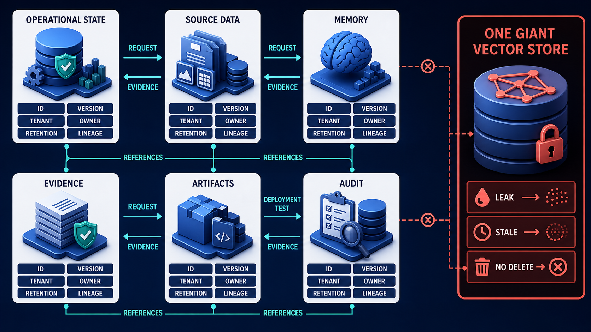
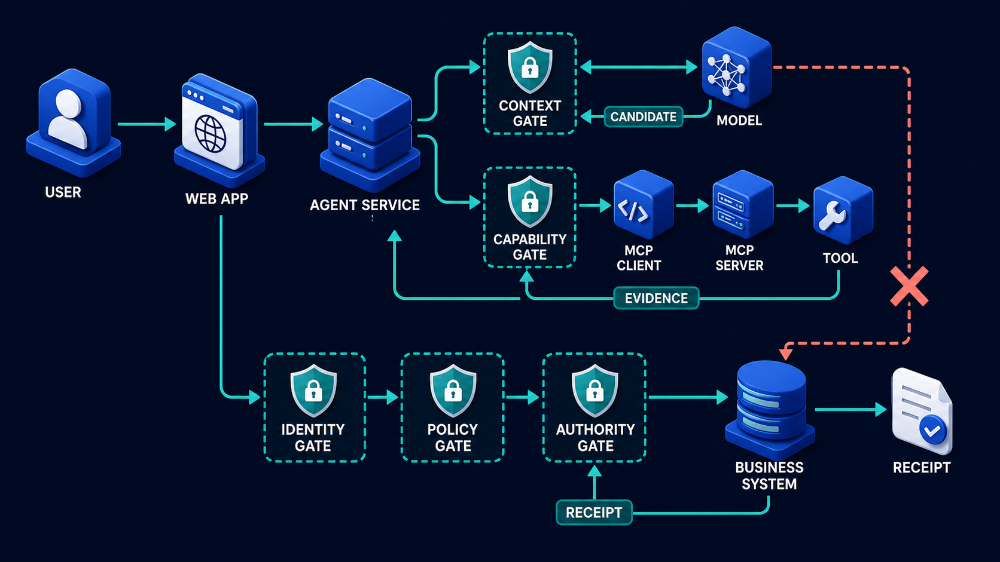

# Diagram 226 — State, data, memory, evidence, artifact, and audit architecture

**Module:** Reference architecture and contracts
**Role in the course:** Give each kind of data a clear purpose, owner, lifetime, authority, and deletion path instead of treating every record as agent memory.
**Layout:** OPERATIONAL STATE begins on the left and the diagram flows toward REFERENCES; a teal **REFERENCES** path is the desired route and a coral **ONE GIANT VECTOR STORE** path is blocked or contained.

---

## At a glance

**State, data, memory, evidence, artifact, and audit architecture** — Give each kind of data a clear purpose, owner, lifetime, authority, and deletion path instead of treating every record as agent memory.

- The central takeaway is: Name the data kind, owner, lifetime, and lineage before choosing a store or index.
- The visual begins with **OPERATIONAL STATE** and ends with the diagram's outcome, not a technology name.
- The safe or selected path is marked **teal**: REFERENCES link stores without copying secrets.
- The blocked or dangerous path is marked **coral**: ONE GIANT VECTOR STORE creates LEAK, STALE, NO DELETE.
- The analogy is: A library separates the original book, the catalogue, a reader's bookmark, a research note, a printed report, and the borrowing record. Putting every item into one unlabeled box would make search, ownership, and deletion impossible.

---

## What the diagram teaches

### 1. State, data, memory, evidence, artifact, and audit architecture

Artifacts are durable outputs. Audit records who or what performed a governed transition. A convenient transcript dump is not a responsible memory architecture. In the diagram, **OPERATIONAL STATE**, **SOURCE DATA**, **MEMORY** appear at the left, turning this idea into something a reviewer can point at.

### 2. Classify Every Data Object as State, Source, Memory, Evidence, Artifact, Audit

Operational state tracks what the workflow is doing. Source data is the original business record. Evidence needs provenance: source identifier, version, retrieval time, content hash, applicable scope, transformation, and the claim it supports. Access to audit records is itself privileged and monitored. This makes incident reconstruction and portfolio proof possible without claiming that logs are the business source of truth. The visual places **SOURCE DATA**, **OPERATIONAL STATE**, **MEMORY** at the center; the arrows between them are the physical expression of this principle. If this is skipped, calling all retained context memory can conceal authority, overcollection, stale evidence, cross-tenant search, and incomplete deletion.

Diagram 225 — *Capability, context, model, tool, and authority boundaries* is the next lens on this idea. The same concepts reappear there with different emphasis, so the two diagrams should be read as a pair.

### 3. Assign Owner, Authority, Tenant, Privacy Class, Retention, Indexing, and Deletion Behavior.

Different authority, retention, privacy, indexing, access, and deletion rules apply. The trace asks the team to assign owner, authority, tenant, privacy class, retention, indexing, and deletion behavior. Look at **TENANT**, **OWNER**, **RETENTION** on the top: the diagram uses those elements to show where this decision lives.

### 4. Use Stable References and Hashes Between Stores Instead of Uncontrolled Copies.

Memory carries deliberately retained preferences or context. The picture shows **REFERENCES** as the visual anchor for this idea, with the surrounding paths showing the flow. The project confirms the point: The architecture inventory identifies each copy, derivative, owner, and retention rule.

### 5. Define Lineage from Input and Evidence Through Proposal, Decision, Effect, and Receipt.

Evidence supports a claim. An embedding is a search aid, not the authoritative evidence record. Audit should record governed facts and receipts without copying unnecessary secrets, private prompts, raw customer content, or model reasoning. Lineage connects a proposal and outcome back to versions of policy, tools, models, prompts, adapters, evidence, and human decisions. To put this into practice, the team should define lineage from input and evidence through proposal, decision, effect, and receipt. At the bottom, **EVIDENCE**, **LINEAGE** is the element that makes this concept concrete before any code is written.

### 6. Test Export, Correction, Expiry, Legal Hold Where Applicable, and Verified Deletion End to End.

Memory requires an explicit purpose, subject, scope, consent or other valid basis, owner, expiry, correction path, and deletion verification. In the diagram, **OPERATIONAL STATE**, **SOURCE DATA**, **ONE GIANT VECTOR STORE** appear at the lower right, turning this idea into something a reviewer can point at. If this is skipped, calling all retained context memory can conceal authority, overcollection, stale evidence, cross-tenant search, and incomplete deletion.

### 7. Name the data kind, owner, lifetime, and lineage

These categories may reference one another, but they should not silently collapse into one database or vector index. The visual places **SOURCE DATA**, **OWNER**, **LINEAGE** at the upper left; the arrows between them are the physical expression of this principle.

### Analogy

A library separates the original book, the catalogue, a reader's bookmark, a research note, a printed report, and the borrowing record. Putting every item into one unlabeled box would make search, ownership, and deletion impossible. Look at **OPERATIONAL STATE**, **SOURCE DATA**, **ONE GIANT VECTOR STORE** on the left: the diagram uses those elements to show where this decision lives. The project confirms the point: Maya deletes a remembered customer preference, but Acme discovers the text still exists in embeddings, a cache, and a generated report.

### The Next.js surface

The Next.js surface must own the human experience while keeping authority and secrets on the server side. In this diagram, that means the web boundary stops the coral anti-patterns before they reach the browser.

- Render provenance and retention in evidence and memory views so Maya can distinguish current source, saved preference, generated artifact, and audit receipt.
- Keep downloaded artifacts addressable and authorized; do not embed private source data in client URLs, analytics, or component props.
- Provide export, correction, memory controls, and deletion status with accessible progress and final verification receipts.

Together these choices prevent the mistakes in the Acme case—Maya deletes a remembered customer preference, but Acme discovers the text still exists in embeddings, a cache, and a generated report.—from becoming the architecture.

### The Python surface

The Python surface must keep business rules, protocols, and persistence in cleanly separated layers. In this diagram, that means FastAPI is one edge of a domain that does not leak into adapters or the model.

- Use separate domain models and repositories for workflow state, evidence, artifacts, memory, audit, and authoritative business records.
- Centralize lineage identifiers and tenant checks while giving each store its own retention, encryption, indexing, and deletion adapter.
- Test cascades as explicit workflows; deletion must reach vector entries, caches, artifacts, derived records, and provider copies or document justified exceptions.

These boundaries make the Acme case—Maya deletes a remembered customer preference, but Acme discovers the text still exists in embeddings, a cache, and a generated report.—testable and replaceable.

---

## Case study — Maya deletes a remembered customer preference

Maya deletes a remembered customer preference, but Acme discovers the text still exists in embeddings, a cache, and a generated report.

### The walkthrough

1. The architecture inventory identifies each copy, derivative, owner, and retention rule.
2. A deletion workflow follows lineage to memory, vector index, cache, and eligible artifacts.
3. The source business record remains because it has a different authority and retention rule, which the interface explains.
4. The deletion receipt lists completed locations, justified holds, failures, retries, and the verification time.

### The result

Maya receives an honest, scoped deletion outcome instead of a false promise based on one database row.

### The danger

Calling all retained context memory can conceal authority, overcollection, stale evidence, cross-tenant search, and incomplete deletion.

### The takeaway

Name the data kind, owner, lifetime, and lineage before choosing a store or index.

---

## Composition

The picture is a data architecture map. Six cobalt platform cards—**OPERATIONAL STATE**, **SOURCE DATA**, **MEMORY**, **EVIDENCE**, **ARTIFACTS**, **AUDIT**—sit as separate stores across the scene. White attribute cards—**IDS**, **VERSION**, **TENANT**, **OWNER**, **RETENTION**, **LINEAGE**—float above them. Teal **REFERENCES** arrows link the stores without copying secrets. On the right, a coral **ONE GIANT VECTOR STORE** card creates **LEAK**, **STALE**, and **NO DELETE**. The composition argues for separation, not consolidation.

## Element by element

- **OPERATIONAL STATE** — Operational state tracks what the workflow is doing.
- **SOURCE DATA** — Source data is the original business record.
- **ONE GIANT VECTOR STORE** — the coral anti-pattern that collapses operational state, source data, memory, evidence, artifacts, and audit into one ungoverned index.
- **NO DELETE** — a consequence of the coral ONE GIANT VECTOR STORE: data cannot be fully removed.
- **MEMORY** — Memory carries deliberately retained preferences or context.
- **EVIDENCE** — Evidence supports a claim.
- **ARTIFACTS** — Artifacts are durable outputs.
- **AUDIT** — Audit records who or what performed a governed transition.
- **VERSION** — Evidence needs provenance: source identifier, version, retrieval time, content hash, applicable scope, transformation, and the claim it supports.
- **TENANT** — Assign owner, authority, tenant, privacy class, retention, indexing, and deletion behavior.
- **OWNER** — Memory requires an explicit purpose, subject, scope, consent or other valid basis, owner, expiry, correction path, and deletion verification.
- **RETENTION** — Different authority, retention, privacy, indexing, access, and deletion rules apply.
- **LINEAGE** — Lineage connects a proposal and outcome back to versions of policy, tools, models, prompts, adapters, evidence, and human decisions.
- **REFERENCES** — Use stable references and hashes between stores instead of uncontrolled copies.
- **LEAK** — a consequence of the coral ONE GIANT VECTOR STORE: sensitive data becomes reachable.
- **STALE** — a consequence of the coral ONE GIANT VECTOR STORE: outdated copies are used.
- **IDS** — the IDS card shown in this diagram; it is one of the labeled elements the architecture uses.

---

## Colour and flow semantics

The course visual grammar uses color to separate platforms, requests, safe paths, danger, and records. In this diagram those colors are assigned as follows:
- **Cobalt platform** — a product, service, environment, or boundary. The main structural cards such as **OPERATIONAL STATE**, **SOURCE DATA**, **MEMORY**, **EVIDENCE**, **ARTIFACTS**, **AUDIT** sit on glowing cobalt platforms.
- **Cyan arrow** — a typed request, event, artifact, deployment, test, or evidence handoff. The cyan paths between **OPERATIONAL STATE**, **SOURCE DATA**, **MEMORY**, **EVIDENCE** carry the forward motion of the architecture.
- **Teal arrow** — an authoritative decision, verified contract, passing gate, safe release, or recovered service. The teal elements **REFERENCES** show the path the design wants to keep open.
- **Coral path** — an unacceptable outcome, failed boundary, broken contract, unsafe release, or unrecovered effect. The coral elements **ONE GIANT VECTOR STORE**, **LEAK**, **STALE**, **NO DELETE** show what must be blocked or contained.
- **White card** — a requirement, schema, service, test, gate, owner, artifact, or receipt. The white cards such as **EVIDENCE**, **ARTIFACTS**, **AUDIT**, **VERSION**, **OWNER** are the readable records the diagram communicates.

---

## How to present it

- Point to **OPERATIONAL STATE** and ask the room to state the human problem or outcome before naming any technology, protocol, or model.
- Point to **SOURCE DATA** and ask what would have to change for the team to classify every data object as state, source, memory, evidence, artifact, audit, or an explicit combination, and who would own that change.
- Point to **TENANT** and ask what evidence would show the team has already assign owner, authority, tenant, privacy class, retention, indexing, and deletion behavior, and what test would fail first if it is missing.
- Point to **REFERENCES** and ask who else in the room must agree before the team can use stable references and hashes between stores instead of uncontrolled copies, and what would change their mind.
- Point to **EVIDENCE** and ask what the smallest version of define lineage from input and evidence through proposal, decision, effect, and receipt looks like, and what would be left out of that version.
- Point to **ONE GIANT VECTOR STORE** and ask what would have to change for the team to test export, correction, expiry, legal hold where applicable, and verified deletion end to end, and who would own that change.
- Trace the **teal** path (REFERENCES link stores without copying secrets) and ask what evidence would prove the real system follows it, who collects that evidence, and how often it is refreshed.
- Show the **coral** path (ONE GIANT VECTOR STORE creates LEAK, STALE, NO DELETE) and ask what control, owner, or test would catch it before a user is harmed, and what the safe state would be if it is triggered.
- Point to **AUDIT** and ask who owns it, what evidence it needs, what happens when that evidence is missing, and which test proves the gate cannot be bypassed.
- Point to **OWNER** and ask who owns it, what evidence it needs, what happens when that evidence is missing, and which test proves the gate cannot be bypassed.
- Use the analogy: A library separates the original book, the catalogue, a reader's bookmark, a research note, a printed report, and the borrowing record. Putting every item into one unlabeled box would make search, ownership, and deletion impossible. Ask how the same failure would appear in the team's current code or process.
- Return to the whole diagram and ask the room to name one thing they will stop, one thing they will start, and one thing they will own differently before the next build.
- Run the lab: Create a data inventory for twenty Acme objects. Classify each, then add authority, tenant, privacy, owner, retention, encryption, index, cache, lineage, export, correction, deletion, audit, and incident requirements.
- Pose the checkpoint: *Is a vector index the source of truth for policy evidence?*

---

## Lab and checkpoint

**Lab:** Create a data inventory for twenty Acme objects. Classify each, then add authority, tenant, privacy, owner, retention, encryption, index, cache, lineage, export, correction, deletion, audit, and incident requirements.

**Checkpoint:** Is a vector index the source of truth for policy evidence?

**Answer:** No. It helps retrieve candidates. The authoritative source record and its version establish the evidence; the index must preserve a reference back to it.

---

## Glossary

- **Lineage** — trace of where data came from and how it changed
- **Artifact** — durable output of a task
- **Retention** — rule for how long data is kept

---

## Sources

- NIST Generative AI Profile
- PostgreSQL documentation
- pgvector documentation

---

## Related lessons

- **Lesson 225** — Capability, context, model, tool, and authority boundaries (`enterprise-boundary-stack`)
- **Lesson 234** — Database, vector index, queue, cache, and artifact storage (`polyglot-storage-decision-map`)
- **Lesson 235** — Telemetry, evaluation, analytics, and cost control (`telemetry-evaluation-cost-control-plane`)
---

### Why this diagram must precede the build

The team should not begin with code, prompts, or models for State, data, memory, evidence, artifact, and audit architecture until the diagram is legible to every reviewer. Give each kind of data a clear purpose, owner, lifetime, authority, and deletion path instead of treating every record as agent memory. The trace moves through 5 decisions: Classify every data object as state, source, memory, evidence, artifact, audit, or an explicit combination.; Assign owner, authority, tenant, privacy class, retention, indexing, and deletion behavior.; Use stable references and hashes between stores instead of uncontrolled copies.; Define lineage from input and evidence through proposal, decision, effect, and receipt.; Test export, correction, expiry, legal hold where applicable, and verified deletion end to end.. Each decision maps to a labeled element in the picture, and each label must have an owner, a contract, and an acceptance test before the corresponding code is written.

The case study—Maya deletes a remembered customer preference, but Acme discovers the text still exists in embeddings, a cache, and a generated report.—shows that Name the data kind, owner, lifetime, and lineage before choosing a store or index. If the team skips this, Calling all retained context memory can conceal authority, overcollection, stale evidence, cross-tenant search, and incomplete deletion. The diagram is the contract the two projects share. Until the team can trace the problem through the labels, assign owners to each card, and write the corresponding test, the build will drift from the architecture.

Before writing the first route, prompt, or adapter, the team should be able to answer: what is the user outcome this diagram protects, which card owns each decision, what evidence moves across each arrow, where the coral anti-patterns first appear, what test or gate proves the real system matches the picture, and which fixture will catch the next regression. When those answers are visible and reviewable, the build becomes a direct translation of the architecture rather than a guess about it. The diagram is the earliest acceptance test the project can write. Keeping it current is cheaper than debugging the drift it prevents. A reviewer who cannot read the diagram will not be able to read the build. Start every build review by pointing at the diagram, not the code.