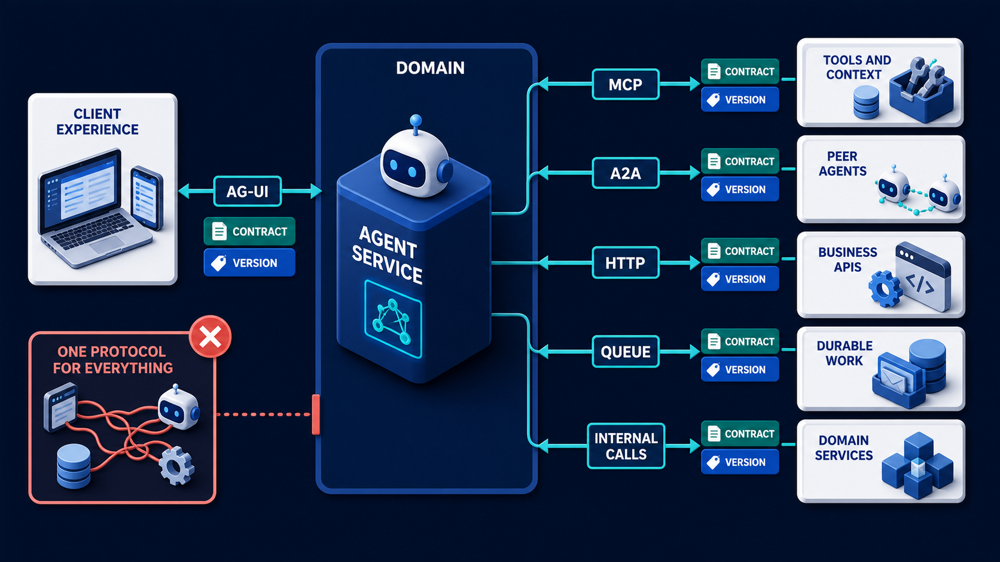
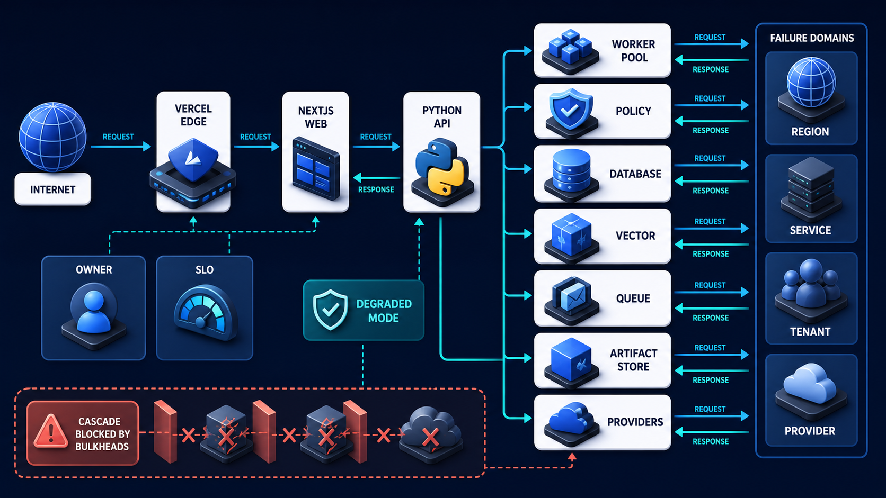

# Diagram 227 — MCP, A2A, AG-UI, HTTP, queue, and internal boundaries

**Module:** Reference architecture and contracts
**Role in the course:** Select a protocol or transport from the relationship and failure needs at each boundary instead of forcing one protocol across the whole system.
**Layout:** CLIENT EXPERIENCE begins on the left and the diagram flows toward AGENT SERVICE; a teal **the safe path** path is the desired route and a coral **ONE PROTOCOL FOR EVERYTHING** path is blocked or contained.

---

## At a glance

**MCP, A2A, AG-UI, HTTP, queue, and internal boundaries** — Select a protocol or transport from the relationship and failure needs at each boundary instead of forcing one protocol across the whole system.

- The central takeaway is: Choose the boundary first, then the protocol; keep product contracts on your side of every adapter.
- The visual begins with **CLIENT EXPERIENCE** and ends with the diagram's outcome, not a technology name.
- The blocked or dangerous path is marked **coral**: ONE PROTOCOL FOR EVERYTHING is blocked.
- The analogy is: A city uses sidewalks, roads, railways, cargo ports, and radio channels because people, parcels, trains, and emergencies have different movement needs. One giant road would not make every journey simpler.

---

## What the diagram teaches

### 1. MCP, A2A, AG-UI, HTTP, queue, and internal boundaries

Ordinary HTTP remains appropriate for stable business APIs. In the diagram, **INTERNAL CALLS**, **HTTP**, **QUEUE** appear at the left, turning this idea into something a reviewer can point at.

### 2. Name the Relationship: Frontend Interaction, Tool Access, Peer Delegation, Business Command, Durable Work

AG-UI connects agent execution to an interactive frontend through typed events. The visual places **DURABLE WORK**, **TOOLS AND CONTEXT**, **PEER AGENTS** at the center; the arrows between them are the physical expression of this principle. If this is skipped, forcing one protocol everywhere can erase delivery semantics, make retries unsafe, and couple product logic to a changing SDK.

### 3. Name Duration, Streaming, Retry, Ordering, Discovery, Identity, and Failure Requirements.

Diagram 228 — *Deployment topology, failure domains, and ownership* is the next lens on this idea. The same concepts reappear there with different emphasis, so the two diagrams should be read as a pair.

A2A connects independently capable agents through tasks, messages, artifacts, discovery, and update mechanisms. A queue is appropriate when work must survive request loss, absorb bursts, retry, or continue beyond one connection. The choice depends on discovery, direction, duration, streaming, delivery guarantee, ordering, identity, version negotiation, payload size, fan-out, cancellation, retry, and ownership—not on which acronym is newest. The trace asks the team to list duration, streaming, retry, ordering, discovery, identity, and failure requirements. Look at **CLIENT EXPERIENCE**, **AGENT SERVICE**, **TOOLS AND CONTEXT** on the top: the diagram uses those elements to show where this decision lives.

### 4. Choose the Smallest Suitable Protocol or Transport and Write the Reason Beside the Arrow.

The architecture may use several protocols in one user journey. The design stays understandable because each arrow has one purpose, one contract owner, one version policy, and one failure story. The picture shows **ONE PROTOCOL FOR EVERYTHING** as the visual anchor for this idea, with the surrounding paths showing the flow. The project confirms the point: Maya classifies the browser relationship as typed interactive state and selects AG-UI through a product adapter.

### 5. Translate at an Adapter Into a Versioned Product Contract with Correlation and Idempotency.

Adapters translate external protocol objects into product-owned contracts. Every boundary needs correlation and idempotency. To put this into practice, the team should translate at an adapter into a versioned product contract with correlation and idempotency. At the bottom, **CONTRACT** is the element that makes this concept concrete before any code is written.

### 6. Test Timeout, Duplicate, Out-of-order, Unavailable Peer, Incompatible Version, and Uncertain-effect Cases.

Domain services should not depend directly on a vendor callback, SDK event, or remote Agent Card shape. A retry after an uncertain response must not create a second refund, and a replayed event must not become a second user notification or audit fact. In the diagram, **PEER AGENTS**, **VERSION** appear at the lower right, turning this idea into something a reviewer can point at. If this is skipped, forcing one protocol everywhere can erase delivery semantics, make retries unsafe, and couple product logic to a changing SDK.

### 7. Choose the boundary first, then the protocol

MCP connects an application host to servers that expose declared context and capabilities. Internal function calls are simplest inside one owned process boundary. The visual places **ONE PROTOCOL FOR EVERYTHING** at the upper left; the arrows between them are the physical expression of this principle.

### Analogy

A city uses sidewalks, roads, railways, cargo ports, and radio channels because people, parcels, trains, and emergencies have different movement needs. One giant road would not make every journey simpler. Look at **CLIENT EXPERIENCE**, **AGENT SERVICE**, **TOOLS AND CONTEXT** on the left: the diagram uses those elements to show where this decision lives. The project confirms the point: Acme initially tries to use MCP for the browser stream, peer-agent delegation, refund API, and background export job.

### The Next.js surface

The Next.js surface must own the human experience while keeping authority and secrets on the server side. In this diagram, that means the web boundary stops the coral anti-patterns before they reach the browser.

- Use HTTP or Server Actions for bounded user commands and an AG-UI adapter for live agent state; keep protocol decoding outside React components.
- Represent correlation, run, task, artifact, proposal, and receipt identifiers in a typed client projection without exposing secrets.
- Design reconnect and duplicate fixtures so a refreshed route cannot replay a consequential command or lose a durable task handle.

Together these choices prevent the mistakes in the Acme case—Acme initially tries to use MCP for the browser stream, peer-agent delegation, refund API, and background export job.—from becoming the architecture.

### The Python surface

The Python surface must keep business rules, protocols, and persistence in cleanly separated layers. In this diagram, that means FastAPI is one edge of a domain that does not leak into adapters or the model.

- Create separate MCP, A2A, AG-UI, HTTP, and queue adapter packages that emit product commands and events.
- Keep domain handlers transport-independent and require idempotency keys at effectful business boundaries.
- Run conformance fixtures per adapter plus end-to-end failure tests that cross multiple boundaries and preserve one trace identity.

These boundaries make the Acme case—Acme initially tries to use MCP for the browser stream, peer-agent delegation, refund API, and background export job.—testable and replaceable.

---

## Case study — Acme initially tries to use MCP for the browser stream

Acme initially tries to use MCP for the browser stream, peer-agent delegation, refund API, and background export job.

### The walkthrough

1. Maya classifies the browser relationship as typed interactive state and selects AG-UI through a product adapter.
2. Peer research remains A2A; declared tools and evidence stay MCP; refund commit remains an ordinary governed business API.
3. A durable export uses a queue and returns a task handle rather than holding the web request open.
4. One end-to-end trace links the journey while each boundary keeps its own contract and retry policy.

### The result

Each connection is easier to explain, test, operate, and replace because it solves one relationship well.

### The danger

Forcing one protocol everywhere can erase delivery semantics, make retries unsafe, and couple product logic to a changing SDK.

### The takeaway

Choose the boundary first, then the protocol; keep product contracts on your side of every adapter.

---

## Composition

The picture is a protocol routing map. On the left, a **CLIENT EXPERIENCE** card connects by an **AG-UI** cyan arrow to an **AGENT SERVICE** platform in the center. From the agent service, four cyan arrows branch: **MCP** to **TOOLS AND CONTEXT**, **A2A** to **PEER AGENTS**, **HTTP** to **BUSINESS APIS**, **QUEUE** to **DURABLE WORK**, and a short **INTERNAL CALLS** arrow stays inside the **DOMAIN**. Each arrow carries a **CONTRACT** and **VERSION** card. A coral **ONE PROTOCOL FOR EVERYTHING** arrow on the right is blocked. The composition shows one service speaking several dialects.

## Element by element

- **CLIENT EXPERIENCE** — a labeled visual element in this diagram; the prompt shows it as CLIENT EXPERIENCE connected by AG-UI to AGENT SERVICE.
- **AGENT SERVICE** — a labeled visual element in this diagram; the prompt shows it as CLIENT EXPERIENCE connected by AG-UI to AGENT SERVICE.
- **TOOLS AND CONTEXT** — a labeled visual element in this diagram; the prompt shows it as AGENT SERVICE uses MCP to TOOLS AND CONTEXT.
- **PEER AGENTS** — a labeled visual element in this diagram; the prompt shows it as A2A to PEER AGENTS.
- **BUSINESS APIS** — Ordinary HTTP remains appropriate for stable business APIs.
- **DURABLE WORK** — Name the relationship: frontend interaction, tool access, peer delegation, business command, durable work, or internal logic.
- **INTERNAL CALLS** — Internal function calls are simplest inside one owned process boundary.
- **ONE PROTOCOL FOR EVERYTHING** — the coral anti-pattern of forcing a single transport on every relationship regardless of need.
- **HTTP** — Ordinary HTTP remains appropriate for stable business APIs.
- **QUEUE** — A queue is appropriate when work must survive request loss, absorb bursts, retry, or continue beyond one connection.
- **DOMAIN** — Domain services should not depend directly on a vendor callback, SDK event, or remote Agent Card shape.
- **CONTRACT** — The design stays understandable because each arrow has one purpose, one contract owner, one version policy, and one failure story.
- **VERSION** — The choice depends on discovery, direction, duration, streaming, delivery guarantee, ordering, identity, version negotiation, payload size, fan-out, cancellation, retry, and ownership—not on which acronym is newest.

---

## Colour and flow semantics

The course visual grammar uses color to separate platforms, requests, safe paths, danger, and records. In this diagram those colors are assigned as follows:
- **Cobalt platform** — a product, service, environment, or boundary. The main structural cards such as **CLIENT EXPERIENCE**, **AGENT SERVICE**, **TOOLS AND CONTEXT**, **PEER AGENTS**, **BUSINESS APIS**, **DURABLE WORK** sit on glowing cobalt platforms.
- **Cyan arrow** — a typed request, event, artifact, deployment, test, or evidence handoff. The cyan paths between **CLIENT EXPERIENCE**, **AGENT SERVICE**, **TOOLS AND CONTEXT**, **PEER AGENTS** carry the forward motion of the architecture.
- **Coral path** — an unacceptable outcome, failed boundary, broken contract, unsafe release, or unrecovered effect. The coral elements **ONE PROTOCOL FOR EVERYTHING** show what must be blocked or contained.
- **White card** — a requirement, schema, service, test, gate, owner, artifact, or receipt. The white cards such as **CLIENT EXPERIENCE**, **AGENT SERVICE**, **TOOLS AND CONTEXT**, **PEER AGENTS**, **BUSINESS APIS**, **DURABLE WORK**, **INTERNAL CALLS**, **HTTP** are the readable records the diagram communicates.

---

## How to present it

- Point to **CLIENT EXPERIENCE** and ask the room to state the human problem or outcome before naming any technology, protocol, or model.
- Point to **DURABLE WORK** and ask what would have to change for the team to name the relationship: frontend interaction, tool access, peer delegation, business command, durable work, or internal logic, and who would own that change.
- Point to **AGENT SERVICE** and ask what evidence would show the team has already list duration, streaming, retry, ordering, discovery, identity, and failure requirements, and what test would fail first if it is missing.
- Point to **ONE PROTOCOL FOR EVERYTHING** and ask who else in the room must agree before the team can choose the smallest suitable protocol or transport and write the reason beside the arrow, and what would change their mind.
- Point to **CONTRACT** and ask what the smallest version of translate at an adapter into a versioned product contract with correlation and idempotency looks like, and what would be left out of that version.
- Point to **PEER AGENTS** and ask what would have to change for the team to test timeout, duplicate, out-of-order, unavailable peer, incompatible version, and uncertain-effect cases, and who would own that change.
- Show the **coral** path (ONE PROTOCOL FOR EVERYTHING is blocked) and ask what control, owner, or test would catch it before a user is harmed, and what the safe state would be if it is triggered.
- Point to **DOMAIN** and ask who owns it, what evidence it needs, what happens when that evidence is missing, and which test proves the gate cannot be bypassed.
- Use the analogy: A city uses sidewalks, roads, railways, cargo ports, and radio channels because people, parcels, trains, and emergencies have different movement needs. One giant road would not make every journey simpler. Ask how the same failure would appear in the team's current code or process.
- Return to the whole diagram and ask the room to name one thing they will stop, one thing they will start, and one thing they will own differently before the next build.
- Run the lab: For twelve Acme connections, choose MCP, A2A, AG-UI, HTTP, queue, or internal call. Document direction, duration, streaming, delivery, ordering, discovery, version, identity, idempotency, timeout, retry, ownership, and failure tests.
- Pose the checkpoint: *Should a durable background job remain attached to one browser request until it finishes?*

---

## Lab and checkpoint

**Lab:** For twelve Acme connections, choose MCP, A2A, AG-UI, HTTP, queue, or internal call. Document direction, duration, streaming, delivery, ordering, discovery, version, identity, idempotency, timeout, retry, ownership, and failure tests.

**Checkpoint:** Should a durable background job remain attached to one browser request until it finishes?

**Answer:** Usually no. Return a durable handle, process through a suitable work system, and let the client reconnect or receive governed updates.

---

## Glossary

- **Adapter** — boundary code translating external and internal contracts
- **Idempotency** — repeated request produces no extra effect
- **Delivery semantics** — rules for whether and how messages may repeat or disappear

---

## Sources

- MCP 2026-07-28 specification
- A2A 1.0 specification
- AG-UI architecture
- AsyncAPI 3.0.0 specification

---

## Related lessons

- **Lesson 225** — Capability, context, model, tool, and authority boundaries (`enterprise-boundary-stack`)
- **Lesson 228** — Deployment topology, failure domains, and ownership (`deployment-topology-failure-domains`)
- **Lesson 232** — Cross-stack integration, adapters, and end-to-end tests (`cross-stack-adapter-test-loop`)
---

### Why this diagram must precede the build

The team should not begin with code, prompts, or models for MCP, A2A, AG-UI, HTTP, queue, and internal boundaries until the diagram is legible to every reviewer. Select a protocol or transport from the relationship and failure needs at each boundary instead of forcing one protocol across the whole system. The trace moves through 5 decisions: Name the relationship: frontend interaction, tool access, peer delegation, business command, durable work, or internal logic.; List duration, streaming, retry, ordering, discovery, identity, and failure requirements.; Choose the smallest suitable protocol or transport and write the reason beside the arrow.; Translate at an adapter into a versioned product contract with correlation and idempotency.; Test timeout, duplicate, out-of-order, unavailable peer, incompatible version, and uncertain-effect cases.. Each decision maps to a labeled element in the picture, and each label must have an owner, a contract, and an acceptance test before the corresponding code is written.

The case study—Acme initially tries to use MCP for the browser stream, peer-agent delegation, refund API, and background export job.—shows that Choose the boundary first, then the protocol; keep product contracts on your side of every adapter. If the team skips this, Forcing one protocol everywhere can erase delivery semantics, make retries unsafe, and couple product logic to a changing SDK. The diagram is the contract the two projects share. Until the team can trace the problem through the labels, assign owners to each card, and write the corresponding test, the build will drift from the architecture.

Before writing the first route, prompt, or adapter, the team should be able to answer: what is the user outcome this diagram protects, which card owns each decision, what evidence moves across each arrow, where the coral anti-patterns first appear, what test or gate proves the real system matches the picture, and which fixture will catch the next regression. When those answers are visible and reviewable, the build becomes a direct translation of the architecture rather than a guess about it. The diagram is the earliest acceptance test the project can write. Keeping it current is cheaper than debugging the drift it prevents. A reviewer who cannot read the diagram will not be able to read the build. Start every build review by pointing at the diagram, not the code.