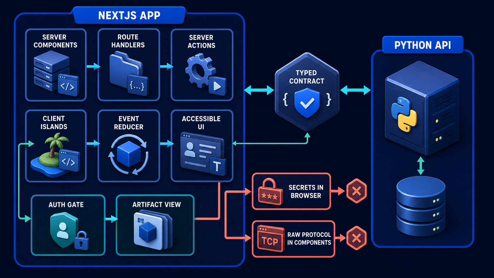
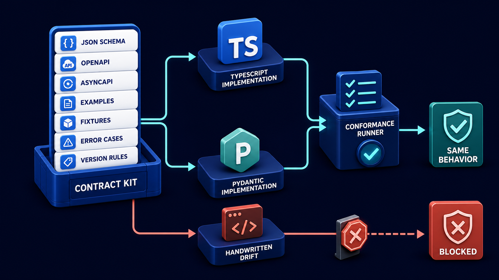

# Diagram 230 — Next.js and React responsibility map

**Module:** Dual-stack implementation blueprint
**Role in the course:** Assign the future Next.js and React project a clear web responsibility without turning the browser into the agent backend or source of truth.
**Layout:** NEXTJS APP begins on the left and the diagram flows toward SERVER COMPONENTS; a teal **the safe path** path is the desired route and a coral **SECRETS IN BROWSER** path is blocked or contained.

---

## At a glance

**Next.js and React responsibility map** — Assign the future Next.js and React project a clear web responsibility without turning the browser into the agent backend or source of truth.

- The central takeaway is: Let Next.js own the trustworthy experience; let typed services own privileged coordination and business truth.
- The visual begins with **NEXTJS APP** and ends with the diagram's outcome, not a technology name.
- The blocked or dangerous path is marked **coral**: SECRETS IN BROWSER and RAW PROTOCOL IN COMPONENTS are blocked.
- The analogy is: A theatre's front of house guides the audience, checks tickets, shows status, and handles accessibility. It does not move scenery by reaching directly into backstage machinery; it coordinates through defined cues and responsible staff.

---

## What the diagram teaches

### 1. Next.js and React responsibility map

Route Handlers and Server Actions provide trusted web boundaries, but every consequential command still calls the product service with identity, tenant, intent, revision, idempotency, and authorization evidence. In the diagram, **NEXTJS APP** appear at the left, turning this idea into something a reviewer can point at.

### 2. Map Each User Journey to Routes, Layouts, Initial Server Data, and Interactive Client Islands.

Server Components are useful for secure data access and initial rendering. A server location alone does not create permission. The visual places **CLIENT ISLANDS**, **SERVER COMPONENTS**, **SERVER ACTIONS** at the center; the arrows between them are the physical expression of this principle. If this is skipped, putting orchestration, secrets, authority, and raw protocol handling into client components makes the system difficult to secure, test, and explain.

### 3. Define Web-to-service Commands, Queries, Streams, Artifacts, Errors, and Identity Propagation.

A reducer creates explicit projections for progress, evidence, proposals, decisions, artifacts, error, and recovery instead of parsing text. The trace asks the team to define web-to-service commands, queries, streams, artifacts, errors, and identity propagation. Look at **NEXTJS APP**, **SERVER COMPONENTS**, **ROUTE HANDLERS** on the top: the diagram uses those elements to show where this decision lives.

### 4. Adapt External Events Into a Small Typed Reducer and Accessible Component Catalog.

Client Components are reserved for live streams, reducers, optimistic input, focus management, interactive diagrams, and device behavior that truly requires the browser. The event adapter converts AG-UI or service updates into product-owned TypeScript events. The picture shows **SERVER COMPONENTS**, **EVENT REDUCER**, **ACCESSIBLE UI** as the visual anchor for this idea, with the surrounding paths showing the flow. The project confirms the point: Maya moves provider access and coordination behind the Python service and trusted server boundaries.

### 5. Protect Secrets and Tenant Data at Server Boundaries

It does not own model secrets or authoritative refund truth. Provider credentials, raw tokens, private prompts, privileged policy details, and unrelated tenant records remain server-side. To put this into practice, the team should protect secrets and tenant data at server boundaries, then recheck authority in the product service. At the bottom, **SERVER COMPONENTS**, **SERVER ACTIONS**, **SECRETS IN BROWSER** is the element that makes this concept concrete before any code is written.

### 6. Test Keyboard, Screen Reader, Stale State, Reconnect, Unauthorized, Slow, Partial, and Recovery Fixtures.

The web project owns the human experience: navigation, readable state, accessible interaction, diagrams, case context, proposals, decisions, artifacts, recovery, learning content, and privacy controls. Accessibility shapes the architecture: semantic routes and headings, keyboard focus after streaming updates, text status, error summaries, reflow, reduced motion, complete diagram explanations, and tested approval dialogs are release requirements. In the diagram, **NEXTJS APP**, **SERVER COMPONENTS**, **ROUTE HANDLERS** appear at the lower right, turning this idea into something a reviewer can point at. If this is skipped, putting orchestration, secrets, authority, and raw protocol handling into client components makes the system difficult to secure, test, and explain.

### 7. Let Next.js own the trustworthy experience

The browser receives the minimum data required for the screen. The visual places **NEXTJS APP** at the upper left; the arrows between them are the physical expression of this principle.

### Analogy

A theatre's front of house guides the audience, checks tickets, shows status, and handles accessibility. It does not move scenery by reaching directly into backstage machinery; it coordinates through defined cues and responsible staff. Look at **NEXTJS APP**, **SERVER COMPONENTS**, **ROUTE HANDLERS** on the left: the diagram uses those elements to show where this decision lives. The project confirms the point: A prototype React component calls a model provider directly, stores its key in public configuration, and treats the final text as a completed refund.

### The Next.js surface

The Next.js surface must own the human experience while keeping authority and secrets on the server side. In this diagram, that means the web boundary stops the coral anti-patterns before they reach the browser.

- Use route groups for public learning, authenticated workspace, tasks, approvals, artifacts, privacy, settings, and administrator review with one shared design system.
- Keep data fetching and mutations server-first, then introduce narrow client components for live event reduction, local drafts, zoom, keyboard labs, and offline progress.
- Create story fixtures for every product state before integrating the Python service, so UI and accessibility behavior are reviewable early.

Diagram 229 — *Shared schemas, contracts, fixtures, and conformance cases* is the next lens on this idea. The same concepts reappear there with different emphasis, so the two diagrams should be read as a pair.

Together these choices prevent the mistakes in the Acme case—A prototype React component calls a model provider directly, stores its key in public configuration, and treats the final text as a completed refund.—from becoming the architecture.

### The Python surface

The Python surface must keep business rules, protocols, and persistence in cleanly separated layers. In this diagram, that means FastAPI is one edge of a domain that does not leak into adapters or the model.

- Publish the contract and mock service the web team needs; do not make the Next.js project import Python implementation details.
- Return typed problem responses, durable handles, artifacts, proposal versions, and receipts that the web app can explain consistently.
- Provide deterministic event recordings for frontend replay and keep privileged policy and provider diagnostics out of user-facing payloads.

These boundaries make the Acme case—A prototype React component calls a model provider directly, stores its key in public configuration, and treats the final text as a completed refund.—testable and replaceable.

---

## Case study — A prototype React component calls a model provider directly

A prototype React component calls a model provider directly, stores its key in public configuration, and treats the final text as a completed refund.

### The walkthrough

1. Maya moves provider access and coordination behind the Python service and trusted server boundaries.
2. The React component consumes typed progress, evidence, proposal, and receipt state instead of raw provider text.
3. The final refund state appears only after the authoritative service returns the committed receipt.
4. A browser test proves that public bundles and network responses contain no provider key or unrelated customer data.

### The result

The web project remains rich and interactive without becoming a secret-bearing business backend.

### The danger

Putting orchestration, secrets, authority, and raw protocol handling into client components makes the system difficult to secure, test, and explain.

### The takeaway

Let Next.js own the trustworthy experience; let typed services own privileged coordination and business truth.

---

## Composition

The picture is a Next.js responsibility map. A **NEXTJS APP** platform in the center contains white cards for **SERVER COMPONENTS**, **ROUTE HANDLERS**, **SERVER ACTIONS**, **CLIENT ISLANDS**, **EVENT REDUCER**, **ACCESSIBLE UI**, **AUTH GATE**, and **ARTIFACT VIEW**. A cyan **TYPED CONTRACT** arrow connects the app to a **PYTHON API** on the right. Two coral blocked paths—**SECRETS IN BROWSER** and **RAW PROTOCOL IN COMPONENTS**—appear at the bottom. The composition keeps privileged work on the server side of the web boundary.

## Element by element

- **NEXTJS APP** — a labeled visual element in this diagram; the prompt shows it as NEXTJS APP with zones SERVER COMPONENTS.
- **SERVER COMPONENTS** — Server Components are useful for secure data access and initial rendering.
- **ROUTE HANDLERS** — Route Handlers and Server Actions provide trusted web boundaries, but every consequential command still calls the product service with identity, tenant, intent, revision, idempotency, and authorization evidence.
- **SERVER ACTIONS** — Route Handlers and Server Actions provide trusted web boundaries, but every consequential command still calls the product service with identity, tenant, intent, revision, idempotency, and authorization evidence.
- **CLIENT ISLANDS** — Map each user journey to routes, layouts, initial server data, and interactive client islands.
- **EVENT REDUCER** — the EVENT REDUCER card shown in this diagram; it is one of the labeled elements the architecture uses.
- **ACCESSIBLE UI** — The web project owns the human experience: navigation, readable state, accessible interaction, diagrams, case context, proposals, decisions, artifacts, recovery, learning content, and privacy controls.
- **AUTH GATE** — the AUTH GATE card shown in this diagram; it is one of the labeled elements the architecture uses.
- **ARTIFACT VIEW** — the ARTIFACT VIEW card shown in this diagram; it is one of the labeled elements the architecture uses.
- **PYTHON API** — a labeled visual element in this diagram; the prompt shows it as to PYTHON API through TYPED CONTRACT.
- **TYPED CONTRACT** — a labeled visual element in this diagram; the prompt shows it as to PYTHON API through TYPED CONTRACT.
- **SECRETS IN BROWSER** — the coral anti-pattern of exposing credentials to the client.
- **RAW PROTOCOL IN COMPONENTS** — the coral anti-pattern of letting React speak provider protocol directly.

---

## Colour and flow semantics

The course visual grammar uses color to separate platforms, requests, safe paths, danger, and records. In this diagram those colors are assigned as follows:
- **Cobalt platform** — a product, service, environment, or boundary. The main structural cards such as **NEXTJS APP**, **SERVER COMPONENTS**, **ROUTE HANDLERS**, **SERVER ACTIONS**, **CLIENT ISLANDS**, **EVENT REDUCER** sit on glowing cobalt platforms.
- **Cyan arrow** — a typed request, event, artifact, deployment, test, or evidence handoff. The cyan paths between **NEXTJS APP**, **SERVER COMPONENTS**, **ROUTE HANDLERS**, **SERVER ACTIONS** carry the forward motion of the architecture.
- **Coral path** — an unacceptable outcome, failed boundary, broken contract, unsafe release, or unrecovered effect. The coral elements **SECRETS IN BROWSER**, **RAW PROTOCOL IN COMPONENTS** show what must be blocked or contained.
- **White card** — a requirement, schema, service, test, gate, owner, artifact, or receipt. The white cards such as **AUTH GATE**, **ARTIFACT VIEW**, **TYPED CONTRACT** are the readable records the diagram communicates.

---

## How to present it

- Point to **NEXTJS APP** and ask the room to state the human problem or outcome before naming any technology, protocol, or model.
- Point to **CLIENT ISLANDS** and ask what would have to change for the team to map each user journey to routes, layouts, initial server data, and interactive client islands, and who would own that change.
- Point to **SERVER COMPONENTS** and ask what evidence would show the team has already define web-to-service commands, queries, streams, artifacts, errors, and identity propagation, and what test would fail first if it is missing.
- Point to **EVENT REDUCER** and ask who else in the room must agree before the team can adapt external events into a small typed reducer and accessible component catalog, and what would change their mind.
- Point to **SERVER ACTIONS** and ask what the smallest version of protect secrets and tenant data at server boundaries, then recheck authority in the product service looks like, and what would be left out of that version.
- Point to **ROUTE HANDLERS** and ask what would have to change for the team to test keyboard, screen reader, stale state, reconnect, unauthorized, slow, partial, and recovery fixtures, and who would own that change.
- Show the **coral** path (SECRETS IN BROWSER and RAW PROTOCOL IN COMPONENTS are blocked) and ask what control, owner, or test would catch it before a user is harmed, and what the safe state would be if it is triggered.
- Point to **AUTH GATE** and ask who owns it, what evidence it needs, what happens when that evidence is missing, and which test proves the gate cannot be bypassed.
- Use the analogy: A theatre's front of house guides the audience, checks tickets, shows status, and handles accessibility. It does not move scenery by reaching directly into backstage machinery; it coordinates through defined cues and responsible staff. Ask how the same failure would appear in the team's current code or process.
- Return to the whole diagram and ask the room to name one thing they will stop, one thing they will start, and one thing they will own differently before the next build.
- Run the lab: Create a route and component blueprint for the Acme web project. Mark every Server Component, Route Handler, Server Action, client island, stream, reducer state, accessibility behavior, cache choice, secret boundary, error, and Python dependency.
- Pose the checkpoint: *Does a Server Action automatically make a refund command authorized?*

---

## Lab and checkpoint

**Lab:** Create a route and component blueprint for the Acme web project. Mark every Server Component, Route Handler, Server Action, client island, stream, reducer state, accessibility behavior, cache choice, secret boundary, error, and Python dependency.

**Checkpoint:** Does a Server Action automatically make a refund command authorized?

**Answer:** No. It is a trusted server-side entrypoint, but identity, tenant, scope, policy, proposal revision, approval, and idempotency still require enforcement.

---

## Glossary

- **Server Component** — component rendered on the server without browser JavaScript by default
- **Client island** — small interactive browser-owned region
- **Projection** — UI state derived from typed records and events

---

## Sources

- Next.js App Router
- Next.js testing
- Vercel environment variables
- WCAG 2.2

---

## Related lessons

- **Lesson 229** — Shared schemas, contracts, fixtures, and conformance cases (`shared-contract-conformance-kit`)
- **Lesson 232** — Cross-stack integration, adapters, and end-to-end tests (`cross-stack-adapter-test-loop`)
- **Lesson 233** — Authentication, secrets, tenants, policy, and audit services (`identity-policy-audit-services`)
---

### Why this diagram must precede the build

The team should not begin with code, prompts, or models for Next.js and React responsibility map until the diagram is legible to every reviewer. Assign the future Next.js and React project a clear web responsibility without turning the browser into the agent backend or source of truth. The trace moves through 5 decisions: Map each user journey to routes, layouts, initial server data, and interactive client islands.; Define web-to-service commands, queries, streams, artifacts, errors, and identity propagation.; Adapt external events into a small typed reducer and accessible component catalog.; Protect secrets and tenant data at server boundaries, then recheck authority in the product service.; Test keyboard, screen reader, stale state, reconnect, unauthorized, slow, partial, and recovery fixtures.. Each decision maps to a labeled element in the picture, and each label must have an owner, a contract, and an acceptance test before the corresponding code is written.

The case study—A prototype React component calls a model provider directly, stores its key in public configuration, and treats the final text as a completed refund.—shows that Let Next.js own the trustworthy experience; let typed services own privileged coordination and business truth. If the team skips this, Putting orchestration, secrets, authority, and raw protocol handling into client components makes the system difficult to secure, test, and explain. The diagram is the contract the two projects share. Until the team can trace the problem through the labels, assign owners to each card, and write the corresponding test, the build will drift from the architecture.

Before writing the first route, prompt, or adapter, the team should be able to answer: what is the user outcome this diagram protects, which card owns each decision, what evidence moves across each arrow, where the coral anti-patterns first appear, what test or gate proves the real system matches the picture, and which fixture will catch the next regression. When those answers are visible and reviewable, the build becomes a direct translation of the architecture rather than a guess about it. The diagram is the earliest acceptance test the project can write. Keeping it current is cheaper than debugging the drift it prevents. A reviewer who cannot read the diagram will not be able to read the build. Start every build review by pointing at the diagram, not the code.