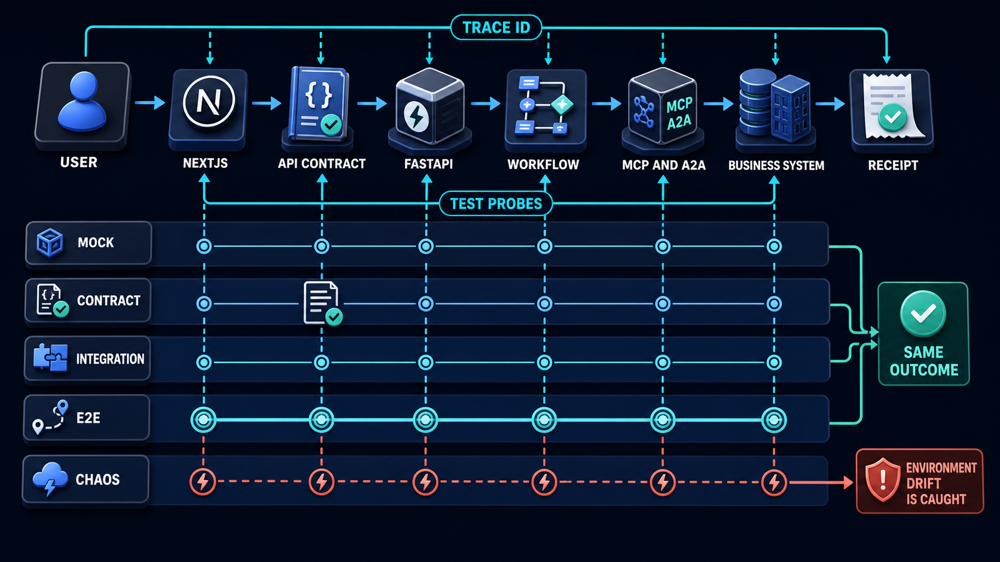
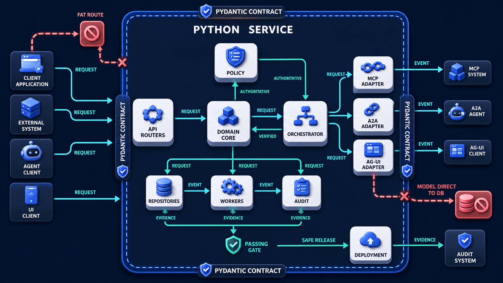

# Diagram 232 — Cross-stack integration, adapters, and end-to-end tests

**Module:** Dual-stack implementation blueprint
**Role in the course:** Join the two future projects through owned adapters and a layered test strategy that proves the whole user story, not only isolated endpoints.
**Layout:** API CONTRACT begins on the left and the diagram flows toward SAME OUTCOME; a teal **SAME OUTCOME** path is the desired route and a coral **ENVIRONMENT DRIFT** path is blocked or contained.

---

## At a glance

**Cross-stack integration, adapters, and end-to-end tests** — Join the two future projects through owned adapters and a layered test strategy that proves the whole user story, not only isolated endpoints.

- The central takeaway is: Prove the baton exchanges and the final user outcome, not only the runners.
- The visual begins with **API CONTRACT** and ends with the diagram's outcome, not a technology name.
- The safe or selected path is marked **teal**: SAME OUTCOME.
- The blocked or dangerous path is marked **coral**: ENVIRONMENT DRIFT is caught.
- The analogy is: A relay team practices individual running, baton exchange, the full race, and bad-weather recovery. Fast individual runners do not prove the baton will reach the finish line.

---

## What the diagram teaches

### 1. Cross-stack integration, adapters, and end-to-end tests

A preview URL connected to uncontrolled production-like data is not a safe test plan. In the diagram, **INTEGRATION** appear at the left, turning this idea into something a reviewer can point at.

### 2. Choose a Vertical User Journey and Assign One Correlation Identity Across Every Service

Integration begins with one user journey and one trace identity. The visual places **USER JOURNEY**, **USER** at the center; the arrows between them are the physical expression of this principle. If this is skipped, unit-test confidence can hide broken serialization, identity propagation, event ordering, accessibility, timeout, and idempotency across real boundaries.

### 3. Define Adapter Inputs, Outputs, Timeouts, Retries, Versions, and Safe Error Mappings.

Adapters protect each side from external volatility. The web adapter converts service data into product state; the Python adapters convert protocol and provider data into domain inputs and results. The trace asks the team to define adapter inputs, outputs, timeouts, retries, versions, and safe error mappings. Look at **API CONTRACT**, **BUSINESS SYSTEM**, **TRACE ID** on the top: the diagram uses those elements to show where this decision lives.

### 4. Build Deterministic Fakes, Then Contract and Integration Fixtures for Each Boundary.

Mock tests give speed, contract tests give boundary agreement, integration tests give real dependency behavior, end-to-end tests give user-story evidence, and fault tests give recovery evidence. A failing test should point to the contract and owner. The picture shows **API CONTRACT**, **CONTRACT**, **INTEGRATION** as the visual anchor for this idea, with the surrounding paths showing the flow. The project confirms the point: The shared fixture defines the expected proposal, decision, committed, receipt, and finished sequence.

### 5. Run the Full Browser-to-receipt Flow with Synthetic Tenant Data and Accessibility Assertions.

The browser request, web server action, Python command, agent task, MCP tool, business effect, event stream, and final receipt must remain correlatable without sharing secrets. End-to-end assertions include accessible text, focus, progress, proposal scope, stale-state blocking, authoritative receipt, persisted artifact, audit correlation, and recovery—not just a 200 response. To put this into practice, the team should run the full browser-to-receipt flow with synthetic tenant data and accessibility assertions. At the bottom, **WORKFLOW**, **RECEIPT** is the element that makes this concept concrete before any code is written.

### 6. Inject Dependency Loss, Duplication, Delay, Stale Evidence, and Uncertain Effects

Test environments need known versions, seeded synthetic data, isolated tenants, deterministic clocks where practical, provider substitutes, and controlled failures. In the diagram, **API CONTRACT**, **BUSINESS SYSTEM**, **TRACE ID** appear at the lower right, turning this idea into something a reviewer can point at. If this is skipped, test environments need known versions, seeded synthetic data, isolated tenants, deterministic clocks where practical, provider substitutes, and controlled failures.

### 7. Prove the baton exchanges and the final user outcome

Each layer answers a different question. The team keeps recordings and manifests so a portfolio demonstration can explain what was proven and what remains intentionally simulated. The visual places **SAME OUTCOME**, **USER JOURNEY**, **USER** at the upper left; the arrows between them are the physical expression of this principle.

### Analogy

A relay team practices individual running, baton exchange, the full race, and bad-weather recovery. Fast individual runners do not prove the baton will reach the finish line. Look at **API CONTRACT**, **BUSINESS SYSTEM**, **TRACE ID** on the left: the diagram uses those elements to show where this decision lives. The project confirms the point: Both projects pass their unit tests, but the browser waits for event names the Python service never emits after an approval.

### The Next.js surface

The Next.js surface must own the human experience while keeping authority and secrets on the server side. In this diagram, that means the web boundary stops the coral anti-patterns before they reach the browser.

- Use browser tests to exercise semantic controls, keyboard flow, network boundaries, streaming state, reconnect, and the final receipt.
- Record trace and task identifiers in authorized test diagnostics without exposing tokens or private payloads to normal users.
- Keep a deterministic service simulator for component development, but run required suites against the real Python contract before release.

Together these choices prevent the mistakes in the Acme case—Both projects pass their unit tests, but the browser waits for event names the Python service never emits after an approval.—from becoming the architecture.

### The Python surface

The Python surface must keep business rules, protocols, and persistence in cleanly separated layers. In this diagram, that means FastAPI is one edge of a domain that does not leak into adapters or the model.

Diagram 231 — *Python and FastAPI responsibility map* is the next lens on this idea. The same concepts reappear there with different emphasis, so the two diagrams should be read as a pair.

- Provide isolated test tenants, seeded records, fake provider adapters, failure injection, and cleanup APIs restricted to test environments.
- Propagate correlation through HTTP, queues, A2A, MCP, audit, and business receipts using explicit fields and OpenTelemetry context.
- Run black-box conformance and end-to-end cases against packaged service builds, not only imported application functions.

These boundaries make the Acme case—Both projects pass their unit tests, but the browser waits for event names the Python service never emits after an approval.—testable and replaceable.

---

## Case study — Both projects pass their unit tests

Both projects pass their unit tests, but the browser waits for event names the Python service never emits after an approval.

### The walkthrough

1. The shared fixture defines the expected proposal, decision, committed, receipt, and finished sequence.
2. Contract tests reveal the event-name and ordering drift before deployment.
3. An end-to-end test then approves a synthetic refund and asserts the accessible receipt and business record.
4. A duplicate-submit test proves the same idempotency key returns the first receipt without a second effect.

### The result

The portfolio demonstrates one coherent product rather than two applications that happen to start separately.

### The danger

Unit-test confidence can hide broken serialization, identity propagation, event ordering, accessibility, timeout, and idempotency across real boundaries.

### The takeaway

Prove the baton exchanges and the final user outcome, not only the runners.

---

## Composition

The picture is an integration test loop. A **USER JOURNEY** arrow enters from the left and crosses **NEXTJS**, **API CONTRACT**, **FASTAPI**, **WORKFLOW**, **MCP AND A2A**, **BUSINESS SYSTEM**, and finally **RECEIPT**. A **TRACE ID** and **TEST PROBES** overlay the path. On the left, stacked test layers—**MOCK**, **CONTRACT**, **INTEGRATION**, **E2E**, **CHAOS**—feed the journey. A teal **SAME OUTCOME** path confirms the loop. A coral **ENVIRONMENT DRIFT** is caught by the probes. The composition shows one journey proven several ways.

## Element by element

- **API CONTRACT** — the API CONTRACT card shown in this diagram; it is one of the labeled elements the architecture uses.
- **BUSINESS SYSTEM** — the BUSINESS SYSTEM card shown in this diagram; it is one of the labeled elements the architecture uses.
- **TRACE ID** — Integration begins with one user journey and one trace identity.
- **TEST PROBES** — a labeled visual element in this diagram; the prompt shows it as Overlay TRACE ID and TEST PROBES.
- **SAME OUTCOME** — Prove the baton exchanges and the final user outcome, not only the runners.
- **ENVIRONMENT DRIFT** — the coral difference between test and production that the test probes catch.
- **USER JOURNEY** — Integration begins with one user journey and one trace identity.
- **USER** — Integration begins with one user journey and one trace identity.
- **NEXTJS** — a labeled visual element in this diagram; the prompt shows it as USER journey crossing NEXTJS.
- **FASTAPI** — the FASTAPI card shown in this diagram; it is one of the labeled elements the architecture uses.
- **WORKFLOW** — a bounded choice for a path that follows known, repeatable steps with little uncertainty.
- **RECEIPT** — The browser request, web server action, Python command, agent task, MCP tool, business effect, event stream, and final receipt must remain correlatable without sharing secrets.
- **MOCK** — Mock tests give speed, contract tests give boundary agreement, integration tests give real dependency behavior, end-to-end tests give user-story evidence, and fault tests give recovery evidence.
- **CONTRACT** — Mock tests give speed, contract tests give boundary agreement, integration tests give real dependency behavior, end-to-end tests give user-story evidence, and fault tests give recovery evidence.
- **INTEGRATION** — Integration begins with one user journey and one trace identity.
- **CHAOS** — a labeled visual element in this diagram; the prompt shows it as CHAOS layers.

---

## Colour and flow semantics

The course visual grammar uses color to separate platforms, requests, safe paths, danger, and records. In this diagram those colors are assigned as follows:
- **Cobalt platform** — a product, service, environment, or boundary. The main structural cards such as **API CONTRACT**, **BUSINESS SYSTEM**, **TRACE ID**, **TEST PROBES**, **USER JOURNEY**, **USER** sit on glowing cobalt platforms.
- **Cyan arrow** — a typed request, event, artifact, deployment, test, or evidence handoff. The cyan paths between **TEST PROBES**, **USER JOURNEY**, **WORKFLOW** carry the forward motion of the architecture.
- **Teal arrow** — an authoritative decision, verified contract, passing gate, safe release, or recovered service. The teal elements **SAME OUTCOME** show the path the design wants to keep open.
- **Coral path** — an unacceptable outcome, failed boundary, broken contract, unsafe release, or unrecovered effect. The coral elements **ENVIRONMENT DRIFT** show what must be blocked or contained.
- **White card** — a requirement, schema, service, test, gate, owner, artifact, or receipt. The white cards such as **API CONTRACT**, **TEST PROBES**, **RECEIPT**, **CONTRACT** are the readable records the diagram communicates.

---

## How to present it

- Point to **API CONTRACT** and ask the room to state the human problem or outcome before naming any technology, protocol, or model.
- Point to **USER JOURNEY** and ask what would have to change for the team to choose a vertical user journey and assign one correlation identity across every service and event, and who would own that change.
- Point to **BUSINESS SYSTEM** and ask what evidence would show the team has already define adapter inputs, outputs, timeouts, retries, versions, and safe error mappings, and what test would fail first if it is missing.
- Point to **CONTRACT** and ask who else in the room must agree before the team can build deterministic fakes, then contract and integration fixtures for each boundary, and what would change their mind.
- Point to **WORKFLOW** and ask what the smallest version of run the full browser-to-receipt flow with synthetic tenant data and accessibility assertions looks like, and what would be left out of that version.
- Point to **TRACE ID** and ask what would have to change for the team to inject dependency loss, duplication, delay, stale evidence, and uncertain effects; verify recovery and evidence manifests, and who would own that change.
- Trace the **teal** path (SAME OUTCOME) and ask what evidence would prove the real system follows it, who collects that evidence, and how often it is refreshed.
- Show the **coral** path (ENVIRONMENT DRIFT is caught) and ask what control, owner, or test would catch it before a user is harmed, and what the safe state would be if it is triggered.
- Use the analogy: A relay team practices individual running, baton exchange, the full race, and bad-weather recovery. Fast individual runners do not prove the baton will reach the finish line. Ask how the same failure would appear in the team's current code or process.
- Return to the whole diagram and ask the room to name one thing they will stop, one thing they will start, and one thing they will own differently before the next build.
- Run the lab: Write a layered test plan for three vertical slices. Include mocks, consumer contracts, real integrations, browser flows, trace assertions, accessibility checks, data isolation, failure injection, uncertain-effect recovery, cleanup, and evidence manifests.
- Pose the checkpoint: *Can a successful API response alone prove the full stack worked?*

---

## Lab and checkpoint

**Lab:** Write a layered test plan for three vertical slices. Include mocks, consumer contracts, real integrations, browser flows, trace assertions, accessibility checks, data isolation, failure injection, uncertain-effect recovery, cleanup, and evidence manifests.

**Checkpoint:** Can a successful API response alone prove the full stack worked?

**Answer:** No. The user-visible state, authoritative effect or safe refusal, artifact, receipt, audit correlation, and recovery behavior must also be verified.

---

## Glossary

- **Vertical slice** — thin end-to-end user capability
- **Correlation ID** — identifier linking work across boundaries
- **Test double** — controlled replacement for a dependency

---

## Sources

- Next.js testing
- FastAPI testing
- OpenTelemetry traces
- OpenAPI 3.1.1 specification

---

## Related lessons

- **Lesson 229** — Shared schemas, contracts, fixtures, and conformance cases (`shared-contract-conformance-kit`)
- **Lesson 230** — Next.js and React responsibility map (`nextjs-react-responsibility-map`)
- **Lesson 231** — Python and FastAPI responsibility map (`python-fastapi-responsibility-map`)
---

### Why this diagram must precede the build

The team should not begin with code, prompts, or models for Cross-stack integration, adapters, and end-to-end tests until the diagram is legible to every reviewer. Join the two future projects through owned adapters and a layered test strategy that proves the whole user story, not only isolated endpoints. The trace moves through 5 decisions: Choose a vertical user journey and assign one correlation identity across every service and event.; Define adapter inputs, outputs, timeouts, retries, versions, and safe error mappings.; Build deterministic fakes, then contract and integration fixtures for each boundary.; Run the full browser-to-receipt flow with synthetic tenant data and accessibility assertions.; Inject dependency loss, duplication, delay, stale evidence, and uncertain effects; verify recovery and evidence manifests.. Each decision maps to a labeled element in the picture, and each label must have an owner, a contract, and an acceptance test before the corresponding code is written.

The case study—Both projects pass their unit tests, but the browser waits for event names the Python service never emits after an approval.—shows that Prove the baton exchanges and the final user outcome, not only the runners. If the team skips this, Unit-test confidence can hide broken serialization, identity propagation, event ordering, accessibility, timeout, and idempotency across real boundaries. The diagram is the contract the two projects share. Until the team can trace the problem through the labels, assign owners to each card, and write the corresponding test, the build will drift from the architecture.

Before writing the first route, prompt, or adapter, the team should be able to answer: what is the user outcome this diagram protects, which card owns each decision, what evidence moves across each arrow, where the coral anti-patterns first appear, what test or gate proves the real system matches the picture, and which fixture will catch the next regression. When those answers are visible and reviewable, the build becomes a direct translation of the architecture rather than a guess about it. The diagram is the earliest acceptance test the project can write. Keeping it current is cheaper than debugging the drift it prevents. A reviewer who cannot read the diagram will not be able to read the build. Start every build review by pointing at the diagram, not the code.