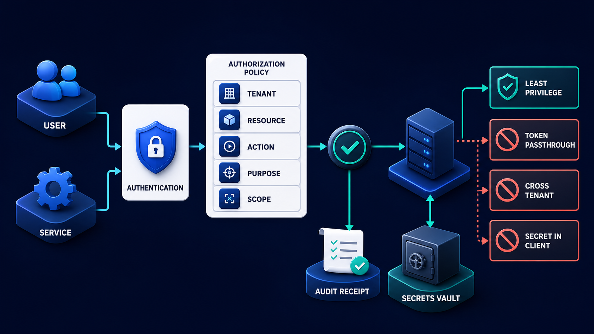
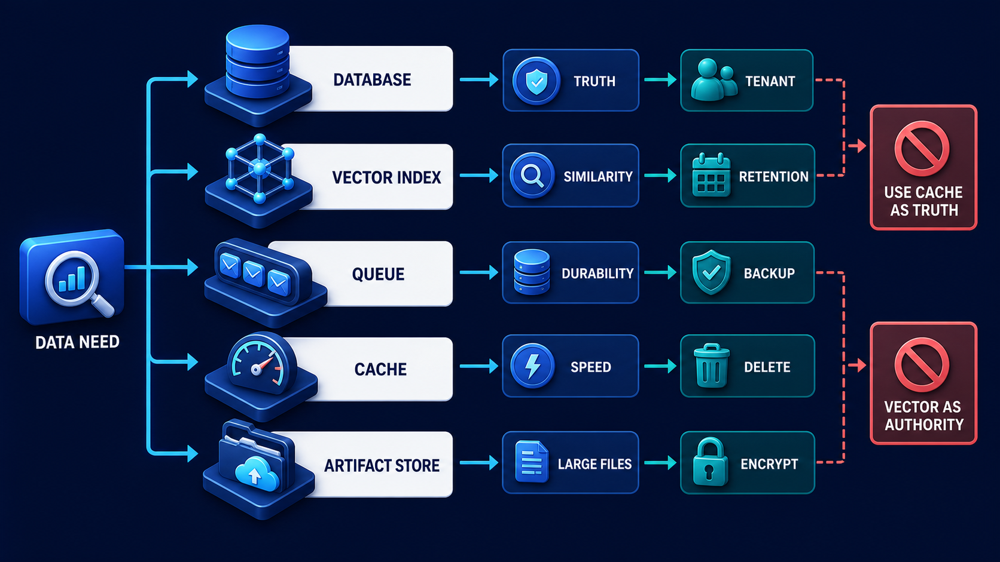

# Diagram 233 — Authentication, secrets, tenants, policy, and audit services

**Module:** Platform, data, and deployment
**Role in the course:** Design identity and policy as explicit services that constrain every protocol, tenant, tool, and authoritative action.
**Layout:** AUTHORIZATION POLICY begins on the left and the diagram flows toward LEAST PRIVILEGE; a teal **LEAST PRIVILEGE** path is the desired route and a coral **TOKEN PASSTHROUGH** path is blocked or contained.

---

## At a glance

**Authentication, secrets, tenants, policy, and audit services** — Design identity and policy as explicit services that constrain every protocol, tenant, tool, and authoritative action.

- The central takeaway is: Authenticate the actor, authorize the exact resource and action, bind the tenant, and keep secrets out of the browser.
- The visual begins with **AUTHORIZATION POLICY** and ends with the diagram's outcome, not a technology name.
- The safe or selected path is marked **teal**: LEAST PRIVILEGE.
- The blocked or dangerous path is marked **coral**: TOKEN PASSTHROUGH, CROSS TENANT, SECRET IN CLIENT blocked.
- The analogy is: A passport proves identity, a ticket grants one journey, and a boarding pass names one flight and seat. Showing a passport does not authorize entering every aircraft or cargo area.

---

## What the diagram teaches

### 1. Authentication, secrets, tenants, policy, and audit services

Tenant isolation must be enforced in queries, caches, indexes, artifacts, queues, events, audit, and administrator tools. In the diagram, **AUTHORIZATION POLICY**, **SECRETS VAULT**, **AUDIT RECEIPT** appear at the left, turning this idea into something a reviewer can point at.

### 2. Inventory Human, Service, Agent, Provider, and Administrative Identities and Their Credential Flows.

Authentication establishes who or what is presenting a credential. Human identity, web session, backend service identity, remote agent identity, and provider credentials have different lifecycles and trust. The visual places **SERVICE** at the center; the arrows between them are the physical expression of this principle. If this is skipped, broad token passthrough and browser-supplied tenant identifiers create confused-deputy and cross-tenant failure paths across every agent tool.

### 3. Bind Every Token to Intended Issuer, Audience, Resource, Scope, Tenant, and Expiry.

A valid token is not blanket permission. The architecture should never pass a user's broad token through every agent and tool without audience and scope controls. Its discovery, resource indicators, scope handling, and token audience rules complement—not replace—Acme's business authorization. The trace asks the team to bind every token to intended issuer, audience, resource, scope, tenant, and expiry. Look at **TOKEN PASSTHROUGH**, **CROSS TENANT**, **TENANT** on the top: the diagram uses those elements to show where this decision lives.

### 4. Evaluate Authorization Beside the Resource and Recheck It Before Consequential Effects.

MCP authorization is optional and applies to HTTP transports when used. The picture shows **AUTHORIZATION POLICY**, **RESOURCE** as the visual anchor for this idea, with the surrounding paths showing the flow. The project confirms the point: The web server ignores the tenant in the URL as authority and resolves the actor's current memberships.

### 5. Keep Secrets Server-side with Environment Separation, Rotation, Scanning, and Audited Access.

Secrets belong in managed server-side configuration with environment separation, rotation, access logs, and least privilege. To put this into practice, the team should keep secrets server-side with environment separation, rotation, scanning, and audited access. At the bottom, **SECRETS VAULT** is the element that makes this concept concrete before any code is written.

### 6. Test Cross-tenant, Confused-deputy, Replay, Stale-session, Excessive-scope, and Unavailable-policy Cases.

Public browser configuration, logs, prompts, build output, screenshots, and test fixtures are not secret stores. Sensitive details are minimized while security teams retain enough evidence to investigate. In the diagram, **CROSS TENANT**, **AUTHORIZATION POLICY**, **TENANT** appear at the lower right, turning this idea into something a reviewer can point at. If this is skipped, broad token passthrough and browser-supplied tenant identifiers create confused-deputy and cross-tenant failure paths across every agent tool.

### 7. Authenticate the actor, authorize the exact resource and action, bind the tenant

Authorization decides whether that actor may perform one action on one resource in the current tenant and context. A tenant field supplied by the browser cannot be trusted without binding it to the authenticated actor. Policy decisions produce explainable receipts: actor, resource, action, tenant, purpose, policy version, inputs, result, obligations, expiry, and correlation. The visual places **CROSS TENANT**, **TENANT**, **RESOURCE** at the upper left; the arrows between them are the physical expression of this principle.

### Analogy

A passport proves identity, a ticket grants one journey, and a boarding pass names one flight and seat. Showing a passport does not authorize entering every aircraft or cargo area. Look at **AUTHORIZATION POLICY**, **SECRETS VAULT**, **AUDIT RECEIPT** on the left: the diagram uses those elements to show where this decision lives. The project confirms the point: A support manager copies an Acme workspace URL from one tenant into another signed-in browser session.

### The Next.js surface

The Next.js surface must own the human experience while keeping authority and secrets on the server side. In this diagram, that means the web boundary stops the coral anti-patterns before they reach the browser.

- Resolve sessions on trusted server boundaries, derive tenant and permissions from the server, and send the browser only safe capability indicators.
- Keep environment variables private by default and test built assets and network responses for accidental secret exposure.
- Render denied and step-up states accessibly, preserving non-sensitive drafts while avoiding disclosure of protected resource details.

Together these choices prevent the mistakes in the Acme case—A support manager copies an Acme workspace URL from one tenant into another signed-in browser session.—from becoming the architecture.

### The Python surface

The Python surface must keep business rules, protocols, and persistence in cleanly separated layers. In this diagram, that means FastAPI is one edge of a domain that does not leak into adapters or the model.

- Centralize authentication adapters and policy inputs, but enforce resource-level authorization inside each application use case.
- Use audience-bound service credentials and avoid forwarding tokens to services for which they were not issued.
- Record minimized policy and audit receipts with tamper-evident storage controls and restricted query paths.

Diagram 234 — *Database, vector index, queue, cache, and artifact storage* is the next lens on this idea. The same concepts reappear there with different emphasis, so the two diagrams should be read as a pair.

These boundaries make the Acme case—A support manager copies an Acme workspace URL from one tenant into another signed-in browser session.—testable and replaceable.

---

## Case study — A support manager copies an Acme workspace URL from one

A support manager copies an Acme workspace URL from one tenant into another signed-in browser session.

### The walkthrough

1. The web server ignores the tenant in the URL as authority and resolves the actor's current memberships.
2. The Python service rechecks access to the specific case and evidence resources.
3. Caches and artifact URLs include server-enforced tenant partitioning and do not reveal whether a forbidden case exists.
4. The denial receipt records the policy version and correlation without copying customer content.

### The result

A valid user session cannot become cross-tenant access through a changed URL or reused artifact link.

### The danger

Broad token passthrough and browser-supplied tenant identifiers create confused-deputy and cross-tenant failure paths across every agent tool.

### The takeaway

Authenticate the actor, authorize the exact resource and action, bind the tenant, and keep secrets out of the browser.

---

## Composition

The picture is an identity and policy gate. **USER** and **SERVICE** identities enter from the left into an **AUTHENTICATION** gate. From there a cyan arrow reaches **AUTHORIZATION POLICY**, which holds five attribute cards—**TENANT**, **RESOURCE**, **ACTION**, **PURPOSE**, **SCOPE**. A **SECRETS VAULT** card at the top feeds only the server side. An **AUDIT RECEIPT** card records the decision. Teal **LEAST PRIVILEGE** path exits. Three coral blocked paths—**TOKEN PASSTHROUGH**, **CROSS TENANT**, **SECRET IN CLIENT**—are stopped. The composition makes every access decision explicit.

## Element by element

- **AUTHORIZATION POLICY** — a labeled visual element in this diagram; the prompt shows it as AUTHORIZATION POLICY with TENANT.
- **SECRETS VAULT** — a labeled visual element in this diagram; the prompt shows it as SECRETS VAULT feeds server only.
- **AUDIT RECEIPT** — a labeled visual element in this diagram; the prompt shows it as AUDIT RECEIPT records decision.
- **LEAST PRIVILEGE** — Secrets belong in managed server-side configuration with environment separation, rotation, access logs, and least privilege.
- **TOKEN PASSTHROUGH** — the coral anti-pattern of forwarding a broad token to every downstream service.
- **CROSS TENANT** — Test cross-tenant, confused-deputy, replay, stale-session, excessive-scope, and unavailable-policy cases.
- **SECRET IN CLIENT** — the coral anti-pattern of exposing a secret in the browser.
- **USER** — The architecture should never pass a user's broad token through every agent and tool without audience and scope controls.
- **SERVICE** — Human identity, web session, backend service identity, remote agent identity, and provider credentials have different lifecycles and trust.
- **AUTHENTICATION** — Authentication establishes who or what is presenting a credential.
- **TENANT** — Authorization decides whether that actor may perform one action on one resource in the current tenant and context.
- **RESOURCE** — Authorization decides whether that actor may perform one action on one resource in the current tenant and context.
- **ACTION** — Authorization decides whether that actor may perform one action on one resource in the current tenant and context.
- **PURPOSE** — Policy decisions produce explainable receipts: actor, resource, action, tenant, purpose, policy version, inputs, result, obligations, expiry, and correlation.
- **SCOPE** — The architecture should never pass a user's broad token through every agent and tool without audience and scope controls.

---

## Colour and flow semantics

The course visual grammar uses color to separate platforms, requests, safe paths, danger, and records. In this diagram those colors are assigned as follows:
- **Cobalt platform** — a product, service, environment, or boundary. The main structural cards such as **AUTHORIZATION POLICY**, **SECRETS VAULT**, **AUDIT RECEIPT**, **USER**, **SERVICE**, **AUTHENTICATION** sit on glowing cobalt platforms.
- **Cyan arrow** — a typed request, event, artifact, deployment, test, or evidence handoff. The cyan paths between **AUTHORIZATION POLICY**, **SECRETS VAULT**, **AUDIT RECEIPT**, **USER** carry the forward motion of the architecture.
- **Teal arrow** — an authoritative decision, verified contract, passing gate, safe release, or recovered service. The teal elements **LEAST PRIVILEGE** show the path the design wants to keep open.
- **Coral path** — an unacceptable outcome, failed boundary, broken contract, unsafe release, or unrecovered effect. The coral elements **TOKEN PASSTHROUGH**, **CROSS TENANT**, **SECRET IN CLIENT** show what must be blocked or contained.
- **White card** — a requirement, schema, service, test, gate, owner, artifact, or receipt. The white cards such as **AUTHORIZATION POLICY**, **SECRETS VAULT**, **AUDIT RECEIPT**, **USER**, **SERVICE**, **AUTHENTICATION**, **TENANT**, **RESOURCE** are the readable records the diagram communicates.

---

## How to present it

- Point to **AUTHORIZATION POLICY** and ask the room to state the human problem or outcome before naming any technology, protocol, or model.
- Point to **SERVICE** and ask what would have to change for the team to inventory human, service, agent, provider, and administrative identities and their credential flows, and who would own that change.
- Point to **TOKEN PASSTHROUGH** and ask what evidence would show the team has already bind every token to intended issuer, audience, resource, scope, tenant, and expiry, and what test would fail first if it is missing.
- Point to **RESOURCE** and ask who else in the room must agree before the team can evaluate authorization beside the resource and recheck it before consequential effects, and what would change their mind.
- Point to **SECRETS VAULT** and ask what the smallest version of keep secrets server-side with environment separation, rotation, scanning, and audited access looks like, and what would be left out of that version.
- Point to **CROSS TENANT** and ask what would have to change for the team to test cross-tenant, confused-deputy, replay, stale-session, excessive-scope, and unavailable-policy cases, and who would own that change.
- Trace the **teal** path (LEAST PRIVILEGE) and ask what evidence would prove the real system follows it, who collects that evidence, and how often it is refreshed.
- Show the **coral** path (TOKEN PASSTHROUGH, CROSS TENANT, SECRET IN CLIENT blocked) and ask what control, owner, or test would catch it before a user is harmed, and what the safe state would be if it is triggered.
- Point to **AUTHORIZATION POLICY** and ask who owns it, what evidence it needs, what happens when that evidence is missing, and which test proves the gate cannot be bypassed.
- Point to **SECRETS VAULT** and ask who owns it, what evidence it needs, what happens when that evidence is missing, and which test proves the gate cannot be bypassed.
- Point to **AUDIT RECEIPT** and ask who owns it, what evidence it needs, what happens when that evidence is missing, and which test proves the gate cannot be bypassed.
- Use the analogy: A passport proves identity, a ticket grants one journey, and a boarding pass names one flight and seat. Showing a passport does not authorize entering every aircraft or cargo area. Ask how the same failure would appear in the team's current code or process.
- Return to the whole diagram and ask the room to name one thing they will stop, one thing they will start, and one thing they will own differently before the next build.
- Run the lab: Create an identity and policy matrix for users, admins, services, agents, MCP clients, A2A peers, and providers. Add issuer, audience, resource, scope, tenant, purpose, expiry, storage, rotation, step-up, audit, denial, and twelve attack tests.

---

## Lab and checkpoint

**Lab:** Create an identity and policy matrix for users, admins, services, agents, MCP clients, A2A peers, and providers. Add issuer, audience, resource, scope, tenant, purpose, expiry, storage, rotation, step-up, audit, denial, and twelve attack tests.

**Checkpoint:** If an access token is valid, may a service send it to any downstream tool?

**Answer:** No. The token must be intended for that resource and audience with appropriate scope; forwarding it elsewhere can expose credentials and create a confused deputy.

---

## Glossary

- **Audience** — service a token is intended for
- **Confused deputy** — trusted component tricked into misusing its authority
- **Least privilege** — only the minimum access required

---

## Sources

- MCP authorization
- OAuth Security BCP RFC 9700
- OAuth DPoP RFC 9449
- OAuth Protected Resource Metadata RFC 9728
- Vercel environment variables

---

## Related lessons

- **Lesson 225** — Capability, context, model, tool, and authority boundaries (`enterprise-boundary-stack`)
- **Lesson 234** — Database, vector index, queue, cache, and artifact storage (`polyglot-storage-decision-map`)
- **Lesson 239** — Threat, evaluation, accessibility, privacy, and readiness gates (`readiness-gate-system`)
---

### Why this diagram must precede the build

The team should not begin with code, prompts, or models for Authentication, secrets, tenants, policy, and audit services until the diagram is legible to every reviewer. Design identity and policy as explicit services that constrain every protocol, tenant, tool, and authoritative action. The trace moves through 5 decisions: Inventory human, service, agent, provider, and administrative identities and their credential flows.; Bind every token to intended issuer, audience, resource, scope, tenant, and expiry.; Evaluate authorization beside the resource and recheck it before consequential effects.; Keep secrets server-side with environment separation, rotation, scanning, and audited access.; Test cross-tenant, confused-deputy, replay, stale-session, excessive-scope, and unavailable-policy cases.. Each decision maps to a labeled element in the picture, and each label must have an owner, a contract, and an acceptance test before the corresponding code is written.

The case study—A support manager copies an Acme workspace URL from one tenant into another signed-in browser session.—shows that Authenticate the actor, authorize the exact resource and action, bind the tenant, and keep secrets out of the browser. If the team skips this, Broad token passthrough and browser-supplied tenant identifiers create confused-deputy and cross-tenant failure paths across every agent tool. The diagram is the contract the two projects share. Until the team can trace the problem through the labels, assign owners to each card, and write the corresponding test, the build will drift from the architecture.

Before writing the first route, prompt, or adapter, the team should be able to answer: what is the user outcome this diagram protects, which card owns each decision, what evidence moves across each arrow, where the coral anti-patterns first appear, what test or gate proves the real system matches the picture, and which fixture will catch the next regression. When those answers are visible and reviewable, the build becomes a direct translation of the architecture rather than a guess about it. The diagram is the earliest acceptance test the project can write. Keeping it current is cheaper than debugging the drift it prevents. A reviewer who cannot read the diagram will not be able to read the build. Start every build review by pointing at the diagram, not the code.