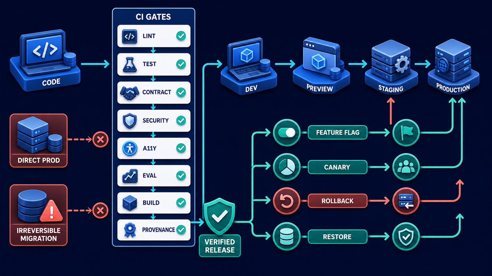

# Diagram 234 — Database, vector index, queue, cache, and artifact storage

**Module:** Platform, data, and deployment
**Role in the course:** Select storage by the job data must perform and define consistency, tenancy, retention, backup, and recovery for each store.
**Layout:** DATA NEED begins on the left and the diagram flows toward VECTOR INDEX; a teal **the safe path** path is the desired route and a coral **USE CACHE AS TRUTH** path is blocked or contained.

---

## At a glance

**Database, vector index, queue, cache, and artifact storage** — Select storage by the job data must perform and define consistency, tenancy, retention, backup, and recovery for each store.

- The central takeaway is: Give each store one job, one authority relationship, and one tested failure story.
- The visual begins with **DATA NEED** and ends with the diagram's outcome, not a technology name.
- The blocked or dangerous path is marked **coral**: USE CACHE AS TRUTH and VECTOR AS AUTHORITY blocked.
- The analogy is: A workshop uses a ledger for official inventory, shelves for parts, a work queue for jobs, a nearby tray for frequently used tools, and a warehouse for large finished items. The tray is convenient but not the inventory ledger.

---

## What the diagram teaches

### 1. Database, vector index, queue, cache, and artifact storage

A vector index helps similarity retrieval. A queue does not make a non-idempotent tool safe by itself. In the diagram, **VECTOR INDEX**, **ARTIFACT STORE**, **USE CACHE AS TRUTH** appear at the left, turning this idea into something a reviewer can point at.

### 2. Name Data Objects and the Query, Transaction, Search, Delivery, or File Behavior Each Needs.

A relational database is a strong default for transactional records, relationships, constraints, and authoritative workflow state. A committed refund needs transactional truth, while a search index may update asynchronously if the interface shows freshness and blocks stale evidence from consequential proposals. The visual places **DATA NEED**, **LARGE FILES**, **DATABASE** at the center; the arrows between them are the physical expression of this principle. If this is skipped, using the fastest or most fashionable store as universal truth hides consistency, deletion, tenancy, restore, and idempotency failures.

### 3. Assign One Authoritative Store and Treat Other Copies as Derived Projections.

The vector row references the source document; the cache can be discarded; the artifact manifest points to the durable blob; the queue message points to workflow state. The trace asks the team to assign one authoritative store and treat other copies as derived projections. Look at **ARTIFACT STORE** on the top: the diagram uses those elements to show where this decision lives.

### 4. Define Consistency, Tenant, Retention, Encryption, Deletion, Backup, Restore, and Capacity Per Store.

Consistency requirements differ. Every store needs tenant partitioning, access rules, encryption, retention, deletion, backup, restore, capacity, and cost ownership. The picture shows **ARTIFACT STORE**, **TENANT**, **RETENTION** as the visual anchor for this idea, with the surrounding paths showing the flow. The project confirms the point: The worker's idempotency record prevents duplicate research artifacts and links both deliveries to one workflow.

### 5. Design Queue Idempotency, Retry, Dead-letter, Ordering, and Backpressure with User-visible States.

A queue carries durable work. Indexes, caches, dead-letter queues, replicas, and backups are part of the data map, not invisible implementation details. Queues require idempotent consumers, retry policy, visibility or lease rules, poison-message handling, dead-letter review, ordering decisions, and backpressure. To put this into practice, the team should design queue idempotency, retry, dead-letter, ordering, and backpressure with user-visible states. At the bottom, **QUEUE** is the element that makes this concept concrete before any code is written.

### 6. Run Restore, Stale-index, Cache-loss, Duplicate-message, and Cross-tenant Tests Before Release.

A cache reduces repeated latency. Storage decisions should be tested through workload and failure scenarios: hot keys, large artifacts, missing index updates, duplicate messages, restore from backup, cross-tenant filters, deletion propagation, and regional unavailability. In the diagram, **VECTOR INDEX**, **USE CACHE AS TRUTH**, **CACHE** appear at the lower right, turning this idea into something a reviewer can point at. If this is skipped, storage decisions should be tested through workload and failure scenarios: hot keys, large artifacts, missing index updates, duplicate messages, restore from backup, cross-tenant filters, deletion propagation, and regional unavailability.

### 7. Give each store one job, one authority relationship

An artifact store holds larger immutable or versioned files. One object may appear in several stores, but one system should own authority. The visual places **ARTIFACT STORE**, **VECTOR AS AUTHORITY** at the upper left; the arrows between them are the physical expression of this principle.

### Analogy

A workshop uses a ledger for official inventory, shelves for parts, a work queue for jobs, a nearby tray for frequently used tools, and a warehouse for large finished items. The tray is convenient but not the inventory ledger. Look at **DATA NEED**, **VECTOR INDEX**, **ARTIFACT STORE** on the left: the diagram uses those elements to show where this decision lives. The project confirms the point: A refund research job is delivered twice, the vector index contains an older policy, and the cached approval card still shows the previous amount.

### The Next.js surface

The Next.js surface must own the human experience while keeping authority and secrets on the server side. In this diagram, that means the web boundary stops the coral anti-patterns before they reach the browser.

- Treat caches as performance layers with explicit freshness; never use client state or cached page output as the authoritative approval or receipt.
- Use authorized, expiring artifact links or service-mediated downloads and provide file name, size, type, version, and scan status.
- Show queued, delayed, retrying, dead-lettered, restored, and unavailable states without promising completion before the service receipt.

Together these choices prevent the mistakes in the Acme case—A refund research job is delivered twice, the vector index contains an older policy, and the cached approval card still shows the previous amount.—from becoming the architecture.

### The Python surface

The Python surface must keep business rules, protocols, and persistence in cleanly separated layers. In this diagram, that means FastAPI is one edge of a domain that does not leak into adapters or the model.

- Use database constraints and transactions for local invariants, with an outbox or equivalent pattern when events must follow committed state.
- Keep vector embeddings and metadata reproducible from versioned source references and verify tenant filters at the query boundary.
- Build idempotent workers that record attempts and outcomes, bound concurrency, quarantine poison jobs, and expose safe operational controls.

These boundaries make the Acme case—A refund research job is delivered twice, the vector index contains an older policy, and the cached approval card still shows the previous amount.—testable and replaceable.

Diagram 236 — *CI/CD, environments, migrations, flags, rollback, and recovery* is the next lens on this idea. The same concepts reappear there with different emphasis, so the two diagrams should be read as a pair.

---

## Case study — A refund research job is delivered twice

A refund research job is delivered twice, the vector index contains an older policy, and the cached approval card still shows the previous amount.

### The walkthrough

1. The worker's idempotency record prevents duplicate research artifacts and links both deliveries to one workflow.
2. Evidence freshness rejects the superseded policy and schedules index repair without hiding the source mismatch.
3. The authoritative proposal revision invalidates the cached card and requests a fresh view.
4. Maya retains her draft note while the product restores synchronized state.

### The result

Derived storage can be stale or duplicated without producing a duplicate refund or a false approval.

### The danger

Using the fastest or most fashionable store as universal truth hides consistency, deletion, tenancy, restore, and idempotency failures.

### The takeaway

Give each store one job, one authority relationship, and one tested failure story.

---

## Composition

The picture is a storage decision map. A **DATA NEED** card at the top points downward to five store platforms—**DATABASE**, **VECTOR INDEX**, **QUEUE**, **CACHE**, **ARTIFACT STORE**. Each store has a white card label: **TRUTH**, **SIMILARITY**, **DURABILITY**, **SPEED**, **LARGE FILES**. Around the stores, attribute cards—**TENANT**, **RETENTION**, **BACKUP**, **DELETE**, **ENCRYPT**—float. Two coral blocked paths—**USE CACHE AS TRUTH** and **VECTOR AS AUTHORITY**—are marked red. The composition maps data to the right job.

## Element by element

- **DATA NEED** — a labeled visual element in this diagram; the prompt shows it as DATA NEED entering five stores DATABASE.
- **VECTOR INDEX** — A vector index helps similarity retrieval.
- **ARTIFACT STORE** — An artifact store holds larger immutable or versioned files.
- **LARGE FILES** — the LARGE FILES card shown in this diagram; it is one of the labeled elements the architecture uses.
- **USE CACHE AS TRUTH** — the coral anti-pattern of treating cached data as the authoritative record.
- **VECTOR AS AUTHORITY** — the coral anti-pattern of treating the vector index as the source of truth.
- **DATABASE** — A relational database is a strong default for transactional records, relationships, constraints, and authoritative workflow state.
- **QUEUE** — A queue carries durable work.
- **CACHE** — A cache reduces repeated latency.
- **TRUTH** — A committed refund needs transactional truth, while a search index may update asynchronously if the interface shows freshness and blocks stale evidence from consequential proposals.
- **SIMILARITY** — A vector index helps similarity retrieval.
- **DURABILITY** — the DURABILITY card shown in this diagram; it is one of the labeled elements the architecture uses.
- **SPEED** — the SPEED card shown in this diagram; it is one of the labeled elements the architecture uses.
- **TENANT** — Every store needs tenant partitioning, access rules, encryption, retention, deletion, backup, restore, capacity, and cost ownership.
- **RETENTION** — Every store needs tenant partitioning, access rules, encryption, retention, deletion, backup, restore, capacity, and cost ownership.
- **BACKUP** — Every store needs tenant partitioning, access rules, encryption, retention, deletion, backup, restore, capacity, and cost ownership.
- **DELETE** — the DELETE card shown in this diagram; it is one of the labeled elements the architecture uses.
- **ENCRYPT** — the ENCRYPT card shown in this diagram; it is one of the labeled elements the architecture uses.

---

## Colour and flow semantics

The course visual grammar uses color to separate platforms, requests, safe paths, danger, and records. In this diagram those colors are assigned as follows:
- **Cobalt platform** — a product, service, environment, or boundary. The main structural cards such as **DATA NEED**, **VECTOR INDEX**, **ARTIFACT STORE**, **LARGE FILES**, **DATABASE**, **QUEUE** sit on glowing cobalt platforms.
- **Cyan arrow** — a typed request, event, artifact, deployment, test, or evidence handoff. The cyan paths between **DATA NEED**, **VECTOR INDEX**, **ARTIFACT STORE**, **LARGE FILES** carry the forward motion of the architecture.
- **Coral path** — an unacceptable outcome, failed boundary, broken contract, unsafe release, or unrecovered effect. The coral elements **USE CACHE AS TRUTH**, **VECTOR AS AUTHORITY** show what must be blocked or contained.
- **White card** — a requirement, schema, service, test, gate, owner, artifact, or receipt. The white cards such as **DATA NEED**, **VECTOR INDEX**, **ARTIFACT STORE**, **LARGE FILES**, **DATABASE**, **QUEUE**, **CACHE**, **TRUTH** are the readable records the diagram communicates.

---

## How to present it

- Point to **DATA NEED** and ask the room to state the human problem or outcome before naming any technology, protocol, or model.
- Point to **LARGE FILES** and ask what would have to change for the team to list data objects and the query, transaction, search, delivery, or file behavior each needs, and who would own that change.
- Point to **ARTIFACT STORE** and ask what evidence would show the team has already assign one authoritative store and treat other copies as derived projections, and what test would fail first if it is missing.
- Point to **TENANT** and ask who else in the room must agree before the team can define consistency, tenant, retention, encryption, deletion, backup, restore, and capacity per store, and what would change their mind.
- Point to **QUEUE** and ask what the smallest version of design queue idempotency, retry, dead-letter, ordering, and backpressure with user-visible states looks like, and what would be left out of that version.
- Point to **VECTOR INDEX** and ask what would have to change for the team to run restore, stale-index, cache-loss, duplicate-message, and cross-tenant tests before release, and who would own that change.
- Show the **coral** path (USE CACHE AS TRUTH and VECTOR AS AUTHORITY blocked) and ask what control, owner, or test would catch it before a user is harmed, and what the safe state would be if it is triggered.
- Point to **VECTOR AS AUTHORITY** and ask who owns it, what evidence it needs, what happens when that evidence is missing, and which test proves the gate cannot be bypassed.
- Use the analogy: A workshop uses a ledger for official inventory, shelves for parts, a work queue for jobs, a nearby tray for frequently used tools, and a warehouse for large finished items. The tray is convenient but not the inventory ledger. Ask how the same failure would appear in the team's current code or process.
- Return to the whole diagram and ask the room to name one thing they will stop, one thing they will start, and one thing they will own differently before the next build.
- Run the lab: Map twenty Acme data objects to database, vector index, queue, cache, and artifact storage. Add authority, consistency, keys, tenant, encryption, retention, deletion, backup, restore, capacity, cost, and ten failure tests.
- Pose the checkpoint: *Can a cache hit prove that a refund proposal is still current?*

---

## Lab and checkpoint

**Lab:** Map twenty Acme data objects to database, vector index, queue, cache, and artifact storage. Add authority, consistency, keys, tenant, encryption, retention, deletion, backup, restore, capacity, cost, and ten failure tests.

**Checkpoint:** Can a cache hit prove that a refund proposal is still current?

**Answer:** No. Sensitive state must be checked against the authoritative revision and policy; cache data is a performance projection with explicit freshness limits.

---

## Glossary

- **Derived projection** — copy rebuilt from an authoritative source
- **Backpressure** — limiting incoming work when capacity is full
- **Dead-letter queue** — holding area for repeatedly failed messages

---

## Sources

- PostgreSQL documentation
- pgvector documentation
- Redis documentation

---

## Related lessons

- **Lesson 226** — State, data, memory, evidence, artifact, and audit architecture (`state-data-evidence-audit-architecture`)
- **Lesson 228** — Deployment topology, failure domains, and ownership (`deployment-topology-failure-domains`)
- **Lesson 236** — CI/CD, environments, migrations, flags, rollback, and recovery (`safe-delivery-recovery-pipeline`)
---

### Why this diagram must precede the build

The team should not begin with code, prompts, or models for Database, vector index, queue, cache, and artifact storage until the diagram is legible to every reviewer. Select storage by the job data must perform and define consistency, tenancy, retention, backup, and recovery for each store. The trace moves through 5 decisions: List data objects and the query, transaction, search, delivery, or file behavior each needs.; Assign one authoritative store and treat other copies as derived projections.; Define consistency, tenant, retention, encryption, deletion, backup, restore, and capacity per store.; Design queue idempotency, retry, dead-letter, ordering, and backpressure with user-visible states.; Run restore, stale-index, cache-loss, duplicate-message, and cross-tenant tests before release.. Each decision maps to a labeled element in the picture, and each label must have an owner, a contract, and an acceptance test before the corresponding code is written.

The case study—A refund research job is delivered twice, the vector index contains an older policy, and the cached approval card still shows the previous amount.—shows that Give each store one job, one authority relationship, and one tested failure story. If the team skips this, Using the fastest or most fashionable store as universal truth hides consistency, deletion, tenancy, restore, and idempotency failures. The diagram is the contract the two projects share. Until the team can trace the problem through the labels, assign owners to each card, and write the corresponding test, the build will drift from the architecture.

Before writing the first route, prompt, or adapter, the team should be able to answer: what is the user outcome this diagram protects, which card owns each decision, what evidence moves across each arrow, where the coral anti-patterns first appear, what test or gate proves the real system matches the picture, and which fixture will catch the next regression. When those answers are visible and reviewable, the build becomes a direct translation of the architecture rather than a guess about it. The diagram is the earliest acceptance test the project can write. Keeping it current is cheaper than debugging the drift it prevents. A reviewer who cannot read the diagram will not be able to read the build. Start every build review by pointing at the diagram, not the code.