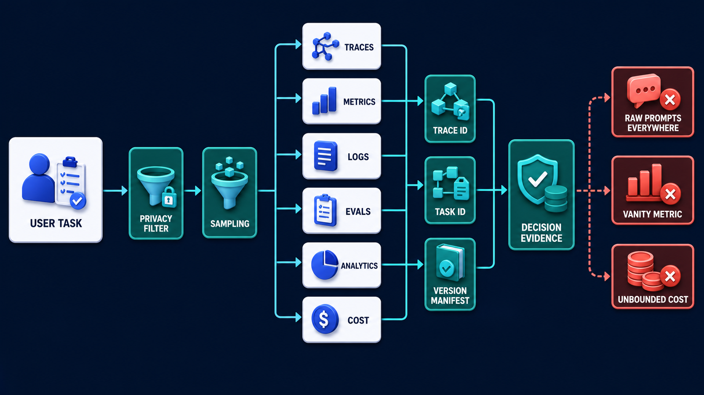
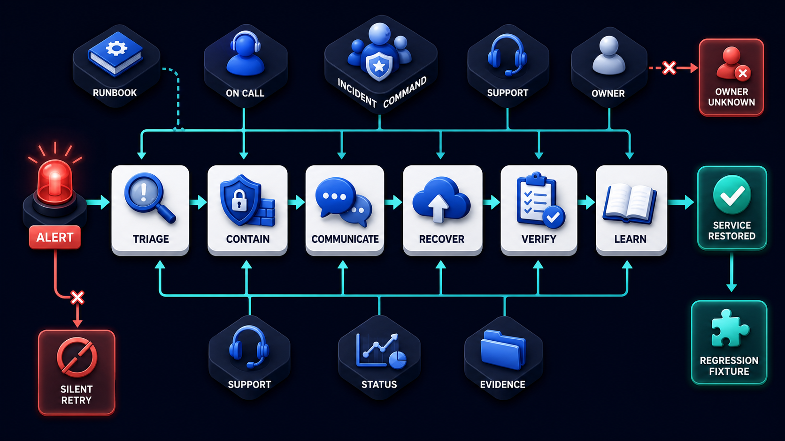

# Diagram 235 — Telemetry, evaluation, analytics, and cost control

**Module:** Platform, data, and deployment
**Role in the course:** Design an evidence control plane that explains system behavior, product value, safety, and cost without turning telemetry into a second uncontrolled data lake.
**Layout:** USER TASK begins on the left and the diagram flows toward DECISION EVIDENCE; a teal **DECISION EVIDENCE** path is the desired route and a coral **RAW PROMPTS EVERYWHERE** path is blocked or contained.

---

## At a glance

**Telemetry, evaluation, analytics, and cost control** — Design an evidence control plane that explains system behavior, product value, safety, and cost without turning telemetry into a second uncontrolled data lake.

- The central takeaway is: Observe the user outcome, system path, quality, safety, privacy, and cost together.
- The visual begins with **USER TASK** and ends with the diagram's outcome, not a technology name.
- The safe or selected path is marked **teal**: DECISION EVIDENCE.
- The blocked or dangerous path is marked **coral**: RAW PROMPTS EVERYWHERE, VANITY METRIC, UNBOUNDED COST blocked.
- The analogy is: A car dashboard, mechanic's diagnostic system, driving test, trip log, and fuel receipt answer different questions. Combining them helps, but recording every private conversation inside the car would not improve maintenance.

---

## What the diagram teaches

### 1. Telemetry, evaluation, analytics, and cost control

Analytics measures product use. Cost records resource consumption. In the diagram, **UNBOUNDED COST**, **ANALYTICS**, **COST** appear at the left, turning this idea into something a reviewer can point at.

### 2. Define the Decisions Telemetry Must Support Before Choosing Fields or Dashboards.

OpenTelemetry provides shared concepts and semantic conventions for telemetry. The visual places **USER TASK**, **TRACE ID**, **TASK ID** at the center; the arrows between them are the physical expression of this principle. If this is skipped, raw telemetry can leak sensitive content, and a cost-only optimization can remove safeguards or make outcomes worse while the bill improves.

### 3. Create a Versioned Event and Attribute Vocabulary with Privacy Classification and Ownership.

They overlap but are not interchangeable. The trace asks the team to create a versioned event and attribute vocabulary with privacy classification and ownership. Look at **PRIVACY FILTER** on the top: the diagram uses those elements to show where this decision lives.

### 4. Propagate Correlation Across Web, API, Queues, Protocols, Tools, Artifacts, and Receipts.

Traces follow one journey across components. Debug convenience does not justify collecting every prompt, document, or tool argument. The picture shows **USER TASK**, **TRACE ID**, **TASK ID** as the visual anchor for this idea, with the surrounding paths showing the flow. The project confirms the point: The team defines task and capability cost attribution and propagates correlation through provider and retry paths.

### 5. Join Controlled Evaluations, Product Outcomes, Accessibility Evidence, Incidents, and Costs by Version.

Evaluations judge model or workflow outputs against criteria. Because GenAI conventions evolve, Acme records schema versions and translates provider attributes into a small product-owned vocabulary. Correlation joins task, run, trace, evidence, proposal, decision, artifact, receipt, evaluation, release, and incident. Operational and product evidence meet at release decisions. To put this into practice, the team should join controlled evaluations, product outcomes, accessibility evidence, incidents, and costs by version. At the bottom, **VERSION MANIFEST**, **DECISION EVIDENCE** is the element that makes this concept concrete before any code is written.

Diagram 240 — *Runbooks, support, incident response, and operational ownership* is the next lens on this idea. The same concepts reappear there with different emphasis, so the two diagrams should be read as a pair.

### 6. Test Redaction, Deletion, Missing Spans, Sampling Bias, Budget Limits, and Dashboard Denominators.

Logs record discrete operational facts. Privacy design begins before instrumentation: allowed fields, redaction, hashing limits, sampling, retention, access, export, deletion, and no-secret rules. Cost control needs budgets, per-capability attribution, cached or reused work, token and tool limits, model routing policy, queue capacity, anomaly alerts, and graceful budget exhaustion. In the diagram, **SAMPLING** appear at the lower right, turning this idea into something a reviewer can point at. If this is skipped, raw telemetry can leak sensitive content, and a cost-only optimization can remove safeguards or make outcomes worse while the bill improves.

### 7. Observe the user outcome, system path, quality, safety, privacy

Metrics summarize repeated behavior. It must use opaque identifiers and controlled access rather than copying raw conversations into every system. A cost chart without user outcome can reward low-quality cheap behavior. A team compares quality, safety, latency, accessibility, recovery, and cost by version and slice, while keeping illustrative course scenarios separate from measured project data. The visual places **USER TASK**, **PRIVACY FILTER** at the upper left; the arrows between them are the physical expression of this principle.

### Analogy

A car dashboard, mechanic's diagnostic system, driving test, trip log, and fuel receipt answer different questions. Combining them helps, but recording every private conversation inside the car would not improve maintenance. Look at **USER TASK**, **TRACE ID**, **TASK ID** on the left: the diagram uses those elements to show where this decision lives. The project confirms the point: Acme sees model spending increase, but dashboards cannot tell which user outcome, release, provider retry, or failed evaluation caused it.

### The Next.js surface

The Next.js surface must own the human experience while keeping authority and secrets on the server side. In this diagram, that means the web boundary stops the coral anti-patterns before they reach the browser.

- Emit a small typed product-event vocabulary at trusted server boundaries and keep optional analytics behind the recorded privacy choice.
- Attach accessible user feedback and interface versions to opaque task identifiers without sending raw customer cases to analytics by default.
- Display operational support receipts and cost or delay states only when they help the user; keep privileged traces in authorized tools.

Together these choices prevent the mistakes in the Acme case—Acme sees model spending increase, but dashboards cannot tell which user outcome, release, provider retry, or failed evaluation caused it.—from becoming the architecture.

### The Python surface

The Python surface must keep business rules, protocols, and persistence in cleanly separated layers. In this diagram, that means FastAPI is one edge of a domain that does not leak into adapters or the model.

- Instrument use cases and adapters with OpenTelemetry context, bounded attributes, redaction processors, and explicit semantic-convention versions.
- Record evaluation and cost manifests keyed by model, prompt, tool, evidence, adapter, dataset, code, and environment versions.
- Apply request, task, tenant, model, and provider budgets with predictable refusal, downgrade, queue, or human-handoff behavior.

These boundaries make the Acme case—Acme sees model spending increase, but dashboards cannot tell which user outcome, release, provider retry, or failed evaluation caused it.—testable and replaceable.

---

## Case study — Acme sees model spending increase

Acme sees model spending increase, but dashboards cannot tell which user outcome, release, provider retry, or failed evaluation caused it.

### The walkthrough

1. The team defines task and capability cost attribution and propagates correlation through provider and retry paths.
2. A version comparison reveals one adapter is repeating retrieval after reconnect.
3. A replay fix reduces duplicate work while evaluation proves answer quality and recovery remain stable.
4. The evidence manifest records the measured result only after the corrected project run, not as a course assumption.

### The result

Cost becomes an explainable system signal connected to value and quality rather than an isolated invoice.

### The danger

Raw telemetry can leak sensitive content, and a cost-only optimization can remove safeguards or make outcomes worse while the bill improves.

### The takeaway

Observe the user outcome, system path, quality, safety, privacy, and cost together.

---

## Composition

The picture is a telemetry control plane. A **USER TASK** card at the left branches into six cyan streams—**TRACES**, **METRICS**, **LOGS**, **EVALS**, **ANALYTICS**, **COST**. They join through a central ring of **TRACE ID**, **TASK ID**, and **VERSION MANIFEST**. Above the streams, **PRIVACY FILTER** and **SAMPLING** cards sit as gates. A teal **DECISION EVIDENCE** path exits to the right. Three coral blocked paths—**RAW PROMPTS EVERYWHERE**, **VANITY METRIC**, **UNBOUNDED COST**—are stopped. The composition shows telemetry as a governed evidence system.

## Element by element

- **USER TASK** — a labeled visual element in this diagram; the prompt shows it as one USER TASK branching to TRACES.
- **TRACE ID** — Correlation joins task, run, trace, evidence, proposal, decision, artifact, receipt, evaluation, release, and incident.
- **TASK ID** — Correlation joins task, run, trace, evidence, proposal, decision, artifact, receipt, evaluation, release, and incident.
- **VERSION MANIFEST** — the VERSION MANIFEST card shown in this diagram; it is one of the labeled elements the architecture uses.
- **PRIVACY FILTER** — a labeled visual element in this diagram; the prompt shows it as PRIVACY FILTER and SAMPLING.
- **DECISION EVIDENCE** — Correlation joins task, run, trace, evidence, proposal, decision, artifact, receipt, evaluation, release, and incident.
- **RAW PROMPTS EVERYWHERE** — the coral anti-pattern of collecting every prompt and tool argument for debugging.
- **VANITY METRIC** — the coral anti-pattern of optimizing a number without user value.
- **UNBOUNDED COST** — the coral anti-pattern of allowing model and tool spending to grow without controls.
- **TRACES** — Traces follow one journey across components.
- **METRICS** — Metrics summarize repeated behavior.
- **LOGS** — Logs record discrete operational facts.
- **EVALS** — the EVALS card shown in this diagram; it is one of the labeled elements the architecture uses.
- **ANALYTICS** — Analytics measures product use.
- **COST** — Cost records resource consumption.
- **SAMPLING** — Privacy design begins before instrumentation: allowed fields, redaction, hashing limits, sampling, retention, access, export, deletion, and no-secret rules.

---

## Colour and flow semantics

The course visual grammar uses color to separate platforms, requests, safe paths, danger, and records. In this diagram those colors are assigned as follows:
- **Cobalt platform** — a product, service, environment, or boundary. The main structural cards such as **USER TASK**, **TRACE ID**, **TASK ID**, **VERSION MANIFEST**, **PRIVACY FILTER**, **TRACES** sit on glowing cobalt platforms.
- **Cyan arrow** — a typed request, event, artifact, deployment, test, or evidence handoff. The cyan paths between **USER TASK**, **TRACE ID**, **TASK ID**, **VERSION MANIFEST** carry the forward motion of the architecture.
- **Teal arrow** — an authoritative decision, verified contract, passing gate, safe release, or recovered service. The teal elements **DECISION EVIDENCE** show the path the design wants to keep open.
- **Coral path** — an unacceptable outcome, failed boundary, broken contract, unsafe release, or unrecovered effect. The coral elements **RAW PROMPTS EVERYWHERE**, **VANITY METRIC**, **UNBOUNDED COST** show what must be blocked or contained.
- **White card** — a requirement, schema, service, test, gate, owner, artifact, or receipt. The white cards such as **USER TASK**, **TRACE ID**, **TASK ID**, **VERSION MANIFEST**, **PRIVACY FILTER**, **TRACES**, **METRICS**, **LOGS** are the readable records the diagram communicates.

---

## How to present it

- Point to **USER TASK** and ask the room to state the human problem or outcome before naming any technology, protocol, or model.
- Point to **TRACE ID** and ask what would have to change for the team to define the decisions telemetry must support before choosing fields or dashboards, and who would own that change.
- Point to **PRIVACY FILTER** and ask what evidence would show the team has already create a versioned event and attribute vocabulary with privacy classification and ownership, and what test would fail first if it is missing.
- Point to **TASK ID** and ask who else in the room must agree before the team can propagate correlation across web, API, queues, protocols, tools, artifacts, and receipts, and what would change their mind.
- Point to **VERSION MANIFEST** and ask what the smallest version of join controlled evaluations, product outcomes, accessibility evidence, incidents, and costs by version looks like, and what would be left out of that version.
- Point to **SAMPLING** and ask what would have to change for the team to test redaction, deletion, missing spans, sampling bias, budget limits, and dashboard denominators, and who would own that change.
- Trace the **teal** path (DECISION EVIDENCE) and ask what evidence would prove the real system follows it, who collects that evidence, and how often it is refreshed.
- Show the **coral** path (RAW PROMPTS EVERYWHERE, VANITY METRIC, UNBOUNDED COST blocked) and ask what control, owner, or test would catch it before a user is harmed, and what the safe state would be if it is triggered.
- Point to **PRIVACY FILTER** and ask who owns it, what evidence it needs, what happens when that evidence is missing, and which test proves the gate cannot be bypassed.
- Use the analogy: A car dashboard, mechanic's diagnostic system, driving test, trip log, and fuel receipt answer different questions. Combining them helps, but recording every private conversation inside the car would not improve maintenance. Ask how the same failure would appear in the team's current code or process.
- Return to the whole diagram and ask the room to name one thing they will stop, one thing they will start, and one thing they will own differently before the next build.
- Run the lab: Design a telemetry dictionary and evidence map for the Acme pilot. Include traces, metrics, logs, evals, analytics, cost, identifiers, versions, privacy fields, redaction, sampling, retention, access, budgets, alerts, dashboards, and deletion tests.
- Pose the checkpoint: *Should every model prompt and tool argument be stored for debugging?*

---

## Lab and checkpoint

**Lab:** Design a telemetry dictionary and evidence map for the Acme pilot. Include traces, metrics, logs, evals, analytics, cost, identifiers, versions, privacy fields, redaction, sampling, retention, access, budgets, alerts, dashboards, and deletion tests.

**Checkpoint:** Should every model prompt and tool argument be stored for debugging?

**Answer:** No. Collect only what a defined purpose requires, minimize or redact sensitive content, restrict access and retention, and prefer references or synthetic reproduction when possible.

---

## Glossary

- **Semantic convention** — shared meaning and name for telemetry attributes
- **Sampling** — recording only a selected portion of events
- **Cost attribution** — linking resource use to an owned capability or outcome

---

## Sources

- OpenTelemetry semantic conventions 1.44.0
- OpenTelemetry GenAI conventions
- OpenTelemetry traces
- NIST AI Risk Management Framework

---

## Related lessons

- **Lesson 224** — Success criteria, exit criteria, and evidence requirements (`success-exit-evidence-contract`)
- **Lesson 226** — State, data, memory, evidence, artifact, and audit architecture (`state-data-evidence-audit-architecture`)
- **Lesson 240** — Runbooks, support, incident response, and operational ownership (`operational-ownership-loop`)
---

### Why this diagram must precede the build

The team should not begin with code, prompts, or models for Telemetry, evaluation, analytics, and cost control until the diagram is legible to every reviewer. Design an evidence control plane that explains system behavior, product value, safety, and cost without turning telemetry into a second uncontrolled data lake. The trace moves through 5 decisions: Define the decisions telemetry must support before choosing fields or dashboards.; Create a versioned event and attribute vocabulary with privacy classification and ownership.; Propagate correlation across web, API, queues, protocols, tools, artifacts, and receipts.; Join controlled evaluations, product outcomes, accessibility evidence, incidents, and costs by version.; Test redaction, deletion, missing spans, sampling bias, budget limits, and dashboard denominators.. Each decision maps to a labeled element in the picture, and each label must have an owner, a contract, and an acceptance test before the corresponding code is written.

The case study—Acme sees model spending increase, but dashboards cannot tell which user outcome, release, provider retry, or failed evaluation caused it.—shows that Observe the user outcome, system path, quality, safety, privacy, and cost together. If the team skips this, Raw telemetry can leak sensitive content, and a cost-only optimization can remove safeguards or make outcomes worse while the bill improves. The diagram is the contract the two projects share. Until the team can trace the problem through the labels, assign owners to each card, and write the corresponding test, the build will drift from the architecture.

Before writing the first route, prompt, or adapter, the team should be able to answer: what is the user outcome this diagram protects, which card owns each decision, what evidence moves across each arrow, where the coral anti-patterns first appear, what test or gate proves the real system matches the picture, and which fixture will catch the next regression. When those answers are visible and reviewable, the build becomes a direct translation of the architecture rather than a guess about it. The diagram is the earliest acceptance test the project can write. Keeping it current is cheaper than debugging the drift it prevents. A reviewer who cannot read the diagram will not be able to read the build. Start every build review by pointing at the diagram, not the code.