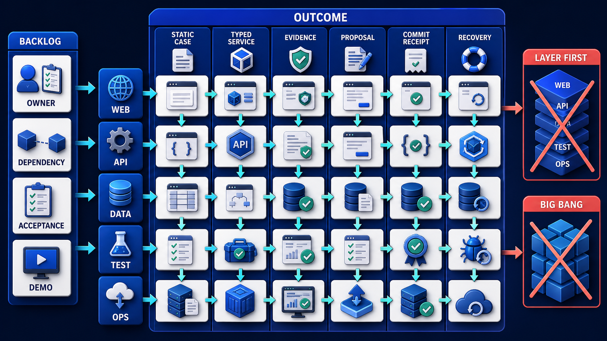

# Diagram 237 — Milestones, vertical slices, backlog, dependencies, and owners

**Module:** Delivery and production readiness
**Role in the course:** Turn the architecture into small end-to-end milestones that create demonstrable evidence and reduce the most important uncertainty early.
**Layout:** VERTICAL SLICES begins on the left and the diagram flows toward STATIC CASE; a teal **the safe path** path is the desired route and a coral **LAYER FIRST** path is blocked or contained.

---

## At a glance

**Milestones, vertical slices, backlog, dependencies, and owners** — Turn the architecture into small end-to-end milestones that create demonstrable evidence and reduce the most important uncertainty early.

- The central takeaway is: Deliver thin complete stories, and use every milestone to retire uncertainty with evidence.
- The visual begins with **VERTICAL SLICES** and ends with the diagram's outcome, not a technology name.
- The blocked or dangerous path is marked **coral**: LAYER FIRST and BIG BANG blocked.
- The analogy is: Building a bridge one entire material at a time would leave no usable crossing for months. A temporary narrow crossing proves the route and foundations before the full roadway expands.

---

## What the diagram teaches

### 1. Milestones, vertical slices, backlog, dependencies, and owners

The plan identifies which can proceed in parallel and which block a gate. In the diagram, **VERTICAL SLICES**, **BACKLOG** appear at the left, turning this idea into something a reviewer can point at.

### 2. Start with the Final User Journey and the Riskiest Unknowns the Project Must Retire.

The next can introduce a typed service and synthetic records. Protocol setup without a user or conformance outcome is an implementation task inside a slice, not the roadmap's purpose. The visual places **VERTICAL SLICES**, **STATIC CASE**, **TYPED SERVICE** at the center; the arrows between them are the physical expression of this principle. If this is skipped, a backlog grouped only by technology can report busy teams while no complete user outcome, authority boundary, or recovery path actually works.

### 3. Define Thin Slices That Cross the System and End in Observable User Value

A vertical slice crosses the minimum interface, service, data, policy, test, and operational path needed to demonstrate one user outcome. Thin slices reveal those problems early. The trace asks the team to define thin slices that cross the system and end in observable user value or a risk decision. Look at **VERTICAL SLICES**, **DEPENDENCY** on the top: the diagram uses those elements to show where this decision lives.

### 4. Break Each Slice Into Owned Backlog Items with Dependencies and Acceptance Evidence.

The first slice can be a static but accessible product story. Later slices add evidence, agent coordination, proposals, authoritative effects, recovery, and operations in controlled steps. Backlog items name outcome, scope, acceptance evidence, dependencies, owner, reviewer, risk, estimate confidence, and definition of done. The picture shows **VERTICAL SLICES**, **EVIDENCE**, **BACKLOG** as the visual anchor for this idea, with the surrounding paths showing the flow. The project confirms the point: Maya reorganizes work around a visible policy-review journey using synthetic data.

### 5. Sequence Contract, Identity, Data, Provider, Accessibility, Security, and Operations Prerequisites.

Diagram 238 — *Contract, integration, workflow, security, and acceptance tests* is the next lens on this idea. The same concepts reappear there with different emphasis, so the two diagrams should be read as a pair.

Layer-first plans build all databases, then all APIs, then all screens. Dependencies include contracts, identity, tenant data, fixtures, provider access, environments, policy decisions, content, accessibility review, and operational ownership. To put this into practice, the team should sequence contract, identity, data, provider, accessibility, security, and operations prerequisites. At the bottom, **DATA** is the element that makes this concept concrete before any code is written.

### 6. Review Each Demonstration, Update Evidence, and Replan from What the Team Actually Learned.

They delay integration evidence and make it easy to discover at the end that contracts, authority, and user state do not fit. Every milestone ends with a demonstration and evidence review. In the diagram, **EVIDENCE** appear at the lower right, turning this idea into something a reviewer can point at. If this is skipped, a backlog grouped only by technology can report busy teams while no complete user outcome, authority boundary, or recovery path actually works.

### 7. Deliver thin complete stories

A milestone is a meaningful capability or risk decision, not a calendar label. Estimates and example dates are plainly illustrative until the actual builders size the work and discover constraints. The visual places **VERTICAL SLICES**, **STATIC CASE**, **TYPED SERVICE** at the upper left; the arrows between them are the physical expression of this principle.

### Analogy

Building a bridge one entire material at a time would leave no usable crossing for months. A temporary narrow crossing proves the route and foundations before the full roadway expands. Look at **VERTICAL SLICES**, **STATIC CASE**, **TYPED SERVICE** on the left: the diagram uses those elements to show where this decision lives. The project confirms the point: Acme's initial backlog has separate epics for frontend, backend, database, agents, security, and testing, with integration scheduled last.

### The Next.js surface

The Next.js surface must own the human experience while keeping authority and secrets on the server side. In this diagram, that means the web boundary stops the coral anti-patterns before they reach the browser.

- Start with accessible static fixtures for all user states, then connect one real query or command per slice without redesigning the component vocabulary.
- Make each backlog item identify route, state, browser behavior, contract, test, and visible acceptance evidence.
- Use preview deployments for milestone demos with synthetic data and a manifest that states what is real, simulated, and intentionally absent.

Together these choices prevent the mistakes in the Acme case—Acme's initial backlog has separate epics for frontend, backend, database, agents, security, and testing, with integration scheduled last.—from becoming the architecture.

### The Python surface

The Python surface must keep business rules, protocols, and persistence in cleanly separated layers. In this diagram, that means FastAPI is one edge of a domain that does not leak into adapters or the model.

- Begin with domain and contract fixtures, then add one real adapter or persistence boundary per slice behind the same application interface.
- Separate discovery spikes from deliverable items and capture their decision, evidence, and consequences in architecture records.
- Keep workflow, policy, and failure fixtures runnable in CI from the first slice so later integrations cannot erase early safety rules.

These boundaries make the Acme case—Acme's initial backlog has separate epics for frontend, backend, database, agents, security, and testing, with integration scheduled last.—testable and replaceable.

---

## Case study — Acme's initial backlog has separate epics for frontend, backend, database

Acme's initial backlog has separate epics for frontend, backend, database, agents, security, and testing, with integration scheduled last.

### The walkthrough

1. Maya reorganizes work around a visible policy-review journey using synthetic data.
2. The first slice renders all states; the second returns typed evidence; the third adds a bounded proposal and human decision.
3. A later slice commits a simulated refund through an idempotent service and produces a receipt.
4. Recovery, security, evaluation, and operations are added as acceptance gates in every slice rather than one final hardening phase.

### The result

Acme has usable demonstrations and integration evidence throughout the project instead of one risky big-bang reveal.

### The danger

A backlog grouped only by technology can report busy teams while no complete user outcome, authority boundary, or recovery path actually works.

### The takeaway

Deliver thin complete stories, and use every milestone to retire uncertainty with evidence.

---

## Composition

The picture is a roadmap of vertical slices. At the top, an **OUTCOME** card decomposes into six **VERTICAL SLICES**—**STATIC CASE**, **TYPED SERVICE**, **EVIDENCE**, **PROPOSAL**, **COMMIT RECEIPT**, **RECOVERY**. Each slice crosses five layers—**WEB**, **API**, **DATA**, **TEST**, **OPS**—shown as a ladder beneath it. Below the slices, **BACKLOG** cards hold **OWNER**, **DEPENDENCY**, **ACCEPTANCE**, and **DEMO**. Two coral blocked paths—**LAYER FIRST** and **BIG BANG**—are marked red. The composition shows a journey sliced all the way through.

## Element by element

- **VERTICAL SLICES** — thin capability crossing all required layers.
- **STATIC CASE** — one of the into six vertical slices in this diagram; STATIC CASE is the static case entry among STATIC CASE, TYPED SERVICE, EVIDENCE ....
- **TYPED SERVICE** — The next can introduce a typed service and synthetic records.
- **COMMIT RECEIPT** — one of the into six vertical slices in this diagram; COMMIT RECEIPT is the commit receipt entry among STATIC CASE, TYPED SERVICE, EVIDENCE ....
- **LAYER FIRST** — Layer-first plans build all databases, then all APIs, then all screens.
- **BIG BANG** — the coral anti-pattern of one final integration reveal.
- **OUTCOME** — A vertical slice crosses the minimum interface, service, data, policy, test, and operational path needed to demonstrate one user outcome.
- **EVIDENCE** — They delay integration evidence and make it easy to discover at the end that contracts, authority, and user state do not fit.
- **PROPOSAL** — The first slice renders all states; the second returns typed evidence; the third adds a bounded proposal and human decision.
- **RECOVERY** — Later slices add evidence, agent coordination, proposals, authoritative effects, recovery, and operations in controlled steps.
- **WEB** — a labeled visual element in this diagram; the prompt shows it as slice crosses WEB.
- **API** — the API card shown in this diagram; it is one of the labeled elements the architecture uses.
- **DATA** — A vertical slice crosses the minimum interface, service, data, policy, test, and operational path needed to demonstrate one user outcome.
- **TEST** — A vertical slice crosses the minimum interface, service, data, policy, test, and operational path needed to demonstrate one user outcome.
- **OPS** — the OPS card shown in this diagram; it is one of the labeled elements the architecture uses.
- **BACKLOG** — Backlog items name outcome, scope, acceptance evidence, dependencies, owner, reviewer, risk, estimate confidence, and definition of done.
- **OWNER** — Backlog items name outcome, scope, acceptance evidence, dependencies, owner, reviewer, risk, estimate confidence, and definition of done.
- **DEPENDENCY** — prerequisite that another item relies on.
- **ACCEPTANCE** — Backlog items name outcome, scope, acceptance evidence, dependencies, owner, reviewer, risk, estimate confidence, and definition of done.
- **DEMO** — the DEMO card shown in this diagram; it is one of the labeled elements the architecture uses.

---

## Colour and flow semantics

The course visual grammar uses color to separate platforms, requests, safe paths, danger, and records. In this diagram those colors are assigned as follows:
- **Cobalt platform** — a product, service, environment, or boundary. The main structural cards such as **VERTICAL SLICES**, **STATIC CASE**, **TYPED SERVICE**, **COMMIT RECEIPT**, **OUTCOME**, **EVIDENCE** sit on glowing cobalt platforms.
- **Cyan arrow** — a typed request, event, artifact, deployment, test, or evidence handoff. The cyan paths between **VERTICAL SLICES**, **STATIC CASE**, **TYPED SERVICE**, **COMMIT RECEIPT** carry the forward motion of the architecture.
- **Coral path** — an unacceptable outcome, failed boundary, broken contract, unsafe release, or unrecovered effect. The coral elements **LAYER FIRST**, **BIG BANG** show what must be blocked or contained.
- **White card** — a requirement, schema, service, test, gate, owner, artifact, or receipt. The white cards such as **VERTICAL SLICES**, **STATIC CASE**, **COMMIT RECEIPT**, **EVIDENCE**, **PROPOSAL**, **TEST**, **OWNER** are the readable records the diagram communicates.

---

## How to present it

- Point to **VERTICAL SLICES** and ask the room to state the human problem or outcome before naming any technology, protocol, or model.
- Point to **STATIC CASE** and ask what would have to change for the team to write the final user journey and the riskiest unknowns the project must retire, and who would own that change.
- Point to **DEPENDENCY** and ask what evidence would show the team has already define thin slices that cross the system and end in observable user value or a risk decision, and what test would fail first if it is missing.
- Point to **EVIDENCE** and ask who else in the room must agree before the team can break each slice into owned backlog items with dependencies and acceptance evidence, and what would change their mind.
- Point to **DATA** and ask what the smallest version of sequence contract, identity, data, provider, accessibility, security, and operations prerequisites looks like, and what would be left out of that version.
- Point to **LAYER FIRST** and ask what would have to change for the team to review each demonstration, update evidence, and replan from what the team actually learned, and who would own that change.
- Show the **coral** path (LAYER FIRST and BIG BANG blocked) and ask what control, owner, or test would catch it before a user is harmed, and what the safe state would be if it is triggered.
- Point to **OWNER** and ask who owns it, what evidence it needs, what happens when that evidence is missing, and which test proves the gate cannot be bypassed.
- Use the analogy: Building a bridge one entire material at a time would leave no usable crossing for months. A temporary narrow crossing proves the route and foundations before the full roadway expands. Ask how the same failure would appear in the team's current code or process.
- Return to the whole diagram and ask the room to name one thing they will stop, one thing they will start, and one thing they will own differently before the next build.
- Run the lab: Create a six-slice roadmap from static product story to production-readiness demonstration. For every slice add outcome, scope, exclusions, backlog, owners, dependencies, risks, acceptance tests, evidence, demo, rollback, and clearly illustrative estimate assumptions.
- Pose the checkpoint: *Is a completed database schema automatically a useful milestone?*

---

## Lab and checkpoint

**Lab:** Create a six-slice roadmap from static product story to production-readiness demonstration. For every slice add outcome, scope, exclusions, backlog, owners, dependencies, risks, acceptance tests, evidence, demo, rollback, and clearly illustrative estimate assumptions.

**Checkpoint:** Is a completed database schema automatically a useful milestone?

**Answer:** Not by itself. A milestone should demonstrate user value or retire a named risk through an observable slice and evidence.

---

## Glossary

- **Vertical slice** — thin capability crossing all required layers
- **Dependency** — prerequisite that another item relies on
- **Estimate confidence** — how certain the team is about a forecast

---

## Sources

- NIST AI RMF Playbook
- GitHub Actions documentation
- Next.js testing
- FastAPI testing

---

## Related lessons

- **Lesson 224** — Success criteria, exit criteria, and evidence requirements (`success-exit-evidence-contract`)
- **Lesson 232** — Cross-stack integration, adapters, and end-to-end tests (`cross-stack-adapter-test-loop`)
- **Lesson 238** — Contract, integration, workflow, security, and acceptance tests (`production-test-pyramid`)
---

### Why this diagram must precede the build

The team should not begin with code, prompts, or models for Milestones, vertical slices, backlog, dependencies, and owners until the diagram is legible to every reviewer. Turn the architecture into small end-to-end milestones that create demonstrable evidence and reduce the most important uncertainty early. The trace moves through 5 decisions: Write the final user journey and the riskiest unknowns the project must retire.; Define thin slices that cross the system and end in observable user value or a risk decision.; Break each slice into owned backlog items with dependencies and acceptance evidence.; Sequence contract, identity, data, provider, accessibility, security, and operations prerequisites.; Review each demonstration, update evidence, and replan from what the team actually learned.. Each decision maps to a labeled element in the picture, and each label must have an owner, a contract, and an acceptance test before the corresponding code is written.

The case study—Acme's initial backlog has separate epics for frontend, backend, database, agents, security, and testing, with integration scheduled last.—shows that Deliver thin complete stories, and use every milestone to retire uncertainty with evidence. If the team skips this, A backlog grouped only by technology can report busy teams while no complete user outcome, authority boundary, or recovery path actually works. The diagram is the contract the two projects share. Until the team can trace the problem through the labels, assign owners to each card, and write the corresponding test, the build will drift from the architecture.

Before writing the first route, prompt, or adapter, the team should be able to answer: what is the user outcome this diagram protects, which card owns each decision, what evidence moves across each arrow, where the coral anti-patterns first appear, what test or gate proves the real system matches the picture, and which fixture will catch the next regression. When those answers are visible and reviewable, the build becomes a direct translation of the architecture rather than a guess about it. The diagram is the earliest acceptance test the project can write. Keeping it current is cheaper than debugging the drift it prevents. A reviewer who cannot read the diagram will not be able to read the build. Start every build review by pointing at the diagram, not the code.