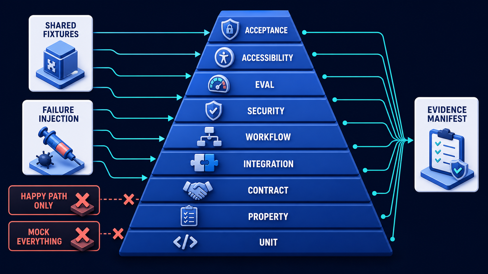
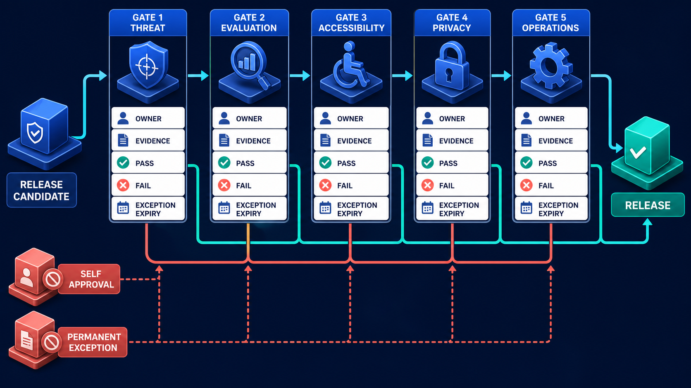

# Diagram 238 — Contract, integration, workflow, security, and acceptance tests

**Module:** Delivery and production readiness
**Role in the course:** Build a layered test system that proves domain rules, cross-stack contracts, real integrations, human journeys, adversarial behavior, and recovery.
**Layout:** TEST PYRAMID begins on the left and the diagram flows toward FAILURE INJECTION; a teal **the safe path** path is the desired route and a coral **HAPPY PATH ONLY** path is blocked or contained.

---

## At a glance

**Contract, integration, workflow, security, and acceptance tests** — Build a layered test system that proves domain rules, cross-stack contracts, real integrations, human journeys, adversarial behavior, and recovery.

- The central takeaway is: Test rules, contracts, real boundaries, complete journeys, attacks, and recovery with the evidence each requires.
- The visual begins with **TEST PYRAMID** and ends with the diagram's outcome, not a technology name.
- The blocked or dangerous path is marked **coral**: HAPPY PATH ONLY and MOCK EVERYTHING blocked.
- The analogy is: An aircraft is checked by testing parts, assembled systems, simulator scenarios, emergency procedures, and full flight acceptance. Counting screws inspected would not replace an engine-out rehearsal.

---

## What the diagram teaches

### 1. Contract, integration, workflow, security, and acceptance tests

Contract tests prove boundary agreement. Workflow tests replay time and failure. Acceptance tests begin from Maya's perspective: visible plan, current evidence, bounded proposal, accessible decision, authoritative result, preserved work, understandable failure, and durable receipt. In the diagram, **CONTRACT**, **INTEGRATION**, **WORKFLOW** appear at the left, turning this idea into something a reviewer can point at.

### 2. Map Every Requirement and Unacceptable Outcome to One or More Test Layers.

Property tests explore ranges and invariants. Acceptance tests prove the user outcome. Flaky or skipped tests remain visible debt rather than disappearing from a green summary. The visual places **TEST PYRAMID**, **MOCK EVERYTHING** at the center; the arrows between them are the physical expression of this principle. If this is skipped, flaky or skipped tests remain visible debt rather than disappearing from a green summary.

### 3. Create Reusable Synthetic Fixtures and Deterministic Clocks, Identities, Tenants, and Provider Doubles.

Shared fixtures make the two stacks comparable. The trace asks the team to create reusable synthetic fixtures and deterministic clocks, identities, tenants, and provider doubles. Look at **FIXTURES** on the top: the diagram uses those elements to show where this decision lives.

### 4. Run Real Boundary Integrations and End-to-end Browser Journeys in Isolated Environments.

Security tests target trust boundaries and unacceptable outcomes. The picture shows **TEST PYRAMID**, **FAILURE INJECTION**, **EVIDENCE MANIFEST** as the visual anchor for this idea, with the surrounding paths showing the flow. The project confirms the point: The requirements map shows concurrency, restart, idempotency, and keyboard recovery were not represented by existing unit tests.

### 5. Inject Malicious, Duplicate, Delayed, Stale, Partial, and Uncertain Behavior and Verify Recovery.

Agent systems also need controlled evaluations for variable outputs. They include valid cases, hostile content, ambiguous evidence, stale policy, missing scopes, duplicates, timeouts, partial success, uncertain effects, and recovery. They attempt cross-tenant access, prompt injection through retrieved data, tool-argument escalation, token misuse, unsafe URLs, data exfiltration, repeated effects, and audit tampering. To put this into practice, the team should inject malicious, duplicate, delayed, stale, partial, and uncertain behavior and verify recovery. At the bottom, **FAILURE INJECTION** is the element that makes this concept concrete before any code is written.

### 6. Publish a Versioned Evidence Manifest Including Failures, Flakes, Skips, Limitations, and Owners.

Each layer has a distinct job. The evidence manifest records code, contract, data, environment, model, prompt, policy, adapter, browser, run, result, and reviewer versions. In the diagram, **EVIDENCE MANIFEST** appear at the lower right, turning this idea into something a reviewer can point at. If this is skipped, mocking every boundary and measuring only coverage can create a perfectly tested imaginary system.

### 7. Test rules, contracts, real boundaries, complete journeys, attacks

Unit tests prove small deterministic rules. Integration tests exercise real dependencies. Evaluations complement software tests; they do not replace exact checks for authorization, schema, tenant isolation, idempotency, state transitions, accessibility, or committed receipts. A passing API without that story is incomplete. The visual places **TEST PYRAMID** at the upper left; the arrows between them are the physical expression of this principle.

Diagram 239 — *Threat, evaluation, accessibility, privacy, and readiness gates* is the next lens on this idea. The same concepts reappear there with different emphasis, so the two diagrams should be read as a pair.

### Analogy

An aircraft is checked by testing parts, assembled systems, simulator scenarios, emergency procedures, and full flight acceptance. Counting screws inspected would not replace an engine-out rehearsal. Look at **TEST PYRAMID**, **FAILURE INJECTION**, **EVIDENCE MANIFEST** on the left: the diagram uses those elements to show where this decision lives. The project confirms the point: Acme reports high code coverage, yet a duplicate approval after a worker restart produces two provider calls and one inaccessible error dialog.

### The Next.js surface

The Next.js surface must own the human experience while keeping authority and secrets on the server side. In this diagram, that means the web boundary stops the coral anti-patterns before they reach the browser.

- Combine component accessibility tests, reducer replay, server-boundary tests, browser journeys, and network failure fixtures.
- Assert focus, names, roles, status messages, reflow, keyboard behavior, stale-control blocking, and complete receipt content.
- Capture screenshots or traces only as supporting evidence; keep semantic assertions so layout changes do not create meaningless failures.

Together these choices prevent the mistakes in the Acme case—Acme reports high code coverage, yet a duplicate approval after a worker restart produces two provider calls and one inaccessible error dialog.—from becoming the architecture.

### The Python surface

The Python surface must keep business rules, protocols, and persistence in cleanly separated layers. In this diagram, that means FastAPI is one edge of a domain that does not leak into adapters or the model.

- Use pure domain tests, schema properties, adapter contracts, repository integrations, workflow replay, policy matrices, and packaged API acceptance tests.
- Inject clocks, IDs, providers, and failure schedules to make expiry, retries, compensation, and uncertain-effect cases repeatable.
- Test idempotency against concurrent delivery and process restart, not only sequential duplicate requests in memory.

These boundaries make the Acme case—Acme reports high code coverage, yet a duplicate approval after a worker restart produces two provider calls and one inaccessible error dialog.—testable and replaceable.

---

## Case study — Acme reports high code coverage

Acme reports high code coverage, yet a duplicate approval after a worker restart produces two provider calls and one inaccessible error dialog.

### The walkthrough

1. The requirements map shows concurrency, restart, idempotency, and keyboard recovery were not represented by existing unit tests.
2. A workflow integration fixture kills the worker after the external effect and replays the message.
3. The idempotency receipt prevents a second effect, while the web acceptance test verifies focus moves to an understandable recovery summary.
4. Both scenarios become permanent release gates linked to the incident class.

### The result

Quality evidence now covers the dangerous system interaction and the human recovery experience, not only lines of code.

### The danger

Mocking every boundary and measuring only coverage can create a perfectly tested imaginary system.

### The takeaway

Test rules, contracts, real boundaries, complete journeys, attacks, and recovery with the evidence each requires.

---

## Composition

The picture is a test pyramid. At the base, a shared **FIXTURES** card and a **FAILURE INJECTION** card feed a stack of test layers—**UNIT**, **PROPERTY**, **CONTRACT**, **INTEGRATION**, **WORKFLOW**, **SECURITY**, **EVAL**, **ACCESSIBILITY**, **ACCEPTANCE**. The layers narrow as they rise. At the top, an **EVIDENCE MANIFEST** card collects the output. Two coral blocked paths—**HAPPY PATH ONLY** and **MOCK EVERYTHING**—are stopped at the base. The composition shows that deep evidence needs many kinds of proof.

## Element by element

- **TEST PYRAMID** — a labeled visual element in this diagram; the prompt shows it as TEST PYRAMID layers UNIT.
- **FAILURE INJECTION** — a labeled visual element in this diagram; the prompt shows it as shared FIXTURES and FAILURE INJECTION.
- **EVIDENCE MANIFEST** — The evidence manifest records code, contract, data, environment, model, prompt, policy, adapter, browser, run, result, and reviewer versions.
- **HAPPY PATH ONLY** — the coral anti-pattern of testing only success.
- **MOCK EVERYTHING** — the coral anti-pattern of replacing every boundary and testing an imaginary system.
- **UNIT** — Unit tests prove small deterministic rules.
- **PROPERTY** — Property tests explore ranges and invariants.
- **CONTRACT** — Contract tests prove boundary agreement.
- **INTEGRATION** — Integration tests exercise real dependencies.
- **WORKFLOW** — Workflow tests replay time and failure.
- **SECURITY** — Security tests target trust boundaries and unacceptable outcomes.
- **EVAL** — the EVAL card shown in this diagram; it is one of the labeled elements the architecture uses.
- **ACCESSIBILITY** — Evaluations complement software tests; they do not replace exact checks for authorization, schema, tenant isolation, idempotency, state transitions, accessibility, or committed receipts.
- **ACCEPTANCE** — Acceptance tests prove the user outcome.
- **FIXTURES** — Shared fixtures make the two stacks comparable.

---

## Colour and flow semantics

The course visual grammar uses color to separate platforms, requests, safe paths, danger, and records. In this diagram those colors are assigned as follows:
- **Cobalt platform** — a product, service, environment, or boundary. The main structural cards such as **TEST PYRAMID**, **FAILURE INJECTION**, **EVIDENCE MANIFEST**, **UNIT**, **PROPERTY**, **CONTRACT** sit on glowing cobalt platforms.
- **Cyan arrow** — a typed request, event, artifact, deployment, test, or evidence handoff. The cyan paths between **TEST PYRAMID**, **WORKFLOW** carry the forward motion of the architecture.
- **Coral path** — an unacceptable outcome, failed boundary, broken contract, unsafe release, or unrecovered effect. The coral elements **HAPPY PATH ONLY**, **MOCK EVERYTHING** show what must be blocked or contained.
- **White card** — a requirement, schema, service, test, gate, owner, artifact, or receipt. The white cards such as **TEST PYRAMID**, **EVIDENCE MANIFEST**, **CONTRACT**, **FIXTURES** are the readable records the diagram communicates.

---

## How to present it

- Point to **TEST PYRAMID** and ask the room to state the human problem or outcome before naming any technology, protocol, or model.
- Point to **MOCK EVERYTHING** and ask what would have to change for the team to map every requirement and unacceptable outcome to one or more test layers, and who would own that change.
- Point to **FIXTURES** and ask what evidence would show the team has already create reusable synthetic fixtures and deterministic clocks, identities, tenants, and provider doubles, and what test would fail first if it is missing.
- Point to **FAILURE INJECTION** and ask who else in the room must agree before the team can run real boundary integrations and end-to-end browser journeys in isolated environments, and what would change their mind.
- Point to **HAPPY PATH ONLY** and ask what the smallest version of inject malicious, duplicate, delayed, stale, partial, and uncertain behavior and verify recovery looks like, and what would be left out of that version.
- Point to **EVIDENCE MANIFEST** and ask what would have to change for the team to publish a versioned evidence manifest including failures, flakes, skips, limitations, and owners, and who would own that change.
- Show the **coral** path (HAPPY PATH ONLY and MOCK EVERYTHING blocked) and ask what control, owner, or test would catch it before a user is harmed, and what the safe state would be if it is triggered.
- Use the analogy: An aircraft is checked by testing parts, assembled systems, simulator scenarios, emergency procedures, and full flight acceptance. Counting screws inspected would not replace an engine-out rehearsal. Ask how the same failure would appear in the team's current code or process.
- Return to the whole diagram and ask the room to name one thing they will stop, one thing they will start, and one thing they will own differently before the next build.
- Run the lab: Build a requirement-to-test matrix for the capstone with at least forty cases across unit, property, contract, integration, workflow, security, evaluation, accessibility, and acceptance layers. Include fixtures, environments, owners, failure injection, evidence fields, and skip policy.
- Pose the checkpoint: *Can model evaluations replace deterministic authorization tests?*

---

## Lab and checkpoint

**Lab:** Build a requirement-to-test matrix for the capstone with at least forty cases across unit, property, contract, integration, workflow, security, evaluation, accessibility, and acceptance layers. Include fixtures, environments, owners, failure injection, evidence fields, and skip policy.

**Checkpoint:** Can model evaluations replace deterministic authorization tests?

**Answer:** No. Variable-output evaluations cannot prove exact access, tenant, idempotency, schema, or state invariants; those require deterministic tests.

---

## Glossary

- **Property test** — test of rules across many generated inputs
- **Acceptance test** — proof of a complete user-facing requirement
- **Flaky test** — test whose result changes without a relevant product change

---

## Sources

- Next.js testing
- FastAPI testing
- OWASP Agentic Applications 2026
- WCAG 2.2

---

## Related lessons

- **Lesson 229** — Shared schemas, contracts, fixtures, and conformance cases (`shared-contract-conformance-kit`)
- **Lesson 232** — Cross-stack integration, adapters, and end-to-end tests (`cross-stack-adapter-test-loop`)
- **Lesson 239** — Threat, evaluation, accessibility, privacy, and readiness gates (`readiness-gate-system`)
---

### Why this diagram must precede the build

The team should not begin with code, prompts, or models for Contract, integration, workflow, security, and acceptance tests until the diagram is legible to every reviewer. Build a layered test system that proves domain rules, cross-stack contracts, real integrations, human journeys, adversarial behavior, and recovery. The trace moves through 5 decisions: Map every requirement and unacceptable outcome to one or more test layers.; Create reusable synthetic fixtures and deterministic clocks, identities, tenants, and provider doubles.; Run real boundary integrations and end-to-end browser journeys in isolated environments.; Inject malicious, duplicate, delayed, stale, partial, and uncertain behavior and verify recovery.; Publish a versioned evidence manifest including failures, flakes, skips, limitations, and owners.. Each decision maps to a labeled element in the picture, and each label must have an owner, a contract, and an acceptance test before the corresponding code is written.

The case study—Acme reports high code coverage, yet a duplicate approval after a worker restart produces two provider calls and one inaccessible error dialog.—shows that Test rules, contracts, real boundaries, complete journeys, attacks, and recovery with the evidence each requires. If the team skips this, Mocking every boundary and measuring only coverage can create a perfectly tested imaginary system. The diagram is the contract the two projects share. Until the team can trace the problem through the labels, assign owners to each card, and write the corresponding test, the build will drift from the architecture.

Before writing the first route, prompt, or adapter, the team should be able to answer: what is the user outcome this diagram protects, which card owns each decision, what evidence moves across each arrow, where the coral anti-patterns first appear, what test or gate proves the real system matches the picture, and which fixture will catch the next regression. When those answers are visible and reviewable, the build becomes a direct translation of the architecture rather than a guess about it. The diagram is the earliest acceptance test the project can write. Keeping it current is cheaper than debugging the drift it prevents. A reviewer who cannot read the diagram will not be able to read the build. Start every build review by pointing at the diagram, not the code.