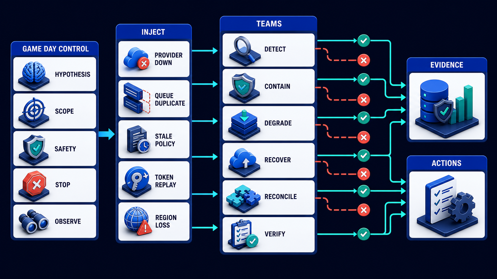
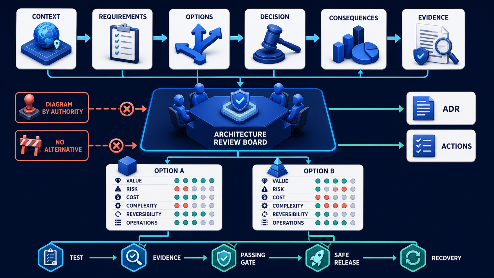

# Diagram 242 — Failure game day and recovery demonstration

**Module:** Final capstone and project handoff
**Role in the course:** Demonstrate that the designed system and team can recognize, contain, recover, reconcile, and learn from realistic failures.
**Layout:** GAME DAY CONTROL begins on the left and the diagram flows toward PROVIDER DOWN; a teal **the safe path** path is the desired route and a coral **the dangerous path** path is blocked or contained.

---

## At a glance

**Failure game day and recovery demonstration** — Demonstrate that the designed system and team can recognize, contain, recover, reconcile, and learn from realistic failures.

- The central takeaway is: Test one bounded failure hypothesis, protect users, verify the whole recovery, and turn surprises into permanent improvements.
- The visual begins with **GAME DAY CONTROL** and ends with the diagram's outcome, not a technology name.
- The analogy is: A lifeboat drill tests alarms, crew roles, passenger guidance, equipment, timing, and headcount without first waiting for a real sinking. The drill is controlled, but the verification is serious.

---

## What the diagram teaches

### 1. Failure game day and recovery demonstration

The team checks tasks, receipts, artifacts, caches, indexes, audit, notifications, accessibility, and privacy before declaring success. In the diagram, **GAME DAY CONTROL** appear at the left, turning this idea into something a reviewer can point at.

### 2. Choose One Architecture Assumption and Write the Failure Hypothesis and Success Evidence.

Diagram 241 — *Architecture review and trade-off defense* is the next lens on this idea. The same concepts reappear there with different emphasis, so the two diagrams should be read as a pair.

Scenarios come from the architecture and threat model: provider unavailable, queue duplicates, stale evidence, policy service loss, token replay, artifact corruption, regional outage, cross-tenant attempt, or uncertain external effect. The visual places **HYPOTHESIS**, **EVIDENCE** at the center; the arrows between them are the physical expression of this principle. If this is skipped, uncontrolled chaos can cause real harm, while a scripted demonstration with no surprising observations proves little about resilience.

### 3. Authorize Scope, Synthetic Data, Observers, Communications, Stop Conditions, and Rollback.

A game day is a controlled resilience exercise with a hypothesis, authorized scope, synthetic or safe target, observers, stop conditions, rollback, and evidence plan. Protect customer data, prevent irreversible effects, limit blast radius, use synthetic tenants, obtain approvals, and give an authorized controller an immediate stop mechanism. The trace asks the team to authorize scope, synthetic data, observers, communications, stop conditions, and rollback. Look at **SCOPE**, **STOP** on the top: the diagram uses those elements to show where this decision lives.

### 4. Inject the Failure While Recording Detection, Decisions, User State, Containment, and System Behavior.

Failure injection must remain bounded. The picture shows **GAME DAY CONTROL**, **PROVIDER DOWN**, **QUEUE DUPLICATE** as the visual anchor for this idea, with the surrounding paths showing the flow. The project confirms the point: A synthetic game day injects the crash at the uncertain-effect boundary under an authorized controller.

### 5. Recover and Reconcile Every Authoritative, Derived, Queued, and User-visible State.

Detection, alert routing, incident roles, runbook accuracy, user-visible degraded state, support communication, reconciliation, restore, and decision authority all matter. Recovery is verified against authoritative records and user outcomes. To put this into practice, the team should recover and reconcile every authoritative, derived, queued, and user-visible state. At the bottom, **RECOVER**, **RECONCILE** is the element that makes this concept concrete before any code is written.

### 6. Publish Findings and Owned Actions, Then Rerun the Scenario After Improvements.

The exercise evaluates both technology and people. The report separates expected behavior, observations, surprises, timeline, evidence, limitations, and actions. In the diagram, **ACTIONS** appear at the lower right, turning this idea into something a reviewer can point at. If this is skipped, uncontrolled chaos can cause real harm, while a scripted demonstration with no surprising observations proves little about resilience.

### 7. Test one bounded failure hypothesis, protect users, verify the whole recovery

It is not permission to surprise production users. Findings become backlog, tests, alerts, architecture decisions, training, and a scheduled re-exercise. The visual places **HYPOTHESIS**, **VERIFY** at the upper left; the arrows between them are the physical expression of this principle.

### Analogy

A lifeboat drill tests alarms, crew roles, passenger guidance, equipment, timing, and headcount without first waiting for a real sinking. The drill is controlled, but the verification is serious. Look at **GAME DAY CONTROL**, **PROVIDER DOWN**, **QUEUE DUPLICATE** on the left: the diagram uses those elements to show where this decision lives. The project confirms the point: Acme believes its idempotency and recovery design is safe, but it has never tested a worker crash immediately after a provider accepts a refund.

### The Next.js surface

The Next.js surface must own the human experience while keeping authority and secrets on the server side. In this diagram, that means the web boundary stops the coral anti-patterns before they reach the browser.

- Use a test-only scenario controller to trigger delayed streams, stale snapshots, dependency loss, expired approvals, and artifact failures in synthetic workspaces.
- Verify accessible degraded messaging, preserved drafts, focus, retry, cancellation, support reference, and later recovery.
- Record browser trace and semantic assertions without including customer data or production secrets in the exercise pack.

Together these choices prevent the mistakes in the Acme case—Acme believes its idempotency and recovery design is safe, but it has never tested a worker crash immediately after a provider accepts a refund.—from becoming the architecture.

### The Python surface

The Python surface must keep business rules, protocols, and persistence in cleanly separated layers. In this diagram, that means FastAPI is one edge of a domain that does not leak into adapters or the model.

- Add authorized failure points at adapter boundaries for timeout, duplicate, corrupt response, unavailable policy, lost worker, and uncertain effect.
- Keep safety interlocks outside the injected component and require a controller identity, scope, expiry, and audit receipt.
- Run reconciliation after the experiment and compare domain state, business receipts, queues, artifacts, indexes, and telemetry.

These boundaries make the Acme case—Acme believes its idempotency and recovery design is safe, but it has never tested a worker crash immediately after a provider accepts a refund.—testable and replaceable.

---

## Case study — Acme believes its idempotency and recovery design is safe

Acme believes its idempotency and recovery design is safe, but it has never tested a worker crash immediately after a provider accepts a refund.

### The walkthrough

1. A synthetic game day injects the crash at the uncertain-effect boundary under an authorized controller.
2. The alert fires, retries pause, and Maya sees an honest pending verification state with her work preserved.
3. The runbook reconciles the provider receipt and Acme idempotency record before completing the task once.
4. A missing support message and slow reconciliation query become owned improvements and permanent fixtures.

### The result

Acme replaces confidence in the diagram with observed recovery evidence and a clearer list of remaining weaknesses.

### The danger

Uncontrolled chaos can cause real harm, while a scripted demonstration with no surprising observations proves little about resilience.

### The takeaway

Test one bounded failure hypothesis, protect users, verify the whole recovery, and turn surprises into permanent improvements.

---

## Composition

The picture is a game-day map. At the top, **GAME DAY CONTROL** holds five cards—**HYPOTHESIS**, **SCOPE**, **SAFETY**, **STOP**, **OBSERVE**. From it, five failure injections—**PROVIDER DOWN**, **QUEUE DUPLICATE**, **STALE POLICY**, **TOKEN REPLAY**, **REGION LOSS**—drop into a team workflow ring of **DETECT**, **CONTAIN**, **DEGRADE**, **RECOVER**, **RECONCILE**, **VERIFY**. On the right, **EVIDENCE** and **ACTIONS** cards exit. The composition shows a controlled, contained, and observed failure exercise.

## Element by element

- **GAME DAY CONTROL** — controlled exercise of failure and recovery.
- **PROVIDER DOWN** — the PROVIDER DOWN card shown in this diagram; it is one of the labeled elements the architecture uses.
- **QUEUE DUPLICATE** — the QUEUE DUPLICATE card shown in this diagram; it is one of the labeled elements the architecture uses.
- **STALE POLICY** — Scenarios come from the architecture and threat model: provider unavailable, queue duplicates, stale evidence, policy service loss, token replay, artifact corruption, regional outage, cross-tenant attempt, or uncertain external effect.
- **TOKEN REPLAY** — Scenarios come from the architecture and threat model: provider unavailable, queue duplicates, stale evidence, policy service loss, token replay, artifact corruption, regional outage, cross-tenant attempt, or uncertain external effect.
- **REGION LOSS** — the REGION LOSS card shown in this diagram; it is one of the labeled elements the architecture uses.
- **HYPOTHESIS** — A game day is a controlled resilience exercise with a hypothesis, authorized scope, synthetic or safe target, observers, stop conditions, rollback, and evidence plan.
- **SCOPE** — A game day is a controlled resilience exercise with a hypothesis, authorized scope, synthetic or safe target, observers, stop conditions, rollback, and evidence plan.
- **SAFETY** — independent control that can stop or contain an experiment.
- **STOP** — A game day is a controlled resilience exercise with a hypothesis, authorized scope, synthetic or safe target, observers, stop conditions, rollback, and evidence plan.
- **OBSERVE** — the OBSERVE card shown in this diagram; it is one of the labeled elements the architecture uses.
- **DETECT** — a labeled visual element in this diagram; the prompt shows it as Teams DETECT.
- **CONTAIN** — Demonstrate that the designed system and team can recognize, contain, recover, reconcile, and learn from realistic failures.
- **DEGRADE** — the DEGRADE card shown in this diagram; it is one of the labeled elements the architecture uses.
- **RECOVER** — Demonstrate that the designed system and team can recognize, contain, recover, reconcile, and learn from realistic failures.
- **RECONCILE** — Demonstrate that the designed system and team can recognize, contain, recover, reconcile, and learn from realistic failures.
- **VERIFY** — Test one bounded failure hypothesis, protect users, verify the whole recovery, and turn surprises into permanent improvements.
- **EVIDENCE** — A game day is a controlled resilience exercise with a hypothesis, authorized scope, synthetic or safe target, observers, stop conditions, rollback, and evidence plan.
- **ACTIONS** — The report separates expected behavior, observations, surprises, timeline, evidence, limitations, and actions.

---

## Colour and flow semantics

The course visual grammar uses color to separate platforms, requests, safe paths, danger, and records. In this diagram those colors are assigned as follows:
- **Cobalt platform** — a product, service, environment, or boundary. The main structural cards such as **GAME DAY CONTROL**, **PROVIDER DOWN**, **QUEUE DUPLICATE**, **STALE POLICY**, **TOKEN REPLAY**, **REGION LOSS** sit on glowing cobalt platforms.
- **Cyan arrow** — a typed request, event, artifact, deployment, test, or evidence handoff. The cyan paths between **GAME DAY CONTROL**, **PROVIDER DOWN**, **QUEUE DUPLICATE**, **STALE POLICY** carry the forward motion of the architecture.
- **White card** — a requirement, schema, service, test, gate, owner, artifact, or receipt. The white cards such as **GAME DAY CONTROL**, **PROVIDER DOWN**, **QUEUE DUPLICATE**, **STALE POLICY**, **TOKEN REPLAY**, **REGION LOSS**, **HYPOTHESIS**, **SCOPE** are the readable records the diagram communicates.

---

## How to present it

- Point to **GAME DAY CONTROL** and ask the room to state the human problem or outcome before naming any technology, protocol, or model.
- Point to **HYPOTHESIS** and ask what would have to change for the team to choose one architecture assumption and write the failure hypothesis and success evidence, and who would own that change.
- Point to **SCOPE** and ask what evidence would show the team has already authorize scope, synthetic data, observers, communications, stop conditions, and rollback, and what test would fail first if it is missing.
- Point to **PROVIDER DOWN** and ask who else in the room must agree before the team can inject the failure while recording detection, decisions, user state, containment, and system behavior, and what would change their mind.
- Point to **RECOVER** and ask what the smallest version of recover and reconcile every authoritative, derived, queued, and user-visible state looks like, and what would be left out of that version.
- Point to **ACTIONS** and ask what would have to change for the team to publish findings and owned actions, then rerun the scenario after improvements, and who would own that change.
- Point to **GAME DAY CONTROL** and ask who owns it, what evidence it needs, what happens when that evidence is missing, and which test proves the gate cannot be bypassed.
- Point to **STALE POLICY** and ask who owns it, what evidence it needs, what happens when that evidence is missing, and which test proves the gate cannot be bypassed.
- Use the analogy: A lifeboat drill tests alarms, crew roles, passenger guidance, equipment, timing, and headcount without first waiting for a real sinking. The drill is controlled, but the verification is serious. Ask how the same failure would appear in the team's current code or process.
- Return to the whole diagram and ask the room to name one thing they will stop, one thing they will start, and one thing they will own differently before the next build.
- Run the lab: Design a ninety-minute game day for three scenarios. Include hypothesis, authorization, synthetic scope, safety, stop conditions, observers, expected alerts, runbooks, user states, communications, evidence, reconciliation, verification, findings, owners, and rerun date.
- Pose the checkpoint: *Should a game day inject failures into production without stakeholder approval because realism is valuable?*

---

## Lab and checkpoint

**Lab:** Design a ninety-minute game day for three scenarios. Include hypothesis, authorization, synthetic scope, safety, stop conditions, observers, expected alerts, runbooks, user states, communications, evidence, reconciliation, verification, findings, owners, and rerun date.

**Checkpoint:** Should a game day inject failures into production without stakeholder approval because realism is valuable?

**Answer:** No. The exercise needs explicit authority, risk review, containment, stop conditions, privacy protection, and an appropriate target environment.

---

## Glossary

- **Game day** — controlled exercise of failure and recovery
- **Failure injection** — deliberate bounded creation of a fault
- **Safety interlock** — independent control that can stop or contain an experiment

---

## Sources

- NIST AI Risk Management Framework
- OWASP Agentic Applications 2026
- OpenTelemetry traces

---

## Related lessons

- **Lesson 240** — Runbooks, support, incident response, and operational ownership (`operational-ownership-loop`)
- **Lesson 241** — Architecture review and trade-off defense (`architecture-review-tradeoff-defense`)
- **Lesson 244** — Graduation map and handoff to the two separate coding projects (`dual-project-graduation-handoff`)
---

### Why this diagram must precede the build

The team should not begin with code, prompts, or models for Failure game day and recovery demonstration until the diagram is legible to every reviewer. Demonstrate that the designed system and team can recognize, contain, recover, reconcile, and learn from realistic failures. The trace moves through 5 decisions: Choose one architecture assumption and write the failure hypothesis and success evidence.; Authorize scope, synthetic data, observers, communications, stop conditions, and rollback.; Inject the failure while recording detection, decisions, user state, containment, and system behavior.; Recover and reconcile every authoritative, derived, queued, and user-visible state.; Publish findings and owned actions, then rerun the scenario after improvements.. Each decision maps to a labeled element in the picture, and each label must have an owner, a contract, and an acceptance test before the corresponding code is written.

The case study—Acme believes its idempotency and recovery design is safe, but it has never tested a worker crash immediately after a provider accepts a refund.—shows that Test one bounded failure hypothesis, protect users, verify the whole recovery, and turn surprises into permanent improvements. If the team skips this, Uncontrolled chaos can cause real harm, while a scripted demonstration with no surprising observations proves little about resilience. The diagram is the contract the two projects share. Until the team can trace the problem through the labels, assign owners to each card, and write the corresponding test, the build will drift from the architecture.

Before writing the first route, prompt, or adapter, the team should be able to answer: what is the user outcome this diagram protects, which card owns each decision, what evidence moves across each arrow, where the coral anti-patterns first appear, what test or gate proves the real system matches the picture, and which fixture will catch the next regression. When those answers are visible and reviewable, the build becomes a direct translation of the architecture rather than a guess about it. The diagram is the earliest acceptance test the project can write. Keeping it current is cheaper than debugging the drift it prevents. A reviewer who cannot read the diagram will not be able to read the build. Start every build review by pointing at the diagram, not the code.