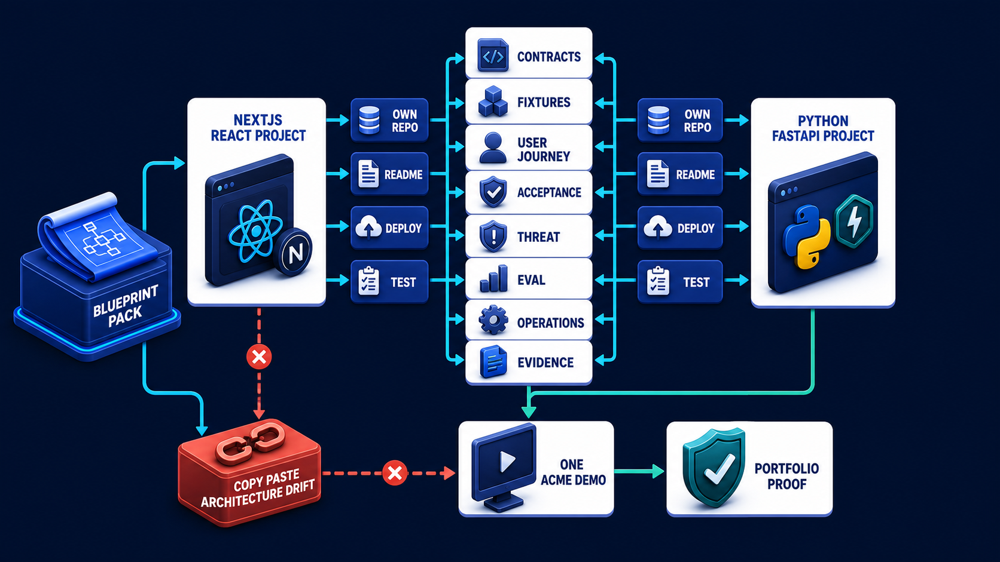

# Diagram 244 — Graduation map and handoff to the two separate coding projects

**Module:** Final capstone and project handoff
**Role in the course:** Package the entire course into a clean implementation handoff so the two later full-stack projects can begin independently and reunite through one tested product contract.
**Layout:** BLUEPRINT PACK begins on the left and the diagram flows toward NEXTJS REACT PROJECT; a teal **the safe path** path is the desired route and a coral **COPY PASTE ARCHITECTURE DRIFT** path is blocked or contained.

---

## At a glance

**Graduation map and handoff to the two separate coding projects** — Package the entire course into a clean implementation handoff so the two later full-stack projects can begin independently and reunite through one tested product contract.

- The central takeaway is: Separate the implementations, share the product contract and proof, and reunite them through tested user outcomes.
- The visual begins with **BLUEPRINT PACK** and ends with the diagram's outcome, not a technology name.
- The blocked or dangerous path is marked **coral**: COPY PASTE ARCHITECTURE DRIFT blocked.
- The analogy is: An architect hands builders drawings, specifications, materials rules, inspections, and acceptance tests. The electrical and structural teams work separately, but their interfaces and final building must agree.

---

## What the diagram teaches

### 1. Graduation map and handoff to the two separate coding projects

Every addition passes the same contract, security, evaluation, accessibility, recovery, and evidence gates. In the diagram, **BLUEPRINT PACK**, **NEXTJS REACT PROJECT**, **PYTHON FASTAPI PROJECT** appear at the left, turning this idea into something a reviewer can point at.

### 2. Freeze the Blueprint Version and Inventory Every Handoff Artifact, Open Question, Assumption, Owner

They remain separate artifacts and repositories or clearly separated workspaces. They exchange versioned commands, queries, events, problems, artifacts, and receipts through the shared conformance kit. The visual places **BLUEPRINT PACK** at the center; the arrows between them are the physical expression of this principle. If this is skipped, starting both codebases without a frozen contract and acceptance pack invites duplicated authority, incompatible events, divergent fixtures, and a late integration rewrite.

### 3. Create Separate Next.js and Python Backlogs Mapped to the Same Vertical Slices, Contracts

The handoff states exactly what the later Next.js and Python projects must build, what they share, what each owns, and how completion will be proven. The trace asks the team to create separate Next.js and Python backlogs mapped to the same vertical slices, contracts, and acceptance cases. Look at **NEXTJS REACT PROJECT**, **PYTHON FASTAPI PROJECT**, **CONTRACTS** on the top: the diagram uses those elements to show where this decision lives.

### 4. Start with Both Projects with Synthetic Fixtures and Conformance Runners Before Live Providers

Neither copies the other's internals. Implementation begins with deterministic synthetic services and fixtures, then introduces real protocol SDKs and providers behind adapters. The picture shows **FIXTURES** as the visual anchor for this idea, with the surrounding paths showing the flow. The project confirms the point: She versions the blueprint and assigns every shared contract, open decision, and acceptance case an owner.

### 5. Integrate Through Versioned Adapters, Run the Complete Gate System, Deploy Independently

The Next.js project owns the web and learning experience, accessible state, interaction, event projection, artifact views, privacy controls, and Vercel deployment. The Python project owns domain rules, orchestration, adapters, durable work, policy, persistence, audit, and service deployment. To put this into practice, the team should integrate through versioned adapters, run the complete gate system, deploy independently, and perform a controlled game day. At the bottom, **DEPLOY** is the element that makes this concept concrete before any code is written.

### 6. Publish the Reproducible Portfolio Pack with Actual Evidence, Measured Results Where Valid, Limitations

It does not pretend that planning is implementation. Graduation evidence is a reproducible dual-stack demonstration: one user journey, one consequential decision, one authoritative or safely simulated receipt, one failure and recovery, one version manifest, and honest measured results only where measurement truly occurred. In the diagram, **BLUEPRINT PACK**, **PORTFOLIO PROOF**, **EVIDENCE** appear at the lower right, turning this idea into something a reviewer can point at. If this is skipped, graduation evidence is a reproducible dual-stack demonstration: one user journey, one consequential decision, one authoritative or safely simulated receipt, one failure and recovery, one version manifest, and honest measured results only where measurement truly occurred.

Diagram 243 — *Portfolio evidence, README, case study, and demonstration plan* is the next lens on this idea. The same concepts reappear there with different emphasis, so the two diagrams should be read as a pair.

### 7. Separate the implementations, share the product contract and proof

Volume 10 finishes the design phase. The shared pack contains the problem brief, user journeys, requirements, unacceptable outcomes, architecture, trust boundaries, contract kit, fixtures, data map, threat model, evaluation plan, accessibility criteria, release gates, runbooks, game day, and evidence manifest. The visual places **PORTFOLIO PROOF**, **CONTRACTS** at the upper left; the arrows between them are the physical expression of this principle.

### Analogy

An architect hands builders drawings, specifications, materials rules, inspections, and acceptance tests. The electrical and structural teams work separately, but their interfaces and final building must agree. Look at **BLUEPRINT PACK**, **NEXTJS REACT PROJECT**, **PYTHON FASTAPI PROJECT** on the left: the diagram uses those elements to show where this decision lives. The project confirms the point: Acme is ready to code, but Maya wants to avoid two teams interpreting the diagrams differently and building incompatible demos.

### The Next.js surface

The Next.js surface must own the human experience while keeping authority and secrets on the server side. In this diagram, that means the web boundary stops the coral anti-patterns before they reach the browser.

- Create a dedicated project with App Router routes, server-first data access, narrow client islands, an accessible product-event reducer, visual lessons, synthetic demo mode, tests, and Vercel deployment.
- Import or generate only the shared wire contracts and fixtures; keep UI state and component architecture native to TypeScript and React.
- Prove the browser journey, accessibility, secret boundary, authorization handoff, reconnect, proposal binding, receipt, and failure recovery.

Together these choices prevent the mistakes in the Acme case—Acme is ready to code, but Maya wants to avoid two teams interpreting the diagrams differently and building incompatible demos.—from becoming the architecture.

### The Python surface

The Python surface must keep business rules, protocols, and persistence in cleanly separated layers. In this diagram, that means FastAPI is one edge of a domain that does not leak into adapters or the model.

- Create a dedicated FastAPI project with domain, application, ports, adapters, workers, stores, policy, telemetry, migrations, tests, and service deployment.
- Implement the canonical contract through Pydantic boundary models while keeping domain semantics independent and stronger where needed.
- Prove idempotency, tenant isolation, evidence freshness, protocol conformance, durable recovery, audit, evaluation, and operational game-day behavior.

These boundaries make the Acme case—Acme is ready to code, but Maya wants to avoid two teams interpreting the diagrams differently and building incompatible demos.—testable and replaceable.

---

## Case study — Acme is ready to code

Acme is ready to code, but Maya wants to avoid two teams interpreting the diagrams differently and building incompatible demos.

### The walkthrough

1. She versions the blueprint and assigns every shared contract, open decision, and acceptance case an owner.
2. The web and Python backlogs use the same six vertical slices and synthetic fixtures while maintaining separate implementation responsibilities.
3. A conformance runner and end-to-end suite reunite the projects at every milestone rather than only at the end.
4. The final demonstration shows the policy review, bounded approval, authoritative simulated receipt, provider-failure recovery, and complete evidence manifest.

### The result

The learner graduates with an implementation-ready map for two serious portfolio projects and a clear standard for proving they work together.

### The danger

Starting both codebases without a frozen contract and acceptance pack invites duplicated authority, incompatible events, divergent fixtures, and a late integration rewrite.

### The takeaway

Separate the implementations, share the product contract and proof, and reunite them through tested user outcomes.

---

## Composition

The picture is a graduation handoff map. In the center, a **BLUEPRINT PACK** splits into two project platforms—**NEXTJS REACT PROJECT** on the left and **PYTHON FASTAPI PROJECT** on the right. The center of the split holds shared cards—**CONTRACTS**, **FIXTURES**, **USER JOURNEY**, **ACCEPTANCE**, **THREAT**, **EVAL**, **OPERATIONS**, **EVIDENCE**. Each project has cards for **OWN REPO**, **README**, **DEPLOY**, and **TEST**. At the bottom, both projects converge on **ONE ACME DEMO** and **PORTFOLIO PROOF**. A coral **COPY PASTE ARCHITECTURE DRIFT** path is blocked. The composition shows one blueprint, two implementations, one proof.

## Element by element

- **BLUEPRINT PACK** — the shared handoff artifact that contains the architecture, contracts, fixtures, and evidence the two projects share.
- **NEXTJS REACT PROJECT** — the separate Next.js implementation project that owns the web experience, accessible UI, and Vercel deployment.
- **PYTHON FASTAPI PROJECT** — the separate Python implementation project that owns domain rules, adapters, durable work, and service deployment.
- **USER JOURNEY** — Graduation evidence is a reproducible dual-stack demonstration: one user journey, one consequential decision, one authoritative or safely simulated receipt, one failure and recovery, one version manifest, and honest measured results only where measurement truly occurred.
- **OWN REPO** — a labeled visual element in this diagram; the prompt shows it as project has OWN REPO.
- **ONE ACME DEMO** — the single reproducible demonstration that both projects converge on to prove the shared user journey.
- **PORTFOLIO PROOF** — the evidence pack that makes the project credible and traceable to tests, deployment, and measured results.
- **COPY PASTE ARCHITECTURE DRIFT** — the coral anti-pattern of copying the other project’s internals instead of sharing contracts and fixtures.
- **CONTRACTS** — Create separate Next.js and Python backlogs mapped to the same vertical slices, contracts, and acceptance cases.
- **FIXTURES** — The shared pack contains the problem brief, user journeys, requirements, unacceptable outcomes, architecture, trust boundaries, contract kit, fixtures, data map, threat model, evaluation plan, accessibility criteria, release gates, runbooks, game day, and evidence manifest.
- **ACCEPTANCE** — Create separate Next.js and Python backlogs mapped to the same vertical slices, contracts, and acceptance cases.
- **THREAT** — The shared pack contains the problem brief, user journeys, requirements, unacceptable outcomes, architecture, trust boundaries, contract kit, fixtures, data map, threat model, evaluation plan, accessibility criteria, release gates, runbooks, game day, and evidence manifest.
- **EVAL** — the EVAL card shown in this diagram; it is one of the labeled elements the architecture uses.
- **OPERATIONS** — the OPERATIONS card shown in this diagram; it is one of the labeled elements the architecture uses.
- **EVIDENCE** — The shared pack contains the problem brief, user journeys, requirements, unacceptable outcomes, architecture, trust boundaries, contract kit, fixtures, data map, threat model, evaluation plan, accessibility criteria, release gates, runbooks, game day, and evidence manifest.
- **README** — the README card shown in this diagram; it is one of the labeled elements the architecture uses.
- **DEPLOY** — Integrate through versioned adapters, run the complete gate system, deploy independently, and perform a controlled game day.
- **TEST** — the TEST card shown in this diagram; it is one of the labeled elements the architecture uses.

---

## Colour and flow semantics

The course visual grammar uses color to separate platforms, requests, safe paths, danger, and records. In this diagram those colors are assigned as follows:
- **Cobalt platform** — a product, service, environment, or boundary. The main structural cards such as **BLUEPRINT PACK**, **NEXTJS REACT PROJECT**, **PYTHON FASTAPI PROJECT** sit on glowing cobalt platforms.
- **Cyan arrow** — a typed request, event, artifact, deployment, test, or evidence handoff. The cyan paths between **USER JOURNEY**, **TEST** carry the forward motion of the architecture.
- **Coral path** — an unacceptable outcome, failed boundary, broken contract, unsafe release, or unrecovered effect. The coral elements **COPY PASTE ARCHITECTURE DRIFT** show what must be blocked or contained.
- **White card** — a requirement, schema, service, test, gate, owner, artifact, or receipt. The white cards such as **CONTRACTS**, **FIXTURES**, **EVIDENCE**, **TEST** are the readable records the diagram communicates.

---

## How to present it

- Point to **BLUEPRINT PACK** and ask the room to state the human problem or outcome before naming any technology, protocol, or model.
- Point to **BLUEPRINT PACK** and ask what would have to change for the team to freeze the blueprint version and inventory every handoff artifact, open question, assumption, owner, and decision, and who would own that change.
- Point to **NEXTJS REACT PROJECT** and ask what evidence would show the team has already create separate Next.js and Python backlogs mapped to the same vertical slices, contracts, and acceptance cases, and what test would fail first if it is missing.
- Point to **FIXTURES** and ask who else in the room must agree before the team can start both projects with synthetic fixtures and conformance runners before live providers or privileged tools, and what would change their mind.
- Point to **DEPLOY** and ask what the smallest version of integrate through versioned adapters, run the complete gate system, deploy independently, and perform a controlled game day looks like, and what would be left out of that version.
- Point to **PORTFOLIO PROOF** and ask what would have to change for the team to publish the reproducible portfolio pack with actual evidence, measured results where valid, limitations, and the next learning roadmap, and who would own that change.
- Show the **coral** path (COPY PASTE ARCHITECTURE DRIFT blocked) and ask what control, owner, or test would catch it before a user is harmed, and what the safe state would be if it is triggered.
- Use the analogy: An architect hands builders drawings, specifications, materials rules, inspections, and acceptance tests. The electrical and structural teams work separately, but their interfaces and final building must agree. Ask how the same failure would appear in the team's current code or process.
- Return to the whole diagram and ask the room to name one thing they will stop, one thing they will start, and one thing they will own differently before the next build.
- Run the lab: Assemble the final handoff directory: blueprint index, Next.js backlog, Python backlog, shared contract kit, fixtures, acceptance matrix, environment map, risk register, gate templates, runbooks, game-day plan, demo script, claim audit, owners, and version-recheck checklist.
- Pose the checkpoint: *Should the two projects share all internal domain and UI types to prevent drift?*

---

## Lab and checkpoint

**Lab:** Assemble the final handoff directory: blueprint index, Next.js backlog, Python backlog, shared contract kit, fixtures, acceptance matrix, environment map, risk register, gate templates, runbooks, game-day plan, demo script, claim audit, owners, and version-recheck checklist.

**Checkpoint:** Should the two projects share all internal domain and UI types to prevent drift?

**Answer:** No. Share canonical wire contracts, fixtures, and behavior tests. Let each project keep native internal models and adapters so implementation concerns remain properly separated.

---

## Glossary

- **Handoff** — complete transfer of decisions and build-ready evidence
- **Wire contract** — agreed data and behavior at a service boundary
- **Graduation evidence** — reproducible proof that the planned system was implemented and verified

---

## Sources

- MCP 2026-07-28 specification
- A2A 1.0 specification
- AG-UI architecture
- Next.js App Router
- FastAPI bigger applications
- WCAG 2.2

---

## Related lessons

- **Lesson 229** — Shared schemas, contracts, fixtures, and conformance cases (`shared-contract-conformance-kit`)
- **Lesson 237** — Milestones, vertical slices, backlog, dependencies, and owners (`vertical-slice-delivery-roadmap`)
- **Lesson 243** — Portfolio evidence, README, case study, and demonstration plan (`portfolio-evidence-story-map`)