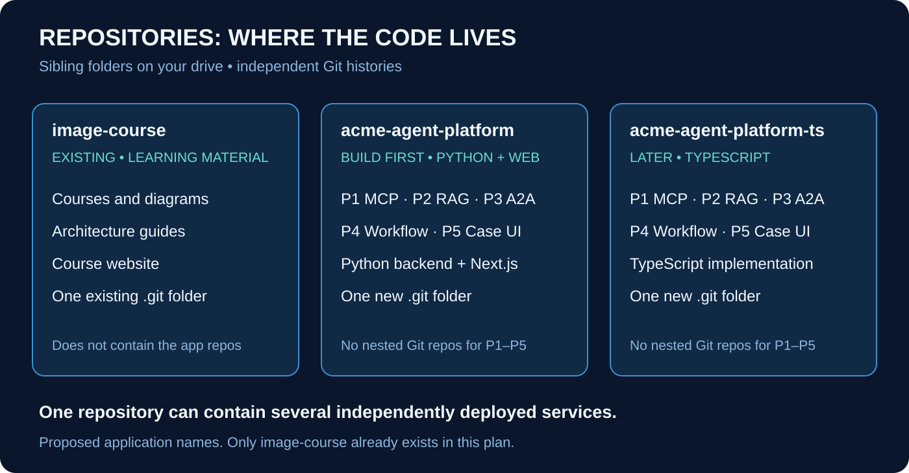
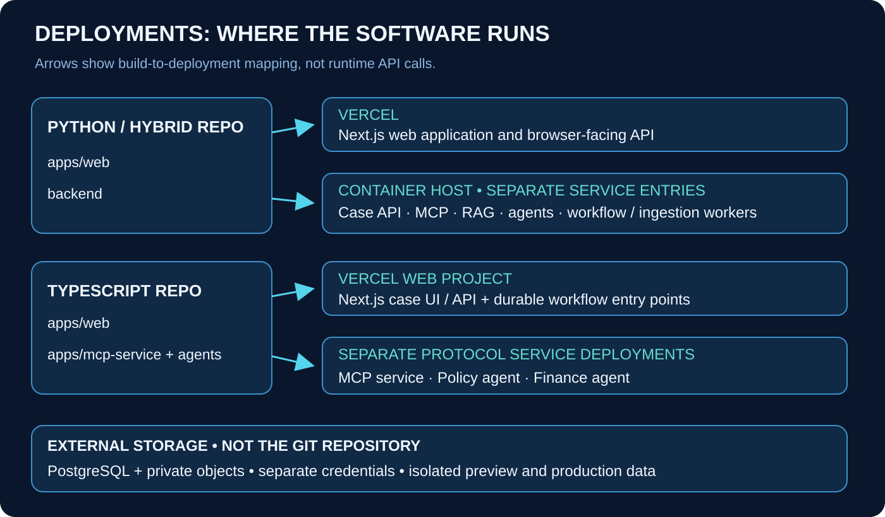

# Where the Projects Live

## A practical guide to folders, Git repositories, and deployment

**My recommendation: keep the course separate, build one Python/hybrid application repository first, and create a second application repository only when we build the TypeScript counterpart.**

The five portfolio projects belong together inside each application repository. They do not need five separate Git repositories. Their services can still be deployed independently.

This document is a proposed implementation plan. No application repositories, cloud projects, databases, or deployments have been created by writing it. Names below are proposed names, not claims that matching GitHub repositories or cloud resources already exist.

## 1. At a glance



I would **not** build the applications inside `image-course`, and I would **not** put separate Git repositories inside its subfolders.

I would use this local arrangement:

```text
E:/
├── image-course/                  Existing Git repository
│   ├── .git/
│   ├── app/                       Course website
│   ├── courses/                   Visual Course 01 ... 10, with assets
│   └── docs/
│       ├── general/
│       └── case-studies/          Acme and HarborCare documents
│
├── acme-agent-platform/           New Python/hybrid Git repository
│   ├── .git/
│   ├── apps/web/                  Next.js interface
│   ├── backend/                   Python services and workers
│   ├── packages/api-contracts/
│   ├── tests/
│   └── docs/projects/             P1–P5 explanations and demos
│
└── acme-agent-platform-ts/        Later TypeScript Git repository
    ├── .git/
    ├── apps/
    ├── packages/
    ├── tests/
    └── docs/projects/             P1–P5 explanations and demos
```

The exact parent directory is not important. They could also live under a neutral `E:/projects/` folder. The important point is that they are **siblings**, not repositories nested inside the course repository.

The explicit drive paths above answer the folder-location question; they are not required runtime paths or paths to display in the finished applications.

## 2. What the diagram teaches

### A folder, repository, project, and deployment are different things

A folder is an organizational container on your computer. A Git repository records changes to files. A portfolio project is a coherent piece of work you can demonstrate. A deployment is a running version of software hosted somewhere.

Think of the application repository as a workshop. Inside it are several work areas: tools, evidence search, specialist agents, workflow management, and the case interface. They share specifications and tests. Some of those work areas produce independently running services, but they still belong to the same workshop.

| Term | Example in our setup | Does it need its own Git repository? |
|---|---|---|
| Learning repository | `image-course` | Yes, already separate |
| Application repository | `acme-agent-platform` | Yes |
| Portfolio project | P2 Evidence RAG Workbench | Not initially |
| Shared package | Contract schemas | Not initially |
| Running service | Policy agent | No; can deploy from an app subfolder |
| Cloud project | Vercel web application configuration | No; multiple cloud projects may use one repo |
| Deployment | A particular built version of that web app | No; a repo produces many deployments over time |

This resolves the apparent contradiction in the earlier documents: **one application repository and multiple deployable services are compatible choices.**

### A concrete example: changing the credit proposal

Suppose we add a `policy_version` field to the proposal for case `CASE-1042`. The backend produces it, the approval screen displays it, the execution rules validate it, and tests verify it.

Inside one repository, those related changes can be reviewed together in one pull request. We can see whether the contract, producer, consumer, and tests agree before accepting the change.

With five separate repositories, the same change may require several pull requests, published package versions, and careful coordination. That complexity is useful when independent teams need it. It is unnecessary overhead for your first integrated portfolio platform.

However, one merged commit does **not** make multiple deployments atomic. The web service and backend may update at different times. That is why backward-compatible contracts and ordered releases still matter, even in one repository.

## 3. How many Git repositories would we create?

Initially, just **one new application repository**, in addition to the existing learning repository.

| Stage | Repositories | Why |
|---|---|---|
| Today | Existing `image-course` | Learning material and course site |
| Build the Python foundation | Add `acme-agent-platform` | One home for Python business logic and services |
| Add the hybrid Next.js interface | Keep using `acme-agent-platform` | The UI is another application entry point, not a new backend fork |
| Build the TypeScript counterpart | Add `acme-agent-platform-ts` | Separate implementation and release lifecycle |

The Python-only guide and hybrid guide describe **successive stages of the same recommended repository**, not two mandatory repositories to maintain forever. We can tag a working Python-first release, then add the Next.js interface while preserving its backend contracts.

The earlier proposed name `acme-agent-platform-hybrid` can be understood as a descriptive alternative. For implementation, I recommend the simpler `acme-agent-platform` so adding a web interface does not require renaming or copying the project.

Do not create permanent `python`, `hybrid`, and `typescript` branches as substitutes for separate products. Branches are for changes in progress. Use release tags for meaningful milestones and a separate repo for the genuinely separate TypeScript implementation.

## 4. Where the five portfolio projects appear

The five projects remain distinct through their code ownership, documentation, tests, and demonstration scenarios—not by duplicating infrastructure five times.

| Portfolio project | Python/hybrid code area | TypeScript code area | Demo entry |
|---|---|---|---|
| P1 MCP Operations Gateway | `backend/src/acme/mcp_gateway` and `domain` | `apps/mcp-service`, `packages/operations-domain` | Approved, denied, and repeated tool calls |
| P2 Evidence RAG Workbench | `backend/src/acme/rag` | `packages/rag` and ingestion workflow | Search and inline evidence |
| P3 A2A Specialist Network | `backend/src/acme/agents` | `apps/policy-agent`, `apps/finance-agent` | Independent task delegation |
| P4 Workflow and Reliability Lab | `backend/src/acme/workflow` and `lab` | Web workflow entry points plus recovery tests | Pause, retry, and reconcile |
| P5 Case Resolution Platform | `apps/web` and Python Case API | `apps/web` and case-domain package | Complete customer dispute |

Each repository would have a documentation area like this:

```text
docs/projects/
├── 01-mcp-gateway/README.md
├── 02-rag-workbench/README.md
├── 03-a2a-specialists/README.md
├── 04-workflow-reliability/README.md
└── 05-case-platform/README.md

fixtures/scenarios/
├── approved-credit/
├── insufficient-evidence/
├── stale-approval/
└── lost-execution-response/
```

Those documentation folders point to real implementation modules. They do not contain five copied applications. A portfolio page can link directly to each project's README, scenario, and relevant tests within the same GitHub repository.

## 5. Why keep applications outside image-course?

The course repository has a different job. It contains source lessons, diagrams, content generation, and a reading website. It should remain easy to build and publish without installing every application service.

Separating the applications keeps their database migrations, test fixtures, backend dependencies, deployment credentials, and release history out of the learning site's lifecycle. A change to an MCP tool should not unintentionally become a change to the course website build.

It also makes the portfolio clearer. A reviewer can clone the application repo and follow its own start-up instructions without downloading the entire teaching collection. Conversely, someone reading the course does not need to run a database and several agents.

Do not introduce nested `.git` directories or submodules here. They would add special cloning, staging, and version-management rules without solving a current need. The course may link to the applications, but it does not need to own their checkouts.

## 6. One repo, several deployments



Vercel supports connecting multiple projects to one Git repository and choosing an application Root Directory for each. Shared workspace packages must be available to the build, including source outside the selected root when required. That means separate service deployments do not require separate GitHub repositories. [Vercel monorepos](https://vercel.com/docs/monorepos), [monorepo build settings](https://vercel.com/docs/monorepos/monorepo-faq).

The arrows above represent **which source produces which deployment**, not runtime network calls. At runtime, services call configured URLs and authenticate to one another. They do not call a GitHub repository or a local folder.

## 7. Python/hybrid deployment plan

Use one Vercel project for the Next.js interface, and a container-capable host for the Python APIs and workers in this baseline. Several service entries can use the same repository—and even the same built backend image—with different start commands and credentials.

| Proposed deployment name | Source | Runtime role |
|---|---|---|
| `acme-web` | `apps/web` | Next.js UI and browser-facing server layer |
| `acme-case-api` | `backend` | Accept commands and serve authorized case data |
| `acme-mcp` | `backend` | Controlled operational tools and ledger access |
| `acme-rag-api` | `backend` | Retrieval queries and evidence packs |
| `acme-policy-agent` | `backend` | Policy A2A endpoint and task handling |
| `acme-finance-agent` | `backend` | Finance A2A endpoint and task handling |
| `acme-workflow-worker` | `backend` | Durable coordination and recovery |
| `acme-relay` | `backend` | Deliver persisted outbox work |
| `acme-ingestion-worker` | `backend` | Process uploaded source documents |

These are logical runtime roles, not a requirement to provision nine paid machines immediately. Local development can run them with one Compose configuration. A small hosted demonstration can share compute while keeping process responsibilities and permissions explicit. Specialist background execution must also have a durable runner; it must not exist only as an untracked task inside an HTTP request.

The Python services use restricted database roles. The web server calls the Case API; it does not receive unrestricted direct access to Python-owned tables. The workflow uses MCP and A2A clients to reach the relevant services.

Only the required public endpoints should be internet-reachable. A worker that only reads a job queue does not need a public website. Private network access and machine authentication should protect backend calls where supported.

## 8. TypeScript deployment plan

Use the same conceptual boundaries, but deploy TypeScript application entry points. The first release can keep RAG as a server-only package used by durable workflow steps rather than creating a separate RAG API.

| Proposed cloud project | Application root | Responsibility |
|---|---|---|
| `acme-ts-web` | `apps/web` | Case UI/API and case workflow entry points |
| `acme-ts-mcp` | `apps/mcp-service` | MCP transport and operational domain commands |
| `acme-ts-policy` | `apps/policy-agent` | Independent Policy A2A service |
| `acme-ts-finance` | `apps/finance-agent` | Independent Finance A2A service |

All four can connect to the same `acme-agent-platform-ts` Git repository. Their builds, credentials, health checks, and deployment versions remain distinct. Configure workspace dependency access and package builds for each entry point; merely pointing at a directory is not the whole setup.

The protocol adapters must be tested against their selected hosting runtime. If a chosen transport requires persistent process-local sessions, adapt the state handling or use a suitable persistent host for that service. A TypeScript repo does not force every service onto Vercel.

Workflow orchestration is not a permanent Node process inside a page request. Durable workflow entry points coordinate bounded steps. Heavy parsing that exceeds runtime budgets may use a separate worker. Those choices alter deployment, not the number of Git repositories.

## 9. Where databases and uploaded files belong

Git stores source code, schema migrations, synthetic fixtures, and configuration templates. It does not store the live database, customer uploads, production credentials, or workflow execution history.

| Resource | Local development | Hosted environments |
|---|---|---|
| PostgreSQL | Local instance or container | Managed database with restricted roles |
| Uploaded sources | Local/private development storage | Private object storage |
| Secrets | Ignored local environment files | Environment-specific secret settings |
| Synthetic fixtures | Versioned in Git | Explicit seed step into isolated demo data |
| Migrations | Versioned in Git | Applied through controlled release tooling |

One PostgreSQL instance may initially contain separately owned schemas. That is different from giving all services one administrator password. The MCP domain owns the credit ledger; agents own task records; RAG owns evidence records.

Keep the Python and TypeScript demo databases separate. When comparing their outputs, run the same synthetic scenario in each. Do not let both coordinators issue actions against one real case. Cross-language tests can deliberately connect selected protocol peers, with one coordinator and one authoritative ledger for each test.

## 10. Local, preview, and production are separate worlds

Vercel's Git integration can produce preview deployments for non-production branches and production deployments from the configured production branch. That is a code-deployment feature; it does not automatically isolate the databases and service URLs your code uses. [Vercel Git deployments](https://vercel.com/docs/git).

| Environment | Purpose | Data and access |
|---|---|---|
| Local | Build and debug | Synthetic local data and developer credentials |
| Preview | Review a proposed change | Isolated synthetic data; no production write authority |
| Production demo | Stable portfolio experience | Controlled fictional dataset, quotas, authenticated sensitive controls |

For the first hosted version, use a controlled integration-preview backend rather than creating a full backend stack for every tiny UI change. Give each preview a separate authorized tenant namespace or resettable isolated dataset. Schema-changing or backend-changing work needs its own compatible integration environment; a shared preview service is not safe for arbitrary incompatible changes.

For TypeScript services, maintain an environment-specific map of web, MCP, Policy, and Finance URLs. A web preview must not accidentally call the production MCP writer. Branch previews of separate services also do not automatically know one another's URLs: wire them explicitly or use tested dependency-routing facilities.

Secrets and service URLs should be configured per environment. Do not put production credentials into a preview build or a public browser variable. Any synthetic failure-injection controls must be protected and excluded from real production use.

## 11. How Git changes become releases

My recommended working sequence is:

```text
Feature branch
    → change code, contracts, and tests together
    → open a pull request
    → run automated checks
    → deploy to an isolated preview/integration environment
    → test the complete case flow
    → merge the approved change
    → release compatible services in a controlled order
    → verify the receipt-backed outcome
```

Use short-lived branches, such as `codex/add-policy-evidence`, and keep `main` stable. Continuous integration should run formatting/type checks, unit tests, contract tests, database tests, and the appropriate end-to-end scenarios.

Start with conservative build checks. Later, skip unaffected services when the dependency graph proves they are unaffected. A change to shared contracts or security packages may affect several deployments even if their own app folders did not change.

Use either the hosting provider's Git deployment integration or an explicit deployment pipeline for a given release path. Do not configure two independent mechanisms that both release the same commit unintentionally. For the multi-service platform, gate production releases on the integration checks rather than assuming every push is safe to publish immediately.

Record a release manifest containing the Git commit, service deployment identifiers, schema migration version, and contract version. One commit can build several deployable artifacts; recording them makes rollback and troubleshooting explainable.

## 12. A safe multi-service release example

Return to the proposed `policy_version` field. A safe release adds the field before making it mandatory everywhere.

1. Apply an additive database migration that old code can tolerate.
2. Deploy providers that can return and accept the new field while preserving compatibility.
3. Deploy the updated clients and UI.
4. Run the case scenario and verify the expected approval binding and receipt.
5. Only later remove compatibility behavior after older clients and paused workflows no longer depend on it.

Database migrations should have one controlled executor, not run competitively from every web instance on startup. Test migration behavior on an isolated database before the production demo.

A code rollback does not undo database changes or issued business actions. Old code must remain compatible with the expanded schema, and any completed credit remains a recorded fact. Similarly, paused workflow runs require a tested version strategy before old handlers are removed.

Do not blindly promote a preview artifact built with preview-only endpoints or configuration into production. Build or stage a production-target artifact with the correct configuration, validate it, and then release it. Environment compatibility matters as much as source-code identity.

## 13. When would I split more repositories?

I would split a component when it has a genuinely independent owner, access policy, release cadence, or external consumer base. For example, an MCP toolkit that several unrelated products consume might eventually deserve a standalone library repository and versioned releases.

I would not split simply to make the GitHub profile show more tiles. Five well-explained projects within a tested platform demonstrate more than five disconnected repositories that cannot run together.

The reverse alternative—putting Python, TypeScript, and the course in one enormous repository—can work for an experienced team with strong build tooling. For your learning and portfolio workflow, it makes the repository heavier and the boundaries less obvious. Two focused implementation repositories are easier to compare and explain.

Initially, keep small language-neutral contract fixtures in both application repos with an explicit contract version and synchronization check. Do not introduce a third shared-contract repository on day one. If updates become frequent, publish a versioned contract artifact with generated clients and compatibility tests.

## 14. What I would create when you ask me to build

The first implementation would create `acme-agent-platform` as a sibling of `image-course`, with one Git repository at its root. It would contain the Python backend, shared contracts, fixtures, tests, and later the Next.js interface. There would be no `.git` directories inside the five project areas.

I would prove one complete local case first: submit, retrieve evidence, delegate, approve, execute, and recover the receipt after a simulated failure. Then I would configure the hosted demo and its isolated data. GitHub repository creation, repository visibility, cloud provisioning, and production publication would be explicit implementation actions—not side effects of generating this document.

If you then ask for the TypeScript counterpart, I would create its sibling repository and reuse the behavioral specification rather than copying Python internals into a TypeScript-shaped wrapper. Both implementations would be judged by the same business and protocol tests.

The architecture guides stay here in the learning repository. Each application gets its own operational README and concise implementation-specific documentation, linked back to the course where useful. We do not copy all 244 source diagrams into every deployment.

## 15. The final recommendation

**Folders:** separate sibling application folders outside `image-course`.

**Git:** one repo for the Python/hybrid platform; a second repo for the later TypeScript counterpart; no separate repo per diagram or per P1–P5 module.

**Deployment:** multiple services can be built and deployed from each application repo, with separate credentials and clear ownership.

**Build order:** complete the Python/hybrid platform first, then decide whether the TypeScript comparison adds enough value to build next.

In short: **organize Git around coherent products, organize deployments around runtime responsibilities, and organize the course around learning.**
