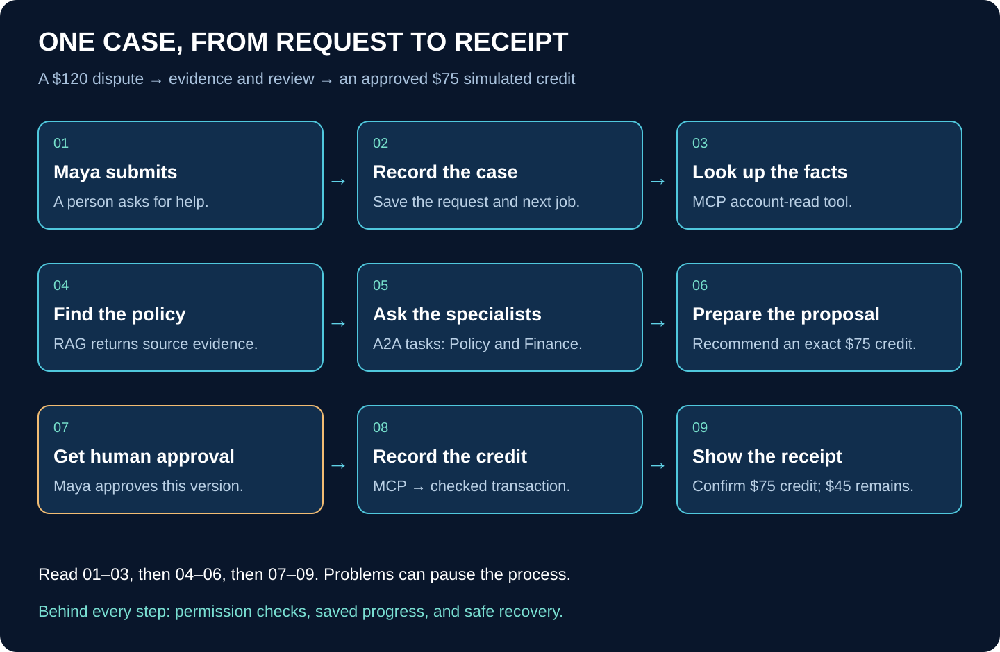
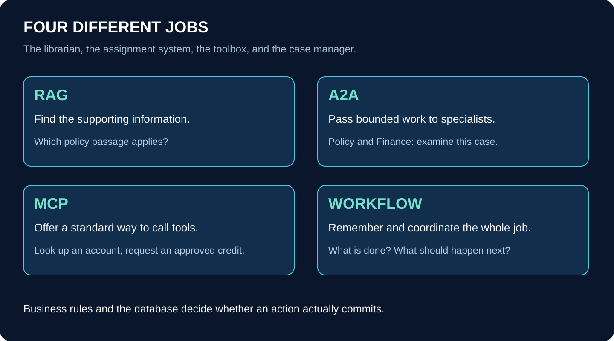

# The Whole Project in Plain English

## Follow one customer request—and understand every part along the way

You do not need to know how to code to read this guide. Think of the project as a small, well-organized customer-service office. Different people have different jobs, they keep written records, and nobody is allowed to move money just because they sound confident.

Our software follows the same idea. Some parts find information, some analyze it, some ask for approval, and one carefully controlled part records the final action.

**This describes the system we plan to build. It is not a claim that the applications are already running.** Our example company and documents are fictional, and the credit is written to a simulated account book. No real payment is sent.

## 1. The entire idea in one minute

A customer disputes a **$120 charge**. A support employee named Maya enters the problem into our application.

The system looks up the account, finds the relevant policy, and asks two specialists to examine the case. They recommend a **$75 credit**. Maya reads the evidence and approves that exact amount. The system records the credit and gives her a receipt. The remaining charge is **$45**.

If the computer handling the job crashes, the system should remember what happened and continue safely. It must not accidentally give the customer another $75 simply because a reply was lost.

That is the project. MCP, RAG, A2A, databases, and the other technologies are the pieces we use to make that story work.

The diagram shows the main successful path. If information is missing, specialists disagree, or approval is refused, the case pauses or takes another path. It does not blindly continue to a credit.

## 2. Meet the office staff

| Part of the system | Imagine it as… | Its actual job |
|---|---|---|
| The web page | Maya's desk | Let her enter a case and understand its progress |
| The Case API | The reception desk | Accept valid requests and return information |
| The workflow | The case manager with a checklist | Remember what has happened and what must happen next |
| RAG | A librarian finding the right pages | Retrieve relevant, permitted evidence for an answer |
| The Policy agent | A policy specialist | Examine whether the policy allows the exception |
| The Finance agent | A calculation specialist | Work out the proposed amount |
| A2A | A shared way to send assignments between specialists | Let independent agents exchange tasks and results |
| MCP | A standard way to request use of the office's tools | Let software discover and call controlled capabilities |
| The business-rule service | The authorized clerk at the account book | Enforce the rules and record the actual credit |
| The database | The office's organized records | Keep cases, decisions, tasks, and receipts after programs stop |

These are analogies, not claims that every component thinks like a person. The workflow can be ordinary programmed rules. Finance can perform ordinary arithmetic. We do not need AI for every step.

## 3. MCP, RAG, and A2A—without the jargon

### RAG: “Find the information before answering”

RAG stands for **retrieval-augmented generation**. The name sounds complicated; the basic idea is not. Instead of asking an AI to answer only from what it learned during training, we first find relevant information and give it that information to work with.

For this case, we find the policy passage explaining when a partial credit is allowed. The answer should point back to that passage so Maya can check it.

RAG does not mean the AI has memorized our documents. It usually means the application searches stored material and supplies selected passages at the time of the question. It also does not guarantee a correct answer: we still need the right policy version, permission checks, and evidence validation.

### A2A: “Ask another specialist to handle this assignment”

A2A stands for **Agent2Agent**. It provides a shared way for independent agent services to receive work, report progress, and return results.

The case manager can ask Policy, “Does this exception apply?” and Finance, “What amount does this rule permit?” Each service can keep its own task record and return a structured result.

This is different from simply having two functions in one file. We use A2A because the specialists are independently running services, and we want their communication to be explicit and testable.

### MCP: “What tools can I use, and how do I call them?”

MCP stands for **Model Context Protocol**. It defines a shared way for a client to interact with capabilities exposed by an MCP server. In our project, the most visible capabilities are tools: look up an account, request an approved credit, and retrieve a receipt.

MCP standardizes the conversation. **Our application still has to enforce permission and business rules.** Using MCP does not automatically make a dangerous action safe.

Other MCP features can expose resources or reusable prompts, but this first project focuses on controlled tools. You do not need to implement every protocol feature to build a useful demonstration.

### The workflow: “Keep the whole job moving safely”

The workflow is not another name for MCP, RAG, or A2A. It coordinates them. It knows that evidence must be gathered before a proposal is approved, and that the final result must be checked before the case is marked complete.

Remember this sentence: **RAG finds evidence. A2A delegates work. MCP provides tool access. The workflow manages the whole case.**

## 4. Before a customer asks: preparing the policy library

RAG has preparation work that happens before the main case journey.

First, someone uploads an authorized policy document. The system stores the original privately and extracts its readable text. It divides the text into smaller pieces called **chunks**, like separating a long handbook into useful passages.

Each passage keeps its source name, document version, location, and access rules. We need those details because a policy can change over time, and one customer group should not be allowed to read another group's private material.

The system creates a search index—an organized way to find passages quickly. It may also create **embeddings**, which are lists of numbers used to compare meaning. For example, “reverse the fee” might be related to “credit the charge” even though the wording differs.

The numbers are not a judgment that the policy applies. They help locate possible evidence. The application must still select the right version and check the actual words.

An uploaded document is not automatically ready. Extraction or indexing can fail. The system should show “Processing” or “Failed” rather than pretending the source is searchable.

## 5. Follow Maya's case from start to finish

### Step 1 — Maya enters the dispute

She opens the web application and enters the account and problem. The page checks for obvious missing information, such as an empty account field.

The server also checks the request. A person can bypass a page and call an endpoint directly, so a pretty form cannot be the only place enforcing rules.

### Step 2 — The system records the request

The Case API checks who Maya is, which customer group she belongs to, and whether she may open this case. It saves case `CASE-1042` and a record saying the case needs processing.

It replies, “Your case was received.” That does **not** mean the credit is complete. It means the system has accepted responsibility for the work.

If Maya accidentally resubmits after a lost reply, the application uses the same submission reference to find the existing case instead of creating another one.

### Step 3 — The workflow looks up the account facts

The workflow starts its checklist. It requests an allowed account lookup through an MCP tool.

The result is a limited set of relevant facts, not unrestricted access to the account database. A caller allowed to read an account is not automatically allowed to change it.

### Step 4 — RAG finds the policy evidence

The retrieval service searches only material this case may use. It looks for the policy that applied when the charge happened—not merely the newest document with similar words.

It returns an **evidence pack**: the selected passages plus their source and version information. Maya will later be able to read these passages inside the case page.

If the system cannot find enough reliable evidence, it should say so. “We need more information” is a valid outcome.

### Step 5 — The specialists examine the case

The coordinator sends a bounded assignment to the Policy agent through A2A. Policy examines eligibility and returns its finding with evidence references.

Finance checks the calculation using the permitted inputs. In this fictional example, the rule permits a $75 credit against the $120 charge. Finance can calculate that with normal code; we do not need a language model to subtract numbers.

The specialists return **artifacts**, meaning recorded work products. An artifact can contain a result, reason, evidence references, and version. It is more dependable than an unexplained line in a chat window.

If one specialist is still working, the case manager remembers that. It does not forget the other's completed work or assume both succeeded.

### Step 6 — The workflow prepares a proposal

The system combines the findings into a proposal: credit $75 USD to this account for this reason, using these policy passages.

The proposal gets a version number. If the amount or evidence changes, a new version is created. This matters because Maya must approve what she actually saw—not a different proposal silently substituted afterward.

### Step 7 — Maya approves the exact action

Maya reads the amount, explanation, and evidence. She approves the current proposal.

The server checks her reviewer permission and confirms the proposal is still current and has not expired. It records the decision. If her page showed an old version, it asks her to review the new version instead.

The workflow can wait here while Maya is away. Closing the browser should not erase the proposal or the case.

### Step 8 — The authorized service records the credit

The workflow requests the approved action through MCP using a narrowly scoped **execution grant**. Think of the grant as a permission slip for this particular action, not a master key.

The business-rule service checks the account, amount, approval binding, and duplicate protection. It records the simulated credit and receipt together in a database transaction.

A **transaction** means the related database changes succeed together or are rolled back together. We do not want a consumed permission slip with no recorded credit, or a recorded credit with no receipt.

The model does not directly write the account book. The controlled business service does.

### Step 9 — Maya sees the receipt

The workflow confirms the receipt and updates the case. The page displays “Completed,” the $75 credit, and the remaining $45 charge.

The receipt is the evidence of the recorded action. A model saying “I have credited the account” is not enough.

## 6. The important extra step: what if something breaks?

Imagine the credit was recorded successfully, but the reply was lost before the workflow received it.

The workflow must not conclude, “There is no reply, so I should create another credit.” Instead, it uses the same **operation key**, which is the reference for this exact action.

The business service looks up that reference and returns the original receipt. This behavior is called **idempotency**: repeating the same intended operation does not create another effect.

When the workflow investigates an uncertain result and compares it with the authoritative record, that is **reconciliation**. In plain English: check what really happened before doing anything else.

The system also checks the identity of the business adjustment, so changing the request key cannot be used to repeat the same approved credit. Duplicate protection is a business rule, not just a convenient button setting.

These protections make retries safe within this design. They are not a promise that every message on the internet is delivered exactly once.

## 7. How the five projects fit into this one story

| Project | The beginner's question it answers | Where you saw it in Maya's story |
|---|---|---|
| P1 — MCP Operations Gateway | How can software use business tools safely? | Account lookup, approved credit, receipt lookup |
| P2 — Evidence RAG Workbench | How do we find and show supporting information? | Policy preparation and evidence retrieval |
| P3 — A2A Specialist Network | How do independent specialists work together? | Policy and Finance assignments |
| P4 — Durable Workflow and Reliability Lab | How do we remember progress and recover? | The checklist, approval wait, retries, reconciliation |
| P5 — Case Resolution Platform | How does a person use all this? | Maya's complete case page |

They are five learning projects within one coherent application. They are not five unrelated chatbots, and they do not require five separate copies of every supporting tool.

## 8. Read this legend correctly

The following legend covers the named technologies and major concepts in our proposed architecture and learning guides. It is **not** a claim that all of them are installed, or that every optional product must be added.

Some entries are software products, such as PostgreSQL. Others are techniques, such as retries. Others are ordinary programming terms, such as function. Keeping those categories separate makes the system much less intimidating.

**Both** means the idea applies to either implementation. **Python path** means our main Python backend with a Next.js interface. **TypeScript path** means the later all-TypeScript application. **Optional/example** means the choice is not mandatory or not yet fixed.

## 9. Technology legend: the screen and the application code

| Technology or term | Plain-English meaning | Where it fits | Status |
|---|---|---|---|
| Python | A programming language for writing instructions | Main backend rules, retrieval, agents, and worker code | Python path |
| JavaScript | A language browsers run, also used on servers | Underlies the React/Next.js application | Web layer in both |
| TypeScript | JavaScript with extra checks to catch many mistakes while developing | Web code, and all application services in the alternative version | Web in both; full TypeScript path |
| React | A library for building a screen from reusable pieces | Forms, evidence cards, approval panels, timelines | Web layer in both |
| Next.js | A framework that organizes React pages and server-side web behavior | The web application, page loading, and browser-facing endpoints | Web layer in both |
| Node.js | Software that runs JavaScript outside the browser | Runs Next.js server code and TypeScript-built services | Web in both; TypeScript services |
| HTML | The structure of a page: headings, paragraphs, forms | What the browser displays; also these readable guides | Both |
| CSS | Rules controlling page appearance | Fonts, spacing, colors, responsive layout | Both |
| Tailwind CSS | A way to style pages using small reusable CSS utility classes | Used by the existing course site; an optional styling choice for the apps | Course site; optional app choice |
| FastAPI | A Python framework for receiving web requests and returning responses | Python Case API and retrieval endpoints | Python path |
| Pydantic | A Python library for checking and describing data shapes | Validate incoming commands and structured results | Python path |
| Runtime schema validator | A tool that checks the actual data received while a program is running | Reject malformed JSON even when code has TypeScript types | Both; library choice varies |
| Zod | One TypeScript library for runtime schemas | Possible TypeScript contract validation tool | Optional/example |
| Function | A named piece of code that does one job | Calculate an amount, validate a request, or load a case | Both; programming concept |
| Module/package | A group of related code that can be reused | Contracts, business rules, retrieval helpers | Both; code organization |
| Frontend | The part a person interacts with | Maya's case workspace | Both; architecture term |
| Backend | The server-side parts doing and recording the work | APIs, agents, workflow, and business services | Both; architecture term |
| Server Component | A React component whose work runs on the server | Load the first authorized case view | Next.js web layer |
| Client Component | A component that supports browser interaction | Buttons, input, selected tabs, progress updates | Next.js web layer |
| BFF | “Backend for frontend”: a server layer tailored to the screen | Next.js forwards safe requests to Python in the hybrid version | Mainly hybrid design |

TypeScript's checks are helpful while writing code, but they do not prove an internet request is valid. That is why runtime validation still exists.

## 10. Technology legend: communication and identity

| Technology or term | Plain-English meaning | Where it fits | Status |
|---|---|---|---|
| API | A defined way to ask another software component to do something or return information | The page asks for a case; the coordinator asks for evidence | Both |
| Endpoint | A particular network address serving one part of an API | Submit a case or read its progress | Both |
| HTTP | The request/response rules used by web clients and servers | Ordinary application calls and supported protocol transports | Both |
| HTTPS/TLS | An encrypted, authenticated connection to a server | Protect data while it travels over the network | Both |
| JSON | A common text format for named values and lists | Commands, task results, evidence references | Both |
| SDK | A software development kit: code supplied to help use a system correctly | Official MCP and A2A clients and servers | Both |
| Protocol | Shared rules for how messages are exchanged | MCP and A2A define different conversations | Both |
| MCP client/server | The caller and provider of MCP capabilities | Workflow client asks the gateway server to use a tool | Both |
| A2A client/server | The sender and receiver of specialist work | Coordinator sends assignments to agent services | Both |
| Authentication | Checking “Who are you?” | Verify Maya's login or a service's identity | Both |
| Authorization | Checking “What may you do?” | Determine whether Maya may approve this case | Both |
| Tenant | A customer organization or group whose data must stay separate | Prevent one company's users from seeing another company's cases | Both |
| Role/scope | A named set or limit of permissions | Reviewer can approve; Finance cannot issue credits | Both |
| Session | The application's record of a continuing interaction or login | Keep Maya signed in, subject to expiry and checks | Both; exact meaning depends on context |
| Access token | A credential presented to a service | Prove permitted service access; keep it secret | Both; design-dependent |
| OAuth / OIDC | Standards often used for delegated access and sign-in | Possible foundations for the chosen authentication integration | Integration choice; not additional agents |
| JWT | One format for carrying signed claims | May be used by an identity provider; must be verified | Optional format, not a permission system by itself |
| Service identity | Credentials identifying a program rather than a person | Identify the worker requesting execution | Both |
| Execution grant | Permission bound to one exact business action | Allow the approved $75 credit, not arbitrary spending | Both; application design |
| Secret/environment variable | Protected configuration such as a password or service URL | Configure programs without putting credentials in browser code | Both |

An encrypted connection does not tell you whether the caller is allowed to approve a credit. A valid login does not grant every permission. Each protection answers a different question.

## 11. Technology legend: AI and evidence

| Technology or term | Plain-English meaning | Where it fits | Status |
|---|---|---|---|
| LLM | Large language model: software that can generate and interpret language | Explain evidence or help produce specialist findings | Optional live-model layer |
| Model provider | A service that runs a model for you | Receives bounded model requests through our adapter | Provider not yet fixed |
| Prompt | Instructions and context sent to a model | Define the specialist's task and supply evidence | Model-assisted steps |
| Context | Information available to the model for a particular request | Case facts and selected policy passages | Model-assisted steps |
| Model token | A small text unit used by model systems | Helps measure request size, limits, and cost | Not the same as an access token |
| Agent | A software component assigned a goal with defined capabilities | Policy or Finance specialist | Both; may combine rules and model calls |
| Model adapter | A boundary hiding provider-specific code | Swap predictable fixture behavior for live model calls | Both |
| Fixture mode | Predetermined synthetic inputs and results | Learn and test without unpredictable model behavior or spend | Both |
| Ingestion | Preparing uploaded information for use | Store, extract, split, and index policies | RAG |
| Chunk | A manageable passage cut from a larger document | A search result with source references | RAG |
| Embedding | A list of numbers used to compare meaning | Find semantically related passages | RAG |
| Vector search | Search by closeness of those numeric representations | Find related ideas, not only matching words | RAG |
| Full-text search | Search based on text terms and their relevance | Find explicit phrases or policy wording | RAG |
| Hybrid search | Combine more than one retrieval approach | Use both lexical and vector candidates | RAG; unrelated to “hybrid Python app” |
| Reranking / rank fusion | Reorder or combine candidate results | Improve the final shortlist of passages | RAG technique; details selected during implementation |
| Evidence pack | A saved group of passages and source references | Support and reproduce a proposal | Both |
| Citation / provenance | Where a statement came from and its history | Identify document version and passage | Both |
| OCR | Optical character recognition: extracting text from an image | Read scanned documents when supported | Optional document-processing extension |
| Prompt injection | Untrusted text trying to redirect the model or application | A malicious document says “ignore approval” | Threat to defend against, not a feature |

Embeddings help retrieve possible evidence; they do not establish truth. A citation shows a source reference; you still need to check that the source supports the claim.

## 12. Technology legend: storage and remembering work

| Technology or term | Plain-English meaning | Where it fits | Status |
|---|---|---|---|
| PostgreSQL | A database for organized, durable records | Cases, tasks, approvals, credit ledger, receipts | Both |
| SQL | The language used to query and change relational databases | Read records and perform controlled updates | Both |
| pgvector | A PostgreSQL extension for vector data and search | Store/search evidence embeddings | Proposed retrieval stack |
| Table / row | A collection of similarly shaped records / one such record | A cases table contains individual cases | Both |
| Database schema | A named grouping of database objects | Separate operations, evidence, and workflow areas | Both; differs from a validation schema |
| Database role | A database identity with specific permissions | Prevent an agent from writing the ledger | Both |
| Object storage | Storage designed for whole files or objects | Original documents and large intermediate outputs | Both; provider not fixed |
| Transaction | Related database changes that succeed or fail together | Record credit, receipt, grant use, and outgoing event together | Both |
| Ledger | The authoritative account book of recorded adjustments | Determine which simulated credits exist | Both; application data |
| Receipt | A stored confirmation of a committed action | Prove the specific credit was recorded | Both |
| Version/revision | A number identifying a particular saved form of something | Keep track of policy, proposal, and artifact changes | Both |
| Migration | A controlled change to database structure | Add tables or fields as code evolves | Both |
| Cache | A temporary copy kept for quicker access | May speed permitted reads; not authoritative state | Optional optimization |
| Backup / restore | Save a recoverable copy / rebuild from it | Recover after data loss or serious failure | Both |

The database and object storage have different jobs. A case row can point to a policy file; that does not mean the file itself belongs inside the case row or the Git repository.

## 13. Technology legend: workflow and safety

| Technology or term | Plain-English meaning | Where it fits | Status |
|---|---|---|---|
| Coordinator | The code deciding which component to ask next | Calls retrieval, specialists, and controlled tools | Both |
| State machine | A list of allowed stages and moves between them | Received → Gathering → Approval → Execution → Completed | Both |
| Durable workflow | A process whose progress survives interruption | Continue the case after restart or human delay | Both |
| Python workflow runtime | Our educational scheduler and recovery code | Run persisted jobs and transitions | Python path |
| Workflow DevKit | A durable-execution framework | Organize TypeScript steps, waits, and retries | TypeScript alternative, not an extra Python coordinator |
| Worker | A program doing background jobs | Ingestion, specialist work, case progression | Both; hosting differs |
| Job queue | A recorded list of work waiting to be done | Decide which job a worker should pick up | Python baseline uses PostgreSQL |
| Outbox | A saved list of messages that must be delivered | Avoid losing work between a database commit and a message send | Both |
| Inbox | A record of messages already accepted | Avoid processing repeated delivery as new work | Both where needed |
| Event | A record that something happened | Case received, approval recorded, credit committed | Both |
| Checkpoint | Saved progress | Remember completed steps before continuing | Both |
| Lease | Temporary ownership of a job | Let another worker recover abandoned work after expiry | Python scheduler; analogous ownership needs elsewhere |
| Fencing/version check | A check preventing an old worker from changing newer state | Stop stale workers overwriting progress | Both where application ownership is required |
| Retry/backoff | Try again, with controlled waits | Recover temporary failures without hammering a service | Both |
| Timeout/deadline | A limit on how long to wait | Escalate stalled work instead of waiting forever | Both |
| Idempotency | Repeating one intended operation does not repeat its effect | Return the original credit receipt on retry | Both |
| Operation key | Stable reference for one intended action | Recognize a repeated execution request | Both |
| Reconciliation | Check authoritative records to resolve uncertainty | Find out whether a credit actually committed | Both |
| Human-in-the-loop | A person is required at a decision point | Maya approves the exact current proposal | Both |
| Hook/callback | A way for an outside event to notify waiting work | Wake a TypeScript workflow after a recorded approval | Runtime-specific mechanism; not authority |
| Polling | Ask periodically for updates | Refresh the case timeline | Simple first web implementation |
| SSE | Server-sent events: a server sends a stream of updates | Optional live progress display | Web option |
| Cursor | A marker of the last update read | Resume the timeline after a connection breaks | Both |

“Background” and “durable” are not synonyms. Work can run in the background and still disappear when its process stops. We need persistent records and recovery rules to make it durable.

## 14. Technology legend: building, testing, and hosting

| Technology or term | Plain-English meaning | Where it fits | Status |
|---|---|---|---|
| Git | A tool recording source-code changes | Track and review our implementation | Both |
| GitHub | A service hosting Git repositories and collaboration tools | Share code and run review/automation workflows | Proposed repository host |
| Repository / monorepo | One code history / one repo containing several related apps or packages | Keep P1–P5 together per implementation | Both |
| Branch / pull request | A separate line of changes / a request to review them | Test changes before merging | Both |
| Dependency | Another library your code uses | FastAPI, React, protocol SDKs | Both |
| pip / venv | Python package installer / isolated Python environment | First local Python lessons | Python path |
| uv | A Python dependency and environment tool | Reproducible Python project setup in the architecture plan | Python tooling choice |
| npm / pnpm | JavaScript package-management tools | Install and organize web/TypeScript dependencies | Choose a consistent tool per repo |
| Lock file | A record of exact dependency versions | Repeat the same install in CI and deployment | Both |
| Docker | Tooling for packaging and running applications in containers | Reproducible local/backend environments | Proposed operational tooling |
| Container | A packaged application process with its dependencies | Run a backend service consistently | Both where useful |
| Docker Compose | A way to describe and start several local containers together | Start database and services for development | Local tooling option |
| Vercel | A hosting platform | Host the Next.js app and compatible TypeScript services | Proposed hosting |
| Container host | A place that runs containerized services and workers | Host the Python backend baseline | Provider not fixed |
| Deployment | A running, published version of software | Make a particular service release available | Both |
| CI/CD | Automated checks and controlled delivery of changes | Test, build, and release code | Both; pipeline design |
| GitHub Actions | GitHub's workflow automation service | A possible CI/release runner | Proposed/example CI tooling |
| pytest | A Python test runner | Check functions, APIs, and integration behavior | Python path |
| Vitest | A JavaScript/TypeScript test runner | Check TypeScript rules and supported workflow tests | TypeScript testing option |
| Playwright | A browser automation/testing tool | Exercise the complete user journey | Browser-test option, not yet a required installed dependency |
| Unit / integration / end-to-end tests | Test one piece / connected pieces / a full journey | Build confidence at different levels | Both |
| Logs / metrics / traces | Recorded events / measurements / connected request journeys | Diagnose problems and observe behavior | Both |
| OpenTelemetry | A standard tooling ecosystem for collecting telemetry | Trace calls across services | Proposed diagnostics approach |
| Alert / runbook | A warning / instructions for responding | Help an operator recover a stalled system | Both |
| Preview / production | A test deployment / the stable released environment | Try changes without affecting the public demo | Both |

Redis, Kafka, Kubernetes, a separate vector-database product, and a particular cloud database vendor are **not required by this baseline**. We can evaluate additional infrastructure later if a measured need appears. You do not need to learn every popular technology before building this project.

## 15. Which pieces change between the two versions?

| Responsibility | Python with a Next.js interface | Full TypeScript counterpart |
|---|---|---|
| Web page | React and Next.js | React and Next.js |
| Backend application code | Python, with FastAPI where HTTP is needed | TypeScript server code |
| Data validation | Pydantic and domain checks | Runtime schemas and domain checks |
| Case workflow | Educational Python persistent-job runtime | Workflow DevKit plus application safeguards |
| Specialist services | Python A2A services | TypeScript A2A services |
| Controlled tools | Python MCP service | TypeScript MCP service |
| Evidence storage and search | PostgreSQL, pgvector, private object storage | Same basic responsibilities |
| Approval, duplicate protection, receipts | Required | Still required |

You do **not** put both case managers in charge of the same case. These are alternative implementations of the same story, not two systems racing to issue the same credit.

The existing `image-course` website is the learning library. The future application repositories are the working demonstrations. Git stores their code; databases store their changing business records; hosting runs the programs.

## 16. What to learn first—and what can wait

First understand the story: request, evidence, specialists, approval, action, receipt. Then learn basic functions, data structures, tests, and simple database records. After that, MCP, RAG, and A2A have concrete jobs rather than mysterious names.

Next learn durable work: what gets saved, how a retry is recognized, and how the system handles a missing reply. Add the interface once the underlying results are understandable. Finally learn deployment, secrets, monitoring, and restore procedures.

Do not start by memorizing every row of the legend. Use it as a reference whenever a word interrupts your understanding. You can build the first useful pieces without OCR, advanced caching, extra brokers, or live model calls.

## 17. Common beginner misunderstandings

**“The AI does everything.”** No. Ordinary code validates input, calculates amounts, checks permissions, saves records, and enforces many decisions. AI can help with language and analysis.

**“If it uses MCP, the tools are safe.”** No. MCP defines communication; our application enforces permission and transaction rules.

**“RAG means the answer must be correct.”** No. Search can retrieve the wrong material and a model can misinterpret good material. We need evidence checks and evaluation.

**“Two agents agreeing means no human is needed.”** Not in this design. Sensitive credits still require the exact human approval.

**“The page says Completed, so it happened.”** The page should say Completed only after the authoritative receipt has been confirmed.

**“No reply means nothing happened.”** No. The action may have committed. Check the existing operation before attempting anything new.

**“One Git repository means one deployment.”** No. Several services can deploy from different parts of one repository.

## 18. How to explain the project to someone else

“We are building a customer-service application that investigates a disputed charge. It looks up facts, finds the relevant policy, and asks specialist services to examine the case. A person approves the exact proposed adjustment. A controlled business service records it and returns a receipt. The system remembers its progress, so a crash or lost reply does not cause it to repeat the credit.”

Then add the technology names only when useful:

“RAG supplies the evidence, A2A connects the specialists, MCP exposes the tools, and a durable workflow coordinates the job. React and Next.js provide the screen. The backend and database enforce the rules and remember what happened.”

If that explanation makes sense to you, you already understand the most important part of the architecture.
