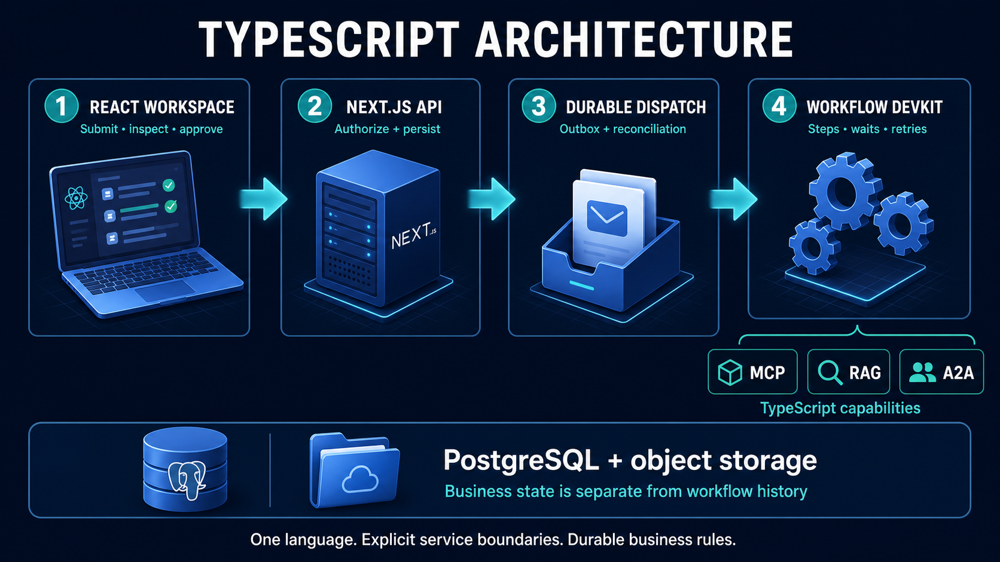
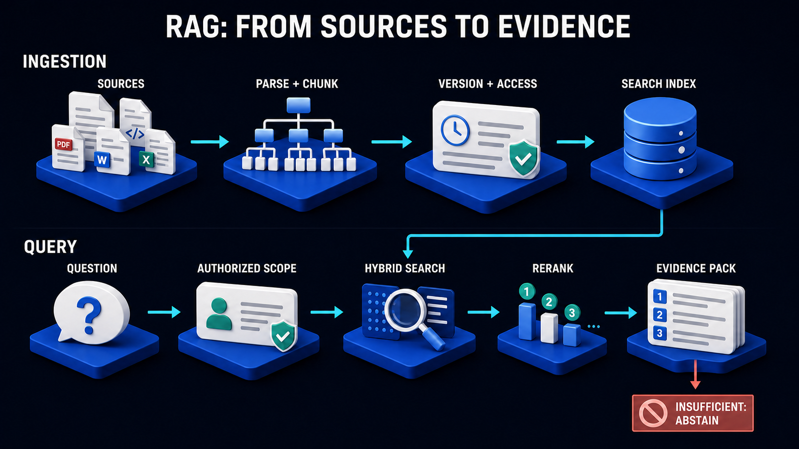
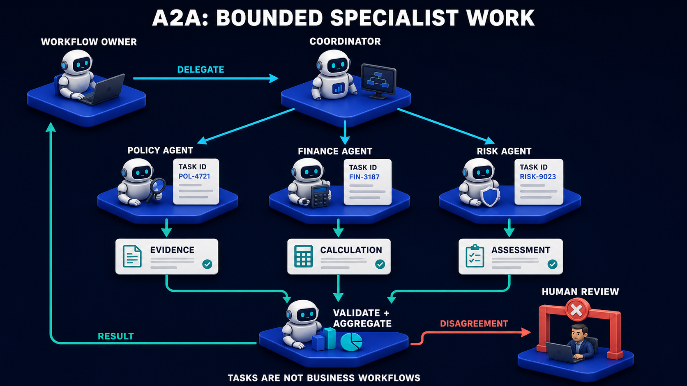
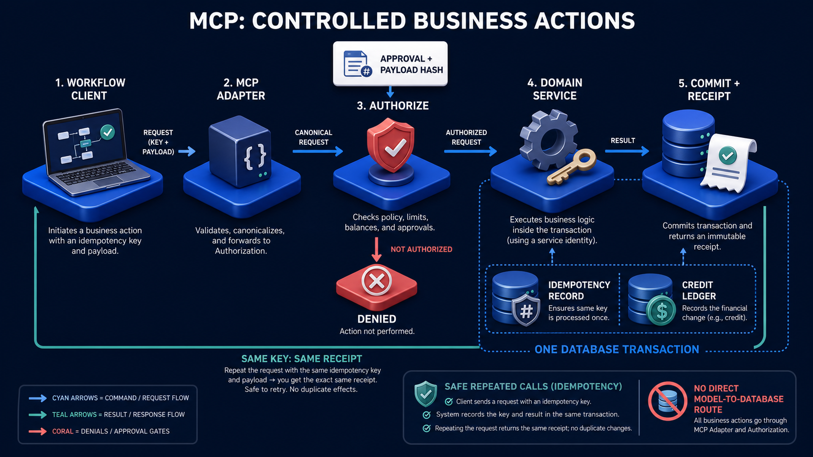

# Acme Agent Platform — TypeScript Architecture

## Next.js, React, and durable workflows on Vercel

**The same five portfolio projects and the same business safeguards, implemented with TypeScript application code.**

This is a proposed implementation blueprint. It does not scaffold an application, change the course website, or deploy paid services. Build it in a separate repository. The fictional Acme case uses synthetic documents and a simulated credit ledger; no real financial transaction is part of the demonstration.

“Full TypeScript” means the application services, agents, retrieval integration, and orchestration are written in TypeScript. It does not mean PostgreSQL, object storage, or model providers disappear. Nor does it mean every operation belongs inside a single Next.js page request.

## 1. At a glance



Read the picture as four responsibilities. React gathers user intent. Next.js authenticates and records it. Durable dispatch ensures that accepted work reaches the workflow runtime. Workflow DevKit coordinates steps, waits, and retries.

The bottom band separates two kinds of memory: **business records** say what happened to a case; **workflow history** says how an execution progressed. A completed step is not a substitute for a credit receipt. Conversely, an unfinished workflow may already have committed a credit and need reconciliation.

| Question | Design decision |
|---|---|
| Primary application language | TypeScript for UI, APIs, agents, retrieval, and domain logic |
| Web framework | Next.js App Router with React |
| Web hosting | Vercel |
| Durable execution | Workflow DevKit, rather than the Python reference job scheduler |
| Business storage | PostgreSQL with owned schemas and transaction boundaries |
| Document storage | Private object storage |
| Protocol boundaries | Official MCP and A2A SDKs behind application adapters |
| Initial model behavior | Deterministic fixtures; live provider adapter added separately |

This guide specifies architecture rather than pinning a package version. Choose and lock compatible Next.js, Node.js, Workflow, and protocol SDK versions when implementation starts. The existing course site's Next.js 15 configuration is not automatically an appropriate dependency lock for a new application.

## 2. What the architecture teaches

### The same business story, with a different implementation

Maya, an Acme support reviewer, receives a dispute about a $120 service charge. The applicable policy allows a $75 credit. She needs an evidence-backed recommendation, an approval record, and proof that the final action happened only once.

She opens the React workspace and creates case `CASE-1042`. Next.js validates her identity and request, then commits the case and an outbox record together. The outbox is a durable “work to deliver” list. If the function stops immediately after the commit, the request is still recoverable.

A dispatcher starts the workflow. The workflow asks for an account snapshot, requests a versioned evidence pack, and delegates Policy and Finance tasks. These are explicit steps with persistent results, not an untracked chain of promises launched from a button click.

Policy explains why the exception applies. Finance calculates the amount. The coordinator records proposal revision 3 and waits for human approval. Maya may close the browser. The workflow is suspended, not depending on an open browser connection or a continuously occupied request.

When Maya returns, the screen loads the persisted proposal. Approval records her decision against that exact revision. A durable notification wakes the workflow, which rereads the approval and requests an execution grant. The domain service validates the grant and commits the simulated credit with its receipt.

If a response disappears after that commit, the workflow recovers the original receipt using the stable operation key. It does not ask the model to guess whether the credit happened.

### One language does not remove trust boundaries

It is tempting to think shared TypeScript types make the whole application safe. They do not. Types disappear at runtime, and network callers can submit arbitrary JSON. Every incoming command still needs runtime validation and authorization.

Likewise, placing several packages in one repository does not make them equally privileged. The policy agent should not receive the database role that can issue credits. React should not receive provider keys simply because both the UI and server code are JavaScript-family code.

Shared types reduce accidental disagreement. Explicit runtime checks prevent untrusted data from being treated as authority. Both are necessary.

### Durable execution is not an infinitely long function

Workflow DevKit separates orchestration from steps and persists execution progress. Workflow code coordinates; step code performs external I/O. Hooks let outside events resume waiting work. These are documented platform capabilities; the approval and ledger rules in this guide remain application responsibilities. [Workflow directives](https://github.com/vercel/workflow/blob/main/docs/content/docs/v5/how-it-works/understanding-directives.mdx), [typed hooks](https://useworkflow.dev/docs/api-reference/workflow/define-hook).

A workflow waiting overnight is not the same as a server function sleeping overnight. Individual steps still need deadlines and must fit their runtime. A large OCR job may require a bounded batch worker or hosted parsing service. Moving orchestration into a durable runtime does not make CPU, memory, or execution limits disappear.

### Why a human approval is more than a Boolean

Suppose the proposal changes from $75 to $100 while Maya has an old tab open. A generic `approved: true` cannot tell us which amount she accepted. The command needs the expected proposal revision, and the server must bind the decision to the canonical action.

This is the central lesson: **a safe agent system connects explanations to evidence, approvals to exact actions, and completion to receipts.** The programming language changes; those relationships do not.

## 3. Mapping the five projects to TypeScript

| Project | Implementation | What remains independently demonstrable |
|---|---|---|
| P1 — MCP Operations Gateway | TypeScript MCP adapter over a transactional domain service | Tool discovery, scoped reads, approval-gated writes, idempotency |
| P2 — Evidence RAG Workbench | TypeScript ingestion/retrieval packages and background workflow | Source versions, authorized search, evidence packs |
| P3 — A2A Specialist Network | Policy and Finance services with persistent task stores | Independent task delegation, artifacts, timeout behavior |
| P4 — Durable Workflow Lab | Workflow DevKit orchestration, steps, hooks, recovery tests | Suspend, resume, retry, reconcile |
| P5 — Case Resolution Platform | Next.js React application plus case command/query layer | Complete submit-to-receipt journey |

A package is code reuse. A service is a running boundary. A portfolio project is a demonstrable unit of learning. Keep these three ideas separate. P3 has two independent services, while P5 can reuse all the packages without duplicating their rules.

## 4. Hosting layout and deployment boundaries

Use one repository with several deployable entry points. The web application, MCP gateway, and two specialist agents may be separate Vercel projects, each built from its own application directory. This makes service credentials, routes, and lifecycle boundaries visible. It is a proposed deployment layout, not a requirement to purchase a particular plan.

Keep RAG as a server-only package called by workflow steps in the first TypeScript release. Give it a dedicated HTTP service later only if independent clients or scaling justify one. A2A agents remain independent services because demonstrating that boundary is the point of P3.

| Deployment | Contains | Must not contain |
|---|---|---|
| Web application | React, case API, workflow entry points, bounded dispatch endpoints | Browser-visible secrets or unrestricted database role |
| MCP service | Protocol adapter, domain commands, receipt queries | Case coordinator or model-controlled write authority |
| Policy agent | A2A endpoint, Policy executor, persistent task store | Credit-writing permission |
| Finance agent | A2A endpoint, calculation executor, persistent task store | Authority to approve its own result |
| Optional ingestion worker | Large parsing/OCR jobs that exceed function budgets | A second coordinator for the whole case |

The default server runtime is Node.js for compatibility with database and protocol libraries. Vercel functions remain bounded; actual limits depend on configuration and plan. This design does not require an unlimited request or a permanent in-memory queue. [Vercel Functions limits](https://vercel.com/docs/functions/limitations).

Before deploying MCP/A2A adapters, test their actual transport under the chosen host: request handling, streaming, cancellation, authentication, and reconnect behavior. Prefer stateless request handling with durable application state. If a selected SDK transport requires process-local session affinity, either supply an appropriate external state implementation or host that adapter in a suitable persistent service. Do not hide the mismatch.

## 5. Proposed repository structure

```text
acme-agent-platform-ts/
├── apps/
│   ├── web/
│   │   ├── app/
│   │   │   ├── layout.tsx
│   │   │   ├── cases/page.tsx
│   │   │   ├── cases/[caseId]/page.tsx
│   │   │   ├── cases/[caseId]/actions.ts
│   │   │   ├── api/cases/route.ts
│   │   │   ├── api/cases/[caseId]/events/route.ts
│   │   │   ├── api/internal/dispatch/route.ts
│   │   │   └── api/internal/reconcile/route.ts
│   │   ├── components/
│   │   │   ├── case-workspace.tsx
│   │   │   ├── evidence-panel.tsx
│   │   │   ├── approval-panel.tsx
│   │   │   └── receipt-card.tsx
│   │   ├── lib/server/
│   │   │   ├── session.ts
│   │   │   ├── case-queries.ts
│   │   │   └── case-commands.ts
│   │   ├── workflows/
│   │   │   ├── resolve-case.ts
│   │   │   ├── ingest-document.ts
│   │   │   └── steps/
│   │   │       ├── gather-evidence.ts
│   │   │       ├── delegate-specialists.ts
│   │   │       ├── record-proposal.ts
│   │   │       ├── read-approval.ts
│   │   │       └── execute-credit.ts
│   │   └── next.config.ts
│   ├── mcp-service/src/
│   │   ├── server.ts
│   │   └── tools.ts
│   ├── policy-agent/src/
│   │   ├── server.ts
│   │   ├── executor.ts
│   │   └── workflow.ts
│   └── finance-agent/src/
│       ├── server.ts
│       ├── executor.ts
│       └── workflow.ts
├── packages/
│   ├── contracts/src/
│   │   ├── case.ts
│   │   ├── proposal.ts
│   │   ├── evidence.ts
│   │   ├── task-artifact.ts
│   │   └── receipt.ts
│   ├── case-domain/src/
│   ├── operations-domain/src/
│   │   ├── issue-credit.ts
│   │   ├── execution-grants.ts
│   │   └── idempotency.ts
│   ├── rag/src/
│   │   ├── ingestion.ts
│   │   ├── authorized-search.ts
│   │   └── evidence-pack.ts
│   ├── protocol-clients/src/
│   │   ├── mcp.ts
│   │   └── a2a.ts
│   ├── persistence/src/
│   ├── security/src/
│   ├── model-adapter/src/
│   └── telemetry/src/
├── database/migrations/
├── fixtures/
├── tests/unit/
├── tests/contract/
├── tests/workflow/
├── tests/protocol/
├── tests/e2e/
├── infra/compose.yaml
├── docs/projects/
├── pnpm-workspace.yaml
├── package.json
└── README.md
```

### What calls what inside this tree

The React approval panel invokes a server action. That action uses `case-commands.ts`, which calls the case-domain package. The package validates the current proposal and writes an approval transaction. It does not import the credit-writing function.

The workflow's `execute-credit.ts` calls the MCP client adapter. The adapter crosses the network to the MCP service. Its tool handler calls `operations-domain/issue-credit.ts`. Only that service has the database role and execution policy needed to mutate the operational ledger.

The shared persistence package contains connection and transaction helpers, not a magical all-access connection. Each deployment supplies its own restricted credentials. Package reuse does not imply permission reuse.

Keep framework-specific files at the edges. Business rules should be unit-testable without starting Next.js or importing a protocol server. Conversely, protocol tests must start real endpoints; directly calling `issue-credit.ts` is not an MCP integration test.

## 6. Contracts and data ownership

Use runtime schemas for commands and returned artifacts. Publish language-neutral JSON contracts so the Python reference can participate in the same tests. Shared TypeScript types are useful within the repository, but they cannot be the only specification of a cross-language message.

| Record | Authoritative owner | Important identifiers |
|---|---|---|
| Case and user-visible status | Case domain | Tenant, case ID, revision |
| Logical workflow and runtime attempts | Orchestration bookkeeping | Logical workflow ID, runtime run ID, fencing generation |
| Proposal and approval | Case approval domain | Proposal revision, payload digest, reviewer |
| Evidence pack | RAG | Pack ID, source versions, chunk IDs |
| Specialist task and artifact | Individual agent | Delegation ID, protocol task ID, artifact revision |
| Credit, grant, receipt | Operations domain | Operation key, grant ID, receipt ID |

Represent money in integer minor units with an explicit currency. Validate the allowed range and integer safety on both sides; do not let JavaScript floating-point arithmetic silently round a financial value. For this bounded fixture, $75 is 7500 USD minor units. For wider ranges, use an agreed decimal-string representation instead of lossy JSON numbers.

Do not serialize a JavaScript `bigint` directly into ordinary JSON. Define the wire representation first. Use consistent timestamps, explicit time zones, version fields, and a distinction between missing and null values.

The same operation key with a different canonical payload is a conflict. The same intake key with different case input is also a conflict. Those are separate idempotency scopes; do not reuse one identifier for every layer.

## 7. The complete call sequence

| Step | Boundary | What happens |
|---|---|---|
| 1 | Browser → Next.js | Session and input validated; case plus outbox committed |
| 2 | Dispatcher → Workflow runtime | Start requested for the logical workflow |
| 3 | Workflow → MCP | Permitted account snapshot retrieved |
| 4 | Workflow → RAG package | Authorized evidence pack produced and stored |
| 5 | Workflow → Policy and Finance A2A endpoints | Bounded tasks accepted; task IDs persisted |
| 6 | Workflow → agent status/artifacts | Results gathered or review condition recorded |
| 7 | Workflow → case domain | Versioned proposal persisted; approval wait established |
| 8 | Reviewer → Next.js → case domain | Exact revision approved and notification outbox written |
| 9 | Notification dispatcher → workflow hook | Workflow awakened; approval reread from the database |
| 10 | Workflow → MCP → operations domain | Exact approved action executed transactionally |
| 11 | Workflow → case read model | Receipt linked and final status published |
| 12 | React → authorized event/snapshot endpoint | User sees the recorded outcome |

Ordinary application commands use HTTP or Server Actions. The MCP and A2A calls use the selected SDK's actual protocol methods. Pin compatible protocol versions and test the chosen transport, rather than copying old method names into a new implementation.

## 8. Durable dispatch: the easy-to-miss failure boundary

Writing a case to PostgreSQL and starting a hosted workflow are two different operations. There is no assumed transaction spanning them.

If we start the workflow first and then fail to save the case, we create an execution without its business record. If we save the case and then fail to start, we accept work that never runs. The outbox bridges this gap: commit the case and pending dispatch together, then deliver dispatch separately with retries.

The baseline dispatcher runs bounded, authenticated batches from a scheduled trigger. It claims pending rows with a lease, starts work, and records the returned runtime run ID. A prompt post-commit dispatch attempt may improve responsiveness, but the scheduled sweep is the recovery path. The polling interval is a deployment decision, not an assumed instant-delivery guarantee.

There is another gap: start may succeed even if the dispatcher loses the response. Retrying could launch another runtime execution. Therefore associate attempts with one application-level logical workflow ID. Before progressing, a run must acquire a database-backed ownership lease/fencing generation. Duplicate attempts cannot both advance the same business revision. Every state-changing step checks its generation, and every external operation uses stable idempotency/delegation keys.

Do not rely on an undocumented guarantee that a workflow-start call is exactly once. Reconcile ambiguous starts against recorded attempts and runtime information where available. Stale attempts may still exist; business safeguards must remain correct even when they do.

## 9. Workflow code, steps, and human waits

Keep the workflow function readable as the business sequence. Put database operations, protocol clients, and model calls into bounded step functions. The conceptual sequence is:

```text
claim logical execution
load case and authorized account facts
build evidence pack
delegate Policy and Finance tasks
collect or escalate their results
record proposal and approval expectation
wait for a decision or deadline
reread and validate persisted approval
obtain execution grant
execute or reconcile the credit
publish receipt-backed completion
```

This is pseudocode, not a drop-in SDK example. Implementation should use the installed Workflow version's documentation and tests for directives, hook lifecycle, retries, and deployment behavior.

### Avoid a lost approval notification

An approval could arrive before the workflow is listening. Persist the decision first and put a notification in an outbox in the same transaction. Establish the wait, then recheck the persisted decision. If no decision exists, suspend. A notification delivery that arrives too early remains retryable; a periodic reconciliation step can also observe the persisted decision.

The hook is a wake-up mechanism, not the authority. Never expose an unrestricted resume endpoint accepting a user-supplied token and `approved: true`. Authenticate the reviewer, validate access and revision, commit the approval, then let a trusted dispatcher resume the correct wait. On resumption, reread the record instead of trusting notification contents.

Use an expiry and explicit reject/cancel paths. If a workflow is resumed twice, the same approval must not generate two grants or credits. Durable execution makes recovery easier; idempotent domain commands make recovery safe.

### Deployment while work is waiting

Do not assume that a paused run can seamlessly execute arbitrary new code. Pin dependencies, record workflow-definition versions, and test the selected runtime's deployment/version behavior. Prefer draining older runs or routing them to compatible handlers before removing old schemas or steps. Use additive database migrations first; destructive cleanup comes only after old readers and runs no longer need the fields.

## 10. RAG in the TypeScript version



The RAG architecture is unchanged by the language. Store originals privately, extract text, create versioned chunks, attach access rules, and compute embeddings. The first release can use plain-text and text-based PDF fixtures; scanned documents are a separate parsing requirement, not a feature to assume works automatically.

Ingestion runs as durable bounded stages. Store intermediate results in object storage or database records and pass their identifiers between steps. Do not repeatedly serialize entire documents into workflow history. Verify upload ownership and content limits before extraction, and isolate untrusted parsing work appropriately.

At query time, filter by tenant, access rules, and relevant policy version before ranking. Use full-text and exact vector search over the permitted subset initially. Save the evidence pack so the proposal is reproducible even after the source collection changes.

In the case workspace, show the source passage inline beneath the specialist's finding. A source citation answers “where did this come from?” An explanation answers “why does it matter?” Neither grants execution permission.

For missing or conflicting evidence, return an explicit insufficiency result. Retrieved text cannot instruct the application to bypass authorization or invoke tools. The model adapter may summarize a passage; the domain layer must still enforce business rules independently.

## 11. MCP and A2A services in TypeScript



The diagram includes a future Risk specialist; the initial build implements only Policy and Finance. Workflow owner, coordinator, and aggregation are logical roles inside the case workflow, not separate deployed agents. Disagreement triggers review, while every sensitive credit still requires explicit execution approval even when the specialists agree.

Official TypeScript/JavaScript implementations exist for both protocols. Use the SDK adapters rather than relabeling an arbitrary JSON endpoint as MCP or A2A. MCP supports remote HTTP transport, and the A2A JavaScript SDK provides client/server support. Compatibility still depends on the versions and transports selected for both peers. [MCP TypeScript server documentation](https://ts.sdk.modelcontextprotocol.io/server), [official A2A JavaScript SDK](https://github.com/a2aproject/a2a-js/blob/main/README.md).

### MCP: tools backed by a domain service

Expose a small useful catalogue: account lookup, policy-safe operational reads, approved credit execution, and operation/receipt lookup. Validate inputs, caller identity, scope, and execution grant before reaching the domain command. An MCP session identifier is not authentication.

Keep tools short enough for the chosen runtime. Longer business processes should create or advance durable work rather than hold a tool call open indefinitely. Session and event state must not exist only in a module-level map on a horizontally scaled service.

### A2A: task acceptance is different from task completion

The Policy endpoint authenticates the caller, validates the delegation, and stores a task plus dispatch record. It can then return an accepted task. Its executor runs the analysis using a durable workflow and persists the artifact before marking completion. Finance follows the same pattern with its own permissions.

The case coordinator polls status or consumes supported notifications with deadlines and backoff. If the acceptance response is lost, the stable delegation identifier allows the service to recover the existing task. Retries do not silently create unlimited specialist work.

Neither agent imports the case coordinator or modifies the other's records. They share contract definitions, not hidden in-process state. That makes a later Python specialist a realistic replacement rather than a full-system rewrite.

## 12. The credit transaction and recovery



For `CASE-1042`, proposal 3 authorizes a simulated $75 credit. The request uses `amount_minor: 7500`, `currency: USD`, and operation key `CASE-1042-credit-proposal-3`. The canonical binding also includes the tenant, account, action, revisions, and expiry.

Inside one local PostgreSQL transaction, the operations domain checks the existing operation record, validates the new execution when needed, checks business uniqueness, consumes the grant, records the credit and receipt, and adds an outbox event. A transaction failure leaves none of those partial effects committed.

If the operation already completed with a matching payload, return its original receipt to an authorized caller. If the payload differs, reject the conflict. If a different key attempts the same approved business adjustment, the uniqueness rule prevents a duplicate. Do not base deduplication only on matching amount: two legitimate unrelated credits could have the same value.

Now inject the failure: commit the credit, then lose the response before the workflow records success. A retryable workflow step may run again. Its stable operation key leads to the existing receipt. This proves a safe local transaction under repeated requests, not exactly-once execution of every step in a distributed system.

For a future real external payment provider, the database cannot atomically commit the provider's action. That would require a separate provider idempotency and reconciliation design. The simulated-ledger demonstration deliberately avoids claiming to solve that larger problem.

## 13. The web experience and security model

Render the initial case snapshot on the server. Use Client Components for the form, tabs, approval interaction, and live timeline. Keep database and provider adapters server-only, and pass only authorized display data to the browser. [Next.js Server and Client Components](https://nextjs.org/docs/app/getting-started/server-and-client-components).

The workspace should contain five visible regions: case summary, source evidence, specialist findings, exact approval proposal, and receipt/timeline. Keep explanations inline. A user should not need to leave the case to understand why the system proposes $75.

After submission, return the case ID and an accepted state promptly. Live progress comes from persisted application events with a cursor. Bounded SSE connections or polling can refresh the view. Reconnect by cursor; recover with a snapshot when necessary. The event stream is not the workflow's source of truth, and losing the browser connection must not stop the case.

Recheck authentication and tenant access on commands, queries, streams, and receipt access. Treat internal dispatch endpoints as privileged: authenticate their machine caller, limit work per invocation, and reject arbitrary workflow names or user-selected code to execute. Protect cookie-authenticated mutations against cross-site requests.

Do not publicly cache private case pages or evidence. Use least-privilege database roles and separate service credentials. A shared code package must not bring an administrator connection into every deployment. Keep preview deployments on isolated fixtures and disable access to real write-capable integrations.

## 14. Testing and observability

Test domain functions without the web framework first. Then test real transactions under concurrency, actual protocol endpoints, durable orchestration, and the browser journey. A passing screen test alone cannot demonstrate safe retries.

| Scenario | Expected result |
|---|---|
| Case commit succeeds; dispatch invocation fails | Pending outbox entry later starts work |
| Workflow-start response is lost | Duplicate attempts cannot advance one case concurrently |
| Approval arrives before the hook is ready | Persisted decision is eventually observed |
| Reviewer submits an old revision | Conflict; current proposal displayed |
| Two execution attempts race | One business credit and one original receipt |
| Credit commits; step result is lost | Retry recovers that receipt |
| Policy agent restarts | Task and artifact state survive |
| Wrong tenant requests evidence or events | Access denied without data leakage |
| Browser disconnects | Work continues; reconnect reconstructs state |
| New deployment meets old paused run | Tested compatible behavior or explicit migration path |

Use deterministic fixtures behind dependency interfaces. The same scenario should run through real database and protocol boundaries in integration tests. Keep model-provider experiments separate from deterministic safety tests so a changed model response does not conceal a broken transaction invariant.

Capture case ID, logical workflow ID, runtime run ID, delegation ID, operation key, and trace ID as distinct fields. The operational dashboard should distinguish business status from runtime health. For example, “execution retrying” is different from “credit not issued.”

Track model calls, tokens where available, retrieval duration, step retries, dispatch age, task age, and reconciliation backlog. Set per-case limits and project budgets. These are measurements to collect during implementation, not results already achieved.

## 15. Cross-language interoperability and comparison

The most interesting comparison is not two screenshots that look alike. It is showing that the implementations honor the same contracts.

| Exercise | Caller | Receiver | Evidence of success |
|---|---|---|---|
| Remote tool lookup | Python client | TypeScript MCP service | Same validated tool result |
| Remote tool lookup | TypeScript client | Python MCP service | Same authorization and error semantics |
| Policy delegation | TypeScript coordinator | Python Policy agent | Valid task/artifact exchange |
| Finance delegation | Python coordinator | TypeScript Finance agent | Same calculation contract |
| Case safety suite | Language-neutral fixtures | Either implementation | Same rejection and receipt invariants |

Pin a shared protocol version/transport intersection before running these exercises. Language interoperability does not imply automatic version interoperability. Compare structured outcomes and evidence identifiers, not exact model-generated prose.

Run comparison scenarios against separate synthetic databases. Do not run both coordinators against the same real business case and let both issue actions. A migration requires one active business writer, stable ownership routing, and a controlled cutover. Shadow evaluation may compare recommendations, but shadow mode must not execute credits.

## 16. Build order and how to present it

| Phase | Build | Demonstrate before moving on |
|---|---|---|
| 1 | Runtime contracts, fixture data, domain transactions | One safe credit under concurrent retry |
| 2 | Next.js intake and case workspace | Accepted case survives refresh |
| 3 | Outbox dispatch and minimal workflow | Accepted work survives dispatch failure |
| 4 | RAG evidence and independent A2A agents | Versioned evidence and tasks visible |
| 5 | Persisted approval plus durable wake-up | Early, stale, duplicate, and expired decisions handled |
| 6 | MCP execution and reconciliation | Lost response yields the original receipt |
| 7 | Browser journey, budgets, isolated deployments | Complete usable case-resolution demonstration |
| 8 | Cross-language adapters | One protocol peer swapped without rewriting the coordinator |

For the presentation, start with Maya's dispute. Show the evidence, explain the two specialist assignments, and pause at approval. Close the tab, reopen it, and demonstrate that the proposal remains. Approve the exact action, inject the response-loss scenario, and show the original receipt after recovery.

Then reveal the architecture diagram and point to the component responsible for each observed behavior. This makes the technologies answers to visible problems rather than a list of fashionable names.

## 17. Choosing between the two versions

| Consideration | Hybrid Next.js + Python | Full TypeScript |
|---|---|---|
| Main learning emphasis | Python services plus a professional web boundary | End-to-end TypeScript and managed durable orchestration |
| Workflow implementation | Existing educational Python runtime | Workflow DevKit and application-level safeguards |
| Toolchains | Python and TypeScript | TypeScript application toolchain |
| Reuse of Python reference | Direct | Contract and behavioral reuse; implementation rewritten |
| Heavy document processing | Python worker ecosystem | TS-compatible tools or explicit external processing |
| Important complexity | Cross-language API boundary | Durable-runtime integration and multi-service permissions |

Build the hybrid version first if Python remains the priority. Build this TypeScript counterpart when the goal is to learn the Vercel-centered application model and compare implementations. Do not build both simultaneously before proving one complete case.

The successful outcome is the same in either version: **a person can understand the evidence, approve a precise action, and trust the recorded result even after the system encounters a failure.**
