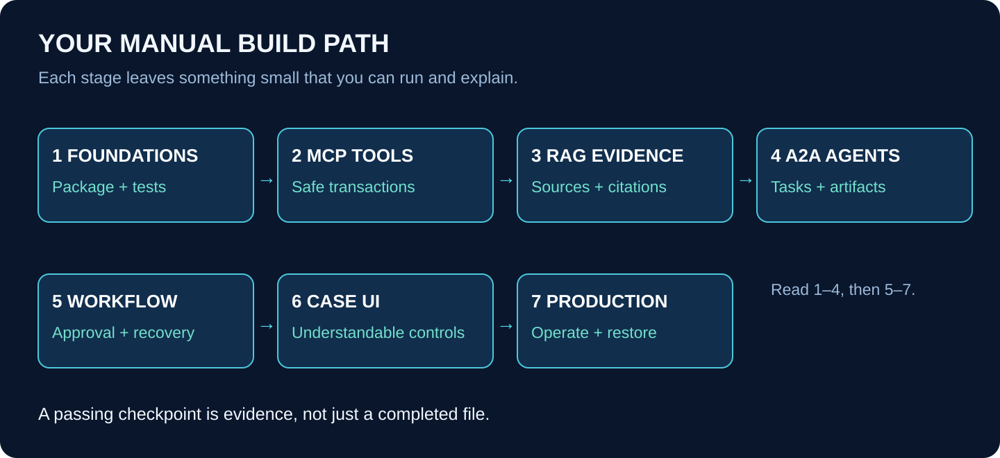

# Build It Yourself

## Seven workbooks: from an empty folder to a production demo

This series teaches you how to build the five Acme projects manually. The primary route is Python services followed by a Next.js interface. Each project also explains its TypeScript implementation path. Start with one route; do not maintain two half-finished implementations at once.

**These are construction workbooks, not a claim that the application already exists.** They give you file order, function contracts, algorithms, small code lessons, tests, failure exercises, and release gates. The short code listings are complete for the named exercise, not a substitute for the entire production codebase. Framework adapters and deployment settings must be implemented and tested against the versions you select. No application code, cloud resources, or deployments are created by these documents.

## 1. Your route through the series

| Order | Workbook | What you will be able to build |
|---|---|---|
| 1 | [Foundations](01-FOUNDATIONS.html) · [Markdown](01-FOUNDATIONS.md) | Empty repository, Python package, tests, database setup, shared contracts |
| 2 | [P1 — MCP Gateway](02-MCP-GATEWAY.html) · [Markdown](02-MCP-GATEWAY.md) | Business functions exposed as controlled tools, with safe repeated writes |
| 3 | [P2 — RAG Workbench](03-RAG-WORKBENCH.html) · [Markdown](03-RAG-WORKBENCH.md) | Ingestion, authorized search, source versions, evidence packs |
| 4 | [P3 — A2A Specialists](04-A2A-SPECIALISTS.html) · [Markdown](04-A2A-SPECIALISTS.md) | Independent Policy and Finance agents with durable task records |
| 5 | [P4 — Durable Workflow](05-DURABLE-WORKFLOW.html) · [Markdown](05-DURABLE-WORKFLOW.md) | Jobs, approval, retries, restart recovery, reconciliation |
| 6 | [P5 — Case Platform](06-CASE-PLATFORM.html) · [Markdown](06-CASE-PLATFORM.md) | Next.js workspace connecting the complete customer journey |
| 7 | [Production and Operations](07-PRODUCTION.html) · [Markdown](07-PRODUCTION.md) | Release pipeline, isolated environments, backups, monitoring, recovery drills |

Each HTML file embeds the diagrams it needs. Links between workbooks are for moving to the next lesson; you do not need to leave a lesson to view its diagrams. Keep the Markdown files for notes or future edits.

## 2. The case we will keep using

Acme receives a dispute about a $120 service charge. Its fictional policy permits a $75 credit. The Policy specialist checks eligibility; Finance checks the arithmetic. Maya, an authorized reviewer, approves the exact proposal. The system writes a simulated ledger entry and returns a receipt.

The fixed demonstration identifiers are tenant `TENANT-A`, account `ACCOUNT-7`, and case `CASE-1042`. Money is represented in minor units: 12000 and 7500 USD cents. These values are synthetic. There is no real bank, payment provider, or private customer dataset.

The most important demonstration is a lost response after a committed credit. On retry, the system returns the original receipt rather than creating another credit. Everything you learn about files, functions, protocols, and deployment serves this understandable outcome.

## 3. How to study each lesson

First read the outcome. Create only the files named in that lesson. Write the smallest function that expresses the rule. Write its test. Run the test and inspect the result. Then deliberately break one assumption and confirm that the test detects it.

Before moving on, explain the function aloud: “It receives this, checks that, changes these records, and returns this.” If you cannot describe a function without saying “the framework handles it,” inspect the boundary more closely.

Each workbook contains a file/function build ledger. Treat every row as a small implementation task, not as a file to paste blindly. Create empty `__init__.py` files in Python package directories as they are introduced. Test-file names are proposed names for the application you will build, not files already present in this course repository.

## 4. What from scratch means here

You write the application rules, state transitions, storage adapters, UI composition, tests, and operational procedures. You still use established libraries for HTTP servers, protocol transports, database drivers, and authentication. Learning to build a car does not require inventing steel; learning an MCP application does not require implementing the protocol parser yourself.

The workbooks distinguish three kinds of material: **typeable exercise**, **algorithm to implement**, and **version-sensitive integration**. The first can be entered directly into the named files. The second specifies your own application's behavior. The third must be matched to installed SDK documentation and checked with real integration tests.

The main path is detailed Python/hybrid instruction. The TypeScript sections are translation work plans with file/function mappings and acceptance criteria, not a second full line-by-line SDK reference. When the actual repositories exist, pin these guides to tagged code checkpoints so every lesson can be compared with a runnable implementation.

## 5. What counts as completion?

| Level | Evidence you must produce |
|---|---|
| Function works | Passing test for normal and invalid input |
| Persistence works | Data survives restarting the process |
| Protocol works | An official client calls a real server endpoint |
| System works | Complete case ends with a matching receipt |
| Recovery works | A deliberately interrupted case safely resumes |
| Production demo works | Correct secrets, isolated data, tested restore, monitored release |

Do not mark a lesson complete because the code merely looks correct. A successful model response is not proof of authorization, a passing UI test is not proof of transactional safety, and a successful deployment is not proof of backup recovery.

## 6. Keep the work outside the course repository

Build the application in the sibling `acme-agent-platform` repository described in the repository guide. The lessons remain in `image-course`. Use one Git history for all five Python/hybrid projects. Add the TypeScript counterpart in its own sibling repository later.

The production destination is initially a **controlled portfolio demo using fictional data**. A real customer-facing financial system needs additional threat modeling, privacy and operational review, provider-specific reconciliation, and appropriate professional oversight. This series does not turn a simulated ledger into a live payment product.
