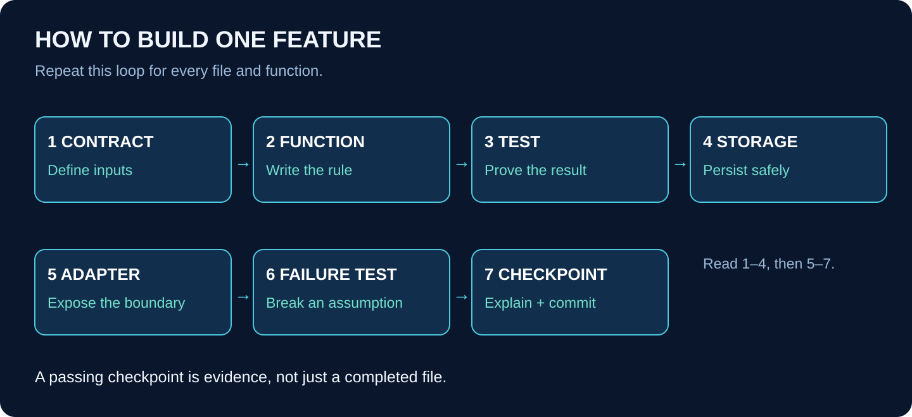

# Workbook 1 — Start with Nothing

## Create the workshop before building the machinery

**Outcome:** a new application repository, a small importable Python package, a passing test, a local database, and a clear contract vocabulary. No agents or model keys are needed yet.

Use the Python/hybrid path first. All file paths in this workbook are relative to your new application repository unless a command explicitly changes directory. The course repository is only where you read the guide.

## 1. At a glance



A pure function receives values and returns a value without calling a network or writing a database. Start there because mistakes are easiest to understand when only one thing is happening. A database adapter later saves the result; a web adapter later accepts a request. Those layers should not be mixed into the first function.

## 2. Install and verify your tools

You need Git, an editor, a supported Python version, Node.js for the later UI, and either local PostgreSQL or a container runtime. Install supported releases from their official distributions. Record the versions in `docs/toolchain.md`; do not copy the course website's dependency file into the application.

Open PowerShell and check the tools you have installed:

```powershell
git --version
python --version
node --version
npm --version
docker --version
```

If a command is not found, stop and fix that installation before continuing. Docker is optional if you install PostgreSQL directly. Do not install a model provider or create a paid account just to pass this first workbook.

In a parent folder of your choice, create a **new, unused** application directory:

```powershell
New-Item -ItemType Directory acme-agent-platform
Set-Location acme-agent-platform
git init
New-Item -ItemType Directory backend
Set-Location backend
python -m venv .venv
.\.venv\Scripts\python.exe -m pip install --upgrade pip
```

A virtual environment is a private set of Python packages for this project. Calling its interpreter directly avoids changing PowerShell execution policy just to activate it. [Python virtual environments](https://docs.python.org/3/library/venv.html).

## 3. Create the first files manually

Create this tree in your editor. The following code examples run from the `backend` directory.

```text
acme-agent-platform/
├── .gitignore
├── README.md
├── docs/toolchain.md
└── backend/
    ├── pyproject.toml
    ├── src/acme/__init__.py
    ├── src/acme/domain/__init__.py
    ├── src/acme/domain/money.py
    └── tests/test_money.py
```

In the root `.gitignore`, exclude `.venv/`, `__pycache__/`, `.pytest_cache/`, `.env`, `.env.*`, `node_modules/`, `.next/`, and local database volumes. Add `!.env.example` after the environment exclusions. An example file contains variable names and harmless placeholders, not real secrets.

Put this initial packaging configuration in `backend/pyproject.toml`:

```toml
[build-system]
requires = ["setuptools>=68"]
build-backend = "setuptools.build_meta"

[project]
name = "acme-agent-platform"
version = "0.1.0"
requires-python = ">=3.11"
dependencies = []

[project.optional-dependencies]
test = ["pytest>=8"]

[tool.setuptools.packages.find]
where = ["src"]

[tool.pytest.ini_options]
testpaths = ["tests"]
```

This is a minimal exercise configuration, not the final locked production dependency set. The build backend tells Python how to install your package; `src` tells it where your code lives; the optional test group installs pytest.

Install it from `backend`:

```powershell
.\.venv\Scripts\python.exe -m pip install -e ".[test]"
```

The editable install means changes to your source are visible without reinstalling the package each time. Later, use a lock-capable dependency workflow and commit its lock file so CI reproduces the same versions.

## 4. Your first function, line by line

In `src/acme/domain/money.py`, type:

```python
def remaining_charge(charge_minor: int, credit_minor: int) -> int:
    if type(charge_minor) is not int or type(credit_minor) is not int:
        raise TypeError("Amounts must be integer minor units")
    if charge_minor < 0 or credit_minor < 0:
        raise ValueError("Amounts cannot be negative")
    if credit_minor > charge_minor:
        raise ValueError("Credit cannot exceed the charge")
    return charge_minor - credit_minor
```

The first line names the function and its two inputs. The annotations document the intended types, but do not enforce them by themselves. The first check rejects strings, decimals, and Booleans. Python's `bool` is a subclass of `int`, so the exact-type check is deliberate for this tiny exercise.

The next two checks reject impossible amounts. The final line performs the calculation only after validation. For 12000 and 7500, it returns 4500. That is $45, not $4500: the unit is cents throughout.

This function does not decide whether a person is eligible for a credit. It only calculates the remainder. Naming that responsibility precisely prevents unrelated policy logic from creeping into it.

## 5. Write its test before adding more code

In `tests/test_money.py`, type:

```python
import pytest
from acme.domain.money import remaining_charge


def test_partial_credit():
    assert remaining_charge(12000, 7500) == 4500


@pytest.mark.parametrize("charge,credit", [(-1, 0), (100, -1), (100, 101)])
def test_invalid_amounts(charge, credit):
    with pytest.raises(ValueError):
        remaining_charge(charge, credit)


def test_boolean_is_not_money():
    with pytest.raises(TypeError):
        remaining_charge(100, True)
```

Run:

```powershell
.\.venv\Scripts\python.exe -m pytest -q
```

You should see five passing cases. Now temporarily reverse the subtraction and run the tests again. The first test should fail. Restore the correct line. This proves your test can catch the bug, not merely that it runs. Pytest discovers test functions and evaluates ordinary assertions. [pytest getting started](https://docs.pytest.org/en/stable/getting-started.html).

## 6. The shared file/function build ledger

Create the following files in order as implementation exercises. Each row describes code you will write, not a supplied implementation hidden elsewhere.

| File | Function or type to create | Inputs → output | Test before proceeding |
|---|---|---|---|
| `contracts/identity.py` | `Actor` | Trusted subject, tenant, roles → immutable identity | Missing tenant rejected |
| `contracts/case.py` | `CaseInput` | Account, charge, reason → validated command | Negative charge rejected |
| `contracts/proposal.py` | `CreditProposal` | Case/account/tenant, amount, currency, revisions → proposal | Unknown fields rejected |
| `contracts/receipt.py` | `CreditReceipt` | Operation ID, credit ID, amount, time → receipt | Required identifiers present |
| `config.py` | `load_settings()` | Environment → validated settings | Production refuses local-auth mode |
| `persistence/db.py` | `open_connection(settings)` | Database URL → connection | Wrong credentials fail without logging password |
| `security/authorize.py` | `require_scope(actor, tenant, action)` | Identity and target → allow or exception | Cross-tenant access denied |
| `observability/events.py` | `make_event(name, ids, details)` | Safe fields → structured event | Secret fields excluded |

Use Pydantic models for HTTP-facing Python contracts, with strict validation where needed and an explicit unknown-field policy. Do not interpret a caller-supplied `Actor` object as authenticated identity. The authentication adapter constructs it after verification.

## 7. Add PostgreSQL without hiding what it does

Install PostgreSQL locally or define a PostgreSQL service in `infra/compose.yaml`. Pick a supported image version explicitly, map it to loopback for development, set a named volume, and load credentials from an ignored environment file. The database name should clearly identify it as a development database.

Before writing application queries, connect with a database client and execute `SELECT 1`. Then create a test table, insert a row, disconnect, reconnect, and read it. This is your first proof that persistence means more than a Python dictionary.

Create `backend/migrations/001_bootstrap.sql`. Add separate schemas for `operations`, `rag`, `agents`, `workflow`, and `cases`. Use a migration-owner role only for schema changes. Application roles get only the schema/table permissions they need. Do not store the owner credential in every service.

Create `persistence/migrations.py` with `apply_pending_migrations(connection, directory)`: acquire a migration lock, read the migration journal, verify checksums of already-applied files, apply unapplied files in order, and record each success. Roll back on failure. Never edit an applied migration; add a new one. You may use an established migration library instead, but retain these guarantees.

Keep test data separate from development data. Before a test reset, verify the selected database is explicitly a test database. Never teach a cleanup helper to drop whichever database happens to be in an environment variable.

## 8. Freeze the fixture vocabulary

Create a synthetic fixture file containing tenant `TENANT-A`, account `ACCOUNT-7`, charge 12000, currency `USD`, case `CASE-1042`, and an eligible credit of 7500. Add `TENANT-B` with a private policy passage so every later guide can test isolation.

Define separate identifiers for cases, proposals, source versions, specialist tasks, workflow runs, and operations. Do not reuse a case ID as a unique tool-call ID. A single case may involve many calls and retries.

Store UTC timestamps and pass a clock dependency into functions that check expiry. Tests can then use a fixed time instead of waiting for minutes to pass. Use integer money with explicit currency and bounded values that both Python and JavaScript can represent exactly.

## 9. TypeScript foundation path

When you build the second repository, create a workspace with `apps/` and `packages/`, one package manager lock file, and strict TypeScript configuration. Create `packages/contracts`, `packages/operations-domain`, and a unit-test configuration before the web app.

Translate `remaining_charge` into `remainingCharge`. Check `Number.isSafeInteger` on both arguments before subtraction. A TypeScript `number` annotation does not reject `NaN`, fractional values, or unsafe integers at runtime. Write the same five tests plus an unsafe-integer test.

Use runtime schemas at boundaries and generate or export language-neutral JSON contracts. Do not assume a TypeScript interface is a validator. Match null handling, money ranges, timestamps, and error codes across both implementations.

## 10. Troubleshooting and completion gate

If Python cannot import `acme`, verify you installed the package from `backend` using the same interpreter that runs pytest. If no tests are collected, check the filename and test-function prefix. If database tests intermittently fail, check test isolation and transaction cleanup before adding retries.

You are ready for P1 when a clean checkout can install dependencies, run the money tests, validate fixture contracts, connect to the development database, and apply migrations to a new test database. Record the exact commands in the root README and commit a checkpoint such as `foundation: package, contracts, and tests`.

Explain it aloud: **“I separated rules from transport, proved one rule with a test, and gave future services a shared vocabulary.”**
