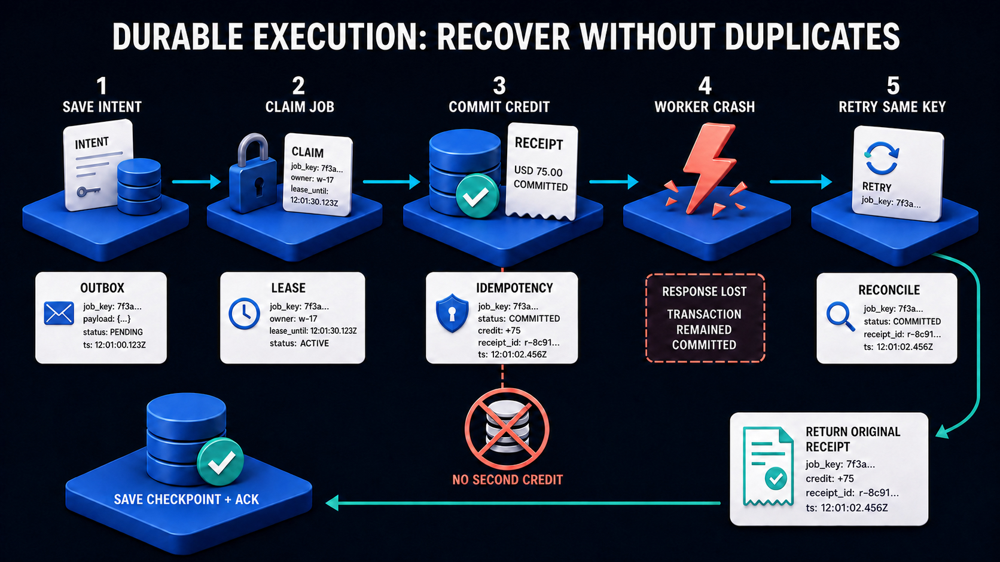

# Workbook 5 — Build the Durable Workflow and Reliability Lab

## P4: remember the work, wait safely, and recover uncertain outcomes

**Outcome:** the case progresses through persisted states, waits for an exact human approval, executes through MCP, and recovers after crashes. This workbook builds the educational Python scheduler. Its TypeScript alternative uses Workflow DevKit instead of duplicating that scheduler.

Prerequisites: P1 tools, P2 evidence, P3 specialists. Use their fixture modes and real protocol boundaries. Keep all money simulated.

## 1. At a glance



Durability means a process can stop without losing accepted work. It does not mean an action runs exactly once. A durable worker may repeat a step after uncertainty, so the step's external effect must be safe to repeat.

The distinction matters in our case: a credit can exist even while the workflow still says Executing. Reconciliation connects those two truths by finding the recorded receipt.

## 2. Create files in a testable order

| File under `backend/src/acme/workflow` | Functions | Purpose |
|---|---|---|
| `states.py` | `transition(current, event)` | Pure state-machine rules |
| `repository.py` | `load_workflow`, `save_transition` | Expected-version state updates |
| `outbox.py` | `record_event`, `deliver_batch` | Durable delivery intent |
| `inbox.py` | `accept_event` | Deduplicate incoming events |
| `jobs.py` | `claim_job`, `renew_lease`, `finish_job` | Persisted scheduling and fencing |
| `coordinator.py` | `advance_case` | Decide the next bounded action |
| `approvals.py` | `record_proposal`, `record_approval` | Exact revision binding |
| `execution.py` | `request_grant`, `execute_approved_credit` | Controlled MCP execution |
| `reconciliation.py` | `reconcile_operation` | Resolve unknown outcomes |
| `worker.py` | `run_once`, `main` | Process jobs and shut down safely |
| `lab/scenarios.py` | `run_failure_scenario` | Repeatable fault injection in tests |

The file order separates “what should happen next?” from “how does a worker acquire the job?” Test the state rules before touching locks.

## 3. Write a small state-machine exercise

Type this into `states.py` as the first reduced learning model:

```python
ALLOWED = {
    ("RECEIVED", "start"): "GATHERING",
    ("GATHERING", "proposal_ready"): "AWAITING_APPROVAL",
    ("AWAITING_APPROVAL", "approved"): "READY_TO_EXECUTE",
    ("READY_TO_EXECUTE", "execute"): "EXECUTING",
    ("EXECUTING", "response_unknown"): "RECONCILING",
    ("EXECUTING", "receipt_found"): "COMPLETED",
    ("RECONCILING", "receipt_found"): "COMPLETED",
}


def transition(current: str, event: str) -> str:
    try:
        return ALLOWED[(current, event)]
    except KeyError:
        raise ValueError(f"Invalid transition: {current} + {event}") from None
```

Test every listed transition and verify that Received cannot jump straight to Completed. This is deliberately not the complete production graph. Extend it with review, input-required, rejected, expired, retry-wait, cancellation, and terminal-failure paths before integration.

Do not allow arbitrary callers to submit the event `approved`. The approval service emits that event only after validating a persisted reviewer decision.

## 4. Persist state and scheduling separately

Create workflow, event, job, inbox, outbox, proposal, and approval tables. Workflow records include tenant, case ID, state, revision, and logical workflow identity. Job records include due time, attempt count, lease expiry, owner, and fencing generation.

`save_transition` updates the row only when its expected revision matches, then records the event and any next-job intent in the same transaction. If another worker advanced the case, the stale update fails instead of silently replacing it.

The outbox is the list of events that must be delivered. The inbox is the list of events already accepted. They solve opposite halves of repeated delivery. Add unique event IDs and make accepting an event plus scheduling its job atomic.

Keep retry scheduling in durable rows. A timer in memory may help responsiveness, but restarting a process must not erase the next retry time.

## 5. Implement job claims carefully

`claim_job(now, worker_id)` opens a short transaction, selects an eligible job, locks it, updates its lease and generation, and commits before external work begins. PostgreSQL `FOR UPDATE SKIP LOCKED` is useful for queue-like consumers, but it is not a general guarantee of a consistent business snapshot. [PostgreSQL SELECT locking](https://www.postgresql.org/docs/current/sql-select.html).

After claiming, the worker calls the external service without holding the row lock. On completion, `finish_job` checks owner and fencing generation. If the lease expired and another worker took over, the old worker cannot update the workflow.

A fence protects your database state; it cannot magically cancel an HTTP request already sent by an old worker. External writes still require P1's stable operation key and business uniqueness. This is why leases alone do not prevent duplicate effects.

`renew_lease` extends ownership only for the current generation. Use database time for lease comparisons to avoid trusting inconsistent worker clocks. Test two workers claiming the same due job.

## 6. Write the coordinator as bounded steps

`advance_case` loads the current state, chooses one permitted action, invokes the corresponding adapter, stores the resulting reference, and schedules the next action. References to account snapshots, evidence packs, and A2A task IDs belong in persistent workflow context.

Do not put the entire investigation into one job with no checkpoints. If Policy completed before a crash, the resumed workflow should load that task and artifact rather than blindly create another assignment.

Use stable delegation IDs for specialist requests and stable ingestion IDs for source work. Record intent before making a call where losing the response would matter. An exception may mean permanent invalid input, a transient failure, or an unknown side-effect outcome; classify these separately.

Retry transient failures with bounded exponential backoff and jitter. Cap attempts and elapsed time. Exhaustion moves to review or a terminal failure with an actionable reason, not an infinite retry loop.

## 7. Build real approval records

`record_proposal` stores a canonical payload containing tenant, case, account, amount, currency, action, proposal revision, evidence bindings, and expiry. A new proposal creates a new revision.

`record_approval(actor, case_id, expected_revision, decision)` authenticates and authorizes the reviewer, locks the current proposal, checks revision and expiry, and inserts the decision plus an outgoing event in one transaction. Reject changed proposals with a conflict and require fresh review.

The workflow later requests an execution grant through a trusted grant issuer. Bind the grant to the exact proposal and purpose. Only the operations service consumes the grant when it commits a new action. Finance cannot mint its own grant.

A repeated matching approval command should return the recorded decision. A conflicting decision requires an explicit policy and audit trail; do not overwrite an approval row to make the UI look simpler.

## 8. Recovery is an explicit state

`execute_approved_credit` sends the approved action and stable operation key. If it receives a receipt, validate and store its reference. If the response is uncertain, enter Reconciling. Do not mark the credit failed solely because a connection closed.

`reconcile_operation` queries the domain service by the operation key or repeats the same idempotent command. A known completed operation yields its original receipt. A still-unknown outcome remains reconciling with bounded escalation. Never generate a new key to “try again.”

Cancellation after a possible effect must also reconcile. A cancelled workflow can still require an audit note showing that the credit committed before cancellation took effect. Stopping a worker does not reverse a transaction.

## 9. Run the failure matrix

| Failure point | Expected recovery |
|---|---|
| After intake commit, before delivery | Outbox relay eventually delivers |
| After inbox acceptance, before worker run | Persisted job remains due |
| After specialist accepts, before response received | Same delegation finds same task |
| After proposal saved, before approval event | Reviewer can reload persisted proposal |
| After approval commit, before event delivery | Outbox delivers the approval event |
| After credit commit, before response | Same operation returns original receipt |
| After receipt saved, before job acknowledged | Repeated job observes completion |
| Old worker wakes after lease loss | Fence prevents stale state changes |

Use deterministic fault hooks and an isolated fixture database. Inspect actual row counts and identifiers, not just log messages. The test must prove one credit and one business receipt after the recovery sequence.

## 10. TypeScript alternative: Workflow DevKit

Do not translate the entire Python job scheduler into TypeScript and then also add Workflow DevKit. In this alternative, the runtime supplies durable step/wait execution; your application still owns business state, approvals, outbox dispatch, and idempotency.

Create `apps/web/workflows/resolve-case.ts` for orchestration, and step files for evidence, delegation, proposal recording, approval reading, execution, and reconciliation. Keep I/O in step functions. Use the installed runtime's directives and integration setup; the course repository does not contain an installed Workflow package to pin these examples against.

Create a persisted case-plus-outbox transaction before starting the runtime. A bounded dispatcher starts a run and records its ID. If the start response is lost, duplicate runtime attempts must not both advance one logical case: use application ownership/version checks and idempotent external commands.

For approval, persist the decision first, enqueue a notification, establish the wait, and recheck the decision. The hook wakes execution; it is not authorization. Authenticate the reviewer endpoint, and never accept a public arbitrary hook token as sufficient authority. Typed hooks can validate event shapes, but business approval remains your responsibility. [Workflow typed hooks](https://useworkflow.dev/docs/api-reference/workflow/define-hook).

Test step functions separately, then test real workflow pause/resume/retry behavior with the installed runtime's integration tooling. A mocked function that immediately returns does not prove crash recovery.

## 11. Completion and presentation

P4 is complete when the failure matrix passes, approval is bound to exact revisions, old workers cannot overwrite new state, and an unknown credit outcome is reconciled. Before production, add queue-age alerts, graceful shutdown, paused-run versioning, and an operator recovery runbook.

Explain it aloud: **“I record intent before work, checkpoint progress after work, and reconcile uncertainty instead of guessing.”**
