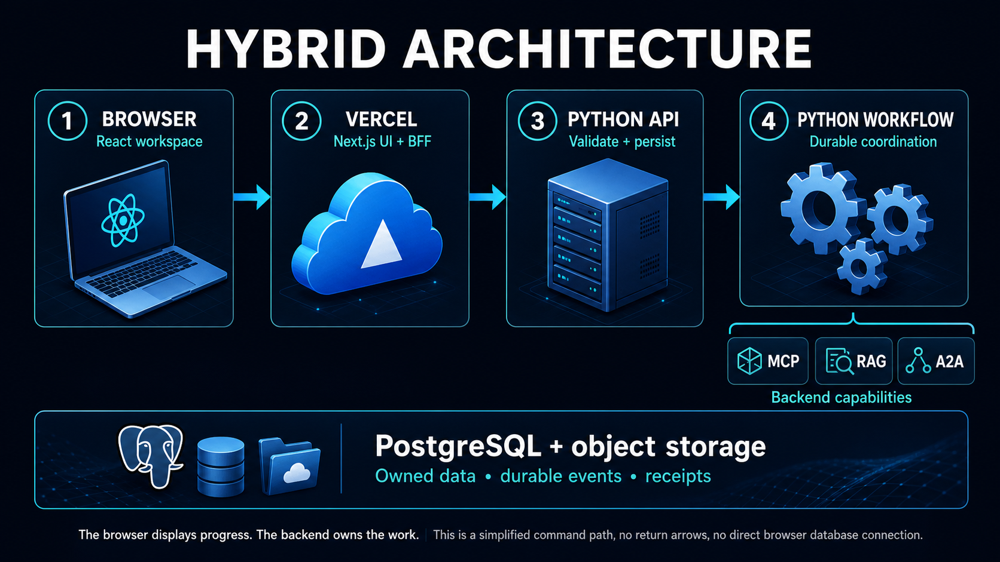

# Workbook 6 — Build the Case Resolution Platform

## P5: give a person a clear, safe interface to the system

**Outcome:** a Next.js workspace lets Maya submit a case, inspect evidence and specialist findings, approve the current proposal, and see a receipt-backed result. Closing the page does not stop the backend workflow.

Prerequisites: P1–P4 working through their real local interfaces. Start with a fixture user in a strictly local configuration, then replace that adapter with verified authentication before any public deployment.

## 1. At a glance



The browser owns interactions, not business truth. The Next.js server loads authorized data and forwards commands. The Python Case API records them. The workflow runs independently and exposes progress through durable read models.

The arrow from API to workflow represents an outbox and persisted jobs, not a single request waiting for the case to finish.

## 2. Build the Case API before the screen

Create these files under `backend/src/acme/case_api`:

| File | Functions | Behavior |
|---|---|---|
| `commands.py` | `create_case`, `submit_decision`, `request_cancel` | Authorize and persist intent |
| `queries.py` | `get_case_snapshot`, `get_case_events` | Read tenant-scoped view data |
| `repository.py` | `insert_case_and_outbox`, `find_intake_key` | Transactional intake |
| `routes.py` | HTTP handlers | Validate requests and map expected errors |
| `app.py` | `create_app(settings, dependencies)` | Compose dependencies and health routes |

`create_case(actor, input, intake_key)` validates tenant/account access and writes the case plus outbox event in one transaction. A repeated identical intake key returns the existing case. A changed payload under that key returns a conflict.

`get_case_snapshot` returns case state, revision, evidence summaries, task references, current proposal, reviewer permissions, and receipt if present. It must not return private internal prompts, provider tokens, or unrestricted document URLs.

Use FastAPI's testing client for request validation and authorization tests; separately test real network behavior when composing services. [FastAPI testing](https://fastapi.tiangolo.com/tutorial/testing/).

## 3. Create the Next.js app deliberately

In the new application repo, create `apps/web`. Use the official Next.js initializer as an optional scaffold for framework boilerplate, selecting TypeScript and App Router. Manual learning still means you inspect and understand every generated file; it does not require writing framework tooling from memory. For a completely manual setup, follow the official installation instructions for the compatible versions you select. [Next.js installation](https://nextjs.org/docs/app/getting-started/installation).

Do not copy `node_modules` or `package.json` from the course website. Commit the new app's lock file. Verify that its development server shows a basic page before adding API calls. Record the actual install, dev, test, and production-build commands in its README.

## 4. The web file/function ledger

Paths below start at `apps/web`.

| File | Functions/component | Role |
|---|---|---|
| `lib/server/session.ts` | `requireSession()` | Return verified user/tenant context |
| `lib/server/backend-client.ts` | `backendRequest()` | Bounded authenticated Python requests |
| `lib/server/case-queries.ts` | `loadCase()` | Validate and shape a case snapshot |
| `app/layout.tsx` | `RootLayout` | Shared page structure and readable styling |
| `app/cases/page.tsx` | `CasesPage` | Authorized case list |
| `app/cases/[caseId]/page.tsx` | `CasePage` | Server-rendered initial snapshot |
| `app/cases/[caseId]/actions.ts` | `approveProposal`, `rejectProposal` | Server-side mutation boundary |
| `components/case-form.tsx` | `CaseForm` | Gather user input and retain intake key |
| `components/evidence-panel.tsx` | `EvidencePanel` | Show passages and source versions inline |
| `components/approval-panel.tsx` | `ApprovalPanel` | Display exact action and revision |
| `components/task-timeline.tsx` | `TaskTimeline` | Display persisted progress |
| `components/receipt-card.tsx` | `ReceiptCard` | Show the recorded outcome |
| `app/api/cases/[caseId]/events/route.ts` | `GET` | Authorized polling/SSE boundary |
| `app/error.tsx`, `app/loading.tsx` | Error and loading components | Understandable incomplete/error states |

Mark secret-bearing adapters server-only. Server Components can load the initial data; Client Components handle interactive controls. Do not make the entire application a Client Component merely because one button is interactive. [Server and Client Components](https://nextjs.org/docs/app/getting-started/server-and-client-components).

## 5. Trace the initial page load

`CasePage` receives the route's case identifier, obtains the verified session, and calls `loadCase`. That function calls the Python adapter directly. A Server Component does not need to call its own Next.js API over HTTP just to reach the same server-side helper.

`backendRequest` attaches scoped service/user delegation, sets a timeout, passes a trace ID, and validates the response. It never trusts a browser-supplied tenant header. Python independently verifies the delegation and case access.

Render the initial snapshot on the server. Give interactive child components only the fields they need. Sensitive case content should not enter public caches. Recheck permissions on later requests because access may change after the page first loaded.

For current Next.js versions, consult the route-parameter and request API behavior of your installed release; do not assume synchronous `params` from an old tutorial remains correct.

## 6. Build the screen with a fixture first

Before connecting the backend, render a fixed, synthetic snapshot through the display components. This isolates layout mistakes from network mistakes. Label fixture mode unmistakably and keep it local until the real boundaries are connected.

Create five regions: the case summary, evidence, specialist findings, approval, and timeline/receipt. The approval panel should show $75 USD, the account, the reason, the proposal revision, and its expiry. The receipt panel should show the receipt ID and recorded amount.

Render source excerpts as text, not raw untrusted HTML. If you support Markdown, sanitize it and restrict dangerous links and embedded content. The evidence text is untrusted even when it came from your own retrieval service.

Make headings, form labels, error messages, focus order, and buttons usable with a keyboard. Use text labels as well as colors for states. A green icon without “Completed” is insufficient feedback.

## 7. A small display function exercise

In `lib/format-money.ts`, implement and test:

```typescript
export function formatUsdMinor(amount: number): string {
  if (!Number.isSafeInteger(amount)) {
    throw new TypeError("Expected safe integer cents");
  }
  return new Intl.NumberFormat("en-US", {
    style: "currency",
    currency: "USD",
  }).format(amount / 100);
}
```

Test 7500 → `$75.00`, 0 → `$0.00`, and reject a fractional or unsafe integer input. This function is deliberately USD-specific: currencies do not all share the same minor-unit scale. It formats a recorded value; it does not calculate the approved amount.

## 8. Implement submission and approval

`CaseForm` creates an intake key once per logical submission and retains it while retrying. On an uncertain response, reuse it. On a successful response, navigate to the returned case. Do not create a new case every time the user presses Refresh.

`approveProposal` rechecks the session and reviewer permissions, validates the expected revision, then forwards the command. Python records the approval against the canonical proposal. The browser cannot choose a new amount while claiming it approved the displayed one.

Handle a revision conflict by reloading the current proposal and asking for fresh review. Handle an expired session by requiring login again. Disable duplicate UI clicks for usability, but rely on backend idempotency for correctness.

Server Actions are remotely invocable mutations, not private functions protected by their filename. Apply authentication, authorization, input validation, and appropriate origin/CSRF protections. Do not expose a generic “invoke any backend action” endpoint.

## 9. Progress without fragile browser state

Begin with polling. The client requests changes after its last event cursor, with bounded backoff and cleanup when the component unmounts. The server authorizes each request. If a cursor is stale, fetch a new snapshot.

Later add SSE if useful, preserving the same durable event contract. A connection may close; reconnect with the last observed cursor. Store event IDs so duplicate delivery does not duplicate timeline entries. Distinguish connection status from business status.

The browser closing must not cancel the case. An explicit Cancel command is a separate authorized action. If the workflow is reconciling a possible credit, the UI should say so instead of announcing that the credit was definitely cancelled.

## 10. End-to-end test sequence

Seed an isolated test database with the fictional case inputs. Start the real backend services and web server. In a browser test, log in as the fixture reviewer, submit the dispute, inspect the policy passage, observe specialist findings, approve the current proposal, and wait for the receipt.

Then repeat with stale approval, wrong tenant, a disconnected browser, and a lost execution response. Assert the database's one-credit invariant as well as the screen content. A UI saying “Success” is not proof that the ledger is correct.

Test that browser bundles and responses contain no service secrets. Test private caching behavior, logout, session expiry, keyboard navigation, and error recovery. A browser automation suite should fail on unexpected console errors and broken requests.

## 11. Full TypeScript variant

Reuse the React components and display contracts, but replace `backend-client.ts` with a server-only case-domain adapter. That adapter writes the TypeScript platform's case/outbox transaction and uses Workflow DevKit for durable coordination.

Keep MCP and A2A boundaries real. The web app still must not import the credit-writer with an unrestricted database credential. Sensitive execution goes through the operations service under an execution identity.

Use the same end-to-end fixtures. One server language removes a cross-language HTTP hop; it does not remove validation, approval, or persistence boundaries. Test both implementations separately against their own databases.

## 12. Completion and presentation

P5 is complete when a person can understand and control the complete case without inspecting logs or leaving the page for evidence. Every displayed success must correspond to persisted state. Before deployment, remove fixture authentication from public environments, configure private caching, and pass the security and accessibility checks.

Explain it aloud: **“The page shows what the system has recorded. It sends commands, but it does not become the source of truth.”**
