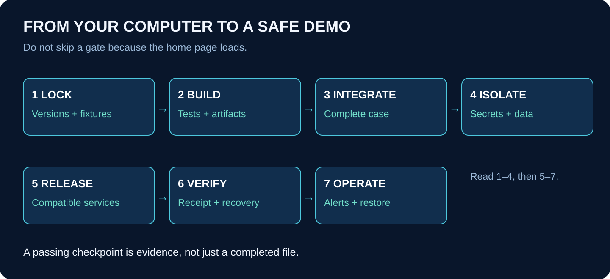

# Workbook 7 — From Local Success to a Production Demo

## Release the complete system and learn to operate it

**Outcome:** a repeatable, monitored release of the five projects using fictional data, separate environment credentials, tested backups, and a recovery runbook. A live payment integration is not part of this series.

Prerequisite: all project completion gates. Do not deploy unfinished safety boundaries to a public endpoint merely to obtain a portfolio URL.

## 1. At a glance

Production is an operating responsibility, not a command that ends development. You must know what is running, which data it uses, how to detect failure, and how to restore service without duplicating business actions.

## 2. Make a release inventory

Create `docs/operations/release-inventory.md`. List each service, source folder, start command, health endpoint or worker heartbeat, required secrets, database role, external dependencies, and rollback target.

For the hybrid version, the web app runs on Vercel and Python APIs/workers run on a container-capable host. For TypeScript, the web and protocol service entry points can deploy separately from the same repository, subject to transport/runtime compatibility tests. A deployment is not a Git repository.

| Project | Release-specific check |
|---|---|
| P1 MCP | Only execution identity writes; receipt lookup protected; concurrent retries safe |
| P2 RAG | Sources private; ingestion bounded; evidence version retained; deletion policy defined |
| P3 A2A | Task state durable; trusted agent URLs; deadline and cancellation behavior tested |
| P4 Workflow | Jobs recover; queue-age alert; unknown operations reconcile; old runs remain compatible |
| P5 Web | Real authentication; no leaked secrets; correct backend environment; usable errors |

## 3. Create the deployment files one at a time

| File | What you write | How you verify it |
|---|---|---|
| `backend/Dockerfile` | Pinned runtime, dependency install, source copy, non-root user, explicit entry point | Build and run with development secrets supplied at runtime |
| `.dockerignore` | Exclude secrets, VCS metadata, caches, local volumes | Inspect build context and image contents |
| `infra/compose.yaml` | Local service names, dependencies, ports, volumes, health checks | Clean local startup without manual hidden steps |
| `.env.example` | Document variable names and safe placeholders | No usable credential committed |
| `.github/workflows/ci.yml` | Install from locks, lint/type checks, unit/integration tests, build | Pull request cannot pass when a safety test fails |
| `scripts/smoke.py` | `check_readiness`, `run_synthetic_case`, `verify_receipt` | Fails on wrong tenant or duplicate credit |
| `scripts/reconcile.py` | `list_uncertain_operations`, `reconcile_one` | Read-only/dry-run first; controlled state changes |
| `docs/operations/runbook.md` | Diagnose, restore, reconcile, escalate | Another person can follow it |
| `docs/operations/release-manifest.json` | Commit, artifacts, migration/contract versions | Running services match recorded release |

These are files to implement in the future application repository. Do not paste a production deployment token into the course guide or commit it as an example.

## 4. Build a reproducible artifact

Pin supported runtime and dependency versions. Install from the lock file in CI. Run the same tests in CI that you ran locally. Build the production web application rather than assuming the development server proves it will build.

For Python, build one backend image when practical and run separate service/worker entry points from it. Give each process only its required credentials. A shared image is not a reason to give every service the migration-owner password.

Never bake secrets into image layers or browser bundles. Supply runtime secrets through the host's protected configuration. Scan tracked files and artifacts for accidental credentials. If a secret was committed, rotate it; deleting the file from the latest commit does not remove the exposure.

## 5. Provision isolated environments

Create development, integration/preview, and production-demo configurations. Use different database credentials and private storage locations. Preview deployments must not call the production MCP writer.

Vercel can connect multiple projects to one repo with different application roots, and Git integration can create preview deployments. Your service URLs and databases still need explicit environment isolation. [Vercel monorepos](https://vercel.com/docs/monorepos), [Git deployments](https://vercel.com/docs/git).

For a small first release, a controlled shared integration environment is acceptable if data is isolated and incompatible schema changes are not tested concurrently against it. Create dedicated environments for changes that cannot safely share the backend.

Choose cloud resources and budgets deliberately. This document does not provision them. Configure quotas and spending alerts before enabling live model calls. Use fixture mode for public demonstrations unless live behavior adds a clear, budgeted benefit.

## 6. Authentication and network gate

Replace local fixture identity with a supported authentication integration. Verify issuer, audience, signature, expiry, and relevant claims. Map identity to tenant membership using trusted records. Test ordinary users, reviewers, administrators, and machine callers separately.

Next.js should forward narrowly scoped delegation to the Python backend, which verifies it independently. Internal dispatch and reconciliation endpoints require machine authentication. Do not rely on an obscure URL for protection.

Use HTTPS, restricted ingress, private database access where possible, and short-lived credentials where supported. Only expose services that need incoming connections. Workers polling a queue generally do not need public ports.

Test cross-tenant reads, writes, source access, task status, event cursors, receipt lookup, and uploads. Check that logs redact tokens and private source text. If any boundary is untested, it is not ready for public release.

## 7. Database migration and release order

Use one migration executor. First apply additive changes that both old and new code can tolerate. Then deploy compatible providers, then consumers. Test the integrated journey before removing old fields or handlers.

Do not run migrations from every service startup. Two instances racing to alter the same schema complicate failure recovery. Keep a migration journal with checksums and review destructive changes separately.

Persisted workflows may resume after a code release. Record workflow-definition versions and retain compatible handlers or drain old runs before removing them. A new deployment does not automatically migrate every paused execution safely.

For Vercel, do not blindly promote a preview artifact configured with preview-only URLs into production. Build or stage the production-target artifact with correct configuration, validate it, then release it through one controlled pipeline.

## 8. Write a useful smoke test

`check_readiness` verifies required dependencies, not just that a process returns HTTP 200. For workers, check a recent heartbeat and bounded queue age. Readiness checks must not reveal secrets or mutate business data.

`run_synthetic_case` creates a uniquely identified case under a dedicated smoke-test tenant. It follows the complete fixture path, records all IDs, and waits with a deadline. It never uses real customer accounts.

`verify_receipt` reads the final receipt and checks tenant, case, amount, operation key, and uniqueness. Run a repeated command and verify the same receipt. A successful home-page response is not a sufficient smoke test for this platform.

Record cleanup and retention rules for smoke-test data. Cleanup should target only those explicit synthetic records, never broad database resets.

## 9. Backups are incomplete until restored

Configure database backups and source-object retention appropriate to the demo. Record recovery-point and recovery-time targets as targets, not measured achievements.

Restore into a separate isolated environment. Verify row counts, source-version references, task artifacts, pending approvals, and receipts. Start workers with outbound effects disabled until the restored state is reviewed. Otherwise replaying restored jobs can unintentionally contact live services.

Test whether the restored database and object storage form a consistent set. A receipt without its referenced source evidence may undermine auditability even if the web app starts.

Document who can restore, where backups live, how encryption keys are accessed, and when the last successful restore test occurred. A backup checkbox is not evidence of recoverability.

## 10. Monitoring that tells you what to do

| Signal | What it may mean | First diagnostic action |
|---|---|---|
| Oldest pending outbox age rising | Delivery stopped | Inspect relay heartbeat and authentication |
| Job lease churn | Workers failing or timeouts too short | Compare attempts and execution durations |
| Many cases reconciling | Uncertain execution responses | Query operation receipts; do not create new keys |
| Ingestion failures | Parser/provider/format problem | Inspect safe error code and source metadata |
| Agent tasks past deadline | Executor or dependency stalled | Inspect persisted task state and worker health |
| Authorization denials rising | Misconfiguration or misuse | Check caller/audience/scope without exposing tokens |
| Model spend rising | Retry loop or uncontrolled prompts | Enforce per-case limits and inspect call counts |

Use structured logs with case, task, operation, and trace IDs as distinct fields. Capture metrics and alerts that lead to an operator action. Avoid dumping full documents or hidden model reasoning into logs.

## 11. Rehearse an incident

Simulate a deployment in which the workflow worker loses connectivity after the ledger commits. The operator should identify the affected case, confirm the operation key, query the authoritative receipt, and resume or reconcile the workflow without minting another credit.

Then simulate a bad UI release. Roll back the web artifact while preserving compatible backend and database state. A code rollback does not reverse a credit, undo a migration, or erase accepted tasks.

Write the incident steps in plain language: symptoms, safe checks, permitted repair, verification, and escalation. A repair script should default to listing intended changes before applying them, and require explicit scope.

## 12. Final release gate for all five projects

Before calling the platform production-demo ready, verify a clean checkout/build, passing security tests, complete fixture journey, concurrent-write safety, crash recovery, tested restore, environment isolation, monitored queues, and an operator runbook.

Document remaining limitations honestly: supported document formats, model evaluation coverage, traffic tested, recovery behavior tested, and unavailable features. Do not advertise invented latency, accuracy, or reliability numbers.

Release a tagged version and record its manifest. The five project READMEs should each contain its purpose, local start instructions, tests, demo scenario, and link to the integrated case experience. The public portfolio can show one coherent platform with five independently explainable engineering achievements.

Explain it aloud: **“I can build it, prove its behavior, release it safely, detect failure, and recover its recorded work.”**
