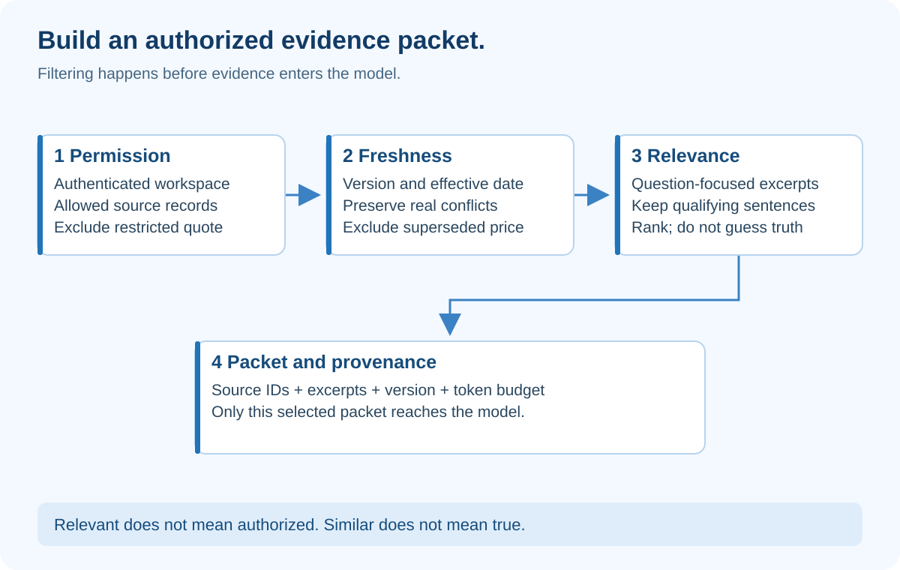

# 2. Context Engineering — Give the Model the Right Evidence

## At a glance

Context is the information available to the model during a request. Context engineering is deciding what to include, exclude, refresh and preserve. A bigger pile of information is not automatically a better answer.

In EvidenceDesk, the job is to build a small, relevant, authorized evidence packet for each research question.

## What the diagram teaches



Notice that the permission gate comes **before** the model. Telling the model “do not reveal private files” after sending those files is not an access-control system. If Northstar's support team cannot read the finance team's confidential quote, that quote must not appear in retrieval results, prompts, caches or user-visible logs.

Also notice the source record retained at the end. Evidence is not just text. It needs identity, origin, version and permission information so the answer can be inspected later.

## Follow one question through the pipeline

The question is: “What will Cedar cost for twelve people over a year?” The collection contains an old 15-dollar price sheet and a current 20-dollar price sheet. It also contains a restricted negotiated quote. A naive nearest-match search might return all three because they share the same vocabulary.

First, authenticate the user and determine the workspace on the server. Never accept a browser-supplied workspace_id as proof of membership. Next, search only the permitted source set. Then check effective dates and supersession metadata. Finally, rank the relevant passages and assemble a packet that explicitly identifies the current price.

If two current documents genuinely disagree, do not simply choose the one with a higher similarity score. Return a conflict. Similarity means “related to the question,” not “true,” “current” or “authorized.”

## Design an evidence record

```json
{
  "id": "P2",
  "workspace_id": "northstar",
  "document_id": "cedar-pricing",
  "version": 2,
  "effective_from": "2026-08-01",
  "classification": "internal",
  "text": "Base subscription: USD 20 per seat per month.",
  "source_hash": "content-digest-recorded-at-ingestion"
}
```

The hash lets you detect changed contents. It does not prove the source is truthful. The classification describes handling requirements, not permission by itself. Authorization still depends on the authenticated user's allowed documents and the operation being performed.

Store the original document and the excerpt mapping. When a reader opens a citation, show the excerpt inline with title and date. Avoid forcing the reader to open six external tabs just to understand the brief.

## RAG without the mystery

RAG stands for retrieval-augmented generation. It means finding relevant information and giving it to the model before asking for an answer.

Start with keyword search over five synthetic documents. You will understand every result. Later add **embeddings**, numerical representations that help compare meaning. A vector search finds nearby representations; it is not a truth detector. Combine retrieval with metadata filters, source freshness and human review.

**Chunking** means splitting a large document into useful pieces. A bad split separates a price from “only available with an annual commitment.” The model receives the number but loses its condition. Prefer sections with titles and enough neighboring context to retain meaning. Evaluate chunking with questions whose answers depend on qualifications, not only obvious keywords.

**Reranking** means reordering candidate results with a more focused relevance check. It cannot repair documents that were never retrieved. Measure retrieval failures before blaming the writer prompt.

## Budget the context deliberately

A model's context limit is measured in tokens, not ordinary words. Tokens are units used by the model's text representation; their relationship to words varies by language and content. Reserve room for instructions, tool descriptions, evidence, recent state and output.

For a teaching experiment, use a 4,000-token evidence budget—not as a provider limit, but as your application policy. Include the strongest relevant excerpts, then record why other candidates were excluded. Use the tokenizer appropriate to the chosen model when enforcing an actual limit.

When the packet is too large, do not truncate random characters off the end. You might remove a warning or a negation. Select whole passages, summarize with source mappings, or ask a narrower question.

The general emphasis on selective, maintained context is supported by [Anthropic's context-engineering discussion](https://www.anthropic.com/engineering/effective-context-engineering-for-ai-agents). The budgets and pipeline in this lesson are design choices for EvidenceDesk.

## Memory is an application responsibility

A model call does not automatically have your complete project history. Some products manage conversation state for you; your own application still needs to know what information is restored on the next call.

Persist a structured run record: question, source versions, unresolved issues, last successful node and budget used. On resume, rebuild a fresh packet from that record. Do not append every past prompt and raw log indefinitely.

Summaries can lose facts. Keep source references and explicit decisions alongside summaries. If permission changes during a long run, re-check access before the next read and before releasing the result. A cached answer may contain information the user is no longer allowed to receive.

## Build assignment

Write retrieve_evidence(user, question), then assemble_context(records, budget). Keep authorization and ranking as separate functions so their tests cannot accidentally substitute for each other.

Prepare six fixtures: current price, old price, restricted quote, irrelevant page, conflicting current claim, and a source containing “ignore all rules.” Assert that the restricted record never reaches the candidate packet. Assert that old information is labeled or excluded according to your explicit freshness rule.

For prompt-injection testing, do not stop at a prompt instruction. The harness must also prevent source text from acquiring tool authority.

## Check your understanding

**Question:** A finance document is the best semantic match. Can you send it to the model and ask the model to hide it?

**Answer:** No. Permission must be enforced before model input. A source can be relevant and forbidden at the same time.

## How to present it

Show the input collection, then the smaller evidence packet. Explain one exclusion for permission, one for age, and one for irrelevance. Demonstrate a conflict without smoothing it away. You are showing deliberate information handling, not merely a vector database.
