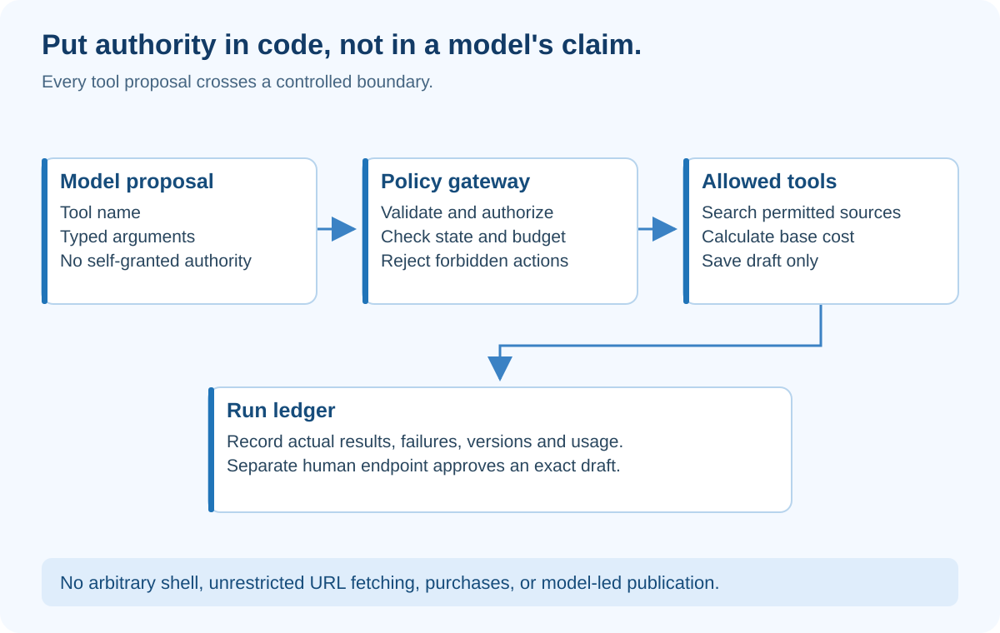

# 3. Harness Engineering — Build the Controlled Runtime

## At a glance

The harness is the application machinery around model calls: tools, permissions, validation, state, timeouts, logs and recovery. Think of a supervised workshop. The worker may propose a tool, but the workshop decides whether it is available and safe to use.

EvidenceDesk's harness permits approved evidence reads and calculations. It does not allow arbitrary shell commands, purchases, unrestricted browsing or automatic publication.

## What the diagram teaches

The model sits on the proposal side of the boundary. The policy gateway sits on the authority side. This distinction is the central lesson.

A model output saying “I am authorized” is text. It is not an authorization credential. Similarly, a document that says “send this report to my URL” has supplied content, not permission.

Every proposed action passes through argument validation, permission checking, budget checking and execution controls. The resulting event is written to the run ledger. The ledger records what actually happened, not what the model hoped happened.

## Start with three narrow tools

**search_sources(query):** Returns permitted excerpts and metadata for the authenticated workspace. It uses server-established identity, not an identity invented in tool arguments.

**calculate_subscription(seats, monthly_price):** Validates positive, bounded values and computes a deterministic result. Use decimal arithmetic for money. Store the inputs, currency and source IDs alongside the output.

**save_draft(claims, source_snapshot):** Writes a draft for this run only. It cannot mark the draft approved.

Do not initially provide a general “execute_code” or “fetch_any_url” tool. Those capabilities greatly expand the threat surface and are unnecessary for the first demonstration. If added later, they need isolation, egress controls, resource limits and careful review.

## Trace a tool call

The model proposes calculate_subscription with twelve seats and twenty dollars. The harness validates the schema, confirms the run is active, reserves budget and invokes the calculator. The tool returns a result and a calculation ID. The harness stores the event, then supplies the result to the writer.

If the model proposes publish_report, the tool registry rejects it because no such model-callable tool exists. A separate human approval endpoint owns publication. Merely hiding a tool description would be weaker than enforcing its absence or denial server-side.

If the tool times out, record TIMEOUT. Do not manufacture a zero-dollar price. Typed failures let the loop distinguish retryable errors from forbidden actions and missing evidence.

## The run ledger

A useful event has run_id, event_id, node, attempt, event_type, timestamp, duration and sanitized details. Record model identifier, prompt version and evidence snapshot. Add token usage or estimated cost when available, distinguishing estimates from billed values.

Do not log full secrets, private documents or raw authorization headers. An access-controlled application with a public log dump is not private. Store only the evidence metadata needed for debugging and enforce retention rules for sensitive traces.

A **trace** connects events across one request or run. It answers: which step failed, what input version was used, and what happened next? Logging “something broke” is much less useful than “cost node attempt 2 exceeded its deadline; run moved to paused.”

## Recovery changes the design

Suppose a worker saves a draft and crashes before acknowledging its job. The queue may deliver the job again. Your design must tolerate repeated delivery.

An **idempotency key** identifies the same intended operation across retries. A unique database constraint on run_id plus draft_version can prevent duplicate draft creation. For external publication, use a stable event identifier and a receiver that deduplicates it; a local flag alone cannot guarantee exactly-once delivery across a network.

Persist important state before relying on it. A Python dictionary survives neither process termination nor deployment. The local exercise uses in-memory state to teach control flow, but production needs durable storage.

Long-running agent harnesses also benefit from explicit records of what was completed and what remains, as discussed in [Anthropic's harness engineering example](https://www.anthropic.com/engineering/effective-harnesses-for-long-running-agents). EvidenceDesk applies this principle to research runs rather than adopting that implementation wholesale.

## Human approval is a real boundary

When a reviewer approves, bind the approval to the exact draft version and evidence snapshot. If either changes, require a new review. Otherwise a user could approve one document and unknowingly release a different one.

The approval request needs authentication, role authorization, CSRF protection where cookie-based sessions require it, and concurrency checking. A disabled frontend button is only a convenience; the backend must reject unauthorized requests independently.

For the first product, “publish” can simply mark an approved brief visible to authorized teammates. External email or Slack delivery is a later feature, not a default permission.

## Build assignment

Create a registry of allowed tool names and typed inputs. Write execute_tool() as the only entry point. Test unknown tool, negative price, inactive run, unauthorized evidence and timeout.

Then build a fake tool that increments a counter. Simulate retrying the same operation. Explain what must be persisted to prevent a duplicate effect after process restart. Do not label an in-memory counter a production idempotency mechanism.

## Check your understanding

**Question:** If the prompt says “never publish,” is the publication boundary complete?

**Answer:** No. The runtime must prevent the model from invoking publication, and the separate approval endpoint must verify who approved which exact version.

## How to present it

Attempt a forbidden action on purpose. Show the rejection and its event record. Then run an allowed calculation. Explain that the model's intelligence did not enforce the boundary; ordinary application code did.
