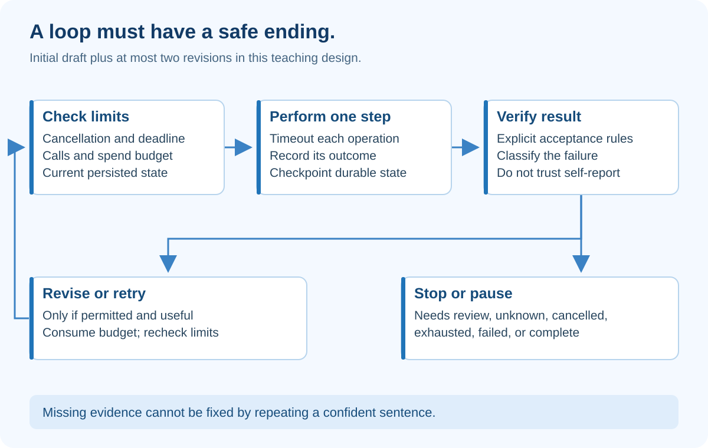

# 4. Loop Engineering — Know When to Continue and When to Stop

## At a glance

A loop repeats work while a condition permits it. Loop engineering makes repetition bounded, observable and recoverable. “Keep trying until it works” is not a production specification.

EvidenceDesk allows an initial draft and at most two revisions. It stops for approval, cancellation, exhausted budget, persistent failure or missing evidence that cannot be obtained.

## What the diagram teaches

The limit check happens before work, not only after it. The checker is separate from the writer. A failed check does not automatically mean “retry everything.” The state and reason determine the next action.

Our run might retrieve evidence successfully, calculate cost correctly and produce one unsupported feature claim. The sensible response is to revise that claim or mark it unknown. Re-fetching every source and repeating every calculation wastes money and may introduce inconsistent versions.

## Define success outside the model

For the capstone, a draft is ready for review when it answers the question, has no unresolved validator failures, identifies unknowns, and stays within the approved evidence snapshot. This is not the same as final publication. A person still reviews the recommendation.

The model saying “done” cannot satisfy these conditions by itself. Nor does a confidence number prove correctness. The application evaluates explicit criteria, and records which criteria passed or failed.

A checker can be partly deterministic and partly assisted. Deterministic checks cover schema, IDs, arithmetic and limits. A model-assisted critic can flag weak reasoning. A human resolves ambiguous support and the actual business decision.

## A state machine in ordinary English

Use queued, running, needs_review, approved, rejected, cancelled, exhausted and failed as run states. A state machine is simply a list of allowed state changes.

A queued run can start. A running run can pause for review, fail or be cancelled. A needs_review run can be approved or rejected. An approved run cannot casually return to running; a changed brief requires a new version and renewed approval.

Store transitions with a version number. Update “version 4, running” to “version 5, needs_review” only if the stored version is still 4. This prevents two workers from silently overwriting one another.

## Budgets are more than a counter

Set a maximum number of revisions, model calls, elapsed seconds and estimated spend. These are application policies, not claims about vendor limits.

For a teaching run, choose at most two revisions and a sixty-second deadline. A slow tool needs its own timeout shorter than the remaining run time. Otherwise checking the deadline between steps will not stop a single call that hangs indefinitely.

Parallel nodes must reserve from a shared budget atomically. If three nodes each read “one call remaining” and all start, a non-atomic check has failed. Count failed attempts when they consumed resources. Display actual usage separately from estimates.

Do not treat a request timeout as proof that an external action did not happen. This is why retries involving side effects need idempotency.

## Classify the reason before retrying

| Situation | Correct next action |
|---|---|
| Temporary provider timeout | Retry a bounded number of times with backoff |
| Invalid credentials | Stop; configuration needs attention |
| Unauthorized source | Deny; retries do not create permission |
| Missing export evidence | Record unknown or ask a person for evidence |
| Unsupported draft sentence | Revise the sentence within the revision limit |
| Cancel requested | Stop before the next action; attempt cancellation of in-flight work |
| Worker restarts | Resume from durable state, respecting already recorded effects |

**Backoff** means increasing the delay between retries, often with a small random variation so many workers do not retry simultaneously. Persist next_attempt_at rather than keeping a web request asleep for minutes.

## Recurring monitoring is a different outer loop

Later, EvidenceDesk could check weekly whether a cited price changed. That requires a scheduler, expiration, user-visible cancellation, change detection and notification deduplication. It does not require the model to run continuously.

Each scheduled occurrence creates or resumes a bounded run. The schedule itself is persistent configuration with an owner and end condition. “Every week forever” should not be an accidental consequence of a demo.

This course does not create a live monitor. It teaches its design. Product-specific slash commands and expiration periods in the transcript are not general rules for your application.

## Persistence and replay

A checkpoint is a saved execution position plus the state needed to continue. Framework persistence can support pause/resume, but external side effects still need careful replay design. [LangGraph's persistence documentation](https://docs.langchain.com/oss/python/langgraph/persistence) describes checkpoint-based state; it does not remove your responsibility for authorization, idempotency or business correctness.

When resuming, verify that the run is still permitted, the deadline has not passed, and the source snapshot is still usable. “We saved state” is not enough if the saved state contains revoked permissions.

## Build assignment

Implement should_continue(state, now) and choose_next_action(issue). Inject a fake clock into tests so a deadline test does not wait a real minute.

Test an always-failing checker. It must produce an exhausted result after the initial draft plus two revisions—not an endless loop. Test cancellation before a tool call and after a checkpoint. Record why the system stopped in language a person can understand.

## Check your understanding

**Question:** The checker fails because no document establishes export support. Should the writer keep rephrasing until the checker approves?

**Answer:** No. Rephrasing cannot create evidence. Mark the capability unknown, seek new authorized evidence if allowed, or stop for human input.

## How to present it

Use a deliberately broken writer. Show the bounded attempts and the final exhausted reason. Then show a successful run reaching needs_review rather than silently publishing. The safety of stopping is part of the feature.
