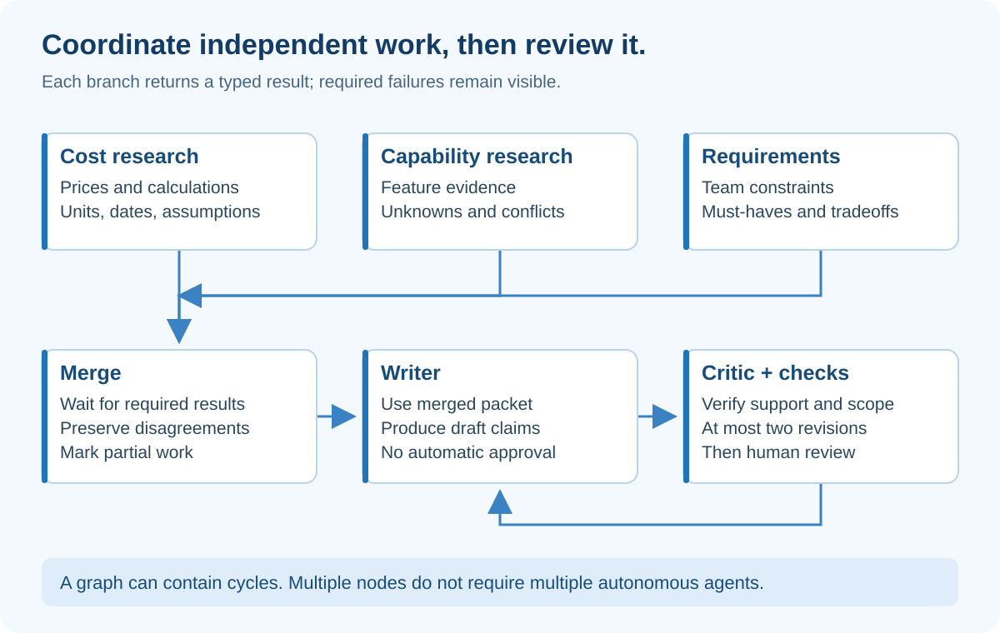

# 5. Graph Engineering — Coordinate Work without Losing Control

## At a glance

A graph describes tasks and their connections. A node is a unit of work. An edge says what can happen next or what must finish first. Graph engineering makes coordination explicit.

EvidenceDesk uses three research branches: cost, capabilities and requirements. Their results meet at a merge step before a writer and critic work on the brief.

## What the diagram teaches

The branches share one authorized source snapshot but produce separate result fields. Cost analysis should not overwrite capability analysis. The merge step waits for the required branch outcomes and preserves disagreements.

Parallel arrows mean tasks may overlap, not that they magically become faster or independent. Provider rate limits, shared budgets and database contention can erase the expected speedup.

The revision arrow makes this a graph with a cycle. It is not a directed acyclic graph once that arrow exists. A tree is another special kind of graph, not a synonym for every agent workflow.

## Design each node as a contract

The cost node accepts pricing evidence and seat count. It returns a calculated subscription amount, units, currency, source IDs and unknowns.

The capabilities node accepts feature evidence and requested capabilities. It returns supported, unsupported or unknown assessments. “Unsupported” requires evidence of absence or a rule defining that result; a missing passage generally means unknown.

The requirements node accepts the team's requirements. It returns the must-have constraints and tradeoffs, not a new set of invented preferences.

The merge node accepts all three typed results. It records missing branches and contradictions. The writer receives this merged packet, not an uncontrolled concatenation of every worker's conversation.

## What happens when one branch fails?

Suppose cost and requirements finish, but capability retrieval times out. You have to choose a policy before deployment.

For our first version, a required branch failure prevents an apparently complete recommendation. The application may show a partial draft clearly labeled incomplete, but cannot send it to approval as if all requirements were assessed.

An optional branch, such as illustrative examples, can be skipped with an explicit note. Required versus optional belongs in graph configuration, not in a model's improvised judgment.

A **join** is the point where branches reconverge. It should receive success, unknown or error for every required branch. Waiting only for successful outputs can hang forever if one branch failed and no terminal result was recorded.

## Why a critic is useful but not magical

Give the critic the user's question, merged evidence, candidate draft and review rubric. Do not give it the writer's persuasive self-justification as if it were evidence.

Ask it to identify unsupported claims, inconsistent numbers, missing requirements and overconfident recommendations. Its output should name the issue and the affected claim, not merely say “looks good.”

A separate model call can reduce some context contamination, but does not guarantee independent judgment. Two calls can share the same blind spots. Deterministic validators and human review remain necessary.

Cap revisions at two. If the critic and writer keep disagreeing, preserve the disagreement and ask a reviewer rather than forcing consensus.

## Multi-node does not mean multi-agent

A calculator node is ordinary Python. A retrieval node can be ordinary Python. A writer node calls a model. You might have a graph with only one model-driven node.

Likewise, several specialized prompts running in one process do not require A2A. Use an agent-to-agent protocol when independently operated services genuinely need a common task interface. For a single-repository beginner project, typed function calls are easier to inspect.

[LangGraph's workflows and agents guide](https://docs.langchain.com/oss/python/langgraph/workflows-agents) describes patterns such as parallelization and routing. In this course, start with explicit Python functions; adopt a graph framework only after you can explain the dependencies it will manage.

## Concurrency needs ownership rules

Have each branch return a distinct result rather than mutate the same dictionary at arbitrary moments. The orchestrator combines them after completion. If using persisted shared state, define reducers or transactional updates deliberately.

A reducer is a rule for combining updates. “Append unique evidence IDs” is a reasonable reducer. “Last writer wins” is dangerous for a list of unresolved failures because the last result could erase earlier problems.

Tag events with node names and attempt numbers. Otherwise overlapping logs are difficult to reconstruct. Keep one run-level cancellation flag, and ensure branches observe it before starting new work.

## Build assignment

First write a sequential version: cost, capabilities, requirements, merge. Test its result. Then run the independent research functions concurrently and compare the final merged output.

Inject a failure into the capabilities branch. Confirm the join returns an explicit incomplete result instead of hanging or approving. Add a test where two branches disagree about a feature. The merge must preserve the conflict.

Only after these pass should you add the writer-critic revision cycle. The loop's budget from the previous chapter still applies to every graph iteration.

## Check your understanding

**Question:** Is running three agents always better than one?

**Answer:** No. It adds cost, coordination and failure modes. Parallel tasks help when the work is genuinely separable and the combined result is measurably better or faster. Measure that tradeoff.

## How to present it

Highlight the three branch outputs in the UI, then show their merge. Break one branch and demonstrate the incomplete state. Explain why the writer cannot start with a falsely complete packet. This makes the graph visible as an engineering decision rather than decorative boxes.
