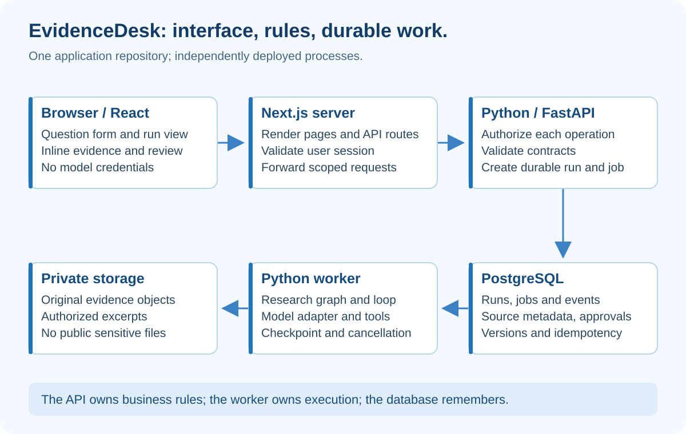

# EvidenceDesk Architecture — Next.js in Front, Python Behind

## At a glance

Build one application repository with three deployable processes: a Next.js frontend, a Python FastAPI API, and a Python worker. Store durable application state in PostgreSQL and original evidence in private object storage.

This is a proposed capstone architecture, not infrastructure provisioned by this course. Start locally with fixtures. Add services only at the corresponding build stage.

## What the diagram teaches



The browser is the reading and review desk. Next.js renders the interface and provides a same-origin server boundary. FastAPI owns the business rules. The worker executes long-running research. The database remembers what happened.

A web request should not remain open while three researchers, a writer and a critic finish. The API creates a job and returns its identifier. The UI asks for that job's state. Closing the tab must not erase the run.

The separate worker is important because an HTTP request's lifetime is not a durable job scheduler. FastAPI's own documentation distinguishes lightweight background tasks from heavier work that may need separate processes or a task queue. See [FastAPI background-task guidance](https://fastapi.tiangolo.com/tutorial/background-tasks/).

## One repository, separate deployment units

Keep the capstone outside this learning-library repository when you implement it as a portfolio product. For example, image-course remains the publishing repository; evidence-desk becomes the application repository. This avoids deploying experimental backend code as part of a document-site change.

Within evidence-desk, use a monorepo: one Git repository containing frontend and backend folders. One pull request can change an API schema and its UI consumer together. Separate deployments do not require separate repositories.

```text
evidence-desk/
  README.md
  .gitignore
  .env.example
  apps/
    web/
      package.json
      package-lock.json
      app/
        layout.tsx
        page.tsx
        runs/[id]/page.tsx
        api/runs/route.ts
        api/runs/[id]/route.ts
        api/runs/[id]/approve/route.ts
        api/runs/[id]/cancel/route.ts
      components/
        BriefForm.tsx
        RunView.tsx
        EvidencePanel.tsx
        ReviewPanel.tsx
      lib/
        api.server.ts
        contracts.ts
  services/
    backend/
      pyproject.toml
      dependency-lock-file
      src/evidence_desk/
        api.py
        auth.py
        schemas.py
        repository.py
        sources.py
        context.py
        prompts/brief-v1.txt
        model.py
        tools.py
        policy.py
        graph.py
        loop.py
        worker.py
        evaluation.py
      migrations/
      tests/
        test_context.py
        test_policy.py
        test_loop.py
        test_graph.py
        test_api.py
        test_approval.py
  fixtures/
    sources.json
    cases.json
  contracts/
    openapi.json
  infra/
    compose.yaml
    Dockerfile.api
    Dockerfile.worker
  docs/
    decisions/
    runbook.md
  .github/workflows/
    checks.yml
    release.yml
```

“dependency-lock-file” means the lockfile created by your selected Python package tool; choose one tool and use its real filename. Do not literally invent that file and expect a package manager to read it. Pin the tested frontend and backend dependency versions at project creation.

## Follow the calls

A user fills BriefForm. The client submits JSON to the Next.js runs route. That route verifies the session, protects the request as appropriate, and forwards a scoped identity to FastAPI. FastAPI independently validates the identity and workspace membership; a plain user-controlled header is not a trust mechanism.

FastAPI validates the question, creates a run and a durable job in one transaction, and returns HTTP 202 with run_id. A transaction means both writes succeed together or neither does.

The worker claims a job with a lease, loads the authorized source snapshot, runs the graph, saves the draft and records needs_review. A lease has an expiry and heartbeat so another worker can recover abandoned work. A database constraint and state version guard against duplicate execution effects.

RunView polls the same-origin status route with a modest interval and stops when the run is terminal or the component unmounts. Later you can add server-sent events. Polling is easier to debug first.

The reviewer approves a particular draft_version. The backend verifies role, state, source access and version. It records the approval atomically. If the draft changed, respond with a conflict rather than approving the new content silently.

## API contracts

| Endpoint in the Python API | Input | Result and important rule |
|---|---|---|
| POST /runs | question, source_set_id; idempotency key header | 202 run_id; server derives workspace |
| GET /runs/{id} | authenticated request | State, draft, sanitized events; owner or permitted reviewer only |
| POST /runs/{id}/cancel | expected_version | Cancellation recorded; worker checks before further work |
| POST /runs/{id}/approve | draft_version, expected_version | Approval only for eligible role and unchanged draft |
| GET /sources/{id}/excerpt | authenticated request | Authorized excerpt, never arbitrary filesystem path |

Use 401 for missing/invalid authentication and 403 for denied operations where disclosing existence is acceptable. For protected resource lookups, consistently return 404 when policy requires hiding existence. Return 409 for version conflicts and 422 for invalid structured input. Do not send raw stack traces to browsers.

A useful run response includes state, state_version, draft_version, unknowns, issues and allowed_actions. The backend calculates allowed_actions; the frontend displays them. Always recheck authorization when an action arrives.

## Data ownership

Store users/workspace membership, sources, runs, node_results, events and approvals in PostgreSQL. Every relevant row carries workspace_id. Queries must enforce scope; consider database-level row policies as defense in depth.

Store source objects privately. Public frontend URLs must not grant anonymous access to internal evidence. If signed URLs are used, make them short-lived and scoped to the authorized object.

Model credentials belong only in backend secret configuration. Never put them in NEXT_PUBLIC variables. The browser receives a safe view of the result, not backend credentials or raw traces.

Next.js Server Components are appropriate for initial rendering; Client Components handle form state, polling and interactive evidence panels. Keep privileged access in server-side modules. See [Next.js server and client component guidance](https://nextjs.org/docs/app/getting-started/server-and-client-components).

## Where each engineering layer lives

| Layer | Main code | Visible proof |
|---|---|---|
| Prompt | prompts/brief-v1.txt, schemas.py | Versioned assignment and checked draft |
| Context | sources.py, context.py | Authorized excerpts and exclusion reasons |
| Harness | tools.py, policy.py, repository.py | Denied actions and event trail |
| Loop | loop.py, worker.py | Bounded retries, cancellation, recovery |
| Graph | graph.py | Branch outcomes, join and review cycle |

The boundaries are conceptual. You do not need five services. Keep functions small enough to test while allowing one backend process to own multiple responsibilities.

## Technology legend

**React** builds interactive interface components. **Next.js** provides routing and frontend/server rendering. **TypeScript** helps check frontend data shapes during development. **FastAPI** exposes Python HTTP endpoints. **Pydantic** validates structured Python inputs and outputs.

**PostgreSQL** stores durable records. **Object storage** stores source files. A **worker** processes jobs outside the request path. A **queue** is a way to deliver pending work; the first durable version can use a carefully designed PostgreSQL job table instead of adding another service.

**LangGraph** is optional orchestration infrastructure, not required for understanding graphs. **pytest** runs backend tests. **Playwright** can test browser behavior. **OpenAPI** describes the API contract. **GitHub Actions** runs automated checks. **Vercel** hosts the Next.js frontend. A separate container-capable host runs the Python API and worker.

**MCP** can later expose search_sources as a protocol tool. **A2A** can later connect an independently hosted specialist. Neither replaces authentication, business rules or testing.

## Deployment and trust boundaries


Keep staging and production databases, source buckets and credentials separate. A preview branch must never write to production evidence or approvals.

Deploy the frontend to Vercel. Deploy the Python API and worker to a container platform that supports their runtime and networking needs. Choose the provider after checking current pricing and requirements; this course does not assume free always-on workers.

Do not move durable worker state into the frontend's local filesystem. Do not assume a Vercel deployment creates your Python database, queue or worker automatically.

## How to present it

Trace one click from the form to a persisted run and back to the review screen. Then close the browser and reopen the run. Explain which service kept working and which database record made the result recoverable.
