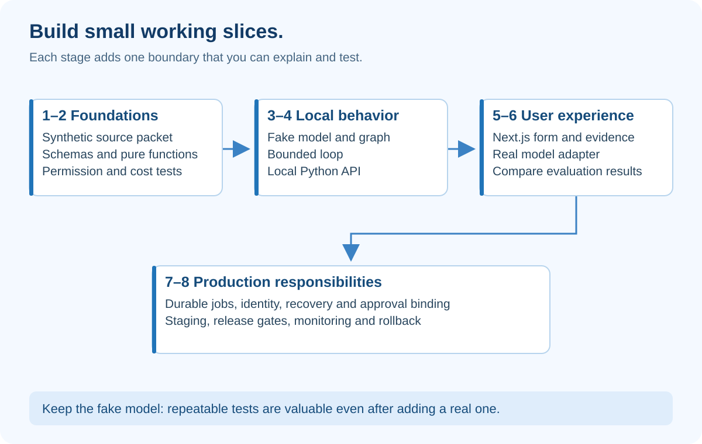

# Build EvidenceDesk Manually — File by File, in Small Working Slices

## At a glance

This workbook takes you from an empty application folder to a production-ready design through eight build stages. It specifies what to create, what each function owns, and what to test before continuing.

It is a construction guide, not a claim that every application file has been generated. The companion Python practice lab is runnable now; the full Next.js/Python capstone is the project you will build.

## What the diagram teaches



Each stage ends with visible behavior. You should never have twenty unexplained files and no working result. First make the data and rules understandable. Then add transport, interface, a model and durable execution.

Avoid adding a model, vector database, graph framework and deployment in the same step. When something fails, you need to know which new boundary introduced the problem.

## Stage 1 — Create the workspace and synthetic facts

Create a new evidence-desk repository, not a nested Git repository inside image-course. Create apps/web, services/backend, fixtures and docs. Add a README explaining the fictional scenario and an .env.example containing variable names with empty placeholders.

From the application root, create a Python virtual environment:

```powershell
py -m venv services/backend/.venv
services/backend/.venv/Scripts/python.exe -m pip install fastapi uvicorn pydantic pytest httpx
```

These are starting installation commands, not a reproducible production lock. Record tested versions using your chosen dependency manager before the first shared release. Exclude .venv, real .env files, caches and credentials from Git.

Create fixtures/sources.json with these synthetic facts:

| ID | Audience | Fact |
|---|---|---|
| P1 | Northstar | Old Cedar price: USD 15 per seat/month; superseded |
| P2 | Northstar | Current Cedar price: USD 20 per seat/month |
| F1 | Northstar | Cedar supports SSO; export capability not stated |
| R1 | Northstar | Twelve seats; SSO and export required for adoption |
| X1 | Finance only | Restricted negotiated quote; never use in Northstar runs |

Add an adversarial fixture containing an instruction to ignore rules. Label it untrusted evidence. Do not use real company documents.

**Gate:** You can explain why P2 is relevant, why P1 is stale, why X1 is forbidden, and why F1 does not prove export support.

## Stage 2 — Write schemas and pure functions

Create src/evidence_desk/schemas.py with Source, Claim, Draft and RunState models. A pure function depends only on its inputs and returns a result without hidden network or database changes.

Create context.py. Write filter_authorized() before rank_sources(). Write select_current() using explicit version metadata, not filenames containing “new.” Write assemble_packet() to preserve IDs and excerpts.

Create tools.py with calculate_subscription(). Use Decimal, reject invalid seats and negative prices, and return currency plus assumptions. A correct multiplication with mixed currencies is still an invalid comparison.

Create evaluation.py with validate_references() and validate_cost_claim(). Keep semantic review separate rather than pretending ID existence proves factual support.

**Gate:** Tests reject X1, unknown citation IDs and invalid prices. The annual base cost is USD 2,880 for the twelve-seat fixture. Missing export evidence produces unknown.

## Stage 3 — Introduce a model boundary without a real model

Create model.py with a small interface: generate_draft(packet, prompt_version) returns a Draft candidate. Implement FakeModel using predetermined outputs.

Create prompts/brief-v1.txt from the prompt lesson. Create policy.py to define allowed tools and states. Create loop.py with should_continue() and next_action(). Inject the clock and model rather than reading global values everywhere.

Create graph.py with cost, capabilities, requirements, merge, write and review functions. Begin sequentially. Only parallelize the independent research nodes after the sequential result is tested.

**Gate:** One good fake output reaches needs_review. One unsupported output is revised within limits or exhausted. No output is automatically approved.

## Stage 4 — Expose a minimal Python API

Create api.py with a FastAPI application and a health endpoint. Run it from services/backend using the virtual environment:

```powershell
.venv/Scripts/python.exe -m uvicorn evidence_desk.api:app --app-dir src --reload --port 8000
```

Create POST /runs and GET /runs/{id}. For this local learning stage only, use in-memory storage and a fixed synthetic user. Bind development services to localhost. Clearly label this mode insecure for public use.

Separate request validation from orchestration. The route should call an application function rather than contain all the graph logic. Return a typed error when the source set is unknown.

Do not promise durable HTTP 202 processing yet. Either run the tiny fake operation synchronously in this local stage or explicitly document that an in-memory job disappears on restart. Durable job creation comes in stage seven.

**Gate:** A request returns the fake brief; invalid input returns a useful validation error. Restarting demonstrates the temporary storage limitation rather than concealing it.

## Stage 5 — Build the Next.js/React interface

Scaffold apps/web with the App Router, TypeScript and your preferred styling setup. Use a currently supported release, inspect the generated files and commit the lockfile. Do not change this learning site's framework version as part of building the capstone.

Start with app/page.tsx containing a title and BriefForm. Make BriefForm a Client Component because it handles user input and submission. Keep backend configuration in lib/api.server.ts, never in client imports.

Add app/api/runs/route.ts to validate and forward requests to the Python service. During the localhost-only stage, the fixed user is a teaching shortcut. Replace it with real session validation before any public deployment.

Create RunView for state, EvidencePanel for inline excerpts and ReviewPanel for explicit approval actions. Use loading, empty, denied, failed, cancelled and needs_review presentations. A spinner alone cannot explain all these states.

For a Next.js dynamic page, await asynchronous route parameters where required by the installed version. Render only authorized data; keeping a component server-side does not automatically authorize the user.

**Gate:** Submit through the browser, inspect evidence without leaving the page, and display a failure clearly. Keyboard navigation must reach every control. Do not add learner progress bars; run state is operational information, not course completion tracking.

## Stage 6 — Replace the fake with a real model adapter

Keep FakeModel for tests. Add a provider adapter behind the same interface. Load its credential from backend-only configuration. Set output limits and timeouts. Record model and prompt versions.

Validate the provider response. An invalid or unsupported answer becomes a structured issue; do not let the UI render it as approved. Do not retry authentication errors as if they were transient model failures.

Use the fixed evidence packet first. Later add retrieval ranking and compare results against the same fixture questions. Introduce embeddings only when keyword search misses meaningful cases.

**Gate:** Run the fixed evaluation set with both the fake and real adapter. Record actual outcomes, model identity and date. The fake's deterministic tests are not evidence of real-model factual accuracy.

## Stage 7 — Add durable state, identity and recovery

Create repository.py and database migrations. Add runs, node_results, events, approvals and jobs tables. Use unique constraints for idempotency and optimistic version checks for state changes.

Create auth.py to validate the selected identity provider's signed credentials, issuer, audience and expiry. Derive workspace membership server-side. Configure the Next.js-to-Python trust boundary explicitly.

Create worker.py to lease jobs, heartbeat, checkpoint and stop on cancellation. Run the API and worker as separate processes. Use a durable job table initially; add a message broker only when your operational needs justify it.

Persist job creation and the run in one transaction. If you later publish events to an external queue, use an outbox pattern: write the intended event to the database transaction, then deliver it separately with retries and deduplication.

**Gate:** Kill the worker after saving a draft but before acknowledging the job. Restart it. The run recovers without duplicate publication. Attempt another workspace's run URL and confirm access is denied.

## Stage 8 — Make release an explicit decision

Add tests, staging configuration, migrations and deployment instructions. Follow the next chapter's release gates. Create a small demonstration packet with no real private data.

The first production release should omit optional external actions. Let users review an internal brief before adding email delivery, public links, MCP adapters or independent agents.

**Gate:** A staging browser flow, permission test, worker restart test and rollback rehearsal all pass. A human reviews the evidence and approves the release.

## Function-by-function teaching order

| Function | Explain before coding |
|---|---|
| filter_authorized | Which identity is trusted, and which records must never leave storage? |
| assemble_packet | What does the model actually receive? |
| calculate_subscription | What are the units and assumptions? |
| generate_draft | Which part is uncertain model output? |
| validate_references | What can code prove, and what can it not prove? |
| execute_tool | Who grants authority? |
| should_continue | What prevents endless work? |
| merge_results | What if one required branch is missing? |
| approve_draft | Which exact version did the reviewer authorize? |

## When you get stuck

Reduce the problem to one boundary. If the browser fails, call the local API directly. If the API fails, call the application function in a test. If the model output fails, replace it with a fixture. If the worker fails, inspect the persisted state and event sequence.

This method is not avoiding the real problem. It identifies the smallest place where the expected behavior stops being true.

## How to present it

Show the commit history as a sequence of working slices. Explain one test you wrote before a feature and one design you changed after a failure. That demonstrates that you understand the project rather than merely having generated its files.
