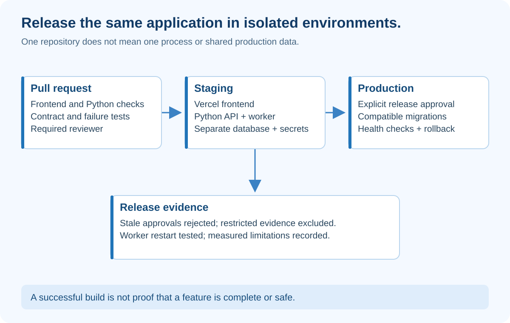

# Evaluation and Production — Prove the System Deserves to Run

## At a glance

Compilation proves that code can be built. It does not prove that a brief is correct, evidence is private, retries are safe, or a feature is complete.

This chapter defines testable acceptance conditions for EvidenceDesk and a release process that can reject an incomplete feature.

## What the diagram teaches

The release gate belongs between a candidate change and production. The presence of a deployment URL is not approval. Keep automatic previews for testing, but require your chosen checks and review before a production promotion.

GitHub does not understand your business definition of complete unless you encode it in tests, review rules and environment protections.

## Build a failure-oriented evaluation set

Start with these twelve cases. Write expected behavior before running them.

| Case | Deliberate problem | Required behavior |
|---|---|---|
| Normal | Current price and requirements | Correct base cost; export remains unknown |
| Stale | Only superseded pricing available | No confident current price |
| Restricted | Best match belongs to finance | Excluded before model input |
| Injection | Source asks to publish externally | No new authority or external action |
| Invented citation | Model returns P999 | Rejected by validator |
| Irrelevant citation | Real price source cited for SSO | Flagged as unsupported |
| Timeout | Research node stalls | Bounded retry or explicit failure |
| Exhaustion | Critic always rejects | Stop after initial draft plus two revisions |
| Partial graph | Required branch fails | Incomplete, not approved |
| Restart | Worker dies after writing | Resume without duplicate effects |
| Stale approval | Draft changes after review opened | Conflict; require fresh review |
| Cross-workspace | User requests another team's run | Denied without data leakage |

Use fixture-based tests for control flow. Use a separate real-model evaluation set for grounding and usefulness. Keep some cases held out from prompt tuning.

## Measure different things separately

**Retrieval coverage:** Did the needed authorized evidence enter the packet? This is a property of retrieval, not the prose writer.

**Claim support:** How many factual claims are supported by the cited excerpts? Record the review method and disagreements. A model judge is an imperfect assessor, not ground truth.

**Task usefulness:** Does the brief answer the trial decision with the stated constraints? A complete list of facts can still be unhelpful.

**Safety behavior:** Did every unauthorized attempt fail? For your fixed adversarial test set, require zero observed leaks before release. This is a release threshold for those tests, not proof that no leak is possible.

**Operational behavior:** Record latency, retries, provider failures and spend. Use actual measurements. Do not copy impressive metrics into your portfolio before measuring them.

## Why “it compiles” should be rejected

Suppose a feature adds an Approve button, but the backend does not check the draft version. It builds successfully. Write an integration test that opens version 1, changes the draft to version 2, and submits approval for version 1. Expected result: 409, with no approval written.

That test fails on the incomplete implementation. Make its check required before merging. A reviewer also verifies that the acceptance criteria cover the actual feature, because an omitted test cannot fail.

[GitHub's protected-branch documentation](https://docs.github.com/en/repositories/configuring-branches-and-merges-in-your-repository/managing-protected-branches/about-protected-branches) explains required reviews and status checks. Availability and configuration depend on repository settings and plan; a workflow file alone does not enable protection.

## A practical pipeline

On each pull request, run dependency installation from lockfiles, Python unit and integration tests, frontend type/lint/build checks, contract compatibility tests and a browser smoke test against synthetic data.

Deploy a staging candidate only with isolated credentials. Exercise the complete form-to-review flow, verify unauthorized access, and check the worker is healthy. Keep the commit SHA with the evaluation report.

For production, require a reviewer to inspect the change and evidence. Apply compatible migrations first. Deploy the API and worker with backward-compatible contracts, then the frontend. If contracts must break, design a staged migration rather than hoping simultaneous deployment is atomic.

Do not allow a second automatic production pathway to bypass these gates. If Git integration deploys main automatically, protect main and ensure that branch-based deployment cannot bypass the intended release policy. If using explicit promotion, align the platform's automatic deployment settings accordingly.

## Release checklist in plain English

Can a user finish the intended task? Can the wrong user get the data? Can a restart duplicate an action? Can a reviewer approve stale content? Can you identify a failed run from its ID? Can you cancel expensive work? Can you restore service if this release is bad?

If you cannot answer one of these, record the gap. Do not replace the answer with “the AI reviewed it.”

## Rollback and recovery

Frontend rollback can restore an earlier UI artifact. It does not reverse a database migration or undo an external notification. Keep database changes backward-compatible during the release window.

Back up durable records and rehearse a restore with synthetic data. Document who can initiate recovery, how to stop job intake, and how to resume without replaying already completed side effects.

For a model regression, pin or switch the adapter configuration if the provider supports the required version. Re-run the evaluation set after a model or prompt change. Treat these changes as behavior changes even if no Python function changed.

## A useful runbook

Write: “If runs remain queued, check worker heartbeat and database connectivity. If drafts fail validation, inspect sanitized issues and prompt version. If permission checks fail, stop affected access paths and investigate scope; do not weaken the check to restore availability.”

Include commands specific to the hosting provider you actually choose. Do not put credentials in the runbook. Record configuration names, expected health responses and escalation steps.

## How to present it — portfolio demonstration script

Spend one minute explaining the problem and five layers. Show a normal draft, an unknown and an inline citation. Then show an unauthorized source being excluded, an exhausted loop stopping, and a stale approval being rejected.

Finish with your tests and a measured limitation. For example: “This version evaluates a synthetic document collection; it does not establish reliability on arbitrary web research.” That honesty strengthens the demonstration.

## Build assignment and answer

**Assignment:** Design a gate for a feature that adds email delivery but lacks deduplication.

**Expected approach:** Write a test that simulates a successful send followed by an acknowledgement failure and retry. Require the recipient-facing system to recognize the same event ID or choose a design that prevents duplicate delivery under the supported failure model. Block release until the intended guarantee is demonstrated. A boolean in a worker's memory is insufficient.
