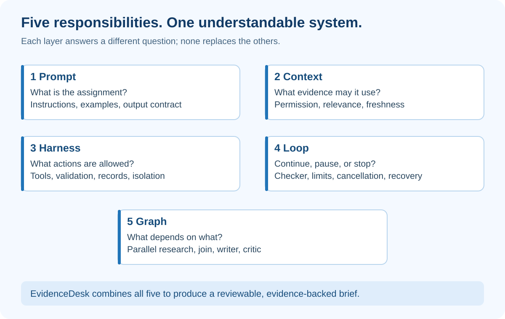

# Practice Lab — Trace All Five Layers without an AI Account

## At a glance

This offline Python exercise demonstrates the control flow with a fake writer and synthetic prices. It uses only Python's standard library, makes no network calls, and needs no API key.

The executable source is included in the course's repository under `docs/case-studies/evidence-desk/lab/engineering_lab.py`. The website article explains the experiment; it is not a hosted Python runtime.

> **Important limit:** This lab does not implement production authentication, durable jobs, real model calls, semantic citation verification or concurrent graph execution. Its workspace argument is a trusted test input, not a secure identity mechanism.

## What the diagram teaches



The prompt constant describes the assignment. The context function selects a current, allowed source. The tool function restricts operations and computes cost. The run function bounds repetition. The research function demonstrates separate branch outputs joined into one packet.

Because the writer is fake, the exercise tests your application rules, not a model's instruction-following ability. This is useful: you can deliberately produce a bad output and observe the same result every time.

## Run it

From the learning-library repository root:

```powershell
py docs/case-studies/evidence-desk/lab/engineering_lab.py
```

The script runs eleven tests. Expected result: all tests pass. It writes no application data and does not start a server.

For an interactive experiment, change into the lab folder and open Python:

```powershell
cd docs/case-studies/evidence-desk/lab
py
```

Then enter:

```python
from engineering_lab import run
state, draft, events = run()
print(state)
print(draft)
print(events)
```

The state is needs_review. The draft contains a base annual cost of Decimal('2880') and an unknown export capability. One event records the first successful check. It never returns approved.

## Read the functions in this order

**context(workspace):** Filters the three source records. Northstar sees current P2, not superseded P1 or finance-only X1. In production the backend must derive workspace from authenticated membership instead of trusting this argument.

**tool(name, seats, source):** Allows only the calculator. Rejects invalid seats and negative prices. It assumes the source has already passed the context boundary. This makes the teaching dependency explicit; a real tool gateway would revalidate the authorized resource reference.

**research(packet):** Creates cost, capabilities and requirements results, then merges them. It runs sequentially so you can follow it easily. Export is deliberately unknown. An empty packet returns no research; conflicting price candidates are rejected.

**fake_writer(merged, bad):** Produces either a valid source ID or the deliberately invented P999. It is not an LLM and does not actually interpret the prompt string.

**check(draft, merged):** Checks the fixture's source identifier, exact cost and unknown export field. It is intentionally narrow. It cannot judge arbitrary prose support.

**run(...):** Handles cancellation before work, missing evidence, and at most three draft attempts. It records each check result. Real deadlines, in-flight cancellation and durable recovery belong to later build stages.

## Experiment 1 — An invalid citation

```python
state, draft, events = run(always_bad=True)
print(state, len(events))
```

Expected: exhausted and 3. The fake writer keeps returning P999. The checker never accepts it. The loop stops rather than repeating forever.

Explain the count: one initial draft plus two revisions equals three attempts. This is a common place for an off-by-one error.

## Experiment 2 — No evidence

```python
print(run(workspace="unknown"))
```

Expected: needs_evidence, no draft, and no model-attempt events. A missing packet is not a reason to fabricate a comparison.

Changing the workspace argument to finance is **not** an authorization test. This local function has no authenticated user. A production authorization test must attempt that change through the API and verify that the server rejects an unauthorized workspace.

## Experiment 3 — A forbidden action

```python
from engineering_lab import tool, SOURCES
tool("publish_report", 12, SOURCES[1])
```

Expected: PermissionError. The runtime rejects the action without asking the fake writer whether it feels authorized.

## Experiment 4 — Cancellation

```python
print(run(cancelled=True))
```

Expected: cancelled, no draft, and no events. This tests cancellation before execution only. Do not claim it demonstrates interrupting a running network request.

## Extend it yourself

Add a fake clock and a deadline test. Add a typed branch failure and verify the merge refuses a complete recommendation. Add a repository interface with an in-memory implementation, then replace it with durable storage. Write a restart test only after state can actually survive process termination.

Finally replace the fake writer with a provider adapter while keeping the fake for tests. Compare real-model outputs against the same acceptance conditions.

## What the eleven tests prove

They verify current-source selection, arithmetic, denied tools, invalid inputs, the review boundary, bounded failure, initial cancellation, missing evidence, conflicting sources and false-cost rejection for the fixture.

They do not establish production security or arbitrary research accuracy. A useful test suite tells you exactly which promises it checks.

## How to present it

Run the passing tests, then demonstrate always_bad=True. Explain why a failed generation can still produce correct application behavior: the system refuses to call an unsupported draft successful.
