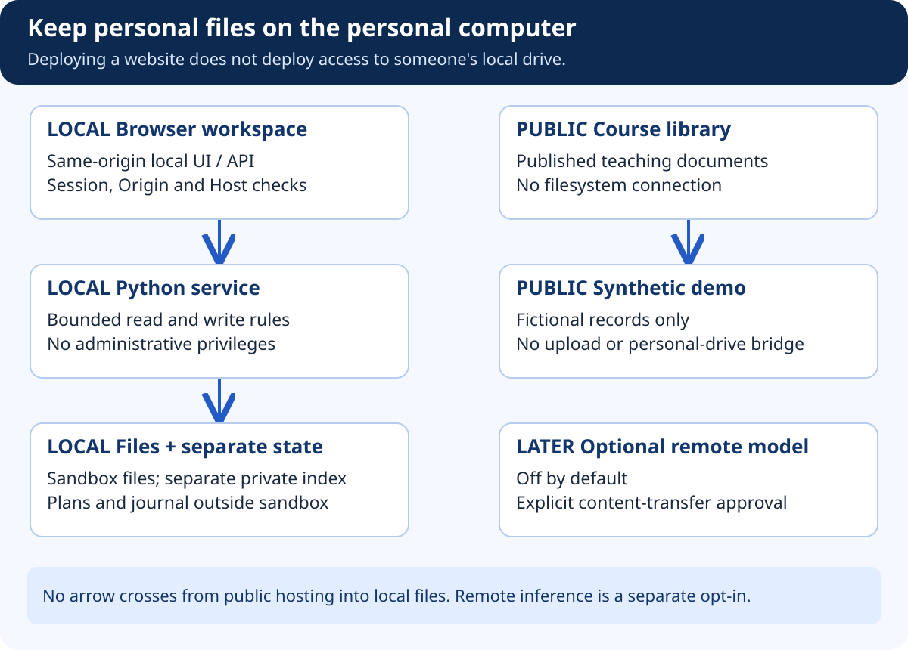

# FilePilot — Repositories, Runtime Data, and Deployment

## At a glance

Keep teaching materials in the existing learning-library repository. Implement FilePilot later in its own sibling application repository. The five projects are modules within that repository, not five nested Git repositories. Personal runtime data belongs outside both repositories.

## What the diagram teaches



There are three different things to ship: explanations, a synthetic demonstration, and software that actually works on a computer. Treating them as one deployment creates confusion about permissions and privacy.

This document collection can be publicly hosted because it contains fictional examples and architecture. A synthetic demonstration can be hosted because it uses intentionally public fixture data. A local application needs installation, local storage, local permissions, and an update mechanism. Hosting the first two does not install the third.

## Proposed top-level organization

```text
workspace-parent/
  image-course/                   Existing teaching-library repository
    docs/case-studies/filepilot/
      collection.json
      00-START-HERE.md / .html
      ...                         Strategy and architecture guides
      manual-build/               Sequential workbooks
      assets/                     Original SVG diagrams
  filepilot-platform/             Future Python/hybrid repository
  filepilot-platform-ts/          Optional later counterpart

local-application-data/            Outside every Git repository
  filepilot/
    state.sqlite
    private-logs/
    settings/

disposable-test-area/              Explicitly created for experiments
  filepilot-sandbox/
```

These application directories are proposed locations, not directories created by this documentation task. The managed sandbox must not contain the program's journal, credentials, or source checkout. Otherwise its own cleanup actions can damage the state needed for recovery.

## Repository and deployment matrix

| Asset | Git repository | Runtime / deployment |
|---|---|---|
| This guide collection | Existing learning library | Static content generated by the website build |
| Python modules and local workspace | Future `filepilot-platform` | Local computer; separate installation |
| Synthetic fixture definitions | Application repository | Test runner and explicitly labelled demo |
| Personal files and extracted content | Never commit | Selected local root and protected index |
| Root grants, approvals, journal | Never commit | Private application-data directory |
| TypeScript alternative | Separate future repository | Its own isolated local state and sandbox |

Ignore virtual environments, build outputs, private state, logs, local settings, and user-selected files. A `.gitignore` is not a security control for already tracked files; review staged changes and scan for secrets before release.

## Development and release environments

Development uses a fresh disposable fixture tree. Continuous integration runs pure contract tests and synthetic protocol tests. Windows-specific filesystem tests require Windows runners and must be reported separately from portable tests. A Linux CI pass cannot establish Windows junction or locked-file behavior.

The local release should run without administrator privileges. Package dependencies reproducibly, record supported Python/Node and operating-system versions, verify update artifacts, and document uninstall behavior. Uninstalling should not silently remove managed user files. Decide separately how a user can export or remove private index and journal data.

A public preview must have no real root grants, no arbitrary upload endpoint, and no connection to a developer's local service. Make the “simulation” label visible on every operational screen. If authentication is added, protect the backend; hiding a button is not sufficient.

## Release gates

Before publishing teaching updates, rebuild the content library, verify links and image flattening, and inspect the reader. Before shipping the future local application, run the safety matrix, crash-recovery tests, privacy checks, and a fresh-machine installation test. These are different release gates for different artifacts.

Keep a versioned schema for the local database. Test migrations against copied synthetic state and define recovery if migration fails. A backup of the journal can help reconstruct history, but it does not contain copies of every managed file. File backups remain a separate responsibility.

## What “production” means here

For the first milestone, production means a reproducible synthetic demonstration and a restricted local sandbox tool. It does not mean certified safety for arbitrary personal drives or unattended operation. Expanding to real folders requires review of OS-level race resistance, link handling, metadata preservation, parser isolation, and privacy behavior.

## How to present it

Draw three labels: “public teaching,” “public simulation,” and “private local tool.” Place each executable and dataset under exactly one label. If you cannot explain where a file's contents travel, the deployment is not ready.
