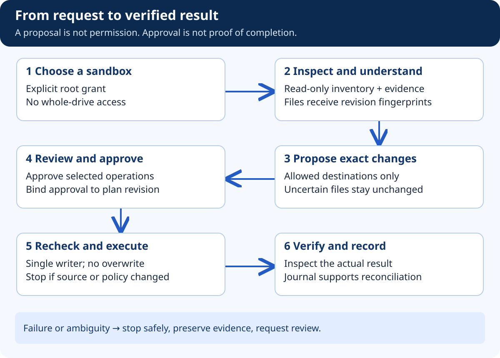

# Build FilePilot — Private Document Search with RAG

## At a glance

Start with local text and Markdown. Build keyword retrieval before embeddings, and answer from quoted evidence before adding generated summaries. Every chunk must retain the source file ID, document revision, root ID, and extraction version.

## What the diagram teaches



Maya asks which note explains retrieval permissions. The finder retrieves a passage from a permitted note and identifies its source. That is already useful without a language model. A generated answer should add explanation, not hide the evidence or invent a source.

Now Maya edits that note or revokes its root grant. Old chunks still sitting in an index must not remain eligible. Permission and freshness checks belong on the retrieval path and again before returning material to a caller. Deleting an index eventually is not enough if revoked data is still being quoted in the meantime.

## 1. Build the files

Create `extraction.py` with `extract_text(file_record)` and `split_passages(text)`. The extractor accepts only supported regular files, validates current root access, imposes size and time limits, and returns text plus a revision fingerprint. It does not execute macros, scripts, or instructions found in the content.

Create `retrieval.py` with `index_file`, `search_evidence`, and `invalidate_file`. Begin with a simple local lexical index. Add a storage migration for document revisions and chunks. Keep the index outside the managed sandbox so organizing the sandbox cannot move or index the application's own database.

Create `tests/unit/test_chunking.py` and `tests/integration/test_retrieval_permissions.py`. Use synthetic canary phrases that make accidental disclosure easy to detect.

## 2. Define the evidence object

```json
{
  "file_id": "F-003",
  "root_id": "ROOT-DEMO",
  "revision": "fixture-revision-a",
  "chunk_id": "F-003:fixture-revision-a:2",
  "excerpt": "Only authorized document passages should enter the answer.",
  "source_label": "Hospital study notes",
  "locator": {"kind": "line_range", "start": 8, "end": 10}
}
```

This object is illustrative. A real revision value comes from the source observation, not a constant. A line locator applies to this text fixture; PDF page references require a different locator type. Keep the original excerpt for evidence while treating the label as presentation, not identity.

## 3. Trace an authorized query

Resolve the caller's current grants. Restrict the candidate corpus to those grants before ranking and sending any content to a model. Retrieve candidate passages, recheck their current source revisions, then construct the answer context. If a candidate has changed, omit it and schedule reindexing or return an explicit freshness warning.

Before returning the answer, ensure its evidence references still belong to the permitted request context. Cache entries must be scoped by principal, grant version, source revisions, and query settings. Do not reuse one user's cached answer for another user simply because the question matches.

## 4. Add semantic retrieval only when useful

Embeddings can help with paraphrases, but they are also derived private data. Keep them local by default and document how they are removed when a root is revoked. Select and pin an embedding model after checking its license, resource requirements, and local execution behavior.

Remote embedding and answer services require a separate explicit content-transfer decision. “Use AI” is not a precise statement of which file contents may leave the machine. The first demo should work with networking disabled and deterministic answer templates.

## 5. Failure and safety tests

Search for a canary in an excluded root and expect no result. Revoke a previously indexed root and repeat the query. Edit a file after indexing and verify the old excerpt is not silently returned as current. Put malicious instructions inside a retrieved passage and verify that no tool or write request follows from that content.

When adding PDFs or OCR later, isolate parsers and bound resource use. Password-protected files, corrupt files, giant documents, and archive bombs are not ordinary happy-path inputs. Unsupported types should be labelled as unsupported, not converted through arbitrary shell commands.

## Acceptance gate and demonstration

Show one useful answer, its excerpt, and its source revision. Then change the source and show that the system refuses to quote stale evidence. Explain that RAG supplies evidence; it does not establish ownership, correctness, or permission by itself.
